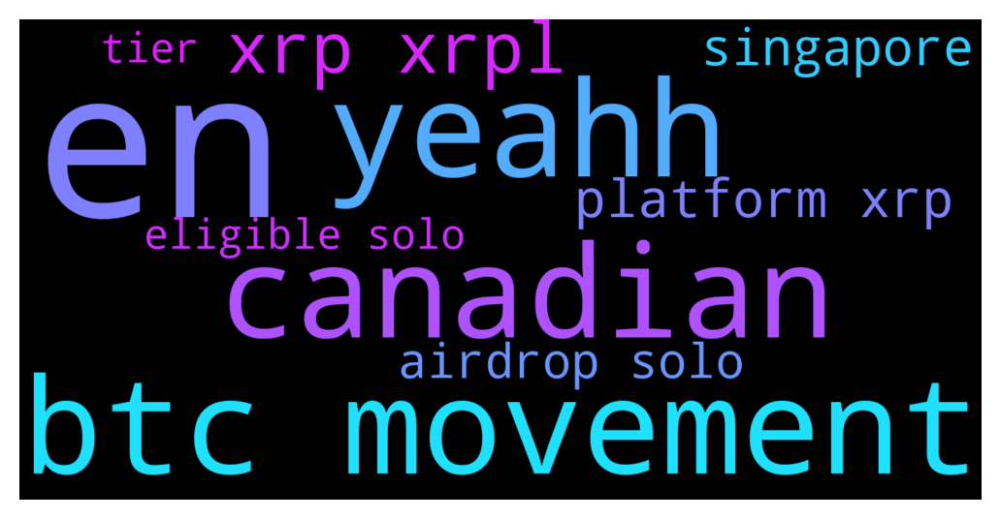

# **@Ripple**
 ## Analysis for **2021-12-14** - **2021-12-15**.

---

## 📊 **Basic Stats**

**n_messages_sent**: 156

---

---

## 🔝 **Top keywords and related messages**

1. **en**

    @GSvetoslav --- *Hey guys, do  I need to hold Solo crypto as well as my Xrp at Xumm wallet in order to get the airdrop? Currently I am holding only XRP* **--->** [TG Discussion](https://t.me/Ripple/3022191)

    @SanshuTokens --- *Yes nothing to do with the XRP token.  It’s ALL crypto tokens on their platform in Singapore* **--->** [TG Discussion](https://t.me/Ripple/3021816)

    @Jawaddeee --- *Why do you have to ask that ... i asked a question in the group not to you personnaly... you dont have to answer en your sarcasme you can keep it* **--->** [TG Discussion](https://t.me/Ripple/3022581)

    @ahmed1137867 --- *if i hold xrp in enchange also i wont be eligible right* **--->** [TG Discussion](https://t.me/Ripple/3022576)

    @Hendrikhaverkamp22 --- *Selling en buyback en to much* **--->** [TG Discussion](https://t.me/Ripple/3022733)

    @hamzaalqaisi80 --- *What is the contract title for the solo currency?* **--->** [TG Discussion](https://t.me/Ripple/3022621)

2. **btc movement**

    @Decrypt_Crypt --- *Why the hell is all market red.btc is not that much down😅* **--->** [TG Discussion](https://t.me/Ripple/3022728)

    @LaporpoMKLT --- *yeahh have been seeing some heavy movements recently* **--->** [TG Discussion](https://t.me/Ripple/3022632)

    @Rektallstar --- *BTC may try to test the 42-43k range. IMO this is very solid support on the daily. We may accumulate around there but that means lots of blood for alts. We may also still continue to hold this area which is key to stop the bleeding.* **--->** [TG Discussion](https://t.me/Ripple/3022773)

    @Rektallstar --- *Some have yes. It's not of much concern as you can see because it didn't have any additional effect on the price outside of what all other coins/tokens did due to BTC drop* **--->** [TG Discussion](https://t.me/Ripple/3022651)

    @Rektallstar --- *Whether we like it or not. 99% of market activity is driven by BTC movements* **--->** [TG Discussion](https://t.me/Ripple/3022811)

    @Rektallstar --- *Sir BTC dropped like 10k LOL that's why the market is down* **--->** [TG Discussion](https://t.me/Ripple/3022810)

3. **yeahh**

    @LaporpoMKLT --- *yeahh have been seeing some heavy movements recently* **--->** [TG Discussion](https://t.me/Ripple/3022632)

    @LaporpoMKLT --- *yeahh bro and the ending is sweeter for the holders and believers* **--->** [TG Discussion](https://t.me/Ripple/3022652)

4. **canadian**

    @Bharani2Dharan --- *Most xrp holders sold because of canadian platforms delisted xrp* **--->** [TG Discussion](https://t.me/Ripple/3022814)

    @Bharani2Dharan --- *canadian crypto platform delisted xrp* **--->** [TG Discussion](https://t.me/Ripple/3022809)

5. **xrp xrpl**

    @Tinkabellagal --- *🔥 286 Million XRP Shifted by Ripple, ODL Corridors and Top-Tier Exchanges https://u.today/286-million-xrp-shifted-by-ripple-odl-corridors-and-top-tier-exchanges* **--->** [TG Discussion](https://t.me/Ripple/3022599)

    @Herman_XRP --- *Im selling everything I have (both cars, jewels, electronics etc) that holds value and using this money to buy XRP and will hodl it! Is it safe to keep my bag of XRP on Binance or should I tranfer everything to Xumm? Thoughts please.* **--->** [TG Discussion](https://t.me/Ripple/3022125)

    @GSvetoslav --- *Hey guys, do  I need to hold Solo crypto as well as my Xrp at Xumm wallet in order to get the airdrop? Currently I am holding only XRP* **--->** [TG Discussion](https://t.me/Ripple/3022191)

    @Agtryap --- *Solo airdrop xrp holder, solo 4$ now  ratio 1:1. Xrp moon soon* **--->** [TG Discussion](https://t.me/Ripple/3022629)

    @LeonVi73 --- *no Binance uses XRP bep2 and Binance-Peg XRP* **--->** [TG Discussion](https://t.me/Ripple/3022240)

    @Tinkabellagal --- *You can buy xrp on bitrue and uphold US can buy xrp on atomic wallet Send to XUMM* **--->** [TG Discussion](https://t.me/Ripple/3022006)

6. **platform xrp**

    @Tinkabellagal --- *🔥 286 Million XRP Shifted by Ripple, ODL Corridors and Top-Tier Exchanges https://u.today/286-million-xrp-shifted-by-ripple-odl-corridors-and-top-tier-exchanges* **--->** [TG Discussion](https://t.me/Ripple/3022599)

    @Herman_XRP --- *Im selling everything I have (both cars, jewels, electronics etc) that holds value and using this money to buy XRP and will hodl it! Is it safe to keep my bag of XRP on Binance or should I tranfer everything to Xumm? Thoughts please.* **--->** [TG Discussion](https://t.me/Ripple/3022125)

    @GSvetoslav --- *Hey guys, do  I need to hold Solo crypto as well as my Xrp at Xumm wallet in order to get the airdrop? Currently I am holding only XRP* **--->** [TG Discussion](https://t.me/Ripple/3022191)

    @Agtryap --- *Solo airdrop xrp holder, solo 4$ now  ratio 1:1. Xrp moon soon* **--->** [TG Discussion](https://t.me/Ripple/3022629)

    @LeonVi73 --- *no Binance uses XRP bep2 and Binance-Peg XRP* **--->** [TG Discussion](https://t.me/Ripple/3022240)

    @Tinkabellagal --- *You can buy xrp on bitrue and uphold US can buy xrp on atomic wallet Send to XUMM* **--->** [TG Discussion](https://t.me/Ripple/3022006)

7. **singapore**

    @SanshuTokens --- *Yes nothing to do with the XRP token.  It’s ALL crypto tokens on their platform in Singapore* **--->** [TG Discussion](https://t.me/Ripple/3021816)

    @ReiTeh --- *I know for a fact that in Singapore, binance is suspended by the Monetary Authority Singapore* **--->** [TG Discussion](https://t.me/Ripple/3021824)

    @Agweldes --- *So the suspension is only in Singapore* **--->** [TG Discussion](https://t.me/Ripple/3021812)

    @MyWii --- *yah, it totally withdrew from singapore though it bought a chunk of shares in HGX singapore.* **--->** [TG Discussion](https://t.me/Ripple/3022500)

8. **airdrop solo**

    @Tinkabellagal --- *Not eligible for solo snapshot and others To get airdrops* **--->** [TG Discussion](https://t.me/Ripple/3022574)

    @JesusJames --- *no its not a scam go to the solo group for more information @SOLOGENICxGoSOLO* **--->** [TG Discussion](https://t.me/Ripple/3022718)

    @GSvetoslav --- *Hey guys, do  I need to hold Solo crypto as well as my Xrp at Xumm wallet in order to get the airdrop? Currently I am holding only XRP* **--->** [TG Discussion](https://t.me/Ripple/3022191)

    @Agtryap --- *Solo airdrop xrp holder, solo 4$ now  ratio 1:1. Xrp moon soon* **--->** [TG Discussion](https://t.me/Ripple/3022629)

    @JesusJames --- *trust wallet does not support solo fyi* **--->** [TG Discussion](https://t.me/Ripple/3022656)

    @Tinkabellagal --- *Rigo I see above that SGB is now on binance So xrp can be converted to SGB to get it off binance exchange SGB is supported by other exchanges and wallets that support xrpl xrp So you can exchange SGB back to real xrp?  Eligible for xrpl airdrops etc then  Up to you  DYOR* **--->** [TG Discussion](https://t.me/Ripple/3022597)

9. **eligible solo**

    @Tinkabellagal --- *Not eligible for solo snapshot and others To get airdrops* **--->** [TG Discussion](https://t.me/Ripple/3022574)

    @JesusJames --- *no its not a scam go to the solo group for more information @SOLOGENICxGoSOLO* **--->** [TG Discussion](https://t.me/Ripple/3022718)

    @GSvetoslav --- *Hey guys, do  I need to hold Solo crypto as well as my Xrp at Xumm wallet in order to get the airdrop? Currently I am holding only XRP* **--->** [TG Discussion](https://t.me/Ripple/3022191)

    @Agtryap --- *Solo airdrop xrp holder, solo 4$ now  ratio 1:1. Xrp moon soon* **--->** [TG Discussion](https://t.me/Ripple/3022629)

    @JesusJames --- *trust wallet does not support solo fyi* **--->** [TG Discussion](https://t.me/Ripple/3022656)

    @Tinkabellagal --- *Rigo I see above that SGB is now on binance So xrp can be converted to SGB to get it off binance exchange SGB is supported by other exchanges and wallets that support xrpl xrp So you can exchange SGB back to real xrp?  Eligible for xrpl airdrops etc then  Up to you  DYOR* **--->** [TG Discussion](https://t.me/Ripple/3022597)

10. **tier**

    @Tinkabellagal --- *🔥 286 Million XRP Shifted by Ripple, ODL Corridors and Top-Tier Exchanges https://u.today/286-million-xrp-shifted-by-ripple-odl-corridors-and-top-tier-exchanges* **--->** [TG Discussion](https://t.me/Ripple/3022599)

