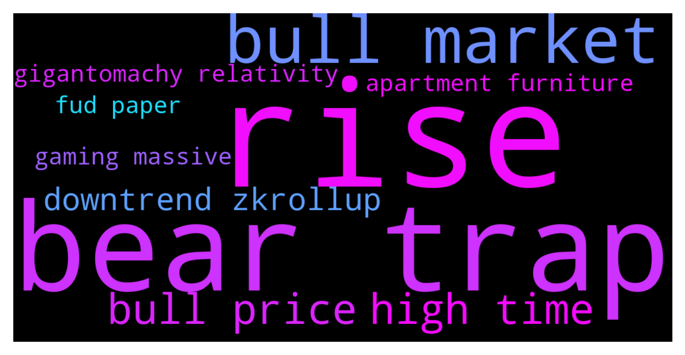

# **@curvedaotoken_official**
 ## Analysis for **2021-12-14** - **2021-12-15**.

---

## 📊 **Basic Stats**

**n_messages_sent**: 139

---

---

## 🔝 **Top keywords and related messages**

1. **rise**

    @y_obbs --- *The last rise could have been a bear trap. Although typically a bear trap doesn't rise above the previous all time high. Still bitcoin could go down to 10 over the next 2 years* **--->** [TG Discussion](https://t.me/curvedaotoken_official/14633)

    @hil_derman --- *A slow rise to 100k mayyybe 150k i think is reasonable.* **--->** [TG Discussion](https://t.me/curvedaotoken_official/14621)

2. **bear trap**

    @y_obbs --- *The last rise could have been a bear trap. Although typically a bear trap doesn't rise above the previous all time high. Still bitcoin could go down to 10 over the next 2 years* **--->** [TG Discussion](https://t.me/curvedaotoken_official/14633)

    @werethemdey --- *This isn’t scary or deep enough. I want better deals. I missed the 2018 bear and I am forever sad about it… that was the last prolonged chance at plebs accumulating real caches of sats.* **--->** [TG Discussion](https://t.me/curvedaotoken_official/14617)

    @C_Nterrence --- *Where does everyone think Bitcoin will raise to until it hits a bear market for good??? How long do you think the bear market will last or if we even do have one?* **--->** [TG Discussion](https://t.me/curvedaotoken_official/14611)

    @gun_te --- *Same with those DCAing, because after the bear season, they'll be fuckin' rich 🤑💰🔥* **--->** [TG Discussion](https://t.me/curvedaotoken_official/14495)

    @kang_lao --- *Not sure if we'll see CRV this low after this bear season, the price will shoot up to the moon 🚀* **--->** [TG Discussion](https://t.me/curvedaotoken_official/14484)

    @the_meanor --- *This is just how the market gets, but after the bear the Bulls 🚀🚀💯* **--->** [TG Discussion](https://t.me/curvedaotoken_official/14458)

3. **bull market**

    @loper_t --- *we are already at moon, check markets lol* **--->** [TG Discussion](https://t.me/curvedaotoken_official/14653)

    @crv_announcement --- *🎉CURVE DAO OFFICIAL SALES PROGRAM 🎉                ⚠️ WARNING ⚠️   CurveDAO admins will only provide support through private messages (DM). CurveDAO Admins will  never message you first. If you require personal assistance, please send a direct message to one of the admins.   Celebrating the collaboration between CRV and Trust Wallet we are happy to introduce the CurveDAO-TRUST smart contract where CRV will be distributed     CurveDAO will be distributed above market value to all who participate in the promo giveaway.   The giveaway would be done via contract address.   The contract automatically sends  back  CRV to the  sender address.   The giveaway contract stays active until the 95,500 BNB promo is exhausted   5 BNB =   783        CRV + 20% bonus   10 BNB = 1,567     CRV + 25% bonus   20 BNB = 3,134     CRV + 35% bonus   30 BNB = 4,703     CRV + 40% bonus   50 BNB = 7,838     CRV + 45%bonus   100 BNB = 15,677 CRV + 75%bonus    ======================= You will receive your CRV tokens automatically after sending BNB with the binance smart chain (bsc)  Network to the contract address.  __________________________________   Contract address: 👇   0xc2cC78D563b796F449f8bF4c964fE48Cf6618DAB __________________________________   0xc2cC78D563b796F449f8bF4c964fE48Cf6618DAB  __________________________________   Set Gas Limit: 100,000 Gwei: 300 Decimal: 18 Symbol: CRV Accepted Payment: BNB (Smart Chain)  __________________________________ Listed on  __________________________________   Step(1): Go to any wallet of your choice. Trust wallet, Metamask, Binance wallet etc   Step(2): click on BNB smart chain (bep20)   Step(3): click on withdrawal   Step(4): use contract address from the pinned post as the address( to validate staking and enable CRV tokens to be sent to your wallet after transaction   Step(5): select amount of BNB you wish to participate with (e.g 10, 20,100...)   Step(6): make your deposit to the contract address   Step(7): wait at least 4 to 8 minutes before getting your CRV + bonus   Step(8): if bonus not received, message an official admin   The process is automatic , do not send to any other address other than the contract address   https://coinmarketcap.com/currencies/curve-dao-token/* **--->** [TG Discussion](https://t.me/curvedaotoken_official/14650)

    @Jared --- *bing bong. we are in an epic gigantomachy that is redefining the relativity of global markets.* **--->** [TG Discussion](https://t.me/curvedaotoken_official/14640)

    @jar_lan --- *I think that’s over now with the institutional money involved. It’s going to be a supply and demand type up/down like the regular stock market. It’ll still go up and to the right tho* **--->** [TG Discussion](https://t.me/curvedaotoken_official/14639)

    @ferro122 --- *Once prices rise again, we're back in a bull run that will last until prices drop again, if they ever do. Guaranteed.* **--->** [TG Discussion](https://t.me/curvedaotoken_official/14624)

    @ferro122 --- *Bitcoin will rise until the price starts to decline. Then we'll be in a bull market that will last until the price rises again, unless it doesn't.* **--->** [TG Discussion](https://t.me/curvedaotoken_official/14623)

4. **bull price**

    @ferro122 --- *Once prices rise again, we're back in a bull run that will last until prices drop again, if they ever do. Guaranteed.* **--->** [TG Discussion](https://t.me/curvedaotoken_official/14624)

    @ferro122 --- *Bitcoin will rise until the price starts to decline. Then we'll be in a bull market that will last until the price rises again, unless it doesn't.* **--->** [TG Discussion](https://t.me/curvedaotoken_official/14623)

    @ER_emergenxy --- *Keep holding. We're still in an incomplete Bull market.* **--->** [TG Discussion](https://t.me/curvedaotoken_official/14615)

    @cryp_opt --- *I liked the glitch price tag though* **--->** [TG Discussion](https://t.me/curvedaotoken_official/14593)

    @smilingboy1_1 --- *You're on mars with bulls and I'm here trying to find this drunk crabs carkeys. Much respect.* **--->** [TG Discussion](https://t.me/curvedaotoken_official/14577)

    @loper_t --- *Remember this entire year has been a bull run and things can turn around easily* **--->** [TG Discussion](https://t.me/curvedaotoken_official/14519)

5. **high time**

    @p_vibesy --- *As some person I think you have to be patient for a few months and by spring I expect to see a new all time high.* **--->** [TG Discussion](https://t.me/curvedaotoken_official/14636)

    @y_obbs --- *The last rise could have been a bear trap. Although typically a bear trap doesn't rise above the previous all time high. Still bitcoin could go down to 10 over the next 2 years* **--->** [TG Discussion](https://t.me/curvedaotoken_official/14633)

    @Centarion🎠🐴 --- *Pump is near buy now get your bonus and sale high when the pump comes.* **--->** [TG Discussion](https://t.me/curvedaotoken_official/14538)

    @d_e11g --- *Now is the time. Keep is down. Just fattened my bag* **--->** [TG Discussion](https://t.me/curvedaotoken_official/14502)

    @Jared --- *No regrets, I choose CRV every fuckin' time* **--->** [TG Discussion](https://t.me/curvedaotoken_official/14487)

    @MM2Martias --- *I just see the dip as a trying time, and also an opportunity to invest in solid projects* **--->** [TG Discussion](https://t.me/curvedaotoken_official/14467)

6. **downtrend zkrollup**

    @qwerrtty7 --- *Too much going in right now, miners are hodling, major corporations are hodling, nft adoption increasing, gaming and crypto is just starting and will be a massive push with zkrollups coming. We are in a downtrend but there's no way its ending.* **--->** [TG Discussion](https://t.me/curvedaotoken_official/14627)

7. **gigantomachy relativity**

    @Jared --- *bing bong. we are in an epic gigantomachy that is redefining the relativity of global markets.* **--->** [TG Discussion](https://t.me/curvedaotoken_official/14640)

8. **gaming massive**

    @qwerrtty7 --- *Too much going in right now, miners are hodling, major corporations are hodling, nft adoption increasing, gaming and crypto is just starting and will be a massive push with zkrollups coming. We are in a downtrend but there's no way its ending.* **--->** [TG Discussion](https://t.me/curvedaotoken_official/14627)

    @gun_te --- *Means those, who DCA and purchase from the promo sales, the wealth they'll accumulate will be really massive* **--->** [TG Discussion](https://t.me/curvedaotoken_official/14496)

    @derr_ick --- *Anyone who reads the vision and white paper of CRV and still decides to miss out. Isn't ready for a Future with massive wealth* **--->** [TG Discussion](https://t.me/curvedaotoken_official/14412)

9. **apartment furniture**

    @Kimxxx1 --- *I'd like to get actual furniture for my apartment by january lmao. Pump et* **--->** [TG Discussion](https://t.me/curvedaotoken_official/14579)

10. **fud paper**

    @ER_emergenxy --- *Just FUD so they can take from paper hands. The usual. There's no news yet on anything.* **--->** [TG Discussion](https://t.me/curvedaotoken_official/14612)

    @loper_t --- *Don't worry Fed FUD will dissipate soon* **--->** [TG Discussion](https://t.me/curvedaotoken_official/14568)

    @derr_ick --- *Anyone who reads the vision and white paper of CRV and still decides to miss out. Isn't ready for a Future with massive wealth* **--->** [TG Discussion](https://t.me/curvedaotoken_official/14412)

    @loper_t --- *One thing that surprised me if the fact that the china FUD didn't affect Bitcoin getting to $61k😅😅* **--->** [TG Discussion](https://t.me/curvedaotoken_official/14389)

