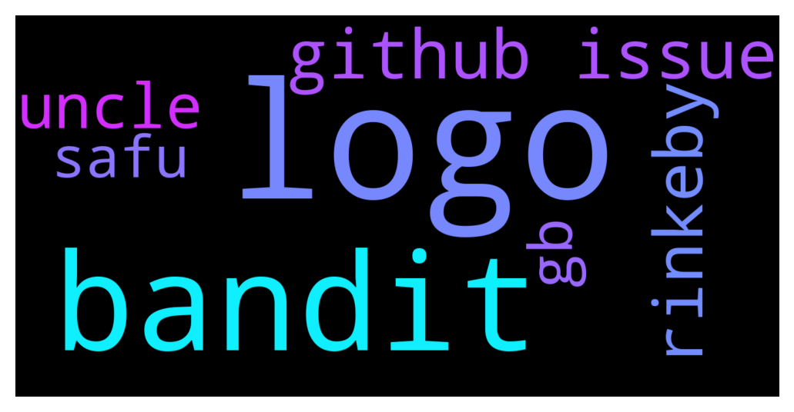

# **@lobsters_chat**
 ## Analysis for **2021-12-14** - **2021-12-15**.

---

## 📊 **Basic Stats**

**n_messages_sent**: 313

---

---

## 🔝 **Top keywords and related messages**

1. **logo**

    @Autismvisky --- *Frens i've made a github issue for the long discussed Logo matter  Here is the link: https://github.com/lobster-dao/overview/issues/49 Feel free to comment your thoughts* **--->** [TG Discussion](https://t.me/lobsters_chat/307683)

    @Autismvisky --- *Gm lads I've surfing here for a while and remember a logo discussion over the past months but i was busy back then‚ and i would like to contribute with a branding design regarding the lobster logo and the lobster nft‚ if that subject still up i would like to get a few answers regarding the direction of the branding matter to start working on the task* **--->** [TG Discussion](https://t.me/lobsters_chat/307625)

    @svenblockchain --- *This is the first I realize the logo has been a bunch of lobsters literally being airdropped. It's been like that since the start right? This is some long term planning...* **--->** [TG Discussion](https://t.me/lobsters_chat/307629)

2. **bandit**

    @TSxxxxxxxx --- *is there anyone with some knowledge of uncle bandit attacks?* **--->** [TG Discussion](https://t.me/lobsters_chat/307674)

    @TSxxxxxxxx --- *I am playing around with some on-chain randomness and I am looking on how to make it uncle bandit proof, what would you say is a good time interval for low chance of re-orgs?* **--->** [TG Discussion](https://t.me/lobsters_chat/307677)

3. **github issue**

    @Autismvisky --- *Frens i've made a github issue for the long discussed Logo matter  Here is the link: https://github.com/lobster-dao/overview/issues/49 Feel free to comment your thoughts* **--->** [TG Discussion](https://t.me/lobsters_chat/307683)

    @blockminded --- *head here, make a github issue with your proposal to be discussed further, which will head to governance if there's enough support https://t.me/lobsterdao* **--->** [TG Discussion](https://t.me/lobsters_chat/307628)

    @adammchen --- *Democracy is an issue in my humble opinion. When the elected officials are worried about the next term, what incentivizes them to think in terms of the countries long-term growth? ... nothing. However, in terms of pros and cons, it's still the best option globally to an extent.* **--->** [TG Discussion](https://t.me/lobsters_chat/307249)

    @Alphamint --- *a16z and pleasr seems cringe to me... but i also thot that about microsoft buying github* **--->** [TG Discussion](https://t.me/lobsters_chat/307443)

    @Oyagami --- *Anyone else have issues using sushiswap on mobile? Always get a client error and it freezes* **--->** [TG Discussion](https://t.me/lobsters_chat/307614)

    @FiveBoroughs --- *If you require supernodes from the start, you circumvent the whole issue* **--->** [TG Discussion](https://t.me/lobsters_chat/307702)

4. **rinkeby**

    @Alphamint --- *i think i crashed rinkeby lol 😅, can someone have a look, it's been down for 20min, which groups mine on rinkeby?* **--->** [TG Discussion](https://t.me/lobsters_chat/307633)

    @Alphamint --- *recommended eth node provider? infura rinkeby is really slow today. optimizing for speed* **--->** [TG Discussion](https://t.me/lobsters_chat/307611)

5. **uncle**

    @TSxxxxxxxx --- *is there anyone with some knowledge of uncle bandit attacks?* **--->** [TG Discussion](https://t.me/lobsters_chat/307674)

    @SpikeSpiege1 --- *Still unclear how he ever got onboarded as a project lead. Researcher doesn't usually equate to leader.  "That's so crypto." Maybe if there was a "shit posting thought leader" position.* **--->** [TG Discussion](https://t.me/lobsters_chat/307098)

    @ChiTimesChi --- *On a more serious note, the solution is fairly simple.   1. Disable unlimited minting USDM backed by thin air. Hardcoded oracle has to go as well.  2. (Helloadminors will applaud this). Buy back minted assets and burn.  Why would anyone actually do this in unclear though.* **--->** [TG Discussion](https://t.me/lobsters_chat/307602)

    @TSxxxxxxxx --- *I am playing around with some on-chain randomness and I am looking on how to make it uncle bandit proof, what would you say is a good time interval for low chance of re-orgs?* **--->** [TG Discussion](https://t.me/lobsters_chat/307677)

6. **gb**

    @TLink_9 --- *I heard it now takes 100gb of ram to be a validator on Solana* **--->** [TG Discussion](https://t.me/lobsters_chat/307695)

    @zhongfu --- *more than that, 128GB was the minimum before the last 17h downtime (not sure if it's higher now)* **--->** [TG Discussion](https://t.me/lobsters_chat/307699)

7. **safu**

    @mrtdlgc --- *it's been safu for some time, but their bridge is not open source* **--->** [TG Discussion](https://t.me/lobsters_chat/307591)

    @bernyn --- *elkfinance is safu? i have tried to bridge from matic to avax but the web just crashed after my wallet approval* **--->** [TG Discussion](https://t.me/lobsters_chat/307590)

