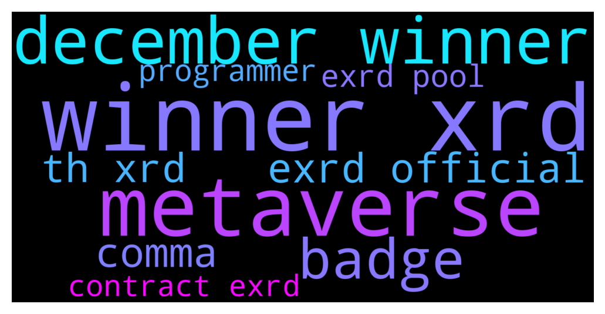

# **@radix_dlt**
 ## Analysis for **2021-12-14** - **2021-12-15**.

---

## 📊 **Basic Stats**

**n_messages_sent**: 541

---

---

## 🔝 **Top keywords and related messages**

1. **winner xrd**

    @MaratCerby --- *🥈 Second RadixDLT scrypto demonstration of 🧙🪄🌈: - CERBY Bridge between two test networks using @CerbyMask web3 wallet -  ✅ Scrypto interactions made: 1) Initially we have 100 XRD in walletA 2) Buying ~500 CERBY for 50 XRD using walletA 3) Sending 50 XRD from walletA to walletB 4) Buying ~300 CERBY for 30 XRD using walletB 5) Sending 300 CERBY from wallet B to walletA 6) Bridging 800 CERBY from #NotRadixNet to #MaybeEmunieNet 7) Selling 800 CERBY on #MaybeEmunieNet  🚀 Features: - Changing networks - Changing wallets - Two different dApps on scrypto  📱 Apps used in demo: - CerbySwap DEX default scrypto single pair version to swap XRD/CERBY - CerbyBridge meta bridge version built on scrypto to bridge CERBY tokens between various networks - Basic transfer tokens functionality  Which network you want our next demo to run on? #NotRadixNet, #MaybeEmunieNet, #HypeMattNet, #DanOnesieNet, #PiersBarberNet, #AdamBicepNet  Please vote here: https://bit.ly/3yrS6FG Youtube demo: https://youtu.be/AI-12xGRAj0* **--->** [TG Discussion](https://t.me/radix_dlt/320492)

    @luke55 --- *🚀 Our Staking Airdrop is already in the pipeline. At the end of December, a total of 3,000,000 $OCI will airdropped to our XRD Stakers.  ✅ Additionally, staking on our own and partner nodes will grant a bonus up to 50% in $OCI (check our pinned post: https://t.me/ociswap/22482).  And of course do not forget, early staking might be beneficial 👀* **--->** [TG Discussion](https://t.me/radix_dlt/320525)

    @TaserFace6937 --- *Congratulations to last week's winner!  🎉🏆💵   Every Friday this month another lucky RadixStake delegator will win 2,000 XRD!  👀  👉To take part in this week's giveaway:  radixstake.com/giveaway.html  💰 December   3rd - 2,000 XRD Winner  https://bit.ly/3pOfIQW 💰 December 10th - 2,000 XRD Winner  https://bit.ly/3pG9p1D 💰 December 17th - 2,000 XRD Winner 💰 December 24th - 2,000 XRD Winner 💰 December 31st - 2,000 XRD Winner  🙏Thank you RadixStake delegators and good luck this Friday!* **--->** [TG Discussion](https://t.me/radix_dlt/321193)

    @Blind5ight --- *eXRD has more markets so is more liquid XRD has less markets but has the added benefit of staking* **--->** [TG Discussion](https://t.me/radix_dlt/320996)

    @acgirl95 --- *Post on twitter. There’s a 20k XRD prize.   https://twitter.com/buyxrd/status/1470593444196196352?s=21* **--->** [TG Discussion](https://t.me/radix_dlt/320691)

    @mx471 --- *https://learn.radixdlt.com/article/is-there-a-minimum-or-maximum-stake-limit "A minimum amount of 90 XRD per stake transaction is required to avoid issues with spamming  a large number of small stakes."* **--->** [TG Discussion](https://t.me/radix_dlt/320015)

2. **metaverse**

    @radixmatt --- *DeFi is what gives value to the worlds of the Metaverse, and the Metaverse just expands the range of what can be tied into DeFi apps.* **--->** [TG Discussion](https://t.me/radix_dlt/321411)

    @Win_Q --- *See here radix is ​​already planning on metaverse* **--->** [TG Discussion](https://t.me/radix_dlt/321415)

    @radixmatt --- *I've got an article I want to write about that (actually gave a presentation on it recently)... in short, metaverse isn't one defi application, it's *all* the defi applications.* **--->** [TG Discussion](https://t.me/radix_dlt/321410)

    @radixmatt --- *It's like... DeFi is the natural foundation for just about everything of value that happens in the Metaverse, and even helps tie the Metaverse together (in that it allows you to carry ownership and identity across worlds).* **--->** [TG Discussion](https://t.me/radix_dlt/321417)

    @Blind5ight --- *Looks like a broad definition of metaverse: What is a DEX doing in there? Sushiswap* **--->** [TG Discussion](https://t.me/radix_dlt/321409)

3. **december winner**

    @luke55 --- *🚀 Our Staking Airdrop is already in the pipeline. At the end of December, a total of 3,000,000 $OCI will airdropped to our XRD Stakers.  ✅ Additionally, staking on our own and partner nodes will grant a bonus up to 50% in $OCI (check our pinned post: https://t.me/ociswap/22482).  And of course do not forget, early staking might be beneficial 👀* **--->** [TG Discussion](https://t.me/radix_dlt/320525)

    @TaserFace6937 --- *Congratulations to last week's winner!  🎉🏆💵   Every Friday this month another lucky RadixStake delegator will win 2,000 XRD!  👀  👉To take part in this week's giveaway:  radixstake.com/giveaway.html  💰 December   3rd - 2,000 XRD Winner  https://bit.ly/3pOfIQW 💰 December 10th - 2,000 XRD Winner  https://bit.ly/3pG9p1D 💰 December 17th - 2,000 XRD Winner 💰 December 24th - 2,000 XRD Winner 💰 December 31st - 2,000 XRD Winner  🙏Thank you RadixStake delegators and good luck this Friday!* **--->** [TG Discussion](https://t.me/radix_dlt/321193)

    @Jazzer9F --- *🎉 Radix Alexandria: Scrypto is Coming. 🎉  Alexandria is launching on December 15, the first release of #Scrypto and Radix Engine v2 to developers.   Full Details: go.radixdlt.com/Scrypto-is-Coming* **--->** [TG Discussion](https://t.me/radix_dlt/320292)

    @Alfred_Dulaire --- *@DogeCube the first RADIX memecoin  The 12 days of Xmas RIDDLE is here! 500 000 DogeCube to win 🚀  RULES:  when ALL LETTER BOXES to use will be revealed on the 25th of December, the first member of the RadPack to DM @DogeCube admins the correct exchange name that will list us in January, will win this big AIRDROP present   💰☃️🎄🌟* **--->** [TG Discussion](https://t.me/radix_dlt/320058)

    @Alfred_Dulaire --- *@DogeCube the first RADIX memecoin  Day 3 of the 12 days of Xmas RIDDLE crossword! 500 000 DogeCube to win 🚀  RULES:  when ALL LETTER BOXES to use will be revealed on the 25th of December 13h UTC, the first member of the RadPack to DM us the correct exchange name listing us in January, will win this big AIRDROP present.  Any "entries" before that will be ignored 😆* **--->** [TG Discussion](https://t.me/radix_dlt/321152)

    @Alfred_Dulaire --- *@DogeCube the first RADIX memecoin  Day 2 of the 12 days of Xmas RIDDLE crossword! 500 000 DogeCube to win 🚀  RULES:  when ALL LETTER BOXES to use will be revealed on the 25th of December 13h UTC, the first member of the RadPack to DM us the correct exchange name listing us in January, will win this big AIRDROP present.  Any "entries" before that will be ignored 😆* **--->** [TG Discussion](https://t.me/radix_dlt/320496)

4. **badge**

    @Ashley --- *badges and people sending things to your wallet, some of the validators are sending their coin for example* **--->** [TG Discussion](https://t.me/radix_dlt/320928)

    @BlAzAk --- *@RadixCollection just launched the first decentralized collectible game living on the @radixdlt network. Come Join the badge hunt ! 🥈🥇🥉 Come now to get the Olympia badge before Alexandria ! NFTs, Leaderboard, Battles, Trading, ... features are coming ! https://radix-collection.com  Who can beat me : https://radix-collection.com/collection/rdx1qspn70eefr2k4dm2zutlggfvdsl2a45haa4l3k5z9w6304p7pdfwp3sl9mvyr ?* **--->** [TG Discussion](https://t.me/radix_dlt/320122)

    @BlAzAk --- *@RadixCollection just launched the first decentralized collectible game living on the @radixdlt network. Come Join the badge hunt ! 🥈🥇🥉 Come now to get the Olympia badge before Alexandria ! NFTs, Leaderboard, Battles, Trading, ... features are coming ! https://radix-collection.com  48 hours after its launch, we are already at 300 registered collectors!  Who can beat me : https://radix-collection.com/collection/rdx1qspn70eefr2k4dm2zutlggfvdsl2a45haa4l3k5z9w6304p7pdfwp3sl9mvyr ?* **--->** [TG Discussion](https://t.me/radix_dlt/320872)

    @BlAzAk --- *@RadixCollection just launched the first decentralized collectible game living on the @radixdlt network. Come Join the badge hunt ! 🥈🥇🥉 Come now to get the Olympia badge before Alexandria ! NFTs, Leaderboard, Battles, Trading, ... features are coming ! https://radix-collection.com  24 hours after its launch, we are already at 200 registered collectors!  Who can beat me : https://radix-collection.com/collection/rdx1qspn70eefr2k4dm2zutlggfvdsl2a45haa4l3k5z9w6304p7pdfwp3sl9mvyr ?* **--->** [TG Discussion](https://t.me/radix_dlt/320291)

    @Davor --- *What is with all the coins received from staking. I noticed I have floop, gold, RCdolphin etc. Is it something more to be realized (new projects) or just something like a badge?* **--->** [TG Discussion](https://t.me/radix_dlt/320924)

5. **exrd official**

    @Blind5ight --- *#eXRD #contract #Uniswap #pool  eXRD contract address https://etherscan.io/token/0x6468e79a80c0eab0f9a2b574c8d5bc374af59414  Uniswap pool for eXRD/USDC: https://v2.info.uniswap.org/pair/0x684b00a5773679f88598a19976fbeb25a68e9a5f  Reminder - Admins will never message you first. Only the links above are official.* **--->** [TG Discussion](https://t.me/radix_dlt/321052)

    @Modus1234 --- *Guys, this ain't right, right? It's supposed to be wayyyy more than 15 watchlists. And Exrd is the only coin I could find this issue on* **--->** [TG Discussion](https://t.me/radix_dlt/321350)

    @mx471 --- *❇️ eXRD IS NOW LIVE. ❇️  Uniswap pool for eXRD/USDC: https://v2.info.uniswap.org/pair/0x684b00a5773679f88598a19976fbeb25a68e9a5f  Token Sale Participants, how to get your tokens: https://radixtokens.helpscoutdocs.com/article/51-how-to-claim-unlocked-exrd  ❇️ All official information can be found below: ❇️  Latest updates for the token distribution can be found here: https://t.me/RadixAnnouncements and https://twitter.com/RadixDLT  Important Links:  ➡️Official eXRD Contract address: https://etherscan.io/token/0x6468e79a80c0eab0f9a2b574c8d5bc374af59414  ➡️Uniswap eXRD/USDC Pair: https://v2.info.uniswap.org/pair/0x684b00a5773679f88598a19976fbeb25a68e9a5f  Withdraw Token Sale eXRD: unlock.radixtokens.com   Guides/Information:  ➡️How to add eXRD to MetaMask: https://radixtokens.helpscoutdocs.com/article/50-exrd-in-metamask  ➡️How to claim unlocked eXRD (token sale): https://radixtokens.helpscoutdocs.com/article/51-how-to-claim-unlocked-exrd  ➡️How to use Uniswap: https://radixtokens.helpscoutdocs.com/article/53-how-to-uniswap  ➡️eXRD Community Liquidity Incentives Guide: https://radixtokens.helpscoutdocs.com/article/52-exrd-community-liquidity-incentives-guide  Reminder - Admins will never message you first. Only the links above are official.  ❇️ eXRD IS NOW LIVE. ❇️* **--->** [TG Discussion](https://t.me/radix_dlt/321056)

    @Blind5ight --- *eXRD has more markets so is more liquid XRD has less markets but has the added benefit of staking* **--->** [TG Discussion](https://t.me/radix_dlt/320996)

    @iphonecliniq --- *Is there a way to convert exrd to xrd in long run* **--->** [TG Discussion](https://t.me/radix_dlt/321007)

    @JohnSmith006 --- *why can't i send exrd from trust wallet to Radix Olympia Dekstop?  He tells me the address is wrong ....* **--->** [TG Discussion](https://t.me/radix_dlt/319997)

6. **comma**

    @Peter (HAM) --- *Good news: The Wikipedia article related to periods and commas mentions Radix. https://en.wikipedia.org/wiki/Decimal_separator* **--->** [TG Discussion](https://t.me/radix_dlt/321167)

    @Avaunt --- *Should be a case of just re-running the command if you have everything still setup from the first attempt* **--->** [TG Discussion](https://t.me/radix_dlt/320316)

    @CSpace80 --- *OK that's what I was doing. When I run the commands there seems to be an error message at app install* **--->** [TG Discussion](https://t.me/radix_dlt/320317)

    @CSpace80 --- *OK thanks will try. So do we need to follow the instructions from the very start? or just continue from command prompt instructions as files will already be on PC.* **--->** [TG Discussion](https://t.me/radix_dlt/320315)

    @aus87 --- *is it just me or is it confusing why some people use commas for decimals and decimals for commas?* **--->** [TG Discussion](https://t.me/radix_dlt/321164)

    @yr12345678 --- *Now you say that: I use the report command for bots. Is that okay? Or should I just let them be?* **--->** [TG Discussion](https://t.me/radix_dlt/321234)

7. **th xrd**

    @MaratCerby --- *🥈 Second RadixDLT scrypto demonstration of 🧙🪄🌈: - CERBY Bridge between two test networks using @CerbyMask web3 wallet -  ✅ Scrypto interactions made: 1) Initially we have 100 XRD in walletA 2) Buying ~500 CERBY for 50 XRD using walletA 3) Sending 50 XRD from walletA to walletB 4) Buying ~300 CERBY for 30 XRD using walletB 5) Sending 300 CERBY from wallet B to walletA 6) Bridging 800 CERBY from #NotRadixNet to #MaybeEmunieNet 7) Selling 800 CERBY on #MaybeEmunieNet  🚀 Features: - Changing networks - Changing wallets - Two different dApps on scrypto  📱 Apps used in demo: - CerbySwap DEX default scrypto single pair version to swap XRD/CERBY - CerbyBridge meta bridge version built on scrypto to bridge CERBY tokens between various networks - Basic transfer tokens functionality  Which network you want our next demo to run on? #NotRadixNet, #MaybeEmunieNet, #HypeMattNet, #DanOnesieNet, #PiersBarberNet, #AdamBicepNet  Please vote here: https://bit.ly/3yrS6FG Youtube demo: https://youtu.be/AI-12xGRAj0* **--->** [TG Discussion](https://t.me/radix_dlt/320492)

    @luke55 --- *🚀 Our Staking Airdrop is already in the pipeline. At the end of December, a total of 3,000,000 $OCI will airdropped to our XRD Stakers.  ✅ Additionally, staking on our own and partner nodes will grant a bonus up to 50% in $OCI (check our pinned post: https://t.me/ociswap/22482).  And of course do not forget, early staking might be beneficial 👀* **--->** [TG Discussion](https://t.me/radix_dlt/320525)

    @TaserFace6937 --- *Congratulations to last week's winner!  🎉🏆💵   Every Friday this month another lucky RadixStake delegator will win 2,000 XRD!  👀  👉To take part in this week's giveaway:  radixstake.com/giveaway.html  💰 December   3rd - 2,000 XRD Winner  https://bit.ly/3pOfIQW 💰 December 10th - 2,000 XRD Winner  https://bit.ly/3pG9p1D 💰 December 17th - 2,000 XRD Winner 💰 December 24th - 2,000 XRD Winner 💰 December 31st - 2,000 XRD Winner  🙏Thank you RadixStake delegators and good luck this Friday!* **--->** [TG Discussion](https://t.me/radix_dlt/321193)

    @Jazzer9F --- *In the 4th installment of his Alexandria blog series, Chief Product Officer at Radix, Matthew Hine, describes how Radix is building the foundation of a new world where #DeFi dApps can scale without limit. 🚀  👉 https://www.radixdlt.com/post/how-radix-engine-is-designed-to-scale-dapps* **--->** [TG Discussion](https://t.me/radix_dlt/320044)

    @Alfred_Dulaire --- *@DogeCube the first RADIX memecoin  The 12 days of Xmas RIDDLE is here! 500 000 DogeCube to win 🚀  RULES:  when ALL LETTER BOXES to use will be revealed on the 25th of December, the first member of the RadPack to DM @DogeCube admins the correct exchange name that will list us in January, will win this big AIRDROP present   💰☃️🎄🌟* **--->** [TG Discussion](https://t.me/radix_dlt/320058)

    @Alfred_Dulaire --- *@DogeCube the first RADIX memecoin  Day 3 of the 12 days of Xmas RIDDLE crossword! 500 000 DogeCube to win 🚀  RULES:  when ALL LETTER BOXES to use will be revealed on the 25th of December 13h UTC, the first member of the RadPack to DM us the correct exchange name listing us in January, will win this big AIRDROP present.  Any "entries" before that will be ignored 😆* **--->** [TG Discussion](https://t.me/radix_dlt/321152)

8. **exrd pool**

    @Blind5ight --- *#eXRD #contract #Uniswap #pool  eXRD contract address https://etherscan.io/token/0x6468e79a80c0eab0f9a2b574c8d5bc374af59414  Uniswap pool for eXRD/USDC: https://v2.info.uniswap.org/pair/0x684b00a5773679f88598a19976fbeb25a68e9a5f  Reminder - Admins will never message you first. Only the links above are official.* **--->** [TG Discussion](https://t.me/radix_dlt/321052)

    @Modus1234 --- *Guys, this ain't right, right? It's supposed to be wayyyy more than 15 watchlists. And Exrd is the only coin I could find this issue on* **--->** [TG Discussion](https://t.me/radix_dlt/321350)

    @mx471 --- *❇️ eXRD IS NOW LIVE. ❇️  Uniswap pool for eXRD/USDC: https://v2.info.uniswap.org/pair/0x684b00a5773679f88598a19976fbeb25a68e9a5f  Token Sale Participants, how to get your tokens: https://radixtokens.helpscoutdocs.com/article/51-how-to-claim-unlocked-exrd  ❇️ All official information can be found below: ❇️  Latest updates for the token distribution can be found here: https://t.me/RadixAnnouncements and https://twitter.com/RadixDLT  Important Links:  ➡️Official eXRD Contract address: https://etherscan.io/token/0x6468e79a80c0eab0f9a2b574c8d5bc374af59414  ➡️Uniswap eXRD/USDC Pair: https://v2.info.uniswap.org/pair/0x684b00a5773679f88598a19976fbeb25a68e9a5f  Withdraw Token Sale eXRD: unlock.radixtokens.com   Guides/Information:  ➡️How to add eXRD to MetaMask: https://radixtokens.helpscoutdocs.com/article/50-exrd-in-metamask  ➡️How to claim unlocked eXRD (token sale): https://radixtokens.helpscoutdocs.com/article/51-how-to-claim-unlocked-exrd  ➡️How to use Uniswap: https://radixtokens.helpscoutdocs.com/article/53-how-to-uniswap  ➡️eXRD Community Liquidity Incentives Guide: https://radixtokens.helpscoutdocs.com/article/52-exrd-community-liquidity-incentives-guide  Reminder - Admins will never message you first. Only the links above are official.  ❇️ eXRD IS NOW LIVE. ❇️* **--->** [TG Discussion](https://t.me/radix_dlt/321056)

    @Blind5ight --- *eXRD has more markets so is more liquid XRD has less markets but has the added benefit of staking* **--->** [TG Discussion](https://t.me/radix_dlt/320996)

    @iphonecliniq --- *Is there a way to convert exrd to xrd in long run* **--->** [TG Discussion](https://t.me/radix_dlt/321007)

    @JohnSmith006 --- *why can't i send exrd from trust wallet to Radix Olympia Dekstop?  He tells me the address is wrong ....* **--->** [TG Discussion](https://t.me/radix_dlt/319997)

9. **programmer**

    @tek2504 --- *HIre 20 world class programmer, project time 1/5 ... but they cost A LOT .. and try to get them from Google etc in the first place* **--->** [TG Discussion](https://t.me/radix_dlt/320672)

    @Maciej --- *What can I say, patience was never my strong side! 😂  Jokes aside, what you just wrote is fine and answers my question. I fully agree that making things right is absolutely priority. Fingers crossed for you and the team and I can't wait to try Scrypto myself, though not being a programmer. ;)* **--->** [TG Discussion](https://t.me/radix_dlt/321178)

    @mx471 --- *I am also not a programmer (anymore, I used to do some Windows & Linux scripting & web development but not professionally) but I want to try to build a casino on Scrypto* **--->** [TG Discussion](https://t.me/radix_dlt/321180)

    @radixmatt --- *👍 And actually I'm interested in the non-programmer perspective on Scrypto too! It's still real programming, but doing basic DeFi things is pretty straightforward and we actually hope that even hobby-level programmers can understand and have some fun with it working from some of the examples.* **--->** [TG Discussion](https://t.me/radix_dlt/321179)

10. **contract exrd**

    @Jazzer9F --- *The ramp-up to Alexandria begins here 🚀  Part 1 in a series on Radix Engine and Scrypto, we break down how today's form of smart contracts are failing DeFi and failing developers.  📖 https://www.radixdlt.com/post/the-problem-with-smart-contracts-today* **--->** [TG Discussion](https://t.me/radix_dlt/320975)

    @Blind5ight --- *#eXRD #contract #Uniswap #pool  eXRD contract address https://etherscan.io/token/0x6468e79a80c0eab0f9a2b574c8d5bc374af59414  Uniswap pool for eXRD/USDC: https://v2.info.uniswap.org/pair/0x684b00a5773679f88598a19976fbeb25a68e9a5f  Reminder - Admins will never message you first. Only the links above are official.* **--->** [TG Discussion](https://t.me/radix_dlt/321052)

    @Modus1234 --- *Guys, this ain't right, right? It's supposed to be wayyyy more than 15 watchlists. And Exrd is the only coin I could find this issue on* **--->** [TG Discussion](https://t.me/radix_dlt/321350)

    @mx471 --- *❇️ eXRD IS NOW LIVE. ❇️  Uniswap pool for eXRD/USDC: https://v2.info.uniswap.org/pair/0x684b00a5773679f88598a19976fbeb25a68e9a5f  Token Sale Participants, how to get your tokens: https://radixtokens.helpscoutdocs.com/article/51-how-to-claim-unlocked-exrd  ❇️ All official information can be found below: ❇️  Latest updates for the token distribution can be found here: https://t.me/RadixAnnouncements and https://twitter.com/RadixDLT  Important Links:  ➡️Official eXRD Contract address: https://etherscan.io/token/0x6468e79a80c0eab0f9a2b574c8d5bc374af59414  ➡️Uniswap eXRD/USDC Pair: https://v2.info.uniswap.org/pair/0x684b00a5773679f88598a19976fbeb25a68e9a5f  Withdraw Token Sale eXRD: unlock.radixtokens.com   Guides/Information:  ➡️How to add eXRD to MetaMask: https://radixtokens.helpscoutdocs.com/article/50-exrd-in-metamask  ➡️How to claim unlocked eXRD (token sale): https://radixtokens.helpscoutdocs.com/article/51-how-to-claim-unlocked-exrd  ➡️How to use Uniswap: https://radixtokens.helpscoutdocs.com/article/53-how-to-uniswap  ➡️eXRD Community Liquidity Incentives Guide: https://radixtokens.helpscoutdocs.com/article/52-exrd-community-liquidity-incentives-guide  Reminder - Admins will never message you first. Only the links above are official.  ❇️ eXRD IS NOW LIVE. ❇️* **--->** [TG Discussion](https://t.me/radix_dlt/321056)

    @Blind5ight --- *eXRD has more markets so is more liquid XRD has less markets but has the added benefit of staking* **--->** [TG Discussion](https://t.me/radix_dlt/320996)

    @iphonecliniq --- *Is there a way to convert exrd to xrd in long run* **--->** [TG Discussion](https://t.me/radix_dlt/321007)

