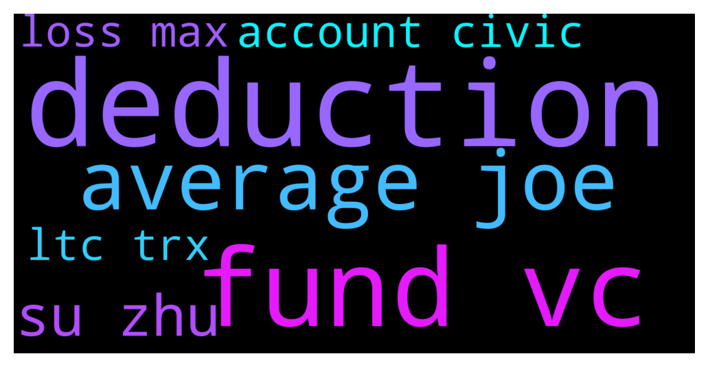

# **@shitpool**
 ## Analysis for **2021-12-14** - **2021-12-15**.

---

## 📊 **Basic Stats**

**n_messages_sent**: 342

---

---

## 🔝 **Top keywords and related messages**

1. **deduction**

    @wojackdegreate --- *Imagine living in us and not having tts deductions… I’d fucking neck.* **--->** [TG Discussion](https://t.me/shitpool/708186)

    @wojackdegreate --- *I think I read something about bots in there. I skipped over those sections because I don’t use them. Google tts trader deductions and it should be in one of the top links.* **--->** [TG Discussion](https://t.me/shitpool/708189)

    @wojackdegreate --- *If ur in us and did more than 700 trades you can get the tts trader deductions* **--->** [TG Discussion](https://t.me/shitpool/707969)

    @wojackdegreate --- *Yea probably. These deductions days are probably numbered because Trump signed them in. Hope they leave them though, much needed for sure.* **--->** [TG Discussion](https://t.me/shitpool/708194)

2. **fund vc**

    @MoneroPal --- *Basically the ones making all the money are quant and hedge funds and vc’s the gaming plays are all VC. Nothing for the average Joe* **--->** [TG Discussion](https://t.me/shitpool/708028)

    @MoneroPal --- *Biggest money makers are quant / hedge funds and VC’s* **--->** [TG Discussion](https://t.me/shitpool/708036)

    @MoneroPal --- *What you wrote will never repeat, almost nobody that is trying to invest now will ever 1500x an amount of $100k. The space is traditional finance (hedge funds, quant funds) and VC’s* **--->** [TG Discussion](https://t.me/shitpool/708021)

    @MoneroPal --- *The maximalist that has no prior understanding of the financial markets beleives that BTC, defi, and crypto are somehow going to topple governments and financial systems, total clowns, that will never happen, and BTC is just another asset. Traded just like any other asset, making real fiat gains that are realized and used to purchase nice things, by the biggest “maximilists” aka the funds that trade it daily* **--->** [TG Discussion](https://t.me/shitpool/708047)

    @kevvy_wevvy --- *bear market hopium - q1 pension funds are gonna come in* **--->** [TG Discussion](https://t.me/shitpool/707708)

    @MoneroPal --- *Anyone with half a brain would understand TIME is a scam. Early entrants dumping on clowns that are coming in late with hopium of lambos due to the calculator and assumptions on price and APY. Both have tankeds 50-60% or more and will dorp further likely decimating the treasury if they do’t buy back. The community is mostly 4chan and Twitter. The project itself is a open ended fund with an inflationay token representing ownership with no future direction, concert promotion, clothing, some sort of investment fund that distributes profits to holders, it’s all over the place, just another Olympus fork, his only goal is to get more people to use MIM* **--->** [TG Discussion](https://t.me/shitpool/707785)

3. **average joe**

    @MoneroPal --- *This isn’t relevent whatsoever the average person will not do any better with BTC versus USD in the end. As for the purchase power, sure, but the credit system has made up for it, or at least up until now. People in the US have some of the highest standard of living due to the dollar. Dollar demand internationally is at an alltime high. Not to mention the macro enviroment drives the price of BTC. It’s completely coupled to dollars.* **--->** [TG Discussion](https://t.me/shitpool/708048)

    @MoneroPal --- *Basically the ones making all the money are quant and hedge funds and vc’s the gaming plays are all VC. Nothing for the average Joe* **--->** [TG Discussion](https://t.me/shitpool/708028)

    @MoneroPal --- *average Joe is apeing into bullshit hoping for a lottery winning* **--->** [TG Discussion](https://t.me/shitpool/708037)

    @MoneroPal --- *I’ve been in the space since 2013 and I have no conviction as to whether or not BTC will be whatever in the future. Lots of things can happen. One thing is for sure is crypto and BTC will certaintly not take over the global financial system. Common misconception by the ignorant uninformed average Joe.* **--->** [TG Discussion](https://t.me/shitpool/708035)

4. **su zhu**

    @ziconet --- *Then you ascend to Su Zhu and lord rothschild begins bringing you to dinners.  We will never be as big as him ever.* **--->** [TG Discussion](https://t.me/shitpool/708016)

    @Xuvinator --- *it's time to update the avax zhu chart* **--->** [TG Discussion](https://t.me/shitpool/707224)

    @MoneroPal --- *Damn this Su Zhu isn’t that old, likely early 30’s* **--->** [TG Discussion](https://t.me/shitpool/708038)

    @Xuvinator --- *thought zhu was saying selling below 48k is a sin yday.* **--->** [TG Discussion](https://t.me/shitpool/707369)

    @ziconet --- *yea basically if you wan to rise up past Su Zhu you have to be like michael saylor if you want to compete* **--->** [TG Discussion](https://t.me/shitpool/708018)

    @MoneroPal --- *You can tell Zhu is a little bitch in real life too* **--->** [TG Discussion](https://t.me/shitpool/708085)

5. **account civic**

    @Bitcoinnect --- *I experimented with this back in early Feb with separate Binance account with small amount of LTC & TRX using coin-M futures, as of now:  LTC grew by 11% and breakeven TRX grew by 8% and heavily underwater  Mind you this has been a bull market where funding favors shorts  Oh don't even try this with BNB  Earning from funding is a myth. Just stay with staking.  1x short should be used as USD preservation strategy during bear market, not to earn funding in bull market* **--->** [TG Discussion](https://t.me/shitpool/707906)

    @sumtemm --- *>Me hoping i can do 700 trades on a honda civic account on spot and just chop it up to earn trader tax status lol* **--->** [TG Discussion](https://t.me/shitpool/708002)

    @ziconet --- *after your first few wins on lambo account you begin winning more and more and work your way up to a decent sized boat* **--->** [TG Discussion](https://t.me/shitpool/708012)

    @MoneroPal --- *whats a honda civic account ser?* **--->** [TG Discussion](https://t.me/shitpool/708004)

    @ziconet --- *Then you hit a big one and go into a lambo account* **--->** [TG Discussion](https://t.me/shitpool/708011)

6. **loss max**

    @wojackdegreate --- *It gets rid of the $3000 max loss rule also, so you can write off massive losses in the same year instead of over a lifetime lol* **--->** [TG Discussion](https://t.me/shitpool/708190)

    @wojackdegreate --- *It also gets rid of the max loss of 3k issue* **--->** [TG Discussion](https://t.me/shitpool/707972)

    @Bitcoinnect --- *Maybe the real sellers were the stop losses we hit along the way? 👀* **--->** [TG Discussion](https://t.me/shitpool/707218)

    @canadapt032702 --- *If u don’t DCA in times like this do u actually lose money u can’t get back or for the time being your in a loss until your crypto recovers if it ever recovers* **--->** [TG Discussion](https://t.me/shitpool/707552)

7. **ltc trx**

    @Bitcoinnect --- *I experimented with this back in early Feb with separate Binance account with small amount of LTC & TRX using coin-M futures, as of now:  LTC grew by 11% and breakeven TRX grew by 8% and heavily underwater  Mind you this has been a bull market where funding favors shorts  Oh don't even try this with BNB  Earning from funding is a myth. Just stay with staking.  1x short should be used as USD preservation strategy during bear market, not to earn funding in bull market* **--->** [TG Discussion](https://t.me/shitpool/707906)

    @Gregoranus --- *Is like that time “they” were going to pump it on a specific day at a specific time, and that time it was “definitely getting listed on Coinbase” when there was only BTC, BCH, ETH & LTC on, pumped for over a week. And all the bank adoption rumours. The XRP army have some heavy marketing MMs. I’ll ride the pump and enjoy the dump.* **--->** [TG Discussion](https://t.me/shitpool/707208)

    @Bitcoinnect --- *This isn't c&c This is opening 1x short on inverse perp, which is coin margined. Meaning for LTC short I have to put in LTC, TRX I have to put in TRX, not using any stablecoins.* **--->** [TG Discussion](https://t.me/shitpool/707909)

