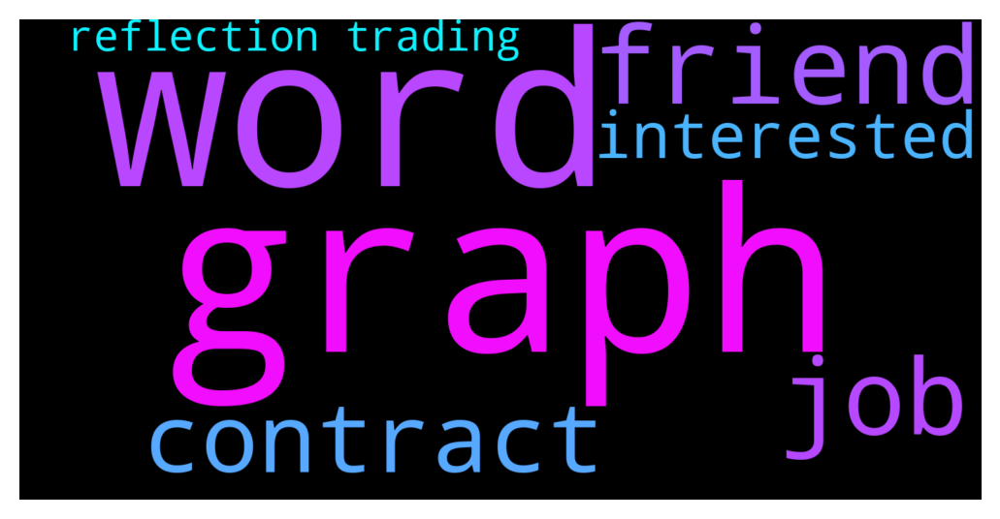

# **@de_fi**
 ## Analysis for **2021-12-01** - **2021-12-02**.

---

## 📊 **Basic Stats**

**n_messages_sent**: 55

---

---

## 🔝 **Top keywords and related messages**

1. **graph**

    @realpeter --- *Flux Protocol Partners with The Graph to Integrate Indexed Data with Smart Contracts  https://twitter.com/fluxprotocol/status/1466133506342465538?s=20* **--->** [TG Discussion](https://t.me/de_fi/229053)

    @realpeter --- *I was referencing an internal chat between the Flux and Graph team. But if you want to follow along for Flux you can join @fluxprotocol* **--->** [TG Discussion](https://t.me/de_fi/229093)

    @dereksilva --- *I did. I work for The Graph Foundation, Peter, among others.* **--->** [TG Discussion](https://t.me/de_fi/229067)

2. **word**

    @realpeter --- *Thanks for the kind words Derek, if you read to the bottom of the article you would see there is more in works not announced yet 🙂* **--->** [TG Discussion](https://t.me/de_fi/229066)

    @dereksilva --- *That’s a complete abuse of that word* **--->** [TG Discussion](https://t.me/de_fi/229065)

3. **friend**

    @CoSieOdjebalo --- *Do you know that new coin Shira Inu? Friend made x3 in a week and I'm thinking about joining in.. should I buy some? What do you think friends???* **--->** [TG Discussion](https://t.me/de_fi/229006)

4. **job**

    @Mariotela --- *Hi guys am an excellent moderator and am looking for a moderating job,I have worked for numerous communities I have pass experience and I can help you grow your community.* **--->** [TG Discussion](https://t.me/de_fi/228942)

    @hrdaoservice --- *Hello! Can you please recommend Telegram groups, Discord servers, maybe some other social networks/communities, where I can post job offerings for solidity developers?  PS we also plan online meetup for hr-managers in crypto and DR-specialists. Please DM me, if you are interested to give a speech.* **--->** [TG Discussion](https://t.me/de_fi/228999)

5. **contract**

    @realpeter --- *Flux Protocol Partners with The Graph to Integrate Indexed Data with Smart Contracts  https://twitter.com/fluxprotocol/status/1466133506342465538?s=20* **--->** [TG Discussion](https://t.me/de_fi/229053)

    @cannabis_breath --- *coinmerge forked contract* **--->** [TG Discussion](https://t.me/de_fi/229052)

6. **interested**

    @mosesgottlieb --- *If you have questions feel free to ask me anything, we host daily games and giveaways in our tg community up to launch, for whoever is interested!* **--->** [TG Discussion](https://t.me/de_fi/228865)

    @valentinabodro --- *Hi there! We're doing research for the DeFi community. I'm looking for participants who are willing to take part in a problem interview. It'll take around an hour. Particularly interested in those from US, West Europe, Saudi Arabia. Please message me, if u're up for this. (some amount of money can be discussed).* **--->** [TG Discussion](https://t.me/de_fi/228861)

    @hrdaoservice --- *Hello! Can you please recommend Telegram groups, Discord servers, maybe some other social networks/communities, where I can post job offerings for solidity developers?  PS we also plan online meetup for hr-managers in crypto and DR-specialists. Please DM me, if you are interested to give a speech.* **--->** [TG Discussion](https://t.me/de_fi/228999)

    @DunhillFineCut --- *anyone interested in a leverage trading protocol on Arbitrum?* **--->** [TG Discussion](https://t.me/de_fi/228991)

7. **reflection trading**

    @cannabis_breath --- *10B supply. ~30% for eth, remaining for BSC & AVAX. 3% reflections. Bylo Trading App access with trailing stop loss for Uniswap.* **--->** [TG Discussion](https://t.me/de_fi/229050)

    @DunhillFineCut --- *anyone interested in a leverage trading protocol on Arbitrum?* **--->** [TG Discussion](https://t.me/de_fi/228991)

