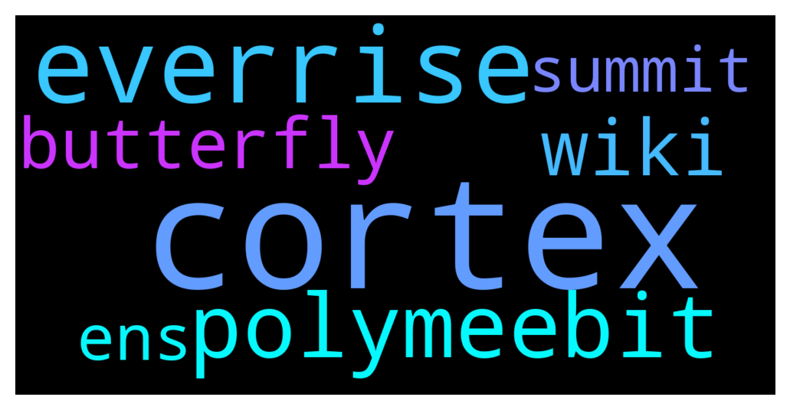

# **@polygonofficial**
 ## Analysis for **2021-11-29** - **2021-12-02**.

---

## 📊 **Basic Stats**

**n_messages_sent**: 3741

---

---

## 🔝 **Top keywords and related messages**

1. **cortex**

    @IndCryptoGeek --- *📢 Join us for an AMA with @cortex_app, A decentralized notebook, web3 publishing tool and wallet in one. The ultimate tool for creating, collaborating and publishing on an open metaverse.   We'll be joined by Leonard Kish (CEO) and Josh Robinson (CTO) and Co-founders at Cortex.  🗓 30 Nov 2021, Tuesday 🕖  7:00 PM IST | 2:30 PM UTC 📍 t.me/polygonofficial  Check out their website and social channels here:  Website: https://www.crtx.app/ Twitter: https://twitter.com/app_cortex Discord: https://discord.gg/jNhy8PU3 Telegram: https://t.me/cortex_app* **--->** [TG Discussion](https://t.me/polygonofficial/901963)

    @IsaSal1218 --- *How is Polygon and Cortex related?* **--->** [TG Discussion](https://t.me/polygonofficial/902189)

    @hypergraphi --- *But the core of Cortex is an HD wallet combined with a decntralized data structure.* **--->** [TG Discussion](https://t.me/polygonofficial/902064)

    @hypergraphi --- *Sure. So Cortex was born out of the idea, much like crypto itself, that data should be decentralized and owned by the users.* **--->** [TG Discussion](https://t.me/polygonofficial/901984)

    @hypergraphi --- *So Cortex is just that, a place to store but also, if you like, to publish all your digital stuff.* **--->** [TG Discussion](https://t.me/polygonofficial/901992)

    @hypergraphi --- *Cortex is the way you access that structure, to take notes, to hold nfts or other assets, or to publish to a full web3 stack.* **--->** [TG Discussion](https://t.me/polygonofficial/901998)

2. **everrise**

    @Andrei --- *hey guys ,check the everrise staking option ..* **--->** [TG Discussion](https://t.me/polygonofficial/903761)

    @TJChillin --- *Hi EverRise just came to Polygon. $RISE ❤️ POLY* **--->** [TG Discussion](https://t.me/polygonofficial/903787)

    @nEverKnown0x --- *the everrise staking platform seems innovative* **--->** [TG Discussion](https://t.me/polygonofficial/903897)

    @nEverKnown0x --- *anyone here heard of everrise launching on poly? i heard the migration went well and was thinking of investing* **--->** [TG Discussion](https://t.me/polygonofficial/903746)

    @Hrdrok --- *You could trade some Matic and stake EverRise. It's a solid project, DYOR.* **--->** [TG Discussion](https://t.me/polygonofficial/904343)

    @TJChillin --- *EverRise has staking feature. Over 36% already staked.* **--->** [TG Discussion](https://t.me/polygonofficial/903794)

3. **polymeebit**

    @Polymeebitss --- *https://polymeebits.com  PolyMeebits is the first Meebits NFT on the Polygon Smart Chain, one of the fastest, safest, and most developed blockchains in the world!     PolyMeebits are a rare collection of 20000 unique 3D avatars that have 9 differing attributes!   The collection consists of: 5 Dissected, 10 Sandeep Naliwal (founder of polygon), 10 polymeebits (wearing Polygon and  outfits), 18 Visitor, 57 Skeleton, 72 Robot, 256 Elephant, 711 pigs, and 18862 Humans !   Minting a PolyMeebits costs only 75 Matic Coin (matic), where users will receive a random Meebit from the ones available.   The rarity of PolygonMeebits is determined by its attributes, description and type. Some of the 3D avatars are super rare!   PolyMeebits offers users the opportunity to receive a distributed part of the revenue by joining a pool!  5% for users who mint 40 PolyMeebits (up to 75000 Matic split between users) 10% for users who mint 120 BMeebits (up to 150000 Matic split between users)  The PolyMeebits platform works with the Metamask wallet, one of the most developed and easy-to-use wallet extensions!   Good luck and may the force be with you!* **--->** [TG Discussion](https://t.me/polygonofficial/903774)

4. **wiki**

    @hypergraphi --- *Cortex is like a browser, wiki and wallet combined. So when you are using Cortex, you are really fully integrated into web3.* **--->** [TG Discussion](https://t.me/polygonofficial/902002)

    @hypergraphi --- *Mostly the domains, the cortex app (wallet and wiki) and the backend are interchangeable.* **--->** [TG Discussion](https://t.me/polygonofficial/902072)

    @hypergraphi --- *A web3 wiki for anything and maybe even a way to filter up the most trusted data.* **--->** [TG Discussion](https://t.me/polygonofficial/902078)

    @hypergraphi --- *While the front end is a wiki.* **--->** [TG Discussion](https://t.me/polygonofficial/902065)

    @hypergraphi --- *We all love note-taking apps, wikis and blogs, but always felt these should be decentralized.* **--->** [TG Discussion](https://t.me/polygonofficial/901988)

5. **butterfly**

    @Clem --- *Butterfly Protocol 👀👀👀💥💥💥 Great paternship with MATIC* **--->** [TG Discussion](https://t.me/polygonofficial/902123)

    @hypergraphi --- *Butterfly protocol domains, like .crtx are cross chain and FULL NFTs you can own for life.* **--->** [TG Discussion](https://t.me/polygonofficial/902241)

    @hypergraphi --- *We use Butterfly Domains, which are soon to be cross-chain with Ethereum and Polygon. They will resolve across chains.* **--->** [TG Discussion](https://t.me/polygonofficial/902020)

    @hypergraphi --- *Butterfly Protocol will be making big waves with cross-chain domains on MATIC. That's why we're using them! 😁* **--->** [TG Discussion](https://t.me/polygonofficial/902126)

6. **ens**

    @hypergraphi --- *Each note, or each page is also a valid crypto address, kind of line ENS, but with the whole URL, down to the data layer.* **--->** [TG Discussion](https://t.me/polygonofficial/901995)

    @hypergraphi --- *And of course, the domains will resolve cross-chain. So lots of benefts beyond,  and compatibility with, ENS.* **--->** [TG Discussion](https://t.me/polygonofficial/902039)

    @BerthoK --- *what about ens domains ?* **--->** [TG Discussion](https://t.me/polygonofficial/902206)

    @IndCryptoGeek --- *You will be selling domain names, what's different from, say, ENS? How will they tie in to the normal web? Will they only work on Polygon?* **--->** [TG Discussion](https://t.me/polygonofficial/902030)

    @SagarBloomberg --- *Hey Admin. Does Polygon has something similar to ENS?* **--->** [TG Discussion](https://t.me/polygonofficial/896631)

7. **summit**

    @OxJCT --- *Be sure to register for the zk Summit hosted by Polygon and ETHGlobal on December 9, 11 AM EST. A really big announcement is dropping during the summit👀  https://t.co/ufG2xelm6L?amp=1* **--->** [TG Discussion](https://t.me/polygonofficial/902884)

    @andytong --- *CryptosRus said good chance Coinbase selects Polygon as NFT marketplace partner. Is this the big December 9th announcement for the zk summit? Does anyone know if this is true? https://youtu.be/jIYtL3wKnSM?t=445 and https://tradersofcrypto.com/news/polygon-matic-boosted-by-coinbase-nft-rumors/* **--->** [TG Discussion](https://t.me/polygonofficial/903888)

    @boksk --- *Hi all. I heard about zk summit and big announcement.  Is it what kind of annoncement? Partnership or new project or something else? I am curious.* **--->** [TG Discussion](https://t.me/polygonofficial/903812)

