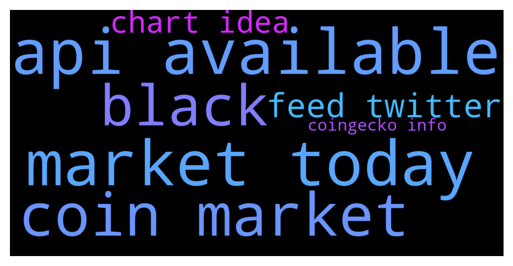

# **@DEXToolsCommunity**
 ## Analysis for **2021-12-01** - **2021-12-03**.

---

## 📊 **Basic Stats**

**n_messages_sent**: 824

---

---

## 🔝 **Top keywords and related messages**

1. **api available**

    @stanes --- *We don't have any api available for now. For partnerships, please DM @guillermorodriguez78 he is the person-in-charge.  Be aware of scammers, HE WILL NEVER DM YOU FIRST.* **--->** [TG Discussion](https://t.me/DEXToolsCommunity/308282)

    @stanes --- *Api should be available next year.* **--->** [TG Discussion](https://t.me/DEXToolsCommunity/308113)

    @napascual --- *Showing up now. Sometimes coingecko API sends the data a bit unsorted, but we've handled that. Thanks for reporting!* **--->** [TG Discussion](https://t.me/DEXToolsCommunity/308877)

    @stanes --- *Polygonscan api doesn't include social info for now so you need to update CoinGecko.* **--->** [TG Discussion](https://t.me/DEXToolsCommunity/308121)

    @stanes --- *Unfortunately Polygonscan api doesn't include socials. Please update CG.* **--->** [TG Discussion](https://t.me/DEXToolsCommunity/307182)

    @stanes --- *I have absolutely no idea how it will work sorry. We will probably know only once api is available.* **--->** [TG Discussion](https://t.me/DEXToolsCommunity/308117)

2. **market today**

    @Dos_Sequis --- *Hello admin I’m having an issue with American Shiba coin the website does not show up on dextools website However the correct website does show up on coin market cap and also coin gecko please help me* **--->** [TG Discussion](https://t.me/DEXToolsCommunity/308840)

    @dogebounty --- *Anyone have advice on how to get market cap on dext corrected for an erc token?* **--->** [TG Discussion](https://t.me/DEXToolsCommunity/307401)

    @hmk18990 --- *yea and I banned another joey couple of minutes before you 😄 you're very popular today* **--->** [TG Discussion](https://t.me/DEXToolsCommunity/306054)

    @delgadough --- *Can someone tell me how Dextools gauges the top trending tokens that show up in the top ticker banner?  Is it based on the most volume for the hour?  Increase in market cap?  Or is ir based on how many visitors clicked on the add to favorites link?  Or something to that affect?* **--->** [TG Discussion](https://t.me/DEXToolsCommunity/308104)

    @Samzyrex2014 --- *Hello devs, will there be burn today?* **--->** [TG Discussion](https://t.me/DEXToolsCommunity/307777)

    @napascual --- *Hard refresh the page, we've fixed this today* **--->** [TG Discussion](https://t.me/DEXToolsCommunity/306998)

3. **coin market**

    @titancrypto1 --- *Is there a way to filter out/ hide ones with no liquidity? Or make Newley added LP show at the top? Just thinking about all the good coins that don’t upload LP at first that get buried* **--->** [TG Discussion](https://t.me/DEXToolsCommunity/306534)

    @Dos_Sequis --- *Hello admin I’m having an issue with American Shiba coin the website does not show up on dextools website However the correct website does show up on coin market cap and also coin gecko please help me* **--->** [TG Discussion](https://t.me/DEXToolsCommunity/308840)

    @dogebounty --- *Anyone have advice on how to get market cap on dext corrected for an erc token?* **--->** [TG Discussion](https://t.me/DEXToolsCommunity/307401)

    @napascual --- *You have the DEXTScore, the community trust and different kinds of information to better take trading decisions. If you still decide to go into a coin we cannot stop you from doing it. Please DYOR always.* **--->** [TG Discussion](https://t.me/DEXToolsCommunity/307424)

    @delgadough --- *Can someone tell me how Dextools gauges the top trending tokens that show up in the top ticker banner?  Is it based on the most volume for the hour?  Increase in market cap?  Or is ir based on how many visitors clicked on the add to favorites link?  Or something to that affect?* **--->** [TG Discussion](https://t.me/DEXToolsCommunity/308104)

    @TS000000000 --- *How do I see what coins are trending !!* **--->** [TG Discussion](https://t.me/DEXToolsCommunity/306572)

4. **black**

    @mangch111 --- *yes black screen on chart* **--->** [TG Discussion](https://t.me/DEXToolsCommunity/308365)

    @mangch111 --- *hi im new user of dextools how come i dont have a chart all i see it black empty* **--->** [TG Discussion](https://t.me/DEXToolsCommunity/308299)

    @mangch111 --- *i just tried microsoft edge its empty. black on the chart area* **--->** [TG Discussion](https://t.me/DEXToolsCommunity/308359)

5. **feed twitter**

    @PlatasCrypto --- *I need to add the Twitter feed to our pair page on Dextools. Contract address: 0x9cf0a5979f6987bc582ec019b389be417ff19880 Twitter account: @DFSocial_Gaming* **--->** [TG Discussion](https://t.me/DEXToolsCommunity/308337)

    @doxedboydev --- *hello sirs, i'm interested in getting my token's twitter feed pushed through to my Dextools pair. whom shall i contact?* **--->** [TG Discussion](https://t.me/DEXToolsCommunity/306231)

    @PlatasCrypto --- *If you scroll down, on the left corner you can see that the Token News section is not being updated with our Twitter feeds and it says to contact your team for that.* **--->** [TG Discussion](https://t.me/DEXToolsCommunity/308349)

    @stanes --- *I don't think we can display a feed for the moment but contact Guillermo please, he is the person in charge.* **--->** [TG Discussion](https://t.me/DEXToolsCommunity/308364)

    @edwarfall --- *It would be great to see token news from twitter in this section like in cmc, no need find it separately in twitter* **--->** [TG Discussion](https://t.me/DEXToolsCommunity/308612)

    @stanes --- *I can see the twitter link is on Dextools, what is your issue?* **--->** [TG Discussion](https://t.me/DEXToolsCommunity/308345)

6. **chart idea**

    @mangch111 --- *yes black screen on chart* **--->** [TG Discussion](https://t.me/DEXToolsCommunity/308365)

    @mixedbymallen --- *Does anyone have a proble with Dextools loading tradingview chart on Big Sur for Mac* **--->** [TG Discussion](https://t.me/DEXToolsCommunity/307630)

    @stanes --- *You have to buy the number of DEXT required:  DEXT PANCAKESWAP PAIR Chart and trade: https://www.dextools.io/app/pancakeswap/pair-explorer/0x4b729d5d871057f3a9c424792729217cde72410d Contract: 0xe91a8d2c584ca93c7405f15c22cdfe53c29896e3  Then you send them to the address the app gives you.* **--->** [TG Discussion](https://t.me/DEXToolsCommunity/306439)

    @mangch111 --- *hi im new user of dextools how come i dont have a chart all i see it black empty* **--->** [TG Discussion](https://t.me/DEXToolsCommunity/308299)

    @td4400 --- *Admins, why poocoin has a chart for this:0x4e3dca33ec4fbcdaf0b29ac229408bb247b71e5f but on dextools there is no real chart found for this.* **--->** [TG Discussion](https://t.me/DEXToolsCommunity/306078)

    @stanes --- *So, if you try to open for example this page: https://www.dextools.io/app/ether/pair-explorer/0xa29fe6ef9592b5d408cca961d0fb9b1faf497d6d on chrome and egde you can't see the chart. Is that correct?* **--->** [TG Discussion](https://t.me/DEXToolsCommunity/308362)

7. **coingecko info**

    @bastardganpunk --- *Here you can find all Info about how you can improve your DextScore 🙂 https://dextools.medium.com/comments-and-tips-about-dext-score-7f6cfd628ee2* **--->** [TG Discussion](https://t.me/DEXToolsCommunity/308657)

    @stanes --- *All right, so please send all the relevant info to @pablojan* **--->** [TG Discussion](https://t.me/DEXToolsCommunity/308415)

    @stanes --- *About social Information for your token, please update etherscan.io or bscscan.com or coingecko.com  We pull info from there.* **--->** [TG Discussion](https://t.me/DEXToolsCommunity/308325)

    @stanes --- *Please update etherscan.io or bscscan.com or coingecko.com  We pull info from there.* **--->** [TG Discussion](https://t.me/DEXToolsCommunity/308341)

    @napascual --- *Showing up now. Sometimes coingecko API sends the data a bit unsorted, but we've handled that. Thanks for reporting!* **--->** [TG Discussion](https://t.me/DEXToolsCommunity/308877)

    @napascual --- *Coingecko normally* **--->** [TG Discussion](https://t.me/DEXToolsCommunity/307750)

