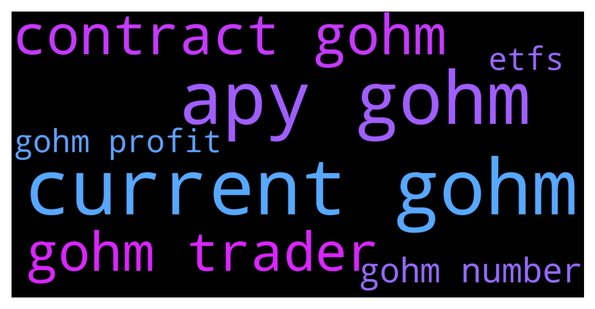

# **@OlympusTG**
 ## Analysis for **2021-12-02** - **2021-12-03**.

---

## 📊 **Basic Stats**

**n_messages_sent**: 2863

---

---

## 🔝 **Top keywords and related messages**

1. **current gohm**

    @Annonymousx0 --- *It means gohm price keep on increasing* **--->** [TG Discussion](https://t.me/OlympusTG/103790)

    @Jayinwakanda --- *https://youtu.be/eGIw6vwhPFw  The calculator guy explains gOHM a bit* **--->** [TG Discussion](https://t.me/OlympusTG/100475)

    @ParamedicOne --- *Yeah but you need to convert your sOHM into gOHM for V2* **--->** [TG Discussion](https://t.me/OlympusTG/100122)

    @LaurensVKA --- *Because when you have your OHM in gohm, you will still get the rebases on top of the extra 15%* **--->** [TG Discussion](https://t.me/OlympusTG/100148)

    @Miguel_ecu --- *gOHM is wsOHM but new contract* **--->** [TG Discussion](https://t.me/OlympusTG/100106)

    @fairwinds --- *Leave sOHM as it is for now. If you want to buy gOHM just buy it with AVAX. Let your sOHM continue* **--->** [TG Discussion](https://t.me/OlympusTG/101836)

2. **apy gohm**

    @Annonymousx0 --- *It means gohm price keep on increasing* **--->** [TG Discussion](https://t.me/OlympusTG/103790)

    @Jayinwakanda --- *https://youtu.be/eGIw6vwhPFw  The calculator guy explains gOHM a bit* **--->** [TG Discussion](https://t.me/OlympusTG/100475)

    @ParamedicOne --- *Yeah but you need to convert your sOHM into gOHM for V2* **--->** [TG Discussion](https://t.me/OlympusTG/100122)

    @LaurensVKA --- *Because when you have your OHM in gohm, you will still get the rebases on top of the extra 15%* **--->** [TG Discussion](https://t.me/OlympusTG/100148)

    @Miguel_ecu --- *gOHM is wsOHM but new contract* **--->** [TG Discussion](https://t.me/OlympusTG/100106)

    @fairwinds --- *Leave sOHM as it is for now. If you want to buy gOHM just buy it with AVAX. Let your sOHM continue* **--->** [TG Discussion](https://t.me/OlympusTG/101836)

3. **contract gohm**

    @Annonymousx0 --- *It means gohm price keep on increasing* **--->** [TG Discussion](https://t.me/OlympusTG/103790)

    @Jayinwakanda --- *https://youtu.be/eGIw6vwhPFw  The calculator guy explains gOHM a bit* **--->** [TG Discussion](https://t.me/OlympusTG/100475)

    @ParamedicOne --- *Yeah but you need to convert your sOHM into gOHM for V2* **--->** [TG Discussion](https://t.me/OlympusTG/100122)

    @LaurensVKA --- *Because when you have your OHM in gohm, you will still get the rebases on top of the extra 15%* **--->** [TG Discussion](https://t.me/OlympusTG/100148)

    @Miguel_ecu --- *gOHM is wsOHM but new contract* **--->** [TG Discussion](https://t.me/OlympusTG/100106)

    @fairwinds --- *Leave sOHM as it is for now. If you want to buy gOHM just buy it with AVAX. Let your sOHM continue* **--->** [TG Discussion](https://t.me/OlympusTG/101836)

4. **gohm trader**

    @Annonymousx0 --- *It means gohm price keep on increasing* **--->** [TG Discussion](https://t.me/OlympusTG/103790)

    @Jayinwakanda --- *https://youtu.be/eGIw6vwhPFw  The calculator guy explains gOHM a bit* **--->** [TG Discussion](https://t.me/OlympusTG/100475)

    @ParamedicOne --- *Yeah but you need to convert your sOHM into gOHM for V2* **--->** [TG Discussion](https://t.me/OlympusTG/100122)

    @LaurensVKA --- *Because when you have your OHM in gohm, you will still get the rebases on top of the extra 15%* **--->** [TG Discussion](https://t.me/OlympusTG/100148)

    @Miguel_ecu --- *gOHM is wsOHM but new contract* **--->** [TG Discussion](https://t.me/OlympusTG/100106)

    @fairwinds --- *Leave sOHM as it is for now. If you want to buy gOHM just buy it with AVAX. Let your sOHM continue* **--->** [TG Discussion](https://t.me/OlympusTG/101836)

5. **gohm number**

    @Annonymousx0 --- *It means gohm price keep on increasing* **--->** [TG Discussion](https://t.me/OlympusTG/103790)

    @Jayinwakanda --- *https://youtu.be/eGIw6vwhPFw  The calculator guy explains gOHM a bit* **--->** [TG Discussion](https://t.me/OlympusTG/100475)

    @ParamedicOne --- *Yeah but you need to convert your sOHM into gOHM for V2* **--->** [TG Discussion](https://t.me/OlympusTG/100122)

    @LaurensVKA --- *Because when you have your OHM in gohm, you will still get the rebases on top of the extra 15%* **--->** [TG Discussion](https://t.me/OlympusTG/100148)

    @Miguel_ecu --- *gOHM is wsOHM but new contract* **--->** [TG Discussion](https://t.me/OlympusTG/100106)

    @fairwinds --- *Leave sOHM as it is for now. If you want to buy gOHM just buy it with AVAX. Let your sOHM continue* **--->** [TG Discussion](https://t.me/OlympusTG/101836)

6. **gohm profit**

    @Annonymousx0 --- *It means gohm price keep on increasing* **--->** [TG Discussion](https://t.me/OlympusTG/103790)

    @Jayinwakanda --- *https://youtu.be/eGIw6vwhPFw  The calculator guy explains gOHM a bit* **--->** [TG Discussion](https://t.me/OlympusTG/100475)

    @ParamedicOne --- *Yeah but you need to convert your sOHM into gOHM for V2* **--->** [TG Discussion](https://t.me/OlympusTG/100122)

    @LaurensVKA --- *Because when you have your OHM in gohm, you will still get the rebases on top of the extra 15%* **--->** [TG Discussion](https://t.me/OlympusTG/100148)

    @Miguel_ecu --- *gOHM is wsOHM but new contract* **--->** [TG Discussion](https://t.me/OlympusTG/100106)

    @fairwinds --- *Leave sOHM as it is for now. If you want to buy gOHM just buy it with AVAX. Let your sOHM continue* **--->** [TG Discussion](https://t.me/OlympusTG/101836)

7. **etfs**

    @FinallyDeshaun --- *bruhhhhh, ok so that is a lot of money to recoup. that's the cost of that lesson learned man. but you're in crypto, on the verge of the second half of a bull cycle. you'll probably make that money back by the spring. Just gotta dust yourself off and go harder before alt season really takes off.   There's some new ETFs on kucoin that could function like small lottery tickets if risk is your thing. Example, DOGE3L. Buy some now and wait until doge goes to .29/.30 cents. DOGE3L price will go up 3 times higher* **--->** [TG Discussion](https://t.me/OlympusTG/104166)

    @FinallyDeshaun --- *shill? uhhhh ok i can see that because i mentioned an example, but there's other exchanges with ETFs. the point is ETFs. Dude got scammed, that's different than just taking risks in crypto. there's other ETFs and other defi high yield APYs to mess with too. i just know that losing money can cripple you and cause you to miss out on other high risk/high reward opportunities. Basically i'm saying just be player #456 from Squid games* **--->** [TG Discussion](https://t.me/OlympusTG/104197)

