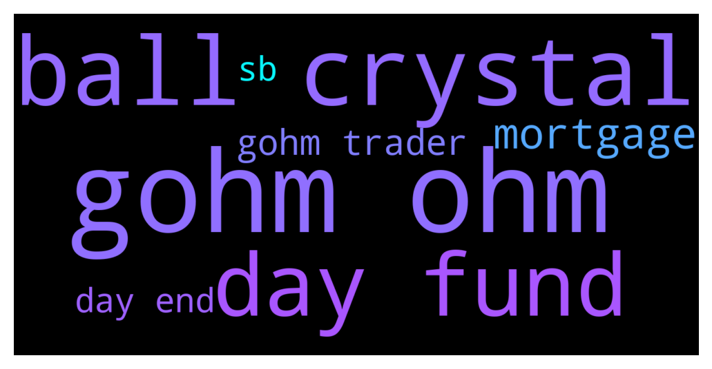

# **@OlympusTG**
 ## Analysis for **2021-12-05** - **2021-12-06**.

---

## 📊 **Basic Stats**

**n_messages_sent**: 1892

---

---

## 🔝 **Top keywords and related messages**

1. **gohm ohm**

    @theMagicUnicorn --- *i think its gohm, im not sure what the ca is sorry* **--->** [TG Discussion](https://t.me/OlympusTG/104978)

    @RightNow_3005 --- *How is gOHM different from sOHM?* **--->** [TG Discussion](https://t.me/OlympusTG/107515)

    @Poopoo --- *Buy gOHM on trader joe (AVAX) gOHM contract address on AVAX: 0x321e7092a180bb43555132ec53aaa65a5bf84251  What is gOHM: https://twitter.com/OlympusDAO/status/1465410905542385677  gOHM documentation: https://docs.olympusdao.finance/main/contracts/tokens#gohm* **--->** [TG Discussion](https://t.me/OlympusTG/107686)

    @JM --- *So I think I get it.  Gohm price = OHM Price * Current Index  Current index increases with every rebase so providing ohm price stays the same Gohm price will increase.  Gohm & AVAX can be farmed for APR. Therefore, providing within the liquidity pool your ratio of coins remains the same. You’ll receive rebase payments via the current index increasing AND you’ll receive APR from your farm?* **--->** [TG Discussion](https://t.me/OlympusTG/106525)

    @theMagicUnicorn --- *gohm is* **--->** [TG Discussion](https://t.me/OlympusTG/106569)

    @RegardV --- *Sorry no calls no pm. Seems the dapp is up again on eth thank you.   What is interesting is that the gohm i brided to avax.  Loading the dapp in eth shows zero balances. But loading the dapp in avax shows my balance.* **--->** [TG Discussion](https://t.me/OlympusTG/106482)

2. **ball crystal**

    @Wbish91 --- *Morning all, I’m 70%in this project with my portfolio. Just come from the Monkey ball starlaunch platform. What a shit show. No co-ordination on the level customer like OHM team, you are a solid project.* **--->** [TG Discussion](https://t.me/OlympusTG/106879)

    @Clewerhillroad --- *Where did you get your crystal ball from and where can I get one* **--->** [TG Discussion](https://t.me/OlympusTG/106534)

    @KBigBagsΩ(🎩, 🎩)🐸 --- *Q1-Q4 The best Crystal ball suggests* **--->** [TG Discussion](https://t.me/OlympusTG/107427)

    @EnricoMendonca --- *where did you buy your crystal ball? are they available? I need one* **--->** [TG Discussion](https://t.me/OlympusTG/107433)

    @P --- *Only those with stone balls survive and thrive in this space....they need to earn their stripes ...sick of them running thier mouths about shit they know little about* **--->** [TG Discussion](https://t.me/OlympusTG/105431)

    @Clewerhillroad --- *No one has a crystal ball unfortunately* **--->** [TG Discussion](https://t.me/OlympusTG/105144)

3. **day fund**

    @Poopoo --- *gohm does not increase, gohm x current index = sohm, current index increases every rebase, you can find current index in the olympus dapp. Let's say 1gOHM ($28,000) x 40 (Current Index) = 40 sOHM ($700 each), a few days later, when sOHM holders have 41 sOHM because of the APY, the current index will be 41. Assuming price of sOHM is still $700, price of 1gOHM will be approximately $28,700* **--->** [TG Discussion](https://t.me/OlympusTG/105926)

    @Poopoo --- *Let's say 1gOHM ($28,000) x 40 (Current Index) = 40 sOHM ($700 each), a few days later, when sOHM holders have 41 sOHM because of the APY, the current index will be 41. Assuming price of sOHM is still $700, price of 1gOHM will be approximately $28,700 otherwise there would be an arbitrage opportunity, you can sell part of your gOHM to take profit* **--->** [TG Discussion](https://t.me/OlympusTG/106828)

    @estudentas --- *Nice. I’m staking 6 and only getting 0,02 every 5 days? Am i doing something wrong?* **--->** [TG Discussion](https://t.me/OlympusTG/106917)

    @Ap0l1o --- *It means that the treasury can cover the current APY without any additional funds in it for the next 200 days.* **--->** [TG Discussion](https://t.me/OlympusTG/107492)

    @T4S0L1T0 --- *That's nothing. I liquidated all my other positions, took out another mortgage on my house, put my mothers pension fund into ohm, and my daughter's college money! Am now 500% into OHM #believe #btfd #ireallyknowriskmanagement* **--->** [TG Discussion](https://t.me/OlympusTG/107950)

    @vampyren --- *so if i calculte right with the each 8h rate it would be like this if i do it right   Start  capital  First rebase  second rebase  third rebase    Next reward (each 8h) Day1  20 000,00 USD  20 078,02 USD  20 156,34 USD  20 234,97 USD    0,39%* **--->** [TG Discussion](https://t.me/OlympusTG/107095)

4. **mortgage**

    @T4S0L1T0 --- *That's nothing. I liquidated all my other positions, took out another mortgage on my house, put my mothers pension fund into ohm, and my daughter's college money! Am now 500% into OHM #believe #btfd #ireallyknowriskmanagement* **--->** [TG Discussion](https://t.me/OlympusTG/107950)

    @deadhead5116 --- *Liquidated all other positions and took out another mortgage on my house am now 180% in on ohm #believe #bullish #btfd* **--->** [TG Discussion](https://t.me/OlympusTG/107928)

5. **gohm trader**

    @theMagicUnicorn --- *i think its gohm, im not sure what the ca is sorry* **--->** [TG Discussion](https://t.me/OlympusTG/104978)

    @RightNow_3005 --- *How is gOHM different from sOHM?* **--->** [TG Discussion](https://t.me/OlympusTG/107515)

    @Poopoo --- *Buy gOHM on trader joe (AVAX) gOHM contract address on AVAX: 0x321e7092a180bb43555132ec53aaa65a5bf84251  What is gOHM: https://twitter.com/OlympusDAO/status/1465410905542385677  gOHM documentation: https://docs.olympusdao.finance/main/contracts/tokens#gohm* **--->** [TG Discussion](https://t.me/OlympusTG/107686)

    @JM --- *So I think I get it.  Gohm price = OHM Price * Current Index  Current index increases with every rebase so providing ohm price stays the same Gohm price will increase.  Gohm & AVAX can be farmed for APR. Therefore, providing within the liquidity pool your ratio of coins remains the same. You’ll receive rebase payments via the current index increasing AND you’ll receive APR from your farm?* **--->** [TG Discussion](https://t.me/OlympusTG/106525)

    @theMagicUnicorn --- *gohm is* **--->** [TG Discussion](https://t.me/OlympusTG/106569)

    @RegardV --- *Sorry no calls no pm. Seems the dapp is up again on eth thank you.   What is interesting is that the gohm i brided to avax.  Loading the dapp in eth shows zero balances. But loading the dapp in avax shows my balance.* **--->** [TG Discussion](https://t.me/OlympusTG/106482)

6. **day end**

    @Poopoo --- *gohm does not increase, gohm x current index = sohm, current index increases every rebase, you can find current index in the olympus dapp. Let's say 1gOHM ($28,000) x 40 (Current Index) = 40 sOHM ($700 each), a few days later, when sOHM holders have 41 sOHM because of the APY, the current index will be 41. Assuming price of sOHM is still $700, price of 1gOHM will be approximately $28,700* **--->** [TG Discussion](https://t.me/OlympusTG/105926)

    @Poopoo --- *Let's say 1gOHM ($28,000) x 40 (Current Index) = 40 sOHM ($700 each), a few days later, when sOHM holders have 41 sOHM because of the APY, the current index will be 41. Assuming price of sOHM is still $700, price of 1gOHM will be approximately $28,700 otherwise there would be an arbitrage opportunity, you can sell part of your gOHM to take profit* **--->** [TG Discussion](https://t.me/OlympusTG/106828)

    @estudentas --- *Nice. I’m staking 6 and only getting 0,02 every 5 days? Am i doing something wrong?* **--->** [TG Discussion](https://t.me/OlympusTG/106917)

    @Ap0l1o --- *It means that the treasury can cover the current APY without any additional funds in it for the next 200 days.* **--->** [TG Discussion](https://t.me/OlympusTG/107492)

    @vampyren --- *so if i calculte right with the each 8h rate it would be like this if i do it right   Start  capital  First rebase  second rebase  third rebase    Next reward (each 8h) Day1  20 000,00 USD  20 078,02 USD  20 156,34 USD  20 234,97 USD    0,39%* **--->** [TG Discussion](https://t.me/OlympusTG/107095)

    @vampyren --- *not according to my calc (i might done something wrong), if u start with 20 , u have 28 after 30 day* **--->** [TG Discussion](https://t.me/OlympusTG/107302)

7. **sb**

    @Ap0l1o --- *klima, rome, sb (lol) and I won't even continue with the others* **--->** [TG Discussion](https://t.me/OlympusTG/107709)

    @pasha701 --- *Klima case it was over hyped, it launched at high market cap, Rome, sb new* **--->** [TG Discussion](https://t.me/OlympusTG/107710)

