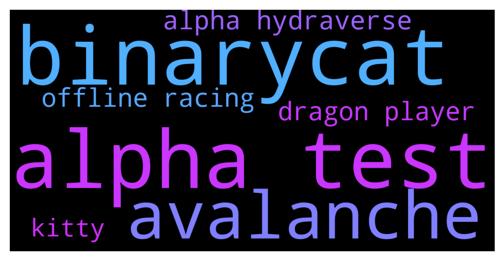

# **@defisearchpublic**
 ## Analysis for **2021-12-04** - **2021-12-06**.

---

## 📊 **Basic Stats**

**n_messages_sent**: 182

---

---

## 🔝 **Top keywords and related messages**

1. **alpha test**

    @Jezzyrei --- *What are the features of the alpha test?* **--->** [TG Discussion](https://t.me/defisearchpublic/239857)

    @Jezzyrei --- *What about the alpha test?* **--->** [TG Discussion](https://t.me/defisearchpublic/239850)

    @Jhayz18 --- *I've seen this new project on twitter and they are having an alpha test tomorrow.* **--->** [TG Discussion](https://t.me/defisearchpublic/239842)

    @Jhayz18 --- *The Hydraverse’s Alpha Version has 3 Features* **--->** [TG Discussion](https://t.me/defisearchpublic/239858)

    @Jhayz18 --- *Yes! the Alpha version will be completely FREE for everyone to participate!* **--->** [TG Discussion](https://t.me/defisearchpublic/239874)

    @wallstreetmonkey69 --- *Hey mates, I got some alpha. Lowkey project by FTX backed by a16z. Possible to get in whitelist rn. Dm me to get a referral link or their twitter (can’t send it here). If you invite 5 people - you get whitelisted.* **--->** [TG Discussion](https://t.me/defisearchpublic/239659)

2. **binarycat**

    @こんにちは --- *where can I find more information about BinaryCat?* **--->** [TG Discussion](https://t.me/defisearchpublic/239831)

    @momshie1328 --- *Have you heard BinaryCat App? This is soon to launch...* **--->** [TG Discussion](https://t.me/defisearchpublic/239811)

    @momshie1328 --- *BinaryCat rewards its user for just using the application.* **--->** [TG Discussion](https://t.me/defisearchpublic/239819)

    @こんにちは --- *aside from being deployed under Avalanche blockchain, what else are the features of BinaryCat?* **--->** [TG Discussion](https://t.me/defisearchpublic/239815)

3. **avalanche**

    @CasperDeFi --- *https://twitter.com/OlympusInuDAO/status/1466072065103077380?s=20   $ohminu relaunch in 3-5hrs on avalanche!  Join now: https://t.me/OlympusInuVerification* **--->** [TG Discussion](https://t.me/defisearchpublic/239665)

    @sg --- *but why they choose Avalanche?* **--->** [TG Discussion](https://t.me/defisearchpublic/239829)

    @momshie1328 --- *it's a decentralized betting  platform run on the Avalanche Network.* **--->** [TG Discussion](https://t.me/defisearchpublic/239813)

    @momshie1328 --- *since avalanche has the fastest transactions among all those blockchain* **--->** [TG Discussion](https://t.me/defisearchpublic/239830)

    @こんにちは --- *aside from being deployed under Avalanche blockchain, what else are the features of BinaryCat?* **--->** [TG Discussion](https://t.me/defisearchpublic/239815)

4. **alpha hydraverse**

    @Jezzyrei --- *What are the features of the alpha test?* **--->** [TG Discussion](https://t.me/defisearchpublic/239857)

    @Jezzyrei --- *What about the alpha test?* **--->** [TG Discussion](https://t.me/defisearchpublic/239850)

    @Jhayz18 --- *I've seen this new project on twitter and they are having an alpha test tomorrow.* **--->** [TG Discussion](https://t.me/defisearchpublic/239842)

    @Jhayz18 --- *The Hydraverse’s Alpha Version has 3 Features* **--->** [TG Discussion](https://t.me/defisearchpublic/239858)

    @Jhayz18 --- *Yes! the Alpha version will be completely FREE for everyone to participate!* **--->** [TG Discussion](https://t.me/defisearchpublic/239874)

    @wallstreetmonkey69 --- *Hey mates, I got some alpha. Lowkey project by FTX backed by a16z. Possible to get in whitelist rn. Dm me to get a referral link or their twitter (can’t send it here). If you invite 5 people - you get whitelisted.* **--->** [TG Discussion](https://t.me/defisearchpublic/239659)

5. **offline racing**

    @Jhayz18 --- *Offline Racing - Players can select one of their dragons to participate in Offline racing.* **--->** [TG Discussion](https://t.me/defisearchpublic/239867)

    @Jhayz18 --- *Hydraverse is a metaverse play-to-earn PVP dragon racing game.* **--->** [TG Discussion](https://t.me/defisearchpublic/239849)

    @Jhayz18 --- *Offline Racing* **--->** [TG Discussion](https://t.me/defisearchpublic/239861)

6. **dragon player**

    @Jhayz18 --- *Augmented Reality (AR) - Each dragon can be represented in reality via AR (augmented reality).* **--->** [TG Discussion](https://t.me/defisearchpublic/239863)

    @Jhayz18 --- *Completing all 7 of these challenges, Dragon Trainers will be able to claim a reward from Hydraland.* **--->** [TG Discussion](https://t.me/defisearchpublic/239853)

    @Jhayz18 --- *Every day, there will be a special mission for the Dragon Trainers in the game.* **--->** [TG Discussion](https://t.me/defisearchpublic/239852)

    @Jhayz18 --- *Dragon Training Course* **--->** [TG Discussion](https://t.me/defisearchpublic/239860)

    @Jhayz18 --- *Offline Racing - Players can select one of their dragons to participate in Offline racing.* **--->** [TG Discussion](https://t.me/defisearchpublic/239867)

    @Jhayz18 --- *Players will be able to bet on their NFTs racing with other Dragons in order to win rewards and game points.* **--->** [TG Discussion](https://t.me/defisearchpublic/239868)

7. **kitty**

    @こんにちは --- *but I wonder if this Kitty token will get a high value* **--->** [TG Discussion](https://t.me/defisearchpublic/239825)

    @momshie1328 --- *everytime you be, you'll be able to earn their tokens for free which is Kitty Token and it is regardless of whether you win bets or not* **--->** [TG Discussion](https://t.me/defisearchpublic/239821)

    @こんにちは --- *ohhh really, but Kitty token has no value yet right?* **--->** [TG Discussion](https://t.me/defisearchpublic/239822)

