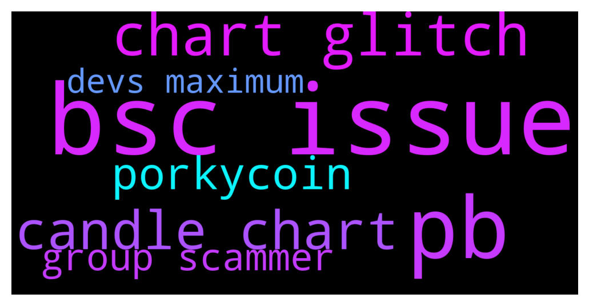

# **@DEXToolsCommunity**
 ## Analysis for **2021-12-06** - **2021-12-08**.

---

## 📊 **Basic Stats**

**n_messages_sent**: 579

---

---

## 🔝 **Top keywords and related messages**

1. **bsc issue**

    @stanes --- *It's related to the issue we currently have with some bsc pairs, need some time to re-index all the txs history so some volume is currently not counted.* **--->** [TG Discussion](https://t.me/DEXToolsCommunity/310572)

    @stanes --- *It's linked to the issue we have on bsc, devs are doing their maximum to fix it asap. Thank you for your patience.* **--->** [TG Discussion](https://t.me/DEXToolsCommunity/310561)

    @stanes --- *It's there, search with the contract address, click on the filter on the right and choose bsc.* **--->** [TG Discussion](https://t.me/DEXToolsCommunity/310293)

    @stanes --- *We are still experiencing some issues with bsc pairs. Devs are currently deploying an update to fix the problem asap. Sorry for the inconvenience.* **--->** [TG Discussion](https://t.me/DEXToolsCommunity/310559)

    @stanes --- *We got a pb with bsc pairs, everything is going back slowly, please be patient. Sorry for the inconvenience.* **--->** [TG Discussion](https://t.me/DEXToolsCommunity/310443)

    @Dannyt6 --- *Hey why doesn't the chart for this token show up? bsc  0x0496ccd13c9848f9c7d1507d1dd86a360b51b596* **--->** [TG Discussion](https://t.me/DEXToolsCommunity/310281)

2. **pb**

    @stanes --- *Pb fixed.* **--->** [TG Discussion](https://t.me/DEXToolsCommunity/310359)

    @stanes --- *Indeed, there is a technical problem affecting this chart. Team will re-index the pair once the pb is solved. Sorry for the inconvenience and thank you for reporting 👍* **--->** [TG Discussion](https://t.me/DEXToolsCommunity/310301)

    @stanes --- *We got a pb with bsc pairs, everything is going back slowly, please be patient. Sorry for the inconvenience.* **--->** [TG Discussion](https://t.me/DEXToolsCommunity/310443)

3. **chart glitch**

    @Janice --- *Is it possible to have the chart show candles instead of just a line?* **--->** [TG Discussion](https://t.me/DEXToolsCommunity/310306)

    @stanes --- *Indeed, there is a technical problem affecting this chart. Team will re-index the pair once the pb is solved. Sorry for the inconvenience and thank you for reporting 👍* **--->** [TG Discussion](https://t.me/DEXToolsCommunity/310301)

    @POA213 --- *i just spotted BTC Forming an Inverted 🐻(Bearish)Cup and Handle pattern .. on the Daily Chart .. in my guess we are not done with Dumps yet !* **--->** [TG Discussion](https://t.me/DEXToolsCommunity/310388)

    @catcatscatcats --- *Why we have problems to see the chart ? https://www.dextools.io/app/bsc/pair-explorer/0x1d49a35b0029d1c40690a8c79bab6ed3c2864e63* **--->** [TG Discussion](https://t.me/DEXToolsCommunity/310442)

    @Dannyt6 --- *Hey why doesn't the chart for this token show up? bsc  0x0496ccd13c9848f9c7d1507d1dd86a360b51b596* **--->** [TG Discussion](https://t.me/DEXToolsCommunity/310281)

    @Janice --- *For some reason it’s not letting me set the chart with candles for this   https://www.dextools.io/app/bsc/pair-explorer/0x1e06b8480733505e9dc228f69588511586edaad1  I did the command right but when I do /price in the group it comes up as 4 as chart option and then says no pair found* **--->** [TG Discussion](https://t.me/DEXToolsCommunity/310354)

4. **candle chart**

    @Janice --- *Is it possible to have the chart show candles instead of just a line?* **--->** [TG Discussion](https://t.me/DEXToolsCommunity/310306)

    @stanes --- *Indeed, there is a technical problem affecting this chart. Team will re-index the pair once the pb is solved. Sorry for the inconvenience and thank you for reporting 👍* **--->** [TG Discussion](https://t.me/DEXToolsCommunity/310301)

    @POA213 --- *i just spotted BTC Forming an Inverted 🐻(Bearish)Cup and Handle pattern .. on the Daily Chart .. in my guess we are not done with Dumps yet !* **--->** [TG Discussion](https://t.me/DEXToolsCommunity/310388)

    @catcatscatcats --- *Why we have problems to see the chart ? https://www.dextools.io/app/bsc/pair-explorer/0x1d49a35b0029d1c40690a8c79bab6ed3c2864e63* **--->** [TG Discussion](https://t.me/DEXToolsCommunity/310442)

    @Dannyt6 --- *Hey why doesn't the chart for this token show up? bsc  0x0496ccd13c9848f9c7d1507d1dd86a360b51b596* **--->** [TG Discussion](https://t.me/DEXToolsCommunity/310281)

    @Janice --- *For some reason it’s not letting me set the chart with candles for this   https://www.dextools.io/app/bsc/pair-explorer/0x1e06b8480733505e9dc228f69588511586edaad1  I did the command right but when I do /price in the group it comes up as 4 as chart option and then says no pair found* **--->** [TG Discussion](https://t.me/DEXToolsCommunity/310354)

5. **porkycoin**

    @VoidInvestor --- *since yesterday, on our PorkyCoin token page there are missing historical data* **--->** [TG Discussion](https://t.me/DEXToolsCommunity/310789)

    @VoidInvestor --- *On our PorkyCoin token, since yesterday there are missing historical data* **--->** [TG Discussion](https://t.me/DEXToolsCommunity/310769)

6. **group scammer**

    @stanes --- *Chinese group here: https://t.me/DEXTChinese* **--->** [TG Discussion](https://t.me/DEXToolsCommunity/310580)

    @hmk18990 --- *amateur scammers joins the groups and most of the time they get banned pro scammers never joins the groups, they've spies in groups and scammers DM you out of the group* **--->** [TG Discussion](https://t.me/DEXToolsCommunity/310655)

    @GarrettGG --- *Also, I am sure a lot of people just DM'd you.  They're all scammers.  DEXT team will never DM first.* **--->** [TG Discussion](https://t.me/DEXToolsCommunity/309271)

    @Janice --- *For some reason it’s not letting me set the chart with candles for this   https://www.dextools.io/app/bsc/pair-explorer/0x1e06b8480733505e9dc228f69588511586edaad1  I did the command right but when I do /price in the group it comes up as 4 as chart option and then says no pair found* **--->** [TG Discussion](https://t.me/DEXToolsCommunity/310354)

    @stanes --- *Please DM @guillermorodriguez78 he is the person-in-charge.  Be aware of scammers, HE WILL NEVER DM YOU FIRST.* **--->** [TG Discussion](https://t.me/DEXToolsCommunity/310053)

    @NegahbanTradingCo --- *is here the main group for dextool ?* **--->** [TG Discussion](https://t.me/DEXToolsCommunity/309266)

7. **devs maximum**

    @hmk18990 --- *it means devs should check your pair 😊* **--->** [TG Discussion](https://t.me/DEXToolsCommunity/310679)

    @stanes --- *It's linked to the issue we have on bsc, devs are doing their maximum to fix it asap. Thank you for your patience.* **--->** [TG Discussion](https://t.me/DEXToolsCommunity/310561)

    @stanes --- *We are still experiencing some issues with bsc pairs. Devs are currently deploying an update to fix the problem asap. Sorry for the inconvenience.* **--->** [TG Discussion](https://t.me/DEXToolsCommunity/310559)

    @stanes --- *Devs did it 😉 You are welcome 👌* **--->** [TG Discussion](https://t.me/DEXToolsCommunity/309148)

    @stanes --- *Not down but some issues with some bsc pairs, devs are on it.* **--->** [TG Discussion](https://t.me/DEXToolsCommunity/310568)

    @stanes --- *As I said: devs are already on it, they are doing their maximum.* **--->** [TG Discussion](https://t.me/DEXToolsCommunity/310422)

