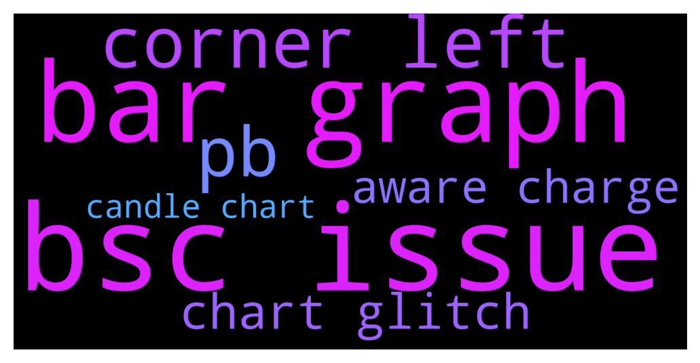

# **@DEXToolsCommunity**
 ## Analysis for **2021-12-06** - **2021-12-08**.

---

## 📊 **Basic Stats**

**n_messages_sent**: 620

---

---

## 🔝 **Top keywords and related messages**

1. **bsc issue**

    @stanes --- *It's related to the issue we currently have with some bsc pairs, need some time to re-index all the txs history so some volume is currently not counted.* **--->** [TG Discussion](https://t.me/DEXToolsCommunity/310572)

    @stanes --- *It's linked to the issue we have on bsc, devs are doing their maximum to fix it asap. Thank you for your patience.* **--->** [TG Discussion](https://t.me/DEXToolsCommunity/310561)

    @stanes --- *It's there, search with the contract address, click on the filter on the right and choose bsc.* **--->** [TG Discussion](https://t.me/DEXToolsCommunity/310293)

    @stanes --- *We are still experiencing some issues with bsc pairs. Devs are currently deploying an update to fix the problem asap. Sorry for the inconvenience.* **--->** [TG Discussion](https://t.me/DEXToolsCommunity/310559)

    @stanes --- *We got a pb with bsc pairs, everything is going back slowly, please be patient. Sorry for the inconvenience.* **--->** [TG Discussion](https://t.me/DEXToolsCommunity/310443)

    @Dannyt6 --- *Hey why doesn't the chart for this token show up? bsc  0x0496ccd13c9848f9c7d1507d1dd86a360b51b596* **--->** [TG Discussion](https://t.me/DEXToolsCommunity/310281)

2. **bar graph**

    @MadSlav --- *yeah, when I opet dextools graph for some token, there is a volume in the top left corner* **--->** [TG Discussion](https://t.me/DEXToolsCommunity/311114)

    @stanes --- *Ok, so click on the lock at the left of the address bar.* **--->** [TG Discussion](https://t.me/DEXToolsCommunity/309976)

    @MadSlav --- *also, there is a volume graph below the price graph... how I could see the volume within that price range? for example, I choose 15 mins, and I see a bar... but it doesnt tell me the volume* **--->** [TG Discussion](https://t.me/DEXToolsCommunity/311119)

    @MadSlav --- *correct... but also there is a volume bar graph below the price line* **--->** [TG Discussion](https://t.me/DEXToolsCommunity/311123)

    @xbtwael --- *Yes it is, copy and paste the name into your search bar* **--->** [TG Discussion](https://t.me/DEXToolsCommunity/309410)

    @gumbercules --- *Use the bar graph in the chart to get more detailed volume data* **--->** [TG Discussion](https://t.me/DEXToolsCommunity/311136)

3. **corner left**

    @atosm --- *eth price at top left corner been stuck for a while* **--->** [TG Discussion](https://t.me/DEXToolsCommunity/310632)

    @MadSlav --- *yeah, when I opet dextools graph for some token, there is a volume in the top left corner* **--->** [TG Discussion](https://t.me/DEXToolsCommunity/311114)

    @stanes --- *Ok, so click on the lock at the left of the address bar.* **--->** [TG Discussion](https://t.me/DEXToolsCommunity/309976)

    @MadSlav --- *let's try again... on the top left corner is Volume, my question is - for what timeframe is that volume? 24hours or?* **--->** [TG Discussion](https://t.me/DEXToolsCommunity/311111)

    @gumbercules --- *volume should appear in the top left hand corner of the TradingView chart* **--->** [TG Discussion](https://t.me/DEXToolsCommunity/311122)

    @stanes --- *If you don't know how to contact the team that's not good... If they have a TG, Discord or any other social, Dextools shows it on the top left of the page. If nothing... 😬* **--->** [TG Discussion](https://t.me/DEXToolsCommunity/309898)

4. **pb**

    @stanes --- *Pb fixed.* **--->** [TG Discussion](https://t.me/DEXToolsCommunity/310359)

    @stanes --- *Indeed, there is a technical problem affecting this chart. Team will re-index the pair once the pb is solved. Sorry for the inconvenience and thank you for reporting 👍* **--->** [TG Discussion](https://t.me/DEXToolsCommunity/310301)

    @stanes --- *We got a pb with bsc pairs, everything is going back slowly, please be patient. Sorry for the inconvenience.* **--->** [TG Discussion](https://t.me/DEXToolsCommunity/310443)

5. **chart glitch**

    @Janice --- *Is it possible to have the chart show candles instead of just a line?* **--->** [TG Discussion](https://t.me/DEXToolsCommunity/310306)

    @POA213 --- *i just spotted BTC Forming an Inverted 🐻(Bearish)Cup and Handle pattern .. on the Daily Chart .. in my guess we are not done with Dumps yet !* **--->** [TG Discussion](https://t.me/DEXToolsCommunity/310388)

    @stanes --- *Indeed, there is a technical problem affecting this chart. Team will re-index the pair once the pb is solved. Sorry for the inconvenience and thank you for reporting 👍* **--->** [TG Discussion](https://t.me/DEXToolsCommunity/310301)

    @catcatscatcats --- *Why we have problems to see the chart ? https://www.dextools.io/app/bsc/pair-explorer/0x1d49a35b0029d1c40690a8c79bab6ed3c2864e63* **--->** [TG Discussion](https://t.me/DEXToolsCommunity/310442)

    @Dannyt6 --- *Hey why doesn't the chart for this token show up? bsc  0x0496ccd13c9848f9c7d1507d1dd86a360b51b596* **--->** [TG Discussion](https://t.me/DEXToolsCommunity/310281)

    @Janice --- *For some reason it’s not letting me set the chart with candles for this   https://www.dextools.io/app/bsc/pair-explorer/0x1e06b8480733505e9dc228f69588511586edaad1  I did the command right but when I do /price in the group it comes up as 4 as chart option and then says no pair found* **--->** [TG Discussion](https://t.me/DEXToolsCommunity/310354)

6. **aware charge**

    @stanes --- *Please DM @guillermorodriguez78 he is the person-in-charge.  Be aware of scammers, HE WILL NEVER DM YOU FIRST.* **--->** [TG Discussion](https://t.me/DEXToolsCommunity/311007)

    @stanes --- *So you are trying to sell, not transfer... Try to do that directly on Uniswap. If can't, ask the token team why. Be aware of scam tokens.* **--->** [TG Discussion](https://t.me/DEXToolsCommunity/309891)

    @bastardganpunk --- *An email or dming @guillermorodriguez78 who is in charge of that.* **--->** [TG Discussion](https://t.me/DEXToolsCommunity/311042)

    @napascual --- *That was a scammer, be aware* **--->** [TG Discussion](https://t.me/DEXToolsCommunity/310705)

    @napascual --- *Of course, admins never dm first, be aware of scammers* **--->** [TG Discussion](https://t.me/DEXToolsCommunity/309280)

    @stanes --- *We are not in charge of Trustwallet, ask them directly 🤷‍♂️* **--->** [TG Discussion](https://t.me/DEXToolsCommunity/311083)

7. **candle chart**

    @Janice --- *Is it possible to have the chart show candles instead of just a line?* **--->** [TG Discussion](https://t.me/DEXToolsCommunity/310306)

    @POA213 --- *i just spotted BTC Forming an Inverted 🐻(Bearish)Cup and Handle pattern .. on the Daily Chart .. in my guess we are not done with Dumps yet !* **--->** [TG Discussion](https://t.me/DEXToolsCommunity/310388)

    @stanes --- *Indeed, there is a technical problem affecting this chart. Team will re-index the pair once the pb is solved. Sorry for the inconvenience and thank you for reporting 👍* **--->** [TG Discussion](https://t.me/DEXToolsCommunity/310301)

    @catcatscatcats --- *Why we have problems to see the chart ? https://www.dextools.io/app/bsc/pair-explorer/0x1d49a35b0029d1c40690a8c79bab6ed3c2864e63* **--->** [TG Discussion](https://t.me/DEXToolsCommunity/310442)

    @Dannyt6 --- *Hey why doesn't the chart for this token show up? bsc  0x0496ccd13c9848f9c7d1507d1dd86a360b51b596* **--->** [TG Discussion](https://t.me/DEXToolsCommunity/310281)

    @Janice --- *For some reason it’s not letting me set the chart with candles for this   https://www.dextools.io/app/bsc/pair-explorer/0x1e06b8480733505e9dc228f69588511586edaad1  I did the command right but when I do /price in the group it comes up as 4 as chart option and then says no pair found* **--->** [TG Discussion](https://t.me/DEXToolsCommunity/310354)

