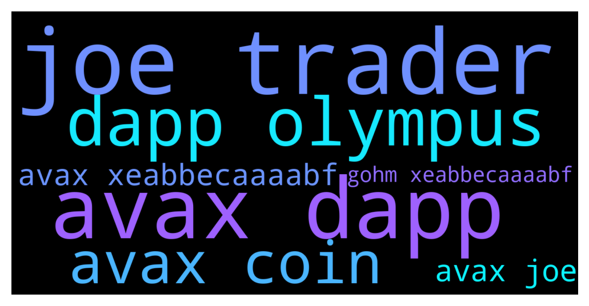

# **@OlympusTG**
 ## Analysis for **2021-12-07** - **2021-12-08**.

---

## 📊 **Basic Stats**

**n_messages_sent**: 1142

---

---

## 🔝 **Top keywords and related messages**

1. **joe trader**

    @Miguel_ecu --- *Ethereum is only worth it if you're investing 10k or more. If you're investing small quantities it's not viable since most of it goes to paying fees. In avalanche you can invest small quantity like $100 and pay very small fee for buying gOHM on trader joe* **--->** [TG Discussion](https://t.me/OlympusTG/108145)

    @Poopoo --- *Figure out how to bridge from Polygon to Avax then buy gOHM on Avax   Buy gOHM on trader joe (AVAX) gOHM contract address on AVAX: 0x321e7092a180bb43555132ec53aaa65a5bf84251  What is gOHM: https://twitter.com/OlympusDAO/status/1465410905542385677  gOHM documentation: https://docs.olympusdao.finance/main/contracts/tokens#gohm* **--->** [TG Discussion](https://t.me/OlympusTG/109153)

    @Poopoo --- *Buy gOHM on trader joe (AVAX) gOHM contract address on AVAX: 0x321e7092a180bb43555132ec53aaa65a5bf84251  What is gOHM: https://twitter.com/OlympusDAO/status/1465410905542385677  gOHM documentation: https://docs.olympusdao.finance/main/contracts/tokens#gohm  gohm does not increase, gohm x current index = sohm, current index increases every rebase, you can find current index on the dashboard od the olympus dapp* **--->** [TG Discussion](https://t.me/OlympusTG/108667)

    @Poopoo --- *why would you do that, you can buy gOHM on AVAX now, the liquidity is quite good.   Buy gOHM on trader joe (AVAX) gOHM contract address on AVAX: 0x321e7092a180bb43555132ec53aaa65a5bf84251  What is gOHM: https://twitter.com/OlympusDAO/status/1465410905542385677  gOHM documentation: https://docs.olympusdao.finance/main/contracts/tokens#gohm  gohm does not increase, gohm x current index = sohm, current index increases every rebase, you can find current index on the dashboard of the olympus dapp, and check your equivalent number of sOHM when you access the Olympus dapp through the AVAX Network* **--->** [TG Discussion](https://t.me/OlympusTG/109439)

    @Ras --- *No need to farm?, gee I collaterized  my gOhm on T.Joe and farmed it so I am earning more gOhm,+ Joe + earning all 3 rebases at the same time...cheers* **--->** [TG Discussion](https://t.me/OlympusTG/108177)

    @Miguel_ecu --- *You can wrap it and bridge or you can sell it on centralized exchange and then buy avax and buy gOHM on trader Joe* **--->** [TG Discussion](https://t.me/OlympusTG/108124)

2. **avax dapp**

    @BROHMZ --- *If you are new to OHM - just buy gOHM on AVAX is best for saving on ETH gas fees and being part of the future* **--->** [TG Discussion](https://t.me/OlympusTG/108086)

    @Poopoo --- *Yes you have to understand that AVAX is not a stablecoin, it crashed more in % than gOHM 2 days ago so you had to get gOHM with more AVAX, but 2 days later it pumped more in % than gOHM, so when you try to swap you get less AVAX* **--->** [TG Discussion](https://t.me/OlympusTG/109453)

    @Poopoo --- *Honestly in your case, the issue is Avax not ohm, because ohm pirce has stayed the same these 2 days, Avax price has chabged quite a lot. I am pretty sure you can swap from wsOHM to gOHM too, gOHM has plenty of liquidity* **--->** [TG Discussion](https://t.me/OlympusTG/109549)

    @Poopoo --- *Figure out how to bridge from Polygon to Avax then buy gOHM on Avax   Buy gOHM on trader joe (AVAX) gOHM contract address on AVAX: 0x321e7092a180bb43555132ec53aaa65a5bf84251  What is gOHM: https://twitter.com/OlympusDAO/status/1465410905542385677  gOHM documentation: https://docs.olympusdao.finance/main/contracts/tokens#gohm* **--->** [TG Discussion](https://t.me/OlympusTG/109153)

    @jack_hearts --- *Is buying and holding gOHM on AVAX equal to holding wsOHM or gOHM on ethereum?* **--->** [TG Discussion](https://t.me/OlympusTG/108589)

    @Poopoo --- *Buy gOHM on trader joe (AVAX) gOHM contract address on AVAX: 0x321e7092a180bb43555132ec53aaa65a5bf84251  What is gOHM: https://twitter.com/OlympusDAO/status/1465410905542385677  gOHM documentation: https://docs.olympusdao.finance/main/contracts/tokens#gohm  gohm does not increase, gohm x current index = sohm, current index increases every rebase, you can find current index on the dashboard od the olympus dapp* **--->** [TG Discussion](https://t.me/OlympusTG/108667)

3. **dapp olympus**

    @elcosmefulanito --- *gOHM can be staked into Olympus? Or is it just for holding coins?* **--->** [TG Discussion](https://t.me/OlympusTG/108106)

    @Poopoo --- *Buy gOHM on trader joe (AVAX) gOHM contract address on AVAX: 0x321e7092a180bb43555132ec53aaa65a5bf84251  What is gOHM: https://twitter.com/OlympusDAO/status/1465410905542385677  gOHM documentation: https://docs.olympusdao.finance/main/contracts/tokens#gohm  gohm does not increase, gohm x current index = sohm, current index increases every rebase, you can find current index on the dashboard od the olympus dapp* **--->** [TG Discussion](https://t.me/OlympusTG/108667)

    @Stevo1010 --- *One other thing, when I buy gOHM it automatically stakes. Is that at the same APY % as on the olympus dao website at 7000%?* **--->** [TG Discussion](https://t.me/OlympusTG/108155)

    @Poopoo --- *why would you do that, you can buy gOHM on AVAX now, the liquidity is quite good.   Buy gOHM on trader joe (AVAX) gOHM contract address on AVAX: 0x321e7092a180bb43555132ec53aaa65a5bf84251  What is gOHM: https://twitter.com/OlympusDAO/status/1465410905542385677  gOHM documentation: https://docs.olympusdao.finance/main/contracts/tokens#gohm  gohm does not increase, gohm x current index = sohm, current index increases every rebase, you can find current index on the dashboard of the olympus dapp, and check your equivalent number of sOHM when you access the Olympus dapp through the AVAX Network* **--->** [TG Discussion](https://t.me/OlympusTG/109439)

    @kvack --- *I read through all the documentation, treasury backing is a trust-based mechanics. If too many people sell, backing means nothing, sure APY would skyrocket, but other forks may prevent users to go back to the Olympus* **--->** [TG Discussion](https://t.me/OlympusTG/109314)

    @Poopoo --- *I don't see any negatives, you can even see your sOHM equivalent on the Olympus dapp now, I have gOHM on Avax and when I went to the dapp on Avax, I can see the equivalent sOHM there, some people prefer to visualise the number in sOHM 😆* **--->** [TG Discussion](https://t.me/OlympusTG/109202)

4. **avax coin**

    @BROHMZ --- *If you are new to OHM - just buy gOHM on AVAX is best for saving on ETH gas fees and being part of the future* **--->** [TG Discussion](https://t.me/OlympusTG/108086)

    @elcosmefulanito --- *gOHM can be staked into Olympus? Or is it just for holding coins?* **--->** [TG Discussion](https://t.me/OlympusTG/108106)

    @Poopoo --- *Yes you have to understand that AVAX is not a stablecoin, it crashed more in % than gOHM 2 days ago so you had to get gOHM with more AVAX, but 2 days later it pumped more in % than gOHM, so when you try to swap you get less AVAX* **--->** [TG Discussion](https://t.me/OlympusTG/109453)

    @Poopoo --- *Honestly in your case, the issue is Avax not ohm, because ohm pirce has stayed the same these 2 days, Avax price has chabged quite a lot. I am pretty sure you can swap from wsOHM to gOHM too, gOHM has plenty of liquidity* **--->** [TG Discussion](https://t.me/OlympusTG/109549)

    @Poopoo --- *Figure out how to bridge from Polygon to Avax then buy gOHM on Avax   Buy gOHM on trader joe (AVAX) gOHM contract address on AVAX: 0x321e7092a180bb43555132ec53aaa65a5bf84251  What is gOHM: https://twitter.com/OlympusDAO/status/1465410905542385677  gOHM documentation: https://docs.olympusdao.finance/main/contracts/tokens#gohm* **--->** [TG Discussion](https://t.me/OlympusTG/109153)

    @jack_hearts --- *Is buying and holding gOHM on AVAX equal to holding wsOHM or gOHM on ethereum?* **--->** [TG Discussion](https://t.me/OlympusTG/108589)

5. **avax joe**

    @BROHMZ --- *If you are new to OHM - just buy gOHM on AVAX is best for saving on ETH gas fees and being part of the future* **--->** [TG Discussion](https://t.me/OlympusTG/108086)

    @Miguel_ecu --- *Ethereum is only worth it if you're investing 10k or more. If you're investing small quantities it's not viable since most of it goes to paying fees. In avalanche you can invest small quantity like $100 and pay very small fee for buying gOHM on trader joe* **--->** [TG Discussion](https://t.me/OlympusTG/108145)

    @Poopoo --- *Yes you have to understand that AVAX is not a stablecoin, it crashed more in % than gOHM 2 days ago so you had to get gOHM with more AVAX, but 2 days later it pumped more in % than gOHM, so when you try to swap you get less AVAX* **--->** [TG Discussion](https://t.me/OlympusTG/109453)

    @Poopoo --- *Honestly in your case, the issue is Avax not ohm, because ohm pirce has stayed the same these 2 days, Avax price has chabged quite a lot. I am pretty sure you can swap from wsOHM to gOHM too, gOHM has plenty of liquidity* **--->** [TG Discussion](https://t.me/OlympusTG/109549)

    @Poopoo --- *Figure out how to bridge from Polygon to Avax then buy gOHM on Avax   Buy gOHM on trader joe (AVAX) gOHM contract address on AVAX: 0x321e7092a180bb43555132ec53aaa65a5bf84251  What is gOHM: https://twitter.com/OlympusDAO/status/1465410905542385677  gOHM documentation: https://docs.olympusdao.finance/main/contracts/tokens#gohm* **--->** [TG Discussion](https://t.me/OlympusTG/109153)

    @jack_hearts --- *Is buying and holding gOHM on AVAX equal to holding wsOHM or gOHM on ethereum?* **--->** [TG Discussion](https://t.me/OlympusTG/108589)

6. **avax xeabbecaaaabf**

    @BROHMZ --- *If you are new to OHM - just buy gOHM on AVAX is best for saving on ETH gas fees and being part of the future* **--->** [TG Discussion](https://t.me/OlympusTG/108086)

    @Poopoo --- *Yes you have to understand that AVAX is not a stablecoin, it crashed more in % than gOHM 2 days ago so you had to get gOHM with more AVAX, but 2 days later it pumped more in % than gOHM, so when you try to swap you get less AVAX* **--->** [TG Discussion](https://t.me/OlympusTG/109453)

    @Poopoo --- *Honestly in your case, the issue is Avax not ohm, because ohm pirce has stayed the same these 2 days, Avax price has chabged quite a lot. I am pretty sure you can swap from wsOHM to gOHM too, gOHM has plenty of liquidity* **--->** [TG Discussion](https://t.me/OlympusTG/109549)

    @Poopoo --- *Figure out how to bridge from Polygon to Avax then buy gOHM on Avax   Buy gOHM on trader joe (AVAX) gOHM contract address on AVAX: 0x321e7092a180bb43555132ec53aaa65a5bf84251  What is gOHM: https://twitter.com/OlympusDAO/status/1465410905542385677  gOHM documentation: https://docs.olympusdao.finance/main/contracts/tokens#gohm* **--->** [TG Discussion](https://t.me/OlympusTG/109153)

    @jack_hearts --- *Is buying and holding gOHM on AVAX equal to holding wsOHM or gOHM on ethereum?* **--->** [TG Discussion](https://t.me/OlympusTG/108589)

    @Poopoo --- *Buy gOHM on trader joe (AVAX) gOHM contract address on AVAX: 0x321e7092a180bb43555132ec53aaa65a5bf84251  What is gOHM: https://twitter.com/OlympusDAO/status/1465410905542385677  gOHM documentation: https://docs.olympusdao.finance/main/contracts/tokens#gohm  gohm does not increase, gohm x current index = sohm, current index increases every rebase, you can find current index on the dashboard od the olympus dapp* **--->** [TG Discussion](https://t.me/OlympusTG/108667)

7. **gohm xeabbecaaaabf**

    @BROHMZ --- *If you are new to OHM - just buy gOHM on AVAX is best for saving on ETH gas fees and being part of the future* **--->** [TG Discussion](https://t.me/OlympusTG/108086)

    @jiyome --- *Ok so what's the difference between gohm and wsohm? If i want to hold one and still get the rebase, which one should I buy?* **--->** [TG Discussion](https://t.me/OlympusTG/108186)

    @EnricoMendonca --- *https://docs.olympusdao.finance/main/basics/migration tl;dr none, gOhm is the new version of wsOhm enabled for future protocol features.* **--->** [TG Discussion](https://t.me/OlympusTG/108187)

    @africaxgram --- *For me the gohm or wsohm did not work out, I holded it one month and it just went down. For sOhm i can exactly see how much it increses in token amount and whats the token worth. much better than gohm* **--->** [TG Discussion](https://t.me/OlympusTG/108133)

    @Miguel_ecu --- *Ethereum is only worth it if you're investing 10k or more. If you're investing small quantities it's not viable since most of it goes to paying fees. In avalanche you can invest small quantity like $100 and pay very small fee for buying gOHM on trader joe* **--->** [TG Discussion](https://t.me/OlympusTG/108145)

    @EnricoMendonca --- *gohm = sohm * index, it is the new wsOhm you can go to traderjoe and buy gohm you can get more info here https://docs.olympusdao.finance/main/contracts/tokens#gohm https://docs.olympusdao.finance/main/basics/migration* **--->** [TG Discussion](https://t.me/OlympusTG/108077)

