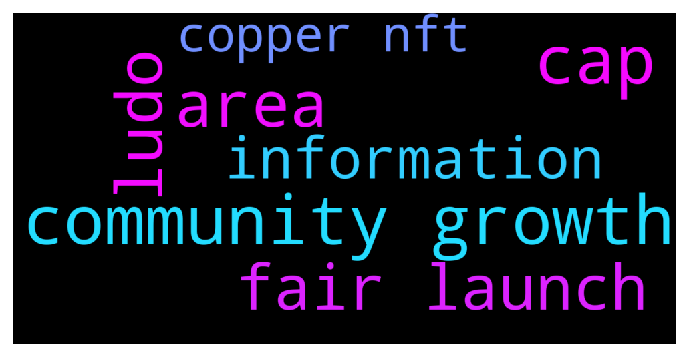

# **@de_fi**
 ## Analysis for **2021-12-07** - **2021-12-08**.

---

## 📊 **Basic Stats**

**n_messages_sent**: 36

---

---

## 🔝 **Top keywords and related messages**

1. **community growth**

    @abeosten --- *Hi folks, Abe here from Cap (cap.finance). We're looking for someone special to supercharge the Cap community's growth. All current contributors are engineers, so community growth is not exactly our area of expertise. 😄  Would you know anyone we can talk to who does this really well? Looking to hire top talent. Thanks!* **--->** [TG Discussion](https://t.me/de_fi/229967)

    @TheCartelX --- *GoldFinX  We're growing a community of disrupters in the artisanal gold mining industry. Join a group a people, like you, who want to change the world for the better and need the resources to do so. We're your resource, and together we can alter the course of our future for the better.  Join the GoldFinX movement, become an Ambassador today: https://goldfinx.com/ambassador/* **--->** [TG Discussion](https://t.me/de_fi/229957)

    @nvy0x --- *Hello everyone, Nic from DeFiSafety here. Firstly, thank you @dereksilva for allowing us to post in here, you’re awesome. Secondly, as you are all well aware, security (and lack thereof) is a major concern within the DeFi communities. This is why DeFiSafety has engineered a rating process that evaluates the safety of the most popular DeFi protocols based on their process quality and transparency. As this is accessible by anyone for free, we encourage you to use these tools as part of your DYOR. In addition, we would love to have discussions with you about the state of safety in DeFi. You can always @ me in here about certain topics or questions you may have, or head over to our website and join our various social media groups where we discuss these topics all day long. Also, feel free to post some review requests in our socials! Again, this is absolutely free. Thank you, and I hope you all have a great day. Stay safe out there!* **--->** [TG Discussion](https://t.me/de_fi/229822)

2. **cap**

    @abeosten --- *Hi folks, Abe here from Cap (cap.finance). We're looking for someone special to supercharge the Cap community's growth. All current contributors are engineers, so community growth is not exactly our area of expertise. 😄  Would you know anyone we can talk to who does this really well? Looking to hire top talent. Thanks!* **--->** [TG Discussion](https://t.me/de_fi/229967)

3. **area**

    @poppycoins --- *Any new NFT project? Or something interesting in this area, maybe* **--->** [TG Discussion](https://t.me/de_fi/230059)

    @abeosten --- *Hi folks, Abe here from Cap (cap.finance). We're looking for someone special to supercharge the Cap community's growth. All current contributors are engineers, so community growth is not exactly our area of expertise. 😄  Would you know anyone we can talk to who does this really well? Looking to hire top talent. Thanks!* **--->** [TG Discussion](https://t.me/de_fi/229967)

4. **ludo**

    @cryptofreakie --- *Take a look on Ludo's upcoming platform. This project will melt some faces, because besides the fact that will be the first search engine for NFTs, Ludo will eb creator-centric and multichain all in one space. Basically a space where everything's connected.* **--->** [TG Discussion](https://t.me/de_fi/230062)

5. **fair launch**

    @mosesgod --- *Well I've got a project for you that started out as a NFT, and then became DeFi.   They were actually, at time of the launch a top 15 opensea project. Yesterday they launched their fair launch auction on Copper.* **--->** [TG Discussion](https://t.me/de_fi/230065)

    @godefi --- *New DAICO-like RGFL - Revenue Generating Fair Launch https://twitter.com/cotraderdao/status/1468542927550955525?s=21* **--->** [TG Discussion](https://t.me/de_fi/230055)

6. **information**

    @barty777 --- *With hundreds or even thousands of messages generated every day in multiple crypto TG groups, it's often hard to find relevant info among all the noise without spending a lot of  time reading through messages.  That's why we are developing a tool that can automatically summarize relevant information from any crypto related TG group, including this group. We generate daily free reports available here: https://github.com/bfreskura/crypto-reports  There is also a TG group where you can post suggestions, leave feedback, and get new updates: https://t.me/crypto_summaries* **--->** [TG Discussion](https://t.me/de_fi/229861)

    @mosesgod --- *lol i didn't even give you any information ffs dude* **--->** [TG Discussion](https://t.me/de_fi/230076)

7. **copper nft**

    @mosesgod --- *Well I've got a project for you that started out as a NFT, and then became DeFi.   They were actually, at time of the launch a top 15 opensea project. Yesterday they launched their fair launch auction on Copper.* **--->** [TG Discussion](https://t.me/de_fi/230065)

    @poppycoins --- *Any new NFT project? Or something interesting in this area, maybe* **--->** [TG Discussion](https://t.me/de_fi/230059)

    @cryptofreakie --- *Take a look on Ludo's upcoming platform. This project will melt some faces, because besides the fact that will be the first search engine for NFTs, Ludo will eb creator-centric and multichain all in one space. Basically a space where everything's connected.* **--->** [TG Discussion](https://t.me/de_fi/230062)

    @mosesgod --- *They have polygon as their official partner and crazy advisor board.  Still waiting to ape in, as the price goes down like it should on copper.* **--->** [TG Discussion](https://t.me/de_fi/230067)

    @mosesgod --- *As a NFT holder youll be able to stake your NFTs and receive apy boosts on your strategies.* **--->** [TG Discussion](https://t.me/de_fi/230066)

    @Knavecrypto --- *Qubsim will change the NFT world, check it out* **--->** [TG Discussion](https://t.me/de_fi/229862)

