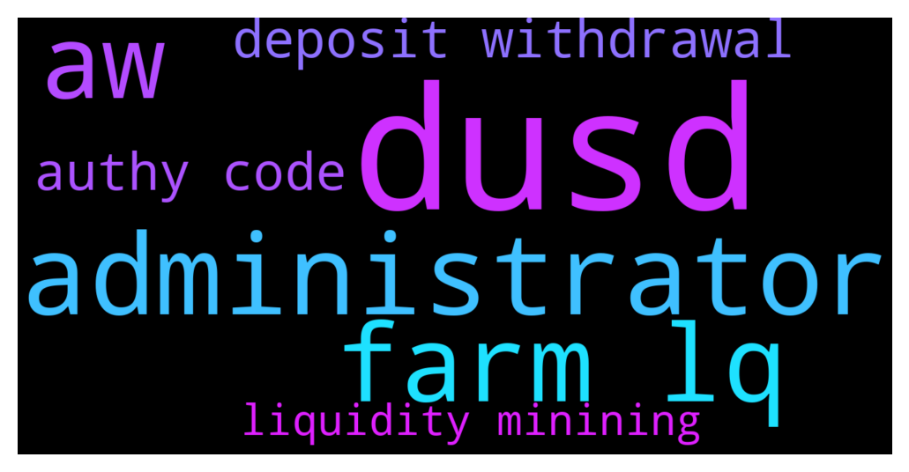

# **@CakeDeFi_EN**
 ## Analysis for **2021-12-08** - **2021-12-09**.

---

## 📊 **Basic Stats**

**n_messages_sent**: 1061

---

---

## 🔝 **Top keywords and related messages**

1. **dusd**

    @CCC --- *Hi is this DefiDollar, same as our dusd in DefiChain? Thanks.* **--->** [TG Discussion](https://t.me/CakeDeFi_EN/148998)

    @Mattijs78 --- *Admin? I have over 50 DFI and DUSD. Why this Mail?* **--->** [TG Discussion](https://t.me/CakeDeFi_EN/150188)

    @UGilgamesh --- *Hi! I've just seen that the pool dBABA - DUSD gives only 3.4% APR. May I ask you what wrong is going with that? Thank you very much* **--->** [TG Discussion](https://t.me/CakeDeFi_EN/150126)

    @Blueskybrian --- *The difference is in wallet for the dfi dusd pool allocate around 2k value and at cake allocated around 10k value and the reward received is almost the same. That look more then 15 % even without using calculator.* **--->** [TG Discussion](https://t.me/CakeDeFi_EN/148731)

    @danielt_eth --- *What is the cheapest or best way to get dUSD into cake for liquidity mining?* **--->** [TG Discussion](https://t.me/CakeDeFi_EN/149752)

    @Dirk --- *I first thought of DUSD - DFI. But the value of DUSD remains the same. Actually, I would have said ETH but the APR are not as high as the other pairs. In which pairs you go in ?* **--->** [TG Discussion](https://t.me/CakeDeFi_EN/148440)

2. **administrator**

    @John --- *You are totally right Never again let anybody check your account  I thought they were administrator at cake defi* **--->** [TG Discussion](https://t.me/CakeDeFi_EN/149720)

    @John --- *Claiming he was the administrator  So watch out.* **--->** [TG Discussion](https://t.me/CakeDeFi_EN/149735)

    @John --- *I have accepted that the money is gone for good . Its just left me with a bad feeling about cake defi, I know that they are not guilty , since as you said anybody can go on telegram and pretend to be an administrator, Maybe though, since this is the cake defi official channel, they should check who is on there claiming to be administrator* **--->** [TG Discussion](https://t.me/CakeDeFi_EN/149952)

    @John --- *I just lost money on here by  somebody posing as administrator of cakedefi* **--->** [TG Discussion](https://t.me/CakeDeFi_EN/149707)

3. **farm lq**

    @默默啃书小凳子~ --- *Yeah, you can reinvest your LQ* **--->** [TG Discussion](https://t.me/CakeDeFi_EN/149971)

    @AnalWhale666 --- *Ok and if I want to open Ethereum LQ farm, i need first to buy Ethereum wallet for 130$? Then send money to wallet ?* **--->** [TG Discussion](https://t.me/CakeDeFi_EN/149972)

    @AnalWhale666 --- *Yes but if I want to grow my LQ farming , can I re invest my yield into my farm or only stake* **--->** [TG Discussion](https://t.me/CakeDeFi_EN/149969)

    @AnalWhale666 --- *Ok btw the yields I get from my liquidity farm will it automatically add to my LQ farm again so I grow my number or do I need to sell my staked dfi in order to re invest in my farm ? Or manually put in more money into the platform and manually add it again into the lq farm ?* **--->** [TG Discussion](https://t.me/CakeDeFi_EN/149962)

    @AnalWhale666 --- *Admin do you know if the yields I get from my Liquidity Farm i can automatically re invest into my farm or are the yields always going to the stakes ? And if so call I sell my dfi stake for btc and then manually grow my LQ farm ?* **--->** [TG Discussion](https://t.me/CakeDeFi_EN/150017)

4. **aw**

    @Daniel --- *Is there no support?? Been waiting over 72 hours for a withdrawal* **--->** [TG Discussion](https://t.me/CakeDeFi_EN/148717)

    @Hjkhjk8 --- *I created a withdrawal request 11 hours ago, it still hasn't happened?* **--->** [TG Discussion](https://t.me/CakeDeFi_EN/149363)

    @freedfidotcom --- *Deposits and withdrawals have been resumed - everything should be processed quite quickly. Thanks for your patience* **--->** [TG Discussion](https://t.me/CakeDeFi_EN/149711)

    @Daniel --- *Are cake withdrawls delayed* **--->** [TG Discussion](https://t.me/CakeDeFi_EN/148503)

    @Kyle --- *If I have dfi in the freezer should I be checking on it every day? I mean it's locked away for the term...is there anything I can do with the dfi when it's Frozen?* **--->** [TG Discussion](https://t.me/CakeDeFi_EN/149075)

    @TwoDsireCrypto --- *You can withdraw straight away* **--->** [TG Discussion](https://t.me/CakeDeFi_EN/149912)

5. **deposit withdrawal**

    @Daniel --- *Is there no support?? Been waiting over 72 hours for a withdrawal* **--->** [TG Discussion](https://t.me/CakeDeFi_EN/148717)

    @Hjkhjk8 --- *I created a withdrawal request 11 hours ago, it still hasn't happened?* **--->** [TG Discussion](https://t.me/CakeDeFi_EN/149363)

    @freedfidotcom --- *Deposits and withdrawals have been resumed - everything should be processed quite quickly. Thanks for your patience* **--->** [TG Discussion](https://t.me/CakeDeFi_EN/149711)

    @ABIOLA SYLVESTER --- *Okay thanks I made additional deposit of eth today as well but I am getting more confused as my funds is as good as not available with some difficult to understand negative symbols please help step in. I am becoming worried and confused the more I try to put money on the platform* **--->** [TG Discussion](https://t.me/CakeDeFi_EN/149179)

    @Michael_Schredl --- *Deposits are delayed today* **--->** [TG Discussion](https://t.me/CakeDeFi_EN/149435)

    @freedfidotcom --- *Yes me too - but to repeat, no withdrawal request is over the stated 72hr timeframe yet and the instruction to resume withdrawals has already been given - please be patient for just a short time more* **--->** [TG Discussion](https://t.me/CakeDeFi_EN/149699)

6. **authy code**

    @Kyle --- *You cannot restore your Google authenticator without the original code or qr from the old one... just happened to me* **--->** [TG Discussion](https://t.me/CakeDeFi_EN/149177)

    @Tokatlifistikb --- *hello i lost google anticator code how do i reset it* **--->** [TG Discussion](https://t.me/CakeDeFi_EN/149173)

    @Malba23 --- *I cannot set my two-factor authentication it say incorrect code and I downloaded that "Authy" app tell me what I should do to resolve this matter??? Where should I get a two factor authentication code cause the one I get from Authy it says incorrect* **--->** [TG Discussion](https://t.me/CakeDeFi_EN/150042)

    @Malba23 --- *I cannot set my two-factor authentication it say incorrect code and I downloaded that "Authy" app tell me what I should do to resolve this matter???* **--->** [TG Discussion](https://t.me/CakeDeFi_EN/150028)

7. **liquidity minining**

    @danielt_eth --- *What is the cheapest or best way to get dUSD into cake for liquidity mining?* **--->** [TG Discussion](https://t.me/CakeDeFi_EN/149752)

    @KyleJallDay --- *I just added to dUSD-DFI liquidity pool. Price of dUSD is like $1.40 right now. When that drops to a $1 in a couple weeks, I'm assuming I'm going to lose a lot of of DFI when I sell my LP shares?  Should I just wait until it's more stable? Or am I wrong?* **--->** [TG Discussion](https://t.me/CakeDeFi_EN/149454)

    @Michael_Schredl --- *It shows you what you will get when you go to remove liquidity* **--->** [TG Discussion](https://t.me/CakeDeFi_EN/150009)

    @DmgBautista --- *That doesnt seem right, if those are indeed the values. When adding the liquidity, did checked the price stability? Because if entering in a low price stability, you may get a very bad rate* **--->** [TG Discussion](https://t.me/CakeDeFi_EN/148737)

    @Paulius --- *Hello, Cake defi community. I want add to liquidity mining DUSD/DFI.   Can i get liqudated and lose all money, while liquidity mining?* **--->** [TG Discussion](https://t.me/CakeDeFi_EN/149262)

    @N.Y.T. --- *Rewards has dropped thought-out all liquidity pool mining. It should be higher with these higher APY. Pls rectify.* **--->** [TG Discussion](https://t.me/CakeDeFi_EN/148640)

