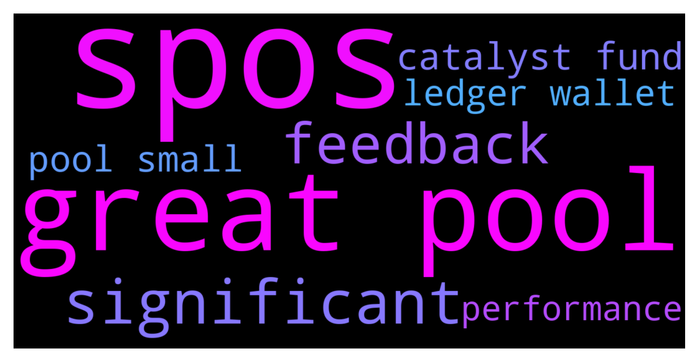

# **@Cardano**
 ## Analysis for **2021-12-08** - **2021-12-09**.

---

## 📊 **Basic Stats**

**n_messages_sent**: 105

---

---

## 🔝 **Top keywords and related messages**

1. **spos**

    @k0ukarin --- *Hi everyone,  Decentralization was the very first point that interested me in blockchain and especially in Cardano. Today I’m a bit worried about seeing some SPOs operating many pools (even if it’s thanks to great marketing 😁).  That’s the reason I’ve just built a website that present small pools with significant results. In the tab linked, the SPOs operate only one pool, have great ROA, a good pledge and a stake around 1.5M / 2M.  Every week, I’ll highlight one smaller pool (<1.5M) to help it achieve the minimum threshold to produce blocks at every epoch.  I’m open to every feedback.  https://www.myfairpool.com/* **--->** [TG Discussion](https://t.me/Cardano/756776)

2. **great pool**

    @k0ukarin --- *Hi everyone,  Decentralization was the very first point that interested me in blockchain and especially in Cardano. Today I’m a bit worried about seeing some SPOs operating many pools (even if it’s thanks to great marketing 😁).  That’s the reason I’ve just built a website that present small pools with significant results. In the tab linked, the SPOs operate only one pool, have great ROA, a good pledge and a stake around 1.5M / 2M.  Every week, I’ll highlight one smaller pool (<1.5M) to help it achieve the minimum threshold to produce blocks at every epoch.  I’m open to every feedback.  https://www.myfairpool.com/* **--->** [TG Discussion](https://t.me/Cardano/756776)

    @Moon --- *Of course. Here are the links to the two stacking pools. They are both in the same pool(ADA Pools A), and the delegate with less ADA(65.83k) gets more than the delegate with 72.17k ADA. 1) https://adapools.org/stake/stake1ux6h23tn33kgu0kgl7ltfe5pathlhvufnm5nxce4pa0utsctgeajk 2) https://adapools.org/stake/stake1ux7sz8nk2g0msh88camrckn74y9pkv45vutwf0hut3jesvcgqt62g* **--->** [TG Discussion](https://t.me/Cardano/756746)

    @Moon --- *Hi. Can someone please explain why 2 delegates with the same amount of stacking hells in the same pool get different rewards?  The difference in the reward is 20-30%* **--->** [TG Discussion](https://t.me/Cardano/756743)

    @DropLipTootsy --- *Great idea a thanks* **--->** [TG Discussion](https://t.me/Cardano/756759)

    @Krieghoff270 --- *The only possible explanation is: You think you are on the same pool but there are several instances in which the name of the pool coincides, but not their ID …* **--->** [TG Discussion](https://t.me/Cardano/756745)

    @glitch04 --- *Rewards are not constant, they are in a constant decay from reward distribution each epoch until transactions on the network are enough to maintain the rewards payout and stabilize the reward pot. They are also in a constant flux from epoch to epoch for each pool based on several factors including a random lottery for production based on stake, it's hard to guess if that is normal or not you would need to look at the data provided by one of the explorers like cardanoscan.io pooltool.io etc to see if your pool is consistent or not compared to similar pools.* **--->** [TG Discussion](https://t.me/Cardano/756258)

3. **significant**

    @k0ukarin --- *Hi everyone,  Decentralization was the very first point that interested me in blockchain and especially in Cardano. Today I’m a bit worried about seeing some SPOs operating many pools (even if it’s thanks to great marketing 😁).  That’s the reason I’ve just built a website that present small pools with significant results. In the tab linked, the SPOs operate only one pool, have great ROA, a good pledge and a stake around 1.5M / 2M.  Every week, I’ll highlight one smaller pool (<1.5M) to help it achieve the minimum threshold to produce blocks at every epoch.  I’m open to every feedback.  https://www.myfairpool.com/* **--->** [TG Discussion](https://t.me/Cardano/756776)

    @yutazzz --- *2021/12/06 AMA details: Sunday swap progress / all indicators positive that can measure Cardano's health / industry social networking wrapped in negativity but still significant progress in 2022 / two aspects of POS security that are robust / neuroscience / courage to hate / Corona Considerations🔥 and more  https://forum.cardano.org/t/2021-12-06ama-cardano-sns-2022-pos-2/88334* **--->** [TG Discussion](https://t.me/Cardano/756588)

4. **feedback**

    @Lgbeano --- *🔐🥳Find out here first!🥳🔐  Thanks to the hard work of some Ambassadors, with the help of the Cardano Foundation.. They have put together a plan to implement ADA to Ledger Live.  The community have asked for years, but never delivered (for many reasons). Wait no more!.. after discussions with Ledger, it is felt Cardano has a very good chance of achieving Ledger Live support by using our community and Catalyst funds.  Feel free to share your feedback on Idea Scale  Don't forget to vote in Catalyst fund 7 for this to be possible! Cardano, bringing the power to the people.   https://cardano.ideascale.com/a/dtd/LEDGER-OP3N/384961-48088* **--->** [TG Discussion](https://t.me/Cardano/756635)

    @k0ukarin --- *Hi everyone,  Decentralization was the very first point that interested me in blockchain and especially in Cardano. Today I’m a bit worried about seeing some SPOs operating many pools (even if it’s thanks to great marketing 😁).  That’s the reason I’ve just built a website that present small pools with significant results. In the tab linked, the SPOs operate only one pool, have great ROA, a good pledge and a stake around 1.5M / 2M.  Every week, I’ll highlight one smaller pool (<1.5M) to help it achieve the minimum threshold to produce blocks at every epoch.  I’m open to every feedback.  https://www.myfairpool.com/* **--->** [TG Discussion](https://t.me/Cardano/756776)

5. **catalyst fund**

    @Lgbeano --- *🔐🥳Find out here first!🥳🔐  Thanks to the hard work of some Ambassadors, with the help of the Cardano Foundation.. They have put together a plan to implement ADA to Ledger Live.  The community have asked for years, but never delivered (for many reasons). Wait no more!.. after discussions with Ledger, it is felt Cardano has a very good chance of achieving Ledger Live support by using our community and Catalyst funds.  Feel free to share your feedback on Idea Scale  Don't forget to vote in Catalyst fund 7 for this to be possible! Cardano, bringing the power to the people.   https://cardano.ideascale.com/a/dtd/LEDGER-OP3N/384961-48088* **--->** [TG Discussion](https://t.me/Cardano/756635)

    @i3DAngels --- *Hey @Lgbeano we are in the DApps & Integrations for Fund 7. Are we allowed to ask community here to review and vote for us?* **--->** [TG Discussion](https://t.me/Cardano/756712)

    @AnimaValeska --- *does sb know when fund 8 of catalyst will start?* **--->** [TG Discussion](https://t.me/Cardano/756669)

6. **pool small**

    @k0ukarin --- *Hi everyone,  Decentralization was the very first point that interested me in blockchain and especially in Cardano. Today I’m a bit worried about seeing some SPOs operating many pools (even if it’s thanks to great marketing 😁).  That’s the reason I’ve just built a website that present small pools with significant results. In the tab linked, the SPOs operate only one pool, have great ROA, a good pledge and a stake around 1.5M / 2M.  Every week, I’ll highlight one smaller pool (<1.5M) to help it achieve the minimum threshold to produce blocks at every epoch.  I’m open to every feedback.  https://www.myfairpool.com/* **--->** [TG Discussion](https://t.me/Cardano/756776)

    @Moon --- *Of course. Here are the links to the two stacking pools. They are both in the same pool(ADA Pools A), and the delegate with less ADA(65.83k) gets more than the delegate with 72.17k ADA. 1) https://adapools.org/stake/stake1ux6h23tn33kgu0kgl7ltfe5pathlhvufnm5nxce4pa0utsctgeajk 2) https://adapools.org/stake/stake1ux7sz8nk2g0msh88camrckn74y9pkv45vutwf0hut3jesvcgqt62g* **--->** [TG Discussion](https://t.me/Cardano/756746)

    @Moon --- *Hi. Can someone please explain why 2 delegates with the same amount of stacking hells in the same pool get different rewards?  The difference in the reward is 20-30%* **--->** [TG Discussion](https://t.me/Cardano/756743)

    @Krieghoff270 --- *The only possible explanation is: You think you are on the same pool but there are several instances in which the name of the pool coincides, but not their ID …* **--->** [TG Discussion](https://t.me/Cardano/756745)

    @glitch04 --- *Rewards are not constant, they are in a constant decay from reward distribution each epoch until transactions on the network are enough to maintain the rewards payout and stabilize the reward pot. They are also in a constant flux from epoch to epoch for each pool based on several factors including a random lottery for production based on stake, it's hard to guess if that is normal or not you would need to look at the data provided by one of the explorers like cardanoscan.io pooltool.io etc to see if your pool is consistent or not compared to similar pools.* **--->** [TG Discussion](https://t.me/Cardano/756258)

    @Brian --- *Does somebody know why my rewards voor staking are way lower than months ago. Rewards are like 30 to 40% less. Should i switch stake pool?* **--->** [TG Discussion](https://t.me/Cardano/756249)

7. **ledger wallet**

    @Lgbeano --- *🔐🥳Find out here first!🥳🔐  Thanks to the hard work of some Ambassadors, with the help of the Cardano Foundation.. They have put together a plan to implement ADA to Ledger Live.  The community have asked for years, but never delivered (for many reasons). Wait no more!.. after discussions with Ledger, it is felt Cardano has a very good chance of achieving Ledger Live support by using our community and Catalyst funds.  Feel free to share your feedback on Idea Scale  Don't forget to vote in Catalyst fund 7 for this to be possible! Cardano, bringing the power to the people.   https://cardano.ideascale.com/a/dtd/LEDGER-OP3N/384961-48088* **--->** [TG Discussion](https://t.me/Cardano/756635)

    @SilentCam --- *Do you think we’ll ever be able to use Daedalus without having to wait an hour for it to sync each time? I love the wallet but it’s so damn slow to use* **--->** [TG Discussion](https://t.me/Cardano/756557)

    @apex_pool_spo --- *6 days ago, the address with more rewards had 130k. the rewards are from a period with 130k in the wallet.  with this transactions, 65k were sent to a different wallet:  https://cardanoscan.io/transaction/6f2dad17d35e568f5197e8e3f4a8aa072232337e2a6117b2f3fab0dca0588c49* **--->** [TG Discussion](https://t.me/Cardano/756754)

    @rebelCoder --- *Hey! Cardano Project ONE wallet was showed at the 2021 Summit. Where can we see the status/progress? I can't find any info. Also, can we participate in Beta testing at all? (https://www.youtube.com/watch?v=Vzwb5fwOwGk)* **--->** [TG Discussion](https://t.me/Cardano/756305)

    @DropLipTootsy --- *I got a wallet + a ledger wallet. Want to move my NFT’s from my regular wallet to the ledger wallet* **--->** [TG Discussion](https://t.me/Cardano/756585)

    @Katsumot0 --- *Can use adalite or typhon wallet. (Ignore the DMs you will get from scammers)* **--->** [TG Discussion](https://t.me/Cardano/756447)

8. **performance**

    @glitch04 --- *Not likely, full nodes are not meant as everyday clients for average users but future light wallets will have the best performance for daily use with rapid sync* **--->** [TG Discussion](https://t.me/Cardano/756577)

    @Chris --- *I must wait maybe 5-10 minutes. Nett year they will work on the Performance. Mithril Update* **--->** [TG Discussion](https://t.me/Cardano/756558)

