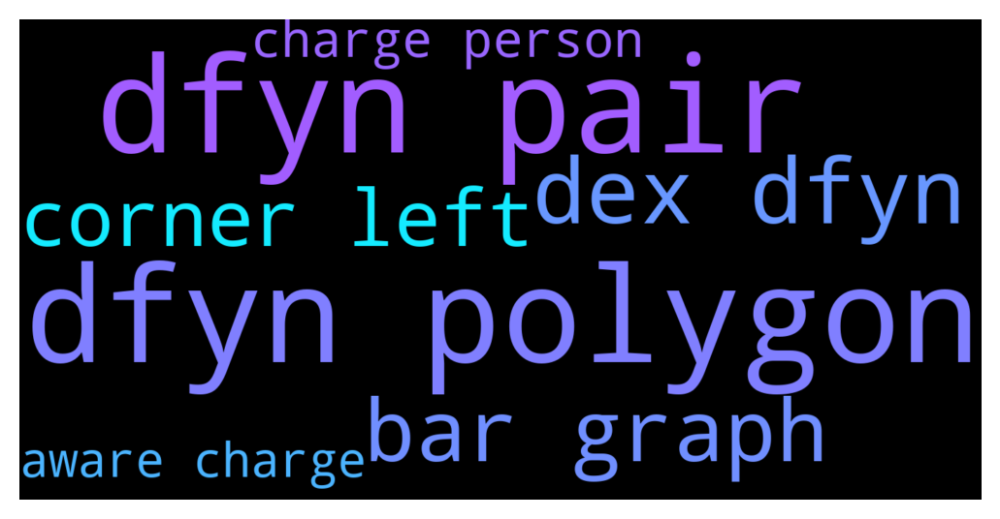

# **@DEXToolsCommunity**
 ## Analysis for **2021-12-07** - **2021-12-09**.

---

## 📊 **Basic Stats**

**n_messages_sent**: 673

---

---

## 🔝 **Top keywords and related messages**

1. **dfyn polygon**

    @ETH_Validator --- *Actually I don't see any coins data on Dfyn Dex showing up..* **--->** [TG Discussion](https://t.me/DEXToolsCommunity/311336)

    @stanes --- *So obviously this Dextools doesn't find this pair. I am sending that to the devs, they will fix it asap. We are supposed to show all the pairs on Dfyn (Polygon side), if you find some other ones with an issue, please let us know. Thank you for reporting 👍* **--->** [TG Discussion](https://t.me/DEXToolsCommunity/311335)

    @stanes --- *If you look for a pair on Dfyn on Polygon, you will find it.* **--->** [TG Discussion](https://t.me/DEXToolsCommunity/311323)

    @stanes --- *We already have Dfyn on Polygon sir.* **--->** [TG Discussion](https://t.me/DEXToolsCommunity/311321)

    @stanes --- *This is indeed strange, but Dfyn is supposed to be supported for all the pairs, let me have a deeper look.* **--->** [TG Discussion](https://t.me/DEXToolsCommunity/311333)

    @ETH_Validator --- *Its taking from Quickswap and not Dfyn* **--->** [TG Discussion](https://t.me/DEXToolsCommunity/311329)

2. **dfyn pair**

    @ETH_Validator --- *Actually I don't see any coins data on Dfyn Dex showing up..* **--->** [TG Discussion](https://t.me/DEXToolsCommunity/311336)

    @hmk18990 --- *it means devs should check your pair 😊* **--->** [TG Discussion](https://t.me/DEXToolsCommunity/310679)

    @gumbercules --- *on each pair? I'm seeing daily so 24hrs* **--->** [TG Discussion](https://t.me/DEXToolsCommunity/311112)

    @stanes --- *So obviously this Dextools doesn't find this pair. I am sending that to the devs, they will fix it asap. We are supposed to show all the pairs on Dfyn (Polygon side), if you find some other ones with an issue, please let us know. Thank you for reporting 👍* **--->** [TG Discussion](https://t.me/DEXToolsCommunity/311335)

    @stanes --- *If you look for a pair on Dfyn on Polygon, you will find it.* **--->** [TG Discussion](https://t.me/DEXToolsCommunity/311323)

    @stanes --- *We already have Dfyn on Polygon sir.* **--->** [TG Discussion](https://t.me/DEXToolsCommunity/311321)

3. **dex dfyn**

    @ETH_Validator --- *Actually I don't see any coins data on Dfyn Dex showing up..* **--->** [TG Discussion](https://t.me/DEXToolsCommunity/311336)

    @stanes --- *So obviously this Dextools doesn't find this pair. I am sending that to the devs, they will fix it asap. We are supposed to show all the pairs on Dfyn (Polygon side), if you find some other ones with an issue, please let us know. Thank you for reporting 👍* **--->** [TG Discussion](https://t.me/DEXToolsCommunity/311335)

    @stanes --- *If you look for a pair on Dfyn on Polygon, you will find it.* **--->** [TG Discussion](https://t.me/DEXToolsCommunity/311323)

    @stanes --- *We already have Dfyn on Polygon sir.* **--->** [TG Discussion](https://t.me/DEXToolsCommunity/311321)

    @stanes --- *This is indeed strange, but Dfyn is supposed to be supported for all the pairs, let me have a deeper look.* **--->** [TG Discussion](https://t.me/DEXToolsCommunity/311333)

    @ETH_Validator --- *Its taking from Quickswap and not Dfyn* **--->** [TG Discussion](https://t.me/DEXToolsCommunity/311329)

4. **bar graph**

    @stanes --- *Ok, so click on the lock at the left of the address bar.* **--->** [TG Discussion](https://t.me/DEXToolsCommunity/309976)

    @MadSlav --- *also, there is a volume graph below the price graph... how I could see the volume within that price range? for example, I choose 15 mins, and I see a bar... but it doesnt tell me the volume* **--->** [TG Discussion](https://t.me/DEXToolsCommunity/311119)

    @MadSlav --- *correct... but also there is a volume bar graph below the price line* **--->** [TG Discussion](https://t.me/DEXToolsCommunity/311123)

    @MadSlav --- *yeah, when I opet dextools graph for some token, there is a volume in the top left corner* **--->** [TG Discussion](https://t.me/DEXToolsCommunity/311114)

    @gumbercules --- *Use the bar graph in the chart to get more detailed volume data* **--->** [TG Discussion](https://t.me/DEXToolsCommunity/311136)

    @gumbercules --- *yes, when you hover over a time on the volume bar graph you'll see a numerical value appear in the top left under the token pair in the chart* **--->** [TG Discussion](https://t.me/DEXToolsCommunity/311124)

5. **corner left**

    @stanes --- *Ok, so click on the lock at the left of the address bar.* **--->** [TG Discussion](https://t.me/DEXToolsCommunity/309976)

    @atosm --- *eth price at top left corner stuck again .....* **--->** [TG Discussion](https://t.me/DEXToolsCommunity/311365)

    @stanes --- *If you don't know how to contact the team that's not good... If they have a TG, Discord or any other social, Dextools shows it on the top left of the page. If nothing... 😬* **--->** [TG Discussion](https://t.me/DEXToolsCommunity/309898)

    @MadSlav --- *let's try again... on the top left corner is Volume, my question is - for what timeframe is that volume? 24hours or?* **--->** [TG Discussion](https://t.me/DEXToolsCommunity/311111)

    @atosm --- *eth price at top left corner been stuck for a while* **--->** [TG Discussion](https://t.me/DEXToolsCommunity/310632)

    @MadSlav --- *yeah, when I opet dextools graph for some token, there is a volume in the top left corner* **--->** [TG Discussion](https://t.me/DEXToolsCommunity/311114)

6. **charge person**

    @stanes --- *Please DM @guillermorodriguez78 he is the person-in-charge.  Be aware of scammers, HE WILL NEVER DM YOU FIRST.* **--->** [TG Discussion](https://t.me/DEXToolsCommunity/311432)

    @bastardganpunk --- *An email or dming @guillermorodriguez78 who is in charge of that.* **--->** [TG Discussion](https://t.me/DEXToolsCommunity/311042)

    @stanes --- *Please DM @guillermorodriguez78 he is the person-in-charge of ads. Be aware of scammers, HE WILL NEVER DM YOU FIRST.* **--->** [TG Discussion](https://t.me/DEXToolsCommunity/311285)

    @stanes --- *We are not in charge of Trustwallet, ask them directly 🤷‍♂️* **--->** [TG Discussion](https://t.me/DEXToolsCommunity/311083)

    @stanes --- *Hi, please DM @guillermorodriguez78 he is the person-in-charge.  Be aware of scammers, HE WILL NEVER DM YOU FIRST.* **--->** [TG Discussion](https://t.me/DEXToolsCommunity/311059)

    @stanes --- *For ads? Please DM @guillermorodriguez78 he is the person-in-charge.  Be aware of scammers, HE WILL NEVER DM YOU FIRST.* **--->** [TG Discussion](https://t.me/DEXToolsCommunity/310980)

7. **aware charge**

    @stanes --- *Please DM @guillermorodriguez78 he is the person-in-charge.  Be aware of scammers, HE WILL NEVER DM YOU FIRST.* **--->** [TG Discussion](https://t.me/DEXToolsCommunity/311432)

    @stanes --- *So you are trying to sell, not transfer... Try to do that directly on Uniswap. If can't, ask the token team why. Be aware of scam tokens.* **--->** [TG Discussion](https://t.me/DEXToolsCommunity/309891)

    @bastardganpunk --- *An email or dming @guillermorodriguez78 who is in charge of that.* **--->** [TG Discussion](https://t.me/DEXToolsCommunity/311042)

    @napascual --- *That was a scammer, be aware* **--->** [TG Discussion](https://t.me/DEXToolsCommunity/310705)

    @stanes --- *Please DM @guillermorodriguez78 he is the person-in-charge of ads. Be aware of scammers, HE WILL NEVER DM YOU FIRST.* **--->** [TG Discussion](https://t.me/DEXToolsCommunity/311285)

    @stanes --- *We are not in charge of Trustwallet, ask them directly 🤷‍♂️* **--->** [TG Discussion](https://t.me/DEXToolsCommunity/311083)

