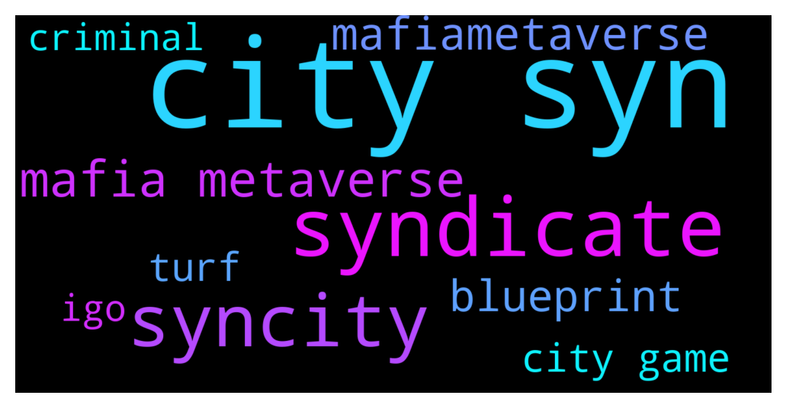

# **@binancenfts**
 ## Analysis for **2021-12-08** - **2021-12-09**.

---

## 📊 **Basic Stats**

**n_messages_sent**: 798

---

---

## 🔝 **Top keywords and related messages**

1. **city syn**

    @Kenikky --- *AMA WITH SYN CITY IS NOW STARTING* **--->** [TG Discussion](https://t.me/binancenfts/406072)

    @SyronEU --- *i cant buy syn nfts lel* **--->** [TG Discussion](https://t.me/binancenfts/406274)

    @Kenikky --- *We're very happy to welcome @superpowerroy of SYN CITY* **--->** [TG Discussion](https://t.me/binancenfts/406075)

    @seregakurd --- *#303 syn city* **--->** [TG Discussion](https://t.me/binancenfts/406320)

    @MrSN001 --- *How many characters are there in Syn City  and how the game is designed, could you tell us about the main features and give us some details of each of them, from the ways in which we can generate profits and the Marketplace that you have designed for the game?* **--->** [TG Discussion](https://t.me/binancenfts/406154)

    @AMS1369 --- *the link to syn city wasnt working yesterday, didnt think it will be today lol !* **--->** [TG Discussion](https://t.me/binancenfts/406316)

2. **syndicate**

    @superpowerroy --- *SYN CITY is the first ever Mafia Metaverse! Players can grind in daily events, PvE, PvP, and Syndicate events such as cross-chain tournaments.  The Mafia will allow #Synners (players) grind their way up through daily missions, events, battles, and much more. Manage your own syndicate, assign tasks, and govern to collect taxes. Syndicates will be able to form powerful cartels to coordinate attacks and acquire resources as you take over real-world cities around the globe.   The Mafia is an ever-green theme and we wanted to take it to the next level* **--->** [TG Discussion](https://t.me/binancenfts/406088)

    @superpowerroy --- *SYN CITY is an action-adventure RPG game in which the players acquire, manage, trade, and expand members of their syndicate. Featuring a cutting-edge gaming engine, bridging the gap between real-world non-fungible token (NFT) utilities and decentralized finance (DeFi) functions.   Displaying a stylized take on the world of modern syndicates, SYN CITY takes this concept a step further by making the game free-to-play — play-to-earn, and truly making the Metaverse more accessible. SYN City is developed by our team of industry experts from Disney, Ubisoft, Roblox, EA, Gameloft, Google, Yahoo and Twitter* **--->** [TG Discussion](https://t.me/binancenfts/406086)

    @superpowerroy --- *In Syn City, you can build your business empire and acquire assets by building, owning businesses, looting, raiding, trading, farming, borrowing/lending, and other services. Claim territory for your turf as you take over rival syndicate operations through exciting, cinematic battles.  You can manage your own turf, build businesses on the turf, and battle other criminal syndicates for world domination! Fight the biggest, baddest, most geared-out criminal syndicates in various PvE, PvP, and syndicate events to progress in the metaverse. All the above while having fun and earning while playing and participating in the ecosystem  There is going to be a massive economy of in-game assets which will feature world renowned artists, celebs and crypto OGs!* **--->** [TG Discussion](https://t.me/binancenfts/406091)

    @superpowerroy --- *The Mafia will allow #Metazens to grind their way up through daily missions, events, battles, and much more. Manage your own syndicate, assign tasks, and govern to collect taxes. Syndicates will be able to form powerful cartels to coordinate attacks and acquire resources as you take over real-world cities around the globe.   Build your business empire and earn assets by building, owning businesses, looting, raiding, trading, farming, borrowing/lending, and other services. Claim territory for your turf as you take over rival syndicate operations through exciting, cinematic battles.   Manage your own turf, build businesses on the turf, and battle other criminal syndicates for world domination! Fight the biggest, baddest, most geared-out criminal syndicates in various PvE, PvP, and syndicate events to progress in the metaverse* **--->** [TG Discussion](https://t.me/binancenfts/406219)

3. **syncity**

    @superpowerroy --- *discord.gg/syncity* **--->** [TG Discussion](https://t.me/binancenfts/406236)

    @superpowerroy --- *Of course, everyone will put in their sweat equity to earn, everyone will do the heavy lifting to earn, and we have built the platform to ensure our community is able to participate in the revolutionary shift. Our community will be rewarded based on their contribution.   You can simply come and participate with our user-friendly platform and participate in the core functions via our Discord server. Come join our server to participate in on-going events and gear up for the game    discord.gg/syncity* **--->** [TG Discussion](https://t.me/binancenfts/406095)

    @superpowerroy --- *pls join our Discord server for more information 👊  discord.gg/syncity* **--->** [TG Discussion](https://t.me/binancenfts/406221)

    @ahsiT03 --- *Gaming and DeFi are popping up everywhere. Many project are offering NFTs aswel. Please explain why Syn City will be one to survive and not fade away in this market? How do you keep users/ investor on your platform for the long term and how do you keep SynCityHQ ahead of the competition?* **--->** [TG Discussion](https://t.me/binancenfts/406167)

    @Marshall313Mathers --- *syncity worth taking at 350$? what do you guys think* **--->** [TG Discussion](https://t.me/binancenfts/406001)

    @Cdrew0 --- *What are the ways to become popular and build an empire inside the SynCity ? Is it just by investment or it have any activities through which we can build an empire ?@superpowerroy* **--->** [TG Discussion](https://t.me/binancenfts/406206)

4. **mafia metaverse**

    @cocoteaaa --- *How does SYN CITY MAFIA as a DAO (MaaD) system differ to traditional DAO system? Are there any special advantages with MaaD system? @superpowerroy* **--->** [TG Discussion](https://t.me/binancenfts/406151)

    @ScoobyDad --- *What differentiates SYN City from other P2E game? Also when we say Free to Play, does that mean players need 0 investment? #mafiametaverse* **--->** [TG Discussion](https://t.me/binancenfts/406143)

    @xperia3 --- *Hi! 🎩  Syn City did something very different than the mainstream metaverse projects and created a Mafia Metaverse. I want to know, what was the main inspiration you got to create this project? Was it a movie or a game? How did you decide to make Mafia Metaverse and what do you expect from this project in long term?  @superpowerroy* **--->** [TG Discussion](https://t.me/binancenfts/406123)

    @superpowerroy --- *SYN City is the first ever Mafia Metaverse  We are building an innovative P2E platform which is the Genesis module for the Metaverse we are building. We want to make the Metaverse more accessible* **--->** [TG Discussion](https://t.me/binancenfts/406083)

    @sinthiasinika --- *Why did you choose the name MafiaMetaverse for the game? How was the SYN CITY Game? which is looking for life in space, born, what was the inspiration for this name and the story of the game?* **--->** [TG Discussion](https://t.me/binancenfts/406171)

    @Kenikky --- *Can you tell us more about the Mafia Metaverse?* **--->** [TG Discussion](https://t.me/binancenfts/406087)

5. **mafiametaverse**

    @ScoobyDad --- *What differentiates SYN City from other P2E game? Also when we say Free to Play, does that mean players need 0 investment? #mafiametaverse* **--->** [TG Discussion](https://t.me/binancenfts/406143)

    @sinthiasinika --- *Why did you choose the name MafiaMetaverse for the game? How was the SYN CITY Game? which is looking for life in space, born, what was the inspiration for this name and the story of the game?* **--->** [TG Discussion](https://t.me/binancenfts/406171)

    @superpowerroy --- *SYN CITY will be chain agnostic and we will continue working with various ecosystems in the form of parallel universes within #mafiametaverse.   We released a free mint Genesis collection on Ethereum and announced our Limited Edition Blueprints for an IGO on Binance NFT.   Our Binance IGO will kick-off in about 30 minutes today, on the 9th Dec, at 1 pm UTC which will be on BSC  We will introduce staking pools on our platform right after TGE, which is expected to be later this month* **--->** [TG Discussion](https://t.me/binancenfts/406103)

    @Kowser0017 --- *Is there any kind of KYC needed to join your platforms? Have you done any audit process? Can users be sure that their info will not be stolen  #mafiametaverse* **--->** [TG Discussion](https://t.me/binancenfts/406182)

    @ScoobyDad --- *What are your marketing strategies to get more players and increase adoption? #mafiametaverse* **--->** [TG Discussion](https://t.me/binancenfts/406190)

    @Abrahamhossain --- *What makes MafiaMetaverse gameplay different from other games??* **--->** [TG Discussion](https://t.me/binancenfts/406162)

6. **blueprint**

    @ikaFelicia02 --- *Why there is only blueprints that only available to be bought from Syn City's NFT ? Where and When the other NFTs will be sale ?* **--->** [TG Discussion](https://t.me/binancenfts/406169)

    @superpowerroy --- *LIMITED EDITION BLUEPRINTS - first ever SYN City IGO* **--->** [TG Discussion](https://t.me/binancenfts/406225)

    @superpowerroy --- *SYN CITY will be chain agnostic and we will continue working with various ecosystems in the form of parallel universes within #mafiametaverse.   We released a free mint Genesis collection on Ethereum and announced our Limited Edition Blueprints for an IGO on Binance NFT.   Our Binance IGO will kick-off in about 30 minutes today, on the 9th Dec, at 1 pm UTC which will be on BSC  We will introduce staking pools on our platform right after TGE, which is expected to be later this month* **--->** [TG Discussion](https://t.me/binancenfts/406103)

    @Pauldennisc --- *Syn city has a great community and exciting and at the same time frustrating for those who are trying to get the ARG2 ( including me ), and later we will have some blueprint to be bought in binance nft marketplace, other than these are there up and coming surprises and is there a limit to how many players can join and play the game??* **--->** [TG Discussion](https://t.me/binancenfts/406148)

    @crypto_RL --- *What is the usage of the blueprints in game? Do we need to have a blueprint to start the game? @superpowerroy* **--->** [TG Discussion](https://t.me/binancenfts/406187)

    @superpowerroy --- *We are kicking off our first public NFT sale exclusively on Binance NFT platform. It's an honor for us to host the IGO here by sharing the Limited Edition Blueprints with the community.  Pls visit our Discord server for more information about the future collections. Remember, Limirted Edition Blueprints are the first on the BSC network* **--->** [TG Discussion](https://t.me/binancenfts/406222)

7. **turf**

    @superpowerroy --- *In Syn City, you can build your business empire and acquire assets by building, owning businesses, looting, raiding, trading, farming, borrowing/lending, and other services. Claim territory for your turf as you take over rival syndicate operations through exciting, cinematic battles.  You can manage your own turf, build businesses on the turf, and battle other criminal syndicates for world domination! Fight the biggest, baddest, most geared-out criminal syndicates in various PvE, PvP, and syndicate events to progress in the metaverse. All the above while having fun and earning while playing and participating in the ecosystem  There is going to be a massive economy of in-game assets which will feature world renowned artists, celebs and crypto OGs!* **--->** [TG Discussion](https://t.me/binancenfts/406091)

    @superpowerroy --- *The Mafia will allow #Metazens to grind their way up through daily missions, events, battles, and much more. Manage your own syndicate, assign tasks, and govern to collect taxes. Syndicates will be able to form powerful cartels to coordinate attacks and acquire resources as you take over real-world cities around the globe.   Build your business empire and earn assets by building, owning businesses, looting, raiding, trading, farming, borrowing/lending, and other services. Claim territory for your turf as you take over rival syndicate operations through exciting, cinematic battles.   Manage your own turf, build businesses on the turf, and battle other criminal syndicates for world domination! Fight the biggest, baddest, most geared-out criminal syndicates in various PvE, PvP, and syndicate events to progress in the metaverse* **--->** [TG Discussion](https://t.me/binancenfts/406219)

8. **city game**

    @Kenikky --- *AMA WITH SYN CITY IS NOW STARTING* **--->** [TG Discussion](https://t.me/binancenfts/406072)

    @Kenikky --- *We're very happy to welcome @superpowerroy of SYN CITY* **--->** [TG Discussion](https://t.me/binancenfts/406075)

    @MrSN001 --- *How many characters are there in Syn City  and how the game is designed, could you tell us about the main features and give us some details of each of them, from the ways in which we can generate profits and the Marketplace that you have designed for the game?* **--->** [TG Discussion](https://t.me/binancenfts/406154)

    @seregakurd --- *#303 syn city* **--->** [TG Discussion](https://t.me/binancenfts/406320)

    @AMS1369 --- *the link to syn city wasnt working yesterday, didnt think it will be today lol !* **--->** [TG Discussion](https://t.me/binancenfts/406316)

    @Sergeyelite --- *guys is it worth buying today's syn city?* **--->** [TG Discussion](https://t.me/binancenfts/405885)

9. **igo**

    @BattledroneV --- *This Game SYN CITY is gonna be awesome. I can see the demand. IGO sold out in 20 mins.* **--->** [TG Discussion](https://t.me/binancenfts/406287)

    @jerrymehra --- *Whats the starting mint price for syn city igo today?* **--->** [TG Discussion](https://t.me/binancenfts/405918)

    @superpowerroy --- *LIMITED EDITION BLUEPRINTS - first ever SYN City IGO* **--->** [TG Discussion](https://t.me/binancenfts/406225)

    @BattledroneV --- *Yo, who got the Syn City NFT igo?* **--->** [TG Discussion](https://t.me/binancenfts/406280)

    @Pauldennisc --- *How can we join syn city igo?* **--->** [TG Discussion](https://t.me/binancenfts/406043)

    @ChibiMaya_bnb --- *not yet, only for IGO by now, but I really want to know how many people here interested ^___^* **--->** [TG Discussion](https://t.me/binancenfts/405054)

10. **criminal**

    @kekock --- *How your project is connected to "Criminal Empire" game, because both (Syn City and Criminal Empire) have same arts and gameplay?  You need to explain this* **--->** [TG Discussion](https://t.me/binancenfts/406118)

    @superpowerroy --- *In Syn City, you can build your business empire and acquire assets by building, owning businesses, looting, raiding, trading, farming, borrowing/lending, and other services. Claim territory for your turf as you take over rival syndicate operations through exciting, cinematic battles.  You can manage your own turf, build businesses on the turf, and battle other criminal syndicates for world domination! Fight the biggest, baddest, most geared-out criminal syndicates in various PvE, PvP, and syndicate events to progress in the metaverse. All the above while having fun and earning while playing and participating in the ecosystem  There is going to be a massive economy of in-game assets which will feature world renowned artists, celebs and crypto OGs!* **--->** [TG Discussion](https://t.me/binancenfts/406091)

    @superpowerroy --- *The Mafia will allow #Metazens to grind their way up through daily missions, events, battles, and much more. Manage your own syndicate, assign tasks, and govern to collect taxes. Syndicates will be able to form powerful cartels to coordinate attacks and acquire resources as you take over real-world cities around the globe.   Build your business empire and earn assets by building, owning businesses, looting, raiding, trading, farming, borrowing/lending, and other services. Claim territory for your turf as you take over rival syndicate operations through exciting, cinematic battles.   Manage your own turf, build businesses on the turf, and battle other criminal syndicates for world domination! Fight the biggest, baddest, most geared-out criminal syndicates in various PvE, PvP, and syndicate events to progress in the metaverse* **--->** [TG Discussion](https://t.me/binancenfts/406219)

