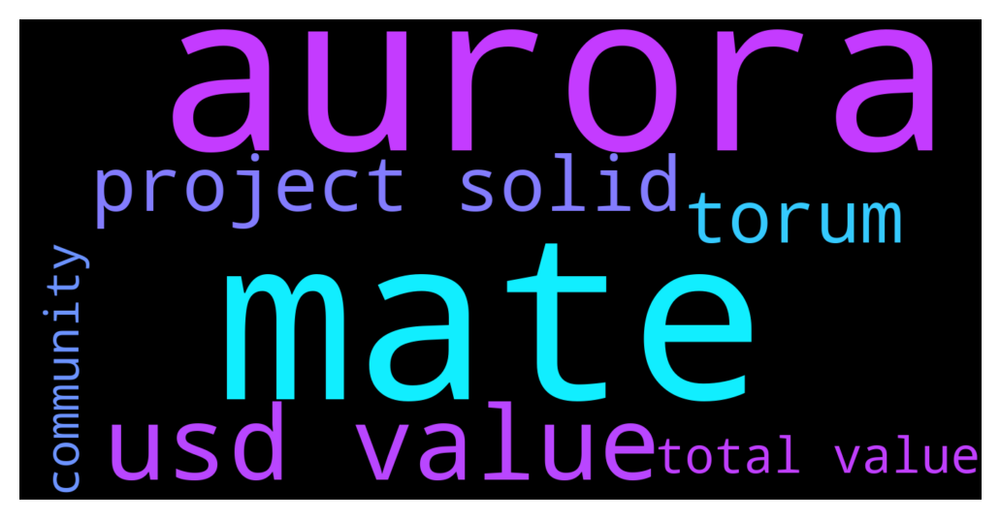

# **@de_fi**
 ## Analysis for **2021-12-08** - **2021-12-09**.

---

## 📊 **Basic Stats**

**n_messages_sent**: 92

---

---

## 🔝 **Top keywords and related messages**

1. **mate**

    @sg --- *what is Torum mate?* **--->** [TG Discussion](https://t.me/de_fi/230320)

    @NiEcil --- *the MDEX Boardroom mate where you can stake MDX to mine XTM with a total value of 100,000 USD. The activity lasts for 45 days only* **--->** [TG Discussion](https://t.me/de_fi/230317)

    @NiEcil --- *there are three activity to be held mate* **--->** [TG Discussion](https://t.me/de_fi/230309)

    @NiEcil --- *yes mate, recently listed on Houbi yesterday* **--->** [TG Discussion](https://t.me/de_fi/230326)

2. **aurora**

    @razerdip --- *Aurora will be a good leverage for Near in the near future 👌 I am following these guys too 😃* **--->** [TG Discussion](https://t.me/de_fi/230212)

    @cryptowarrior3 --- *Yeah Aurora is cool but the real leverage for the NEAR Protocol is its nft ecosystem cuz the platforms like Paras are growing rapidly 😅* **--->** [TG Discussion](https://t.me/de_fi/230213)

    @cryptowarrior3 --- *I think the most bullish thing in DeFi is bridge tokens right now. Aurora is my hidden superstar 😅* **--->** [TG Discussion](https://t.me/de_fi/230211)

3. **usd value**

    @NiEcil --- *Torum is pleased to announce the commencement of “Joint Mining Program” with MDEX and provide $200,000 USD worth of reward to the community.* **--->** [TG Discussion](https://t.me/de_fi/230300)

    @NiEcil --- *You can stake XTM/HT to mine MDX with a total value of 60,000 USD.* **--->** [TG Discussion](https://t.me/de_fi/230306)

    @BradyDale --- *Does anyone have a good understanding of why mStable's total value locked doubled from mid October to early November? https://defipulse.com/mstable* **--->** [TG Discussion](https://t.me/de_fi/230102)

    @NiEcil --- *You have to trade XTM/HT to mine MDX with a total value of 40,000 USD.* **--->** [TG Discussion](https://t.me/de_fi/230315)

    @NiEcil --- *the MDEX Boardroom mate where you can stake MDX to mine XTM with a total value of 100,000 USD. The activity lasts for 45 days only* **--->** [TG Discussion](https://t.me/de_fi/230317)

    @NiEcil --- *SocialFi, users can earn by supporting their favourite creators through collectables that provide actual value* **--->** [TG Discussion](https://t.me/de_fi/230324)

4. **project solid**

    @mosesgod --- *Well I've got a project for you that started out as a NFT, and then became DeFi.   They were actually, at time of the launch a top 15 opensea project. Yesterday they launched their fair launch auction on Copper.* **--->** [TG Discussion](https://t.me/de_fi/230065)

    @poppycoins --- *Any new NFT project? Or something interesting in this area, maybe* **--->** [TG Discussion](https://t.me/de_fi/230059)

    @Tronix50 --- *I’ve heard nothing but good things about it actually from a lot of people! Very solid project. Easy 100x in the near future.* **--->** [TG Discussion](https://t.me/de_fi/230226)

    @Kartik --- *Yo I came across a good BSC project, private sell ongoing, Safu play. Check it out  TG: goatprotocolfinance* **--->** [TG Discussion](https://t.me/de_fi/230087)

    @k_o_n_n_e_r_y --- *check out awesome project called pokerdao, they using platform with multichain compatibility so users can create tables* **--->** [TG Discussion](https://t.me/de_fi/230080)

    @cryptofreakie --- *Take a look on Ludo's upcoming platform. This project will melt some faces, because besides the fact that will be the first search engine for NFTs, Ludo will eb creator-centric and multichain all in one space. Basically a space where everything's connected.* **--->** [TG Discussion](https://t.me/de_fi/230062)

5. **torum**

    @NiEcil --- *Torum is pleased to announce the commencement of “Joint Mining Program” with MDEX and provide $200,000 USD worth of reward to the community.* **--->** [TG Discussion](https://t.me/de_fi/230300)

    @sg --- *what is Torum mate?* **--->** [TG Discussion](https://t.me/de_fi/230320)

    @NiEcil --- *Torum is a revolutionary SocialFi Metaverse ecosystem designed to connect worldwide cryptocurrency users.* **--->** [TG Discussion](https://t.me/de_fi/230322)

6. **total value**

    @NiEcil --- *You can stake XTM/HT to mine MDX with a total value of 60,000 USD.* **--->** [TG Discussion](https://t.me/de_fi/230306)

    @BradyDale --- *Does anyone have a good understanding of why mStable's total value locked doubled from mid October to early November? https://defipulse.com/mstable* **--->** [TG Discussion](https://t.me/de_fi/230102)

    @NiEcil --- *You have to trade XTM/HT to mine MDX with a total value of 40,000 USD.* **--->** [TG Discussion](https://t.me/de_fi/230315)

    @NiEcil --- *the MDEX Boardroom mate where you can stake MDX to mine XTM with a total value of 100,000 USD. The activity lasts for 45 days only* **--->** [TG Discussion](https://t.me/de_fi/230317)

    @NiEcil --- *SocialFi, users can earn by supporting their favourite creators through collectables that provide actual value* **--->** [TG Discussion](https://t.me/de_fi/230324)

7. **community**

    @NiEcil --- *Torum is pleased to announce the commencement of “Joint Mining Program” with MDEX and provide $200,000 USD worth of reward to the community.* **--->** [TG Discussion](https://t.me/de_fi/230300)

    @kelvin0083 --- *No it's my community that will do it* **--->** [TG Discussion](https://t.me/de_fi/230221)

    @ayoistimi18 --- *Okay can I know more about the community?* **--->** [TG Discussion](https://t.me/de_fi/230285)

    @abeosten --- *Hi folks, Abe here from Cap (cap.finance). We're looking for someone special to supercharge the Cap community's growth. All current contributors are engineers, so community growth is not exactly our area of expertise. 😄  Would you know anyone we can talk to who does this really well? Looking to hire top talent. Thanks!* **--->** [TG Discussion](https://t.me/de_fi/229967)

    @ayoistimi18 --- *About the AMA, is it my community that will do the hosting of the AMA session?* **--->** [TG Discussion](https://t.me/de_fi/230167)

    @ayoistimi18 --- *Any one with a great community that would love to participate in our Upcoming coming AMA session.* **--->** [TG Discussion](https://t.me/de_fi/230329)

