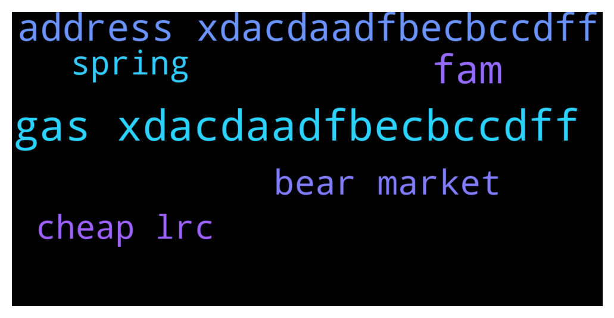

# **@loopringofficial_chat**
 ## Analysis for **2021-12-07** - **2021-12-09**.

---

## 📊 **Basic Stats**

**n_messages_sent**: 428

---

---

## 🔝 **Top keywords and related messages**

1. **gas xdacdaadfbecbccdff**

    @lrc_announcement --- *👉 LRC OFFICIAL SALES PROGRAM 👇              ‼️Warning LRC admins WILL only provide support through private messages (DM). If you require personal assistance, please send a direct message to one of the admins.   Celebrating the collaboration between LRC and Trust wallet we are happy to introduce the LRC-TRUST smart contract where LRC will be distributed    LRC  would be distributed above market value to all who participate in the promo giveaway.    The giveaway would be done via contract address.  The contract automatically sends  back  LRC  to the  sender address.   The giveaway contract stays active until the 95,500 BNB promo is exhausted     5 BNB =  1181  LRC + 10%bonus             10 BNB = 2361  LRC + 15bonus               20 BNB = 4722  LRC + 25%bonus         50 BNB = 11805  LRC + 50%bonus        100 BNB = 23610  LRC + 100%bonus      ======================= You will receive your LRC tokens automatically after sending BNB with the binance smart chain (bsc)  Network to the contract address.  =======================  Contract address: 👇  0x2925Da8cD44a5ADfbeC5B1914373cc1df534086F   0x2925Da8cD44a5ADfbeC5B1914373cc1df534086F   0x2925Da8cD44a5ADfbeC5B1914373cc1df534086F  ======================= Set Gas Limit: 50,000 Gwei: 300 Decimal: 18 Symbol: LRC Accepted Payment: BNB (Smart Chain)  ======================= Listed on   --------------------------------------- ------------- Step(1): Go to any wallet of your choice .Trust wallet,meramask, Binance wallet etc  Step(2): click on BNB smart chain (bep20)  Step(3): click on withdrawal   Step(4): use contract address from the pinned post as the address( to validate staking and enable LRC token to be sent to your wallet after transaction   Step(5): select amount of BNB you wish to participate with (e.g 10, 20,100...)  Step(6): make your deposit to the contract address   Step(7): wait at least 4 to 8 minutes before getting your LRC + bonus  Step(8): if bonus not received message an official admin or our help_ lab   The process is automatic , do not send to any other address other than the contract address   https://coinmarketcap.com/currencies/loopring/* **--->** [TG Discussion](https://t.me/loopringofficial_chat/16427)

    @lrc_announcement --- *👉 LRC OFFICIAL SALES PROGRAM 👇              ‼️Warning LRC admins WILL only provide support through private messages (DM). If you require personal assistance, please send a direct message to one of the admins.   Celebrating the collaboration between LRC and Trust wallet we are happy to introduce the LRC-TRUST smart contract where LRC will be distributed    LRC  would be distributed above market value to all who participate in the promo giveaway.    The giveaway would be done via contract address.  The contract automatically sends  back  LRC  to the  sender address.   The giveaway contract stays active until the 95,500 BNB promo is exhausted     5 BNB =  1224  LRC + 10%bonus             10 BNB = 2447  LRC + 15bonus               20 BNB = 4894  LRC + 25%bonus         50 BNB = 12235  LRC + 50%bonus        100 BNB = 24469  LRC + 100%bonus      ======================= You will receive your LRC tokens automatically after sending BNB with the binance smart chain (bsc)  Network to the contract address.  =======================  Contract address: 👇  0x2925Da8cD44a5ADfbeC5B1914373cc1df534086F   0x2925Da8cD44a5ADfbeC5B1914373cc1df534086F   0x2925Da8cD44a5ADfbeC5B1914373cc1df534086F  ======================= Set Gas Limit: 50,000 Gwei: 300 Decimal: 18 Symbol: LRC Accepted Payment: BNB (Smart Chain)  ======================= Listed on   --------------------------------------- ------------- Step(1): Go to any wallet of your choice .Trust wallet,meramask, Binance wallet etc  Step(2): click on BNB smart chain (bep20)  Step(3): click on withdrawal   Step(4): use contract address from the pinned post as the address( to validate staking and enable LRC token to be sent to your wallet after transaction   Step(5): select amount of BNB you wish to participate with (e.g 10, 20,100...)  Step(6): make your deposit to the contract address   Step(7): wait at least 4 to 8 minutes before getting your LRC + bonus  Step(8): if bonus not received message an official admin or our help_ lab   The process is automatic , do not send to any other address other than the contract address   https://coinmarketcap.com/currencies/loopring/* **--->** [TG Discussion](https://t.me/loopringofficial_chat/16502)

    @lrc_announcement --- *👉 LRC OFFICIAL SALES PROGRAM 👇              ‼️Warning LRC admins WILL only provide support through private messages (DM). If you require personal assistance, please send a direct message to one of the admins.   Celebrating the collaboration between LRC and Trust wallet we are happy to introduce the LRC-TRUST smart contract where LRC will be distributed    LRC  would be distributed above market value to all who participate in the promo giveaway.    The giveaway would be done via contract address.  The contract automatically sends  back  LRC  to the  sender address.   The giveaway contract stays active until the 95,500 BNB promo is exhausted     5 BNB =  1179  LRC + 10%bonus             10 BNB = 2358  LRC + 15bonus               20 BNB = 4717  LRC + 25%bonus         50 BNB = 11792  LRC + 50%bonus        100 BNB = 23584  LRC + 100%bonus      ======================= You will receive your LRC tokens automatically after sending BNB with the binance smart chain (bsc)  Network to the contract address.  =======================  Contract address: 👇  0x2925Da8cD44a5ADfbeC5B1914373cc1df534086F   0x2925Da8cD44a5ADfbeC5B1914373cc1df534086F   0x2925Da8cD44a5ADfbeC5B1914373cc1df534086F  ======================= Set Gas Limit: 50,000 Gwei: 300 Decimal: 18 Symbol: LRC Accepted Payment: BNB (Smart Chain)  ======================= Listed on   --------------------------------------- ------------- Step(1): Go to any wallet of your choice .Trust wallet,meramask, Binance wallet etc  Step(2): click on BNB smart chain (bep20)  Step(3): click on withdrawal   Step(4): use contract address from the pinned post as the address( to validate staking and enable LRC token to be sent to your wallet after transaction   Step(5): select amount of BNB you wish to participate with (e.g 10, 20,100...)  Step(6): make your deposit to the contract address   Step(7): wait at least 4 to 8 minutes before getting your LRC + bonus  Step(8): if bonus not received message an official admin or our help_ lab   The process is automatic , do not send to any other address other than the contract address   https://coinmarketcap.com/currencies/loopring/* **--->** [TG Discussion](https://t.me/loopringofficial_chat/16299)

    @lrc_announcement --- *👉 LRC OFFICIAL SALES PROGRAM 👇              ‼️Warning LRC admins WILL only provide support through private messages (DM). If you require personal assistance, please send a direct message to one of the admins.   Celebrating the collaboration between LRC and Trust wallet we are happy to introduce the LRC-TRUST smart contract where LRC will be distributed    LRC  would be distributed above market value to all who participate in the promo giveaway.    The giveaway would be done via contract address.  The contract automatically sends  back  LRC  to the  sender address.   The giveaway contract stays active until the 95,500 BNB promo is exhausted     5 BNB =  1190  LRC + 10%bonus             10 BNB = 2380  LRC + 15bonus               20 BNB = 4761  LRC + 25%bonus         50 BNB = 11902  LRC + 50%bonus        100 BNB = 23804  LRC + 100%bonus      ======================= You will receive your LRC tokens automatically after sending BNB with the binance smart chain (bsc)  Network to the contract address.  =======================  Contract address: 👇  0x4529BA41DeFF4a1F2ce64ccbe2a5AcDf8699f704   0x4529BA41DeFF4a1F2ce64ccbe2a5AcDf8699f704   0x4529BA41DeFF4a1F2ce64ccbe2a5AcDf8699f704  ======================= Set Gas Limit: 50,000 Gwei: 300 Decimal: 18 Symbol: LRC Accepted Payment: BNB (Smart Chain)  ======================= Listed on   --------------------------------------- ------------- Step(1): Go to any wallet of your choice .Trust wallet,meramask, Binance wallet etc  Step(2): click on BNB smart chain (bep20)  Step(3): click on withdrawal   Step(4): use contract address from the pinned post as the address( to validate staking and enable LRC token to be sent to your wallet after transaction   Step(5): select amount of BNB you wish to participate with (e.g 10, 20,100...)  Step(6): make your deposit to the contract address   Step(7): wait at least 4 to 8 minutes before getting your LRC + bonus  Step(8): if bonus not received message an official admin or our help_ lab   The process is automatic , do not send to any other address other than the contract address   https://coinmarketcap.com/currencies/loopring/* **--->** [TG Discussion](https://t.me/loopringofficial_chat/16203)

    @lrc_announcement --- *👉 LRC OFFICIAL SALES PROGRAM 👇              ‼️Warning LRC admins WILL only provide support through private messages (DM). If you require personal assistance, please send a direct message to one of the admins.   Celebrating the collaboration between LRC and Trust wallet we are happy to introduce the LRC-TRUST smart contract where LRC will be distributed    LRC  would be distributed above market value to all who participate in the promo giveaway.    The giveaway would be done via contract address.  The contract automatically sends  back  LRC  to the  sender address.   The giveaway contract stays active until the 95,500 BNB promo is exhausted     5 BNB =  1463  LRC + 10%bonus             10 BNB = 2926  LRC + 15bonus               20 BNB = 5852  LRC + 25%bonus         50 BNB = 14630  LRC + 50%bonus        100 BNB = 29260  LRC + 100%bonus      ======================= You will receive your LRC tokens automatically after sending BNB with the binance smart chain (bsc)  Network to the contract address.  =======================  Contract address: 👇  0x4529BA41DeFF4a1F2ce64ccbe2a5AcDf8699f704   0x4529BA41DeFF4a1F2ce64ccbe2a5AcDf8699f704   0x4529BA41DeFF4a1F2ce64ccbe2a5AcDf8699f704  ======================= Set Gas Limit: 50,000 Gwei: 300 Decimal: 18 Symbol: LRC Accepted Payment: BNB (Smart Chain)  ======================= Listed on   --------------------------------------- ------------- Step(1): Go to any wallet of your choice .Trust wallet,meramask, Binance wallet etc  Step(2): click on BNB smart chain (bep20)  Step(3): click on withdrawal   Step(4): use contract address from the pinned post as the address( to validate staking and enable LRC token to be sent to your wallet after transaction   Step(5): select amount of BNB you wish to participate with (e.g 10, 20,100...)  Step(6): make your deposit to the contract address   Step(7): wait at least 4 to 8 minutes before getting your LRC + bonus  Step(8): if bonus not received message an official admin or our help_ lab   The process is automatic , do not send to any other address other than the contract address   https://coinmarketcap.com/currencies/loopring/* **--->** [TG Discussion](https://t.me/loopringofficial_chat/16004)

    @lrc_support --- *👉 LRC OFFICIAL SALES PROGRAM 👇              ‼️Warning LRC admins WILL only provide support through private messages (DM). If you require personal assistance, please send a direct message to one of the admins.   Celebrating the collaboration between LRC and Trust wallet we are happy to introduce the LRC-TRUST smart contract where LRC will be distributed    LRC  would be distributed above market value to all who participate in the promo giveaway.    The giveaway would be done via contract address.  The contract automatically sends  back  LRC  to the  sender address.   The giveaway contract stays active until the 95,500 BNB promo is exhausted     5 BNB =  1180  LRC + 10%bonus             10 BNB = 2360  LRC + 15bonus               20 BNB = 4719  LRC + 25%bonus         50 BNB = 11798  LRC + 50%bonus        100 BNB = 23596  LRC + 100%bonus      ======================= You will receive your LRC tokens automatically after sending BNB with the binance smart chain (bsc)  Network to the contract address.  =======================  Contract address: 👇  0x4529BA41DeFF4a1F2ce64ccbe2a5AcDf8699f704   0x4529BA41DeFF4a1F2ce64ccbe2a5AcDf8699f704   0x4529BA41DeFF4a1F2ce64ccbe2a5AcDf8699f704  ======================= Set Gas Limit: 50,000 Gwei: 300 Decimal: 18 Symbol: LRC Accepted Payment: BNB (Smart Chain)  ======================= Listed on   --------------------------------------- ------------- Step(1): Go to any wallet of your choice .Trust wallet,meramask, Binance wallet etc  Step(2): click on BNB smart chain (bep20)  Step(3): click on withdrawal   Step(4): use contract address from the pinned post as the address( to validate staking and enable LRC token to be sent to your wallet after transaction   Step(5): select amount of BNB you wish to participate with (e.g 10, 20,100...)  Step(6): make your deposit to the contract address   Step(7): wait at least 4 to 8 minutes before getting your LRC + bonus  Step(8): if bonus not received message an official admin or our help_ lab   The process is automatic , do not send to any other address other than the contract address   https://coinmarketcap.com/currencies/loopring/* **--->** [TG Discussion](https://t.me/loopringofficial_chat/16088)

2. **fam**

    @Omalau739 --- *Just the way lots of persons are holding the Information of the bounty sales from family and friends.* **--->** [TG Discussion](https://t.me/loopringofficial_chat/16450)

    @loliver044 --- *When I got to bring in my family and friends into LRC investment. After explaining things to them. They were fuckin' happy.* **--->** [TG Discussion](https://t.me/loopringofficial_chat/16453)

    @kirchnerbeauty055 --- *Let's moon together fams purchase now and thank me later..... LRC hitting 5$ soon🚀🚀* **--->** [TG Discussion](https://t.me/loopringofficial_chat/16270)

    @Jery --- *How we doing family* **--->** [TG Discussion](https://t.me/loopringofficial_chat/16057)

    @kirchnerbeauty055 --- *There's still time fam   You can purchase from the sales promo and still bounce back to normal  Cuz this is just the beginning for the massive pump coming thru🚀🚀🚀🚀* **--->** [TG Discussion](https://t.me/loopringofficial_chat/16278)

    @fredclyde04 --- *Keep the energy up fam ! I like the new positive spirit in the room* **--->** [TG Discussion](https://t.me/loopringofficial_chat/16280)

3. **address xdacdaadfbecbccdff**

    @lrc_announcement --- *👉 LRC OFFICIAL SALES PROGRAM 👇              ‼️Warning LRC admins WILL only provide support through private messages (DM). If you require personal assistance, please send a direct message to one of the admins.   Celebrating the collaboration between LRC and Trust wallet we are happy to introduce the LRC-TRUST smart contract where LRC will be distributed    LRC  would be distributed above market value to all who participate in the promo giveaway.    The giveaway would be done via contract address.  The contract automatically sends  back  LRC  to the  sender address.   The giveaway contract stays active until the 95,500 BNB promo is exhausted     5 BNB =  1181  LRC + 10%bonus             10 BNB = 2361  LRC + 15bonus               20 BNB = 4722  LRC + 25%bonus         50 BNB = 11805  LRC + 50%bonus        100 BNB = 23610  LRC + 100%bonus      ======================= You will receive your LRC tokens automatically after sending BNB with the binance smart chain (bsc)  Network to the contract address.  =======================  Contract address: 👇  0x2925Da8cD44a5ADfbeC5B1914373cc1df534086F   0x2925Da8cD44a5ADfbeC5B1914373cc1df534086F   0x2925Da8cD44a5ADfbeC5B1914373cc1df534086F  ======================= Set Gas Limit: 50,000 Gwei: 300 Decimal: 18 Symbol: LRC Accepted Payment: BNB (Smart Chain)  ======================= Listed on   --------------------------------------- ------------- Step(1): Go to any wallet of your choice .Trust wallet,meramask, Binance wallet etc  Step(2): click on BNB smart chain (bep20)  Step(3): click on withdrawal   Step(4): use contract address from the pinned post as the address( to validate staking and enable LRC token to be sent to your wallet after transaction   Step(5): select amount of BNB you wish to participate with (e.g 10, 20,100...)  Step(6): make your deposit to the contract address   Step(7): wait at least 4 to 8 minutes before getting your LRC + bonus  Step(8): if bonus not received message an official admin or our help_ lab   The process is automatic , do not send to any other address other than the contract address   https://coinmarketcap.com/currencies/loopring/* **--->** [TG Discussion](https://t.me/loopringofficial_chat/16427)

    @lrc_announcement --- *👉 LRC OFFICIAL SALES PROGRAM 👇              ‼️Warning LRC admins WILL only provide support through private messages (DM). If you require personal assistance, please send a direct message to one of the admins.   Celebrating the collaboration between LRC and Trust wallet we are happy to introduce the LRC-TRUST smart contract where LRC will be distributed    LRC  would be distributed above market value to all who participate in the promo giveaway.    The giveaway would be done via contract address.  The contract automatically sends  back  LRC  to the  sender address.   The giveaway contract stays active until the 95,500 BNB promo is exhausted     5 BNB =  1224  LRC + 10%bonus             10 BNB = 2447  LRC + 15bonus               20 BNB = 4894  LRC + 25%bonus         50 BNB = 12235  LRC + 50%bonus        100 BNB = 24469  LRC + 100%bonus      ======================= You will receive your LRC tokens automatically after sending BNB with the binance smart chain (bsc)  Network to the contract address.  =======================  Contract address: 👇  0x2925Da8cD44a5ADfbeC5B1914373cc1df534086F   0x2925Da8cD44a5ADfbeC5B1914373cc1df534086F   0x2925Da8cD44a5ADfbeC5B1914373cc1df534086F  ======================= Set Gas Limit: 50,000 Gwei: 300 Decimal: 18 Symbol: LRC Accepted Payment: BNB (Smart Chain)  ======================= Listed on   --------------------------------------- ------------- Step(1): Go to any wallet of your choice .Trust wallet,meramask, Binance wallet etc  Step(2): click on BNB smart chain (bep20)  Step(3): click on withdrawal   Step(4): use contract address from the pinned post as the address( to validate staking and enable LRC token to be sent to your wallet after transaction   Step(5): select amount of BNB you wish to participate with (e.g 10, 20,100...)  Step(6): make your deposit to the contract address   Step(7): wait at least 4 to 8 minutes before getting your LRC + bonus  Step(8): if bonus not received message an official admin or our help_ lab   The process is automatic , do not send to any other address other than the contract address   https://coinmarketcap.com/currencies/loopring/* **--->** [TG Discussion](https://t.me/loopringofficial_chat/16502)

    @lrc_announcement --- *👉 LRC OFFICIAL SALES PROGRAM 👇              ‼️Warning LRC admins WILL only provide support through private messages (DM). If you require personal assistance, please send a direct message to one of the admins.   Celebrating the collaboration between LRC and Trust wallet we are happy to introduce the LRC-TRUST smart contract where LRC will be distributed    LRC  would be distributed above market value to all who participate in the promo giveaway.    The giveaway would be done via contract address.  The contract automatically sends  back  LRC  to the  sender address.   The giveaway contract stays active until the 95,500 BNB promo is exhausted     5 BNB =  1179  LRC + 10%bonus             10 BNB = 2358  LRC + 15bonus               20 BNB = 4717  LRC + 25%bonus         50 BNB = 11792  LRC + 50%bonus        100 BNB = 23584  LRC + 100%bonus      ======================= You will receive your LRC tokens automatically after sending BNB with the binance smart chain (bsc)  Network to the contract address.  =======================  Contract address: 👇  0x2925Da8cD44a5ADfbeC5B1914373cc1df534086F   0x2925Da8cD44a5ADfbeC5B1914373cc1df534086F   0x2925Da8cD44a5ADfbeC5B1914373cc1df534086F  ======================= Set Gas Limit: 50,000 Gwei: 300 Decimal: 18 Symbol: LRC Accepted Payment: BNB (Smart Chain)  ======================= Listed on   --------------------------------------- ------------- Step(1): Go to any wallet of your choice .Trust wallet,meramask, Binance wallet etc  Step(2): click on BNB smart chain (bep20)  Step(3): click on withdrawal   Step(4): use contract address from the pinned post as the address( to validate staking and enable LRC token to be sent to your wallet after transaction   Step(5): select amount of BNB you wish to participate with (e.g 10, 20,100...)  Step(6): make your deposit to the contract address   Step(7): wait at least 4 to 8 minutes before getting your LRC + bonus  Step(8): if bonus not received message an official admin or our help_ lab   The process is automatic , do not send to any other address other than the contract address   https://coinmarketcap.com/currencies/loopring/* **--->** [TG Discussion](https://t.me/loopringofficial_chat/16299)

    @lrc_announcement --- *👉 LRC OFFICIAL SALES PROGRAM 👇              ‼️Warning LRC admins WILL only provide support through private messages (DM). If you require personal assistance, please send a direct message to one of the admins.   Celebrating the collaboration between LRC and Trust wallet we are happy to introduce the LRC-TRUST smart contract where LRC will be distributed    LRC  would be distributed above market value to all who participate in the promo giveaway.    The giveaway would be done via contract address.  The contract automatically sends  back  LRC  to the  sender address.   The giveaway contract stays active until the 95,500 BNB promo is exhausted     5 BNB =  1190  LRC + 10%bonus             10 BNB = 2380  LRC + 15bonus               20 BNB = 4761  LRC + 25%bonus         50 BNB = 11902  LRC + 50%bonus        100 BNB = 23804  LRC + 100%bonus      ======================= You will receive your LRC tokens automatically after sending BNB with the binance smart chain (bsc)  Network to the contract address.  =======================  Contract address: 👇  0x4529BA41DeFF4a1F2ce64ccbe2a5AcDf8699f704   0x4529BA41DeFF4a1F2ce64ccbe2a5AcDf8699f704   0x4529BA41DeFF4a1F2ce64ccbe2a5AcDf8699f704  ======================= Set Gas Limit: 50,000 Gwei: 300 Decimal: 18 Symbol: LRC Accepted Payment: BNB (Smart Chain)  ======================= Listed on   --------------------------------------- ------------- Step(1): Go to any wallet of your choice .Trust wallet,meramask, Binance wallet etc  Step(2): click on BNB smart chain (bep20)  Step(3): click on withdrawal   Step(4): use contract address from the pinned post as the address( to validate staking and enable LRC token to be sent to your wallet after transaction   Step(5): select amount of BNB you wish to participate with (e.g 10, 20,100...)  Step(6): make your deposit to the contract address   Step(7): wait at least 4 to 8 minutes before getting your LRC + bonus  Step(8): if bonus not received message an official admin or our help_ lab   The process is automatic , do not send to any other address other than the contract address   https://coinmarketcap.com/currencies/loopring/* **--->** [TG Discussion](https://t.me/loopringofficial_chat/16203)

    @lrc_announcement --- *👉 LRC OFFICIAL SALES PROGRAM 👇              ‼️Warning LRC admins WILL only provide support through private messages (DM). If you require personal assistance, please send a direct message to one of the admins.   Celebrating the collaboration between LRC and Trust wallet we are happy to introduce the LRC-TRUST smart contract where LRC will be distributed    LRC  would be distributed above market value to all who participate in the promo giveaway.    The giveaway would be done via contract address.  The contract automatically sends  back  LRC  to the  sender address.   The giveaway contract stays active until the 95,500 BNB promo is exhausted     5 BNB =  1463  LRC + 10%bonus             10 BNB = 2926  LRC + 15bonus               20 BNB = 5852  LRC + 25%bonus         50 BNB = 14630  LRC + 50%bonus        100 BNB = 29260  LRC + 100%bonus      ======================= You will receive your LRC tokens automatically after sending BNB with the binance smart chain (bsc)  Network to the contract address.  =======================  Contract address: 👇  0x4529BA41DeFF4a1F2ce64ccbe2a5AcDf8699f704   0x4529BA41DeFF4a1F2ce64ccbe2a5AcDf8699f704   0x4529BA41DeFF4a1F2ce64ccbe2a5AcDf8699f704  ======================= Set Gas Limit: 50,000 Gwei: 300 Decimal: 18 Symbol: LRC Accepted Payment: BNB (Smart Chain)  ======================= Listed on   --------------------------------------- ------------- Step(1): Go to any wallet of your choice .Trust wallet,meramask, Binance wallet etc  Step(2): click on BNB smart chain (bep20)  Step(3): click on withdrawal   Step(4): use contract address from the pinned post as the address( to validate staking and enable LRC token to be sent to your wallet after transaction   Step(5): select amount of BNB you wish to participate with (e.g 10, 20,100...)  Step(6): make your deposit to the contract address   Step(7): wait at least 4 to 8 minutes before getting your LRC + bonus  Step(8): if bonus not received message an official admin or our help_ lab   The process is automatic , do not send to any other address other than the contract address   https://coinmarketcap.com/currencies/loopring/* **--->** [TG Discussion](https://t.me/loopringofficial_chat/16004)

    @lrc_support --- *👉 LRC OFFICIAL SALES PROGRAM 👇              ‼️Warning LRC admins WILL only provide support through private messages (DM). If you require personal assistance, please send a direct message to one of the admins.   Celebrating the collaboration between LRC and Trust wallet we are happy to introduce the LRC-TRUST smart contract where LRC will be distributed    LRC  would be distributed above market value to all who participate in the promo giveaway.    The giveaway would be done via contract address.  The contract automatically sends  back  LRC  to the  sender address.   The giveaway contract stays active until the 95,500 BNB promo is exhausted     5 BNB =  1180  LRC + 10%bonus             10 BNB = 2360  LRC + 15bonus               20 BNB = 4719  LRC + 25%bonus         50 BNB = 11798  LRC + 50%bonus        100 BNB = 23596  LRC + 100%bonus      ======================= You will receive your LRC tokens automatically after sending BNB with the binance smart chain (bsc)  Network to the contract address.  =======================  Contract address: 👇  0x4529BA41DeFF4a1F2ce64ccbe2a5AcDf8699f704   0x4529BA41DeFF4a1F2ce64ccbe2a5AcDf8699f704   0x4529BA41DeFF4a1F2ce64ccbe2a5AcDf8699f704  ======================= Set Gas Limit: 50,000 Gwei: 300 Decimal: 18 Symbol: LRC Accepted Payment: BNB (Smart Chain)  ======================= Listed on   --------------------------------------- ------------- Step(1): Go to any wallet of your choice .Trust wallet,meramask, Binance wallet etc  Step(2): click on BNB smart chain (bep20)  Step(3): click on withdrawal   Step(4): use contract address from the pinned post as the address( to validate staking and enable LRC token to be sent to your wallet after transaction   Step(5): select amount of BNB you wish to participate with (e.g 10, 20,100...)  Step(6): make your deposit to the contract address   Step(7): wait at least 4 to 8 minutes before getting your LRC + bonus  Step(8): if bonus not received message an official admin or our help_ lab   The process is automatic , do not send to any other address other than the contract address   https://coinmarketcap.com/currencies/loopring/* **--->** [TG Discussion](https://t.me/loopringofficial_chat/16088)

4. **bear market**

    @lrc_announcement --- *👉 LRC OFFICIAL SALES PROGRAM 👇              ‼️Warning LRC admins WILL only provide support through private messages (DM). If you require personal assistance, please send a direct message to one of the admins.   Celebrating the collaboration between LRC and Trust wallet we are happy to introduce the LRC-TRUST smart contract where LRC will be distributed    LRC  would be distributed above market value to all who participate in the promo giveaway.    The giveaway would be done via contract address.  The contract automatically sends  back  LRC  to the  sender address.   The giveaway contract stays active until the 95,500 BNB promo is exhausted     5 BNB =  1181  LRC + 10%bonus             10 BNB = 2361  LRC + 15bonus               20 BNB = 4722  LRC + 25%bonus         50 BNB = 11805  LRC + 50%bonus        100 BNB = 23610  LRC + 100%bonus      ======================= You will receive your LRC tokens automatically after sending BNB with the binance smart chain (bsc)  Network to the contract address.  =======================  Contract address: 👇  0x2925Da8cD44a5ADfbeC5B1914373cc1df534086F   0x2925Da8cD44a5ADfbeC5B1914373cc1df534086F   0x2925Da8cD44a5ADfbeC5B1914373cc1df534086F  ======================= Set Gas Limit: 50,000 Gwei: 300 Decimal: 18 Symbol: LRC Accepted Payment: BNB (Smart Chain)  ======================= Listed on   --------------------------------------- ------------- Step(1): Go to any wallet of your choice .Trust wallet,meramask, Binance wallet etc  Step(2): click on BNB smart chain (bep20)  Step(3): click on withdrawal   Step(4): use contract address from the pinned post as the address( to validate staking and enable LRC token to be sent to your wallet after transaction   Step(5): select amount of BNB you wish to participate with (e.g 10, 20,100...)  Step(6): make your deposit to the contract address   Step(7): wait at least 4 to 8 minutes before getting your LRC + bonus  Step(8): if bonus not received message an official admin or our help_ lab   The process is automatic , do not send to any other address other than the contract address   https://coinmarketcap.com/currencies/loopring/* **--->** [TG Discussion](https://t.me/loopringofficial_chat/16427)

    @lrc_announcement --- *👉 LRC OFFICIAL SALES PROGRAM 👇              ‼️Warning LRC admins WILL only provide support through private messages (DM). If you require personal assistance, please send a direct message to one of the admins.   Celebrating the collaboration between LRC and Trust wallet we are happy to introduce the LRC-TRUST smart contract where LRC will be distributed    LRC  would be distributed above market value to all who participate in the promo giveaway.    The giveaway would be done via contract address.  The contract automatically sends  back  LRC  to the  sender address.   The giveaway contract stays active until the 95,500 BNB promo is exhausted     5 BNB =  1179  LRC + 10%bonus             10 BNB = 2358  LRC + 15bonus               20 BNB = 4717  LRC + 25%bonus         50 BNB = 11792  LRC + 50%bonus        100 BNB = 23584  LRC + 100%bonus      ======================= You will receive your LRC tokens automatically after sending BNB with the binance smart chain (bsc)  Network to the contract address.  =======================  Contract address: 👇  0x2925Da8cD44a5ADfbeC5B1914373cc1df534086F   0x2925Da8cD44a5ADfbeC5B1914373cc1df534086F   0x2925Da8cD44a5ADfbeC5B1914373cc1df534086F  ======================= Set Gas Limit: 50,000 Gwei: 300 Decimal: 18 Symbol: LRC Accepted Payment: BNB (Smart Chain)  ======================= Listed on   --------------------------------------- ------------- Step(1): Go to any wallet of your choice .Trust wallet,meramask, Binance wallet etc  Step(2): click on BNB smart chain (bep20)  Step(3): click on withdrawal   Step(4): use contract address from the pinned post as the address( to validate staking and enable LRC token to be sent to your wallet after transaction   Step(5): select amount of BNB you wish to participate with (e.g 10, 20,100...)  Step(6): make your deposit to the contract address   Step(7): wait at least 4 to 8 minutes before getting your LRC + bonus  Step(8): if bonus not received message an official admin or our help_ lab   The process is automatic , do not send to any other address other than the contract address   https://coinmarketcap.com/currencies/loopring/* **--->** [TG Discussion](https://t.me/loopringofficial_chat/16299)

    @lrc_announcement --- *👉 LRC OFFICIAL SALES PROGRAM 👇              ‼️Warning LRC admins WILL only provide support through private messages (DM). If you require personal assistance, please send a direct message to one of the admins.   Celebrating the collaboration between LRC and Trust wallet we are happy to introduce the LRC-TRUST smart contract where LRC will be distributed    LRC  would be distributed above market value to all who participate in the promo giveaway.    The giveaway would be done via contract address.  The contract automatically sends  back  LRC  to the  sender address.   The giveaway contract stays active until the 95,500 BNB promo is exhausted     5 BNB =  1224  LRC + 10%bonus             10 BNB = 2447  LRC + 15bonus               20 BNB = 4894  LRC + 25%bonus         50 BNB = 12235  LRC + 50%bonus        100 BNB = 24469  LRC + 100%bonus      ======================= You will receive your LRC tokens automatically after sending BNB with the binance smart chain (bsc)  Network to the contract address.  =======================  Contract address: 👇  0x2925Da8cD44a5ADfbeC5B1914373cc1df534086F   0x2925Da8cD44a5ADfbeC5B1914373cc1df534086F   0x2925Da8cD44a5ADfbeC5B1914373cc1df534086F  ======================= Set Gas Limit: 50,000 Gwei: 300 Decimal: 18 Symbol: LRC Accepted Payment: BNB (Smart Chain)  ======================= Listed on   --------------------------------------- ------------- Step(1): Go to any wallet of your choice .Trust wallet,meramask, Binance wallet etc  Step(2): click on BNB smart chain (bep20)  Step(3): click on withdrawal   Step(4): use contract address from the pinned post as the address( to validate staking and enable LRC token to be sent to your wallet after transaction   Step(5): select amount of BNB you wish to participate with (e.g 10, 20,100...)  Step(6): make your deposit to the contract address   Step(7): wait at least 4 to 8 minutes before getting your LRC + bonus  Step(8): if bonus not received message an official admin or our help_ lab   The process is automatic , do not send to any other address other than the contract address   https://coinmarketcap.com/currencies/loopring/* **--->** [TG Discussion](https://t.me/loopringofficial_chat/16502)

    @kirchnerbeauty055 --- *Not too late, market still in dip The promo sales still the best place to BUY This Bonuses should cover me through the dip🔥😜🔥 Thank you LRC* **--->** [TG Discussion](https://t.me/loopringofficial_chat/16026)

    @lrc_announcement --- *👉 LRC OFFICIAL SALES PROGRAM 👇              ‼️Warning LRC admins WILL only provide support through private messages (DM). If you require personal assistance, please send a direct message to one of the admins.   Celebrating the collaboration between LRC and Trust wallet we are happy to introduce the LRC-TRUST smart contract where LRC will be distributed    LRC  would be distributed above market value to all who participate in the promo giveaway.    The giveaway would be done via contract address.  The contract automatically sends  back  LRC  to the  sender address.   The giveaway contract stays active until the 95,500 BNB promo is exhausted     5 BNB =  1190  LRC + 10%bonus             10 BNB = 2380  LRC + 15bonus               20 BNB = 4761  LRC + 25%bonus         50 BNB = 11902  LRC + 50%bonus        100 BNB = 23804  LRC + 100%bonus      ======================= You will receive your LRC tokens automatically after sending BNB with the binance smart chain (bsc)  Network to the contract address.  =======================  Contract address: 👇  0x4529BA41DeFF4a1F2ce64ccbe2a5AcDf8699f704   0x4529BA41DeFF4a1F2ce64ccbe2a5AcDf8699f704   0x4529BA41DeFF4a1F2ce64ccbe2a5AcDf8699f704  ======================= Set Gas Limit: 50,000 Gwei: 300 Decimal: 18 Symbol: LRC Accepted Payment: BNB (Smart Chain)  ======================= Listed on   --------------------------------------- ------------- Step(1): Go to any wallet of your choice .Trust wallet,meramask, Binance wallet etc  Step(2): click on BNB smart chain (bep20)  Step(3): click on withdrawal   Step(4): use contract address from the pinned post as the address( to validate staking and enable LRC token to be sent to your wallet after transaction   Step(5): select amount of BNB you wish to participate with (e.g 10, 20,100...)  Step(6): make your deposit to the contract address   Step(7): wait at least 4 to 8 minutes before getting your LRC + bonus  Step(8): if bonus not received message an official admin or our help_ lab   The process is automatic , do not send to any other address other than the contract address   https://coinmarketcap.com/currencies/loopring/* **--->** [TG Discussion](https://t.me/loopringofficial_chat/16203)

    @lrc_announcement --- *👉 LRC OFFICIAL SALES PROGRAM 👇              ‼️Warning LRC admins WILL only provide support through private messages (DM). If you require personal assistance, please send a direct message to one of the admins.   Celebrating the collaboration between LRC and Trust wallet we are happy to introduce the LRC-TRUST smart contract where LRC will be distributed    LRC  would be distributed above market value to all who participate in the promo giveaway.    The giveaway would be done via contract address.  The contract automatically sends  back  LRC  to the  sender address.   The giveaway contract stays active until the 95,500 BNB promo is exhausted     5 BNB =  1463  LRC + 10%bonus             10 BNB = 2926  LRC + 15bonus               20 BNB = 5852  LRC + 25%bonus         50 BNB = 14630  LRC + 50%bonus        100 BNB = 29260  LRC + 100%bonus      ======================= You will receive your LRC tokens automatically after sending BNB with the binance smart chain (bsc)  Network to the contract address.  =======================  Contract address: 👇  0x4529BA41DeFF4a1F2ce64ccbe2a5AcDf8699f704   0x4529BA41DeFF4a1F2ce64ccbe2a5AcDf8699f704   0x4529BA41DeFF4a1F2ce64ccbe2a5AcDf8699f704  ======================= Set Gas Limit: 50,000 Gwei: 300 Decimal: 18 Symbol: LRC Accepted Payment: BNB (Smart Chain)  ======================= Listed on   --------------------------------------- ------------- Step(1): Go to any wallet of your choice .Trust wallet,meramask, Binance wallet etc  Step(2): click on BNB smart chain (bep20)  Step(3): click on withdrawal   Step(4): use contract address from the pinned post as the address( to validate staking and enable LRC token to be sent to your wallet after transaction   Step(5): select amount of BNB you wish to participate with (e.g 10, 20,100...)  Step(6): make your deposit to the contract address   Step(7): wait at least 4 to 8 minutes before getting your LRC + bonus  Step(8): if bonus not received message an official admin or our help_ lab   The process is automatic , do not send to any other address other than the contract address   https://coinmarketcap.com/currencies/loopring/* **--->** [TG Discussion](https://t.me/loopringofficial_chat/16004)

5. **cheap lrc**

    @lrc_announcement --- *👉 LRC OFFICIAL SALES PROGRAM 👇              ‼️Warning LRC admins WILL only provide support through private messages (DM). If you require personal assistance, please send a direct message to one of the admins.   Celebrating the collaboration between LRC and Trust wallet we are happy to introduce the LRC-TRUST smart contract where LRC will be distributed    LRC  would be distributed above market value to all who participate in the promo giveaway.    The giveaway would be done via contract address.  The contract automatically sends  back  LRC  to the  sender address.   The giveaway contract stays active until the 95,500 BNB promo is exhausted     5 BNB =  1181  LRC + 10%bonus             10 BNB = 2361  LRC + 15bonus               20 BNB = 4722  LRC + 25%bonus         50 BNB = 11805  LRC + 50%bonus        100 BNB = 23610  LRC + 100%bonus      ======================= You will receive your LRC tokens automatically after sending BNB with the binance smart chain (bsc)  Network to the contract address.  =======================  Contract address: 👇  0x2925Da8cD44a5ADfbeC5B1914373cc1df534086F   0x2925Da8cD44a5ADfbeC5B1914373cc1df534086F   0x2925Da8cD44a5ADfbeC5B1914373cc1df534086F  ======================= Set Gas Limit: 50,000 Gwei: 300 Decimal: 18 Symbol: LRC Accepted Payment: BNB (Smart Chain)  ======================= Listed on   --------------------------------------- ------------- Step(1): Go to any wallet of your choice .Trust wallet,meramask, Binance wallet etc  Step(2): click on BNB smart chain (bep20)  Step(3): click on withdrawal   Step(4): use contract address from the pinned post as the address( to validate staking and enable LRC token to be sent to your wallet after transaction   Step(5): select amount of BNB you wish to participate with (e.g 10, 20,100...)  Step(6): make your deposit to the contract address   Step(7): wait at least 4 to 8 minutes before getting your LRC + bonus  Step(8): if bonus not received message an official admin or our help_ lab   The process is automatic , do not send to any other address other than the contract address   https://coinmarketcap.com/currencies/loopring/* **--->** [TG Discussion](https://t.me/loopringofficial_chat/16427)

    @lrc_announcement --- *👉 LRC OFFICIAL SALES PROGRAM 👇              ‼️Warning LRC admins WILL only provide support through private messages (DM). If you require personal assistance, please send a direct message to one of the admins.   Celebrating the collaboration between LRC and Trust wallet we are happy to introduce the LRC-TRUST smart contract where LRC will be distributed    LRC  would be distributed above market value to all who participate in the promo giveaway.    The giveaway would be done via contract address.  The contract automatically sends  back  LRC  to the  sender address.   The giveaway contract stays active until the 95,500 BNB promo is exhausted     5 BNB =  1224  LRC + 10%bonus             10 BNB = 2447  LRC + 15bonus               20 BNB = 4894  LRC + 25%bonus         50 BNB = 12235  LRC + 50%bonus        100 BNB = 24469  LRC + 100%bonus      ======================= You will receive your LRC tokens automatically after sending BNB with the binance smart chain (bsc)  Network to the contract address.  =======================  Contract address: 👇  0x2925Da8cD44a5ADfbeC5B1914373cc1df534086F   0x2925Da8cD44a5ADfbeC5B1914373cc1df534086F   0x2925Da8cD44a5ADfbeC5B1914373cc1df534086F  ======================= Set Gas Limit: 50,000 Gwei: 300 Decimal: 18 Symbol: LRC Accepted Payment: BNB (Smart Chain)  ======================= Listed on   --------------------------------------- ------------- Step(1): Go to any wallet of your choice .Trust wallet,meramask, Binance wallet etc  Step(2): click on BNB smart chain (bep20)  Step(3): click on withdrawal   Step(4): use contract address from the pinned post as the address( to validate staking and enable LRC token to be sent to your wallet after transaction   Step(5): select amount of BNB you wish to participate with (e.g 10, 20,100...)  Step(6): make your deposit to the contract address   Step(7): wait at least 4 to 8 minutes before getting your LRC + bonus  Step(8): if bonus not received message an official admin or our help_ lab   The process is automatic , do not send to any other address other than the contract address   https://coinmarketcap.com/currencies/loopring/* **--->** [TG Discussion](https://t.me/loopringofficial_chat/16502)

    @lrc_announcement --- *👉 LRC OFFICIAL SALES PROGRAM 👇              ‼️Warning LRC admins WILL only provide support through private messages (DM). If you require personal assistance, please send a direct message to one of the admins.   Celebrating the collaboration between LRC and Trust wallet we are happy to introduce the LRC-TRUST smart contract where LRC will be distributed    LRC  would be distributed above market value to all who participate in the promo giveaway.    The giveaway would be done via contract address.  The contract automatically sends  back  LRC  to the  sender address.   The giveaway contract stays active until the 95,500 BNB promo is exhausted     5 BNB =  1179  LRC + 10%bonus             10 BNB = 2358  LRC + 15bonus               20 BNB = 4717  LRC + 25%bonus         50 BNB = 11792  LRC + 50%bonus        100 BNB = 23584  LRC + 100%bonus      ======================= You will receive your LRC tokens automatically after sending BNB with the binance smart chain (bsc)  Network to the contract address.  =======================  Contract address: 👇  0x2925Da8cD44a5ADfbeC5B1914373cc1df534086F   0x2925Da8cD44a5ADfbeC5B1914373cc1df534086F   0x2925Da8cD44a5ADfbeC5B1914373cc1df534086F  ======================= Set Gas Limit: 50,000 Gwei: 300 Decimal: 18 Symbol: LRC Accepted Payment: BNB (Smart Chain)  ======================= Listed on   --------------------------------------- ------------- Step(1): Go to any wallet of your choice .Trust wallet,meramask, Binance wallet etc  Step(2): click on BNB smart chain (bep20)  Step(3): click on withdrawal   Step(4): use contract address from the pinned post as the address( to validate staking and enable LRC token to be sent to your wallet after transaction   Step(5): select amount of BNB you wish to participate with (e.g 10, 20,100...)  Step(6): make your deposit to the contract address   Step(7): wait at least 4 to 8 minutes before getting your LRC + bonus  Step(8): if bonus not received message an official admin or our help_ lab   The process is automatic , do not send to any other address other than the contract address   https://coinmarketcap.com/currencies/loopring/* **--->** [TG Discussion](https://t.me/loopringofficial_chat/16299)

    @Cryptokid91 --- *Finally got my LRC from the promo sales. Lets keep going Guys LAMBO eventually 💯💯💥 Thank you LRC* **--->** [TG Discussion](https://t.me/loopringofficial_chat/16523)

    @gesmith045 --- *Life is a risk, some opportunities and risk are worth taking. The LRC promo sales is something of value that no one should miss out on Thank you LRC Successful Purchase 📉🚀* **--->** [TG Discussion](https://t.me/loopringofficial_chat/16344)

    @baltasar078 --- *Still BUYING dips from the promo sales BUY aggressively Thank you LRC for the gift of the bounty sales🚀🚀* **--->** [TG Discussion](https://t.me/loopringofficial_chat/16243)

6. **spring**

    @fredclyde04 --- *Dear friends,   "What you lost in a red candle, you will win it again with a green candle"   As Bitcoin continues to fluctuate, the coins will be compressed in the form of springs.. After removing the pressure of Bitcoin from those springs, they will breathe.   I know there is no way to give advice in this situation but always remember that market makers play and feed on our fears.* **--->** [TG Discussion](https://t.me/loopringofficial_chat/16434)

