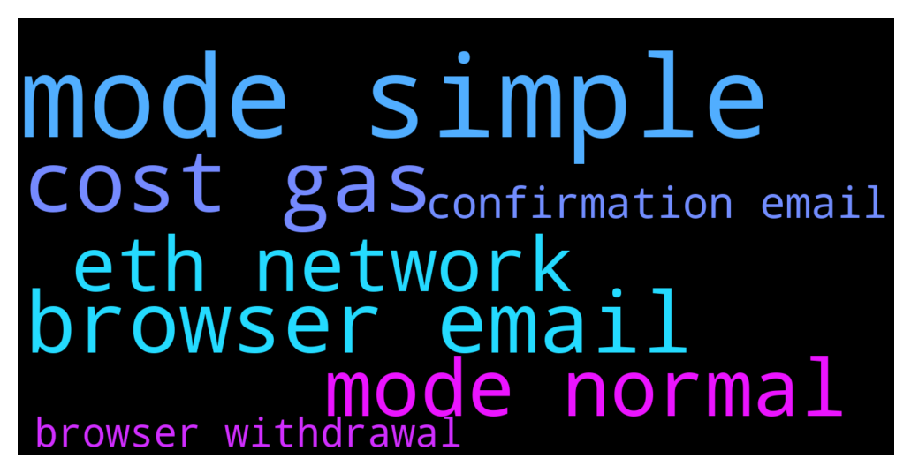

# **@CakeDeFi_EN**
 ## Analysis for **2021-12-09** - **2021-12-10**.

---

## 📊 **Basic Stats**

**n_messages_sent**: 977

---

---

## 🔝 **Top keywords and related messages**

1. **mode simple**

    @moneydelics --- *Made a super simple step by step tutorial!  Hope it helps  https://m.youtube.com/watch?v=D_98N4jx0fo&feature=youtu.be* **--->** [TG Discussion](https://t.me/CakeDeFi_EN/150513)

    @moneydelics --- *Not sure if that's what you mean, but made a super simple step by step tutorial for new comers on Cake DeFi!  Let me know if it helps  https://m.youtube.com/watch?v=D_98N4jx0fo&feature=youtu.be* **--->** [TG Discussion](https://t.me/CakeDeFi_EN/150576)

    @whyisthis --- *Ah my bad, I meant it's not on simple mode, have enough of both coins to balance but still can't add* **--->** [TG Discussion](https://t.me/CakeDeFi_EN/150566)

    @whyisthis --- *Anyone else having trouble adding small amounts of liquidity mining? I have enough and am in simple mode but can't click add. Just want to add in the rewards back into lm 😪* **--->** [TG Discussion](https://t.me/CakeDeFi_EN/150562)

    @DmgBautista --- *Simple mode is currently not working, maybe tomorrow it is already, but for the moment, under maintenace still. But normal mode works fine!* **--->** [TG Discussion](https://t.me/CakeDeFi_EN/150564)

    @AnalWhale666 --- *When willl  mode be aativated again do we have a estimate? " Simple mode is currently not available. Please try again later"* **--->** [TG Discussion](https://t.me/CakeDeFi_EN/150407)

2. **browser email**

    @fabioandreatta --- *Steps:  1) Login to Cake on your browser 2) make the withdrawal 3) click link in email* **--->** [TG Discussion](https://t.me/CakeDeFi_EN/150751)

    @fabioandreatta --- *The reason for your rejection in stated in the email, please kindly follow the steps there or use a diffrent document   If your proof of address was not accepted, we have an article for you here: https://cake.zendesk.com/hc/en-us/articles/360036036832-Which-documents-are-accepted-as-Proof-of-Address-POA-for-KYC-  There is no need for a discussion here on Telegram* **--->** [TG Discussion](https://t.me/CakeDeFi_EN/150880)

    @fabioandreatta --- *this is wierd, are you using diffrent browsers or a VPN, try on your computer or on a diffrent phone. It is currently working* **--->** [TG Discussion](https://t.me/CakeDeFi_EN/150759)

    @fabioandreatta --- *You need to login first. In your browser for it to work* **--->** [TG Discussion](https://t.me/CakeDeFi_EN/150749)

    @Dcshel --- *cake updates rewards every 12 hours. plus you can then look at your transactions list and you get a weekly email.  It's a really nice service. ( on the Defichain DEX wallets it's updated every block so almost continuously.  but without all the nice simple reporting or auto staking of rewards)* **--->** [TG Discussion](https://t.me/CakeDeFi_EN/150433)

    @nadastropovic --- *yeah i did multiple time, then i get a cancelled withdrawal email* **--->** [TG Discussion](https://t.me/CakeDeFi_EN/150750)

3. **cost gas**

    @Dcshel --- *when I created a USDC wallet a couple days ago on Cake it cost me like $25 or so, but it can vary based on ETH gas prices* **--->** [TG Discussion](https://t.me/CakeDeFi_EN/150411)

    @Cosmic88 --- *BTC is my sweetheart too. You can lend out your eth for now until the gas fees get cheaper.* **--->** [TG Discussion](https://t.me/CakeDeFi_EN/150980)

    @Ru --- *Ethereum gas fee can be very high and has nothing to do with Cake. So indeed there is no fee for depositing but there is no way around the standard Ethereum gas fee.* **--->** [TG Discussion](https://t.me/CakeDeFi_EN/149525)

    @DmgBautista --- *Yes, still, considering I only take small lending values to cover fees sometimes for larger investments, the gas cost gets expensive for the value 😅 I do not want to sell DFI to cover transactions, I believe it will pump way more than ethereum for the next months 😅 And BTC is also my sweethearth, dont want to sell any. What can a guy do? 😅* **--->** [TG Discussion](https://t.me/CakeDeFi_EN/150976)

    @John --- *Sadly The 130 USDC is permanent  on your website, when one finally finds it hidden away in the FAQs so if it was eth gas fee it would change, its not, its a non transparent fixed charge.* **--->** [TG Discussion](https://t.me/CakeDeFi_EN/149529)

    @DmgBautista --- *Yes, it was 25$ before the ETH pumping. After started pumping, the gas cost increased hugely and ethereum network is charging way more now. Its impossible to predict these fees, therefore they have to be dynamic and reviewed constantly. Buying and selling on ethereum network currently is highly expensive. I myself am not selling any ETH now due to that.* **--->** [TG Discussion](https://t.me/CakeDeFi_EN/150968)

4. **mode normal**

    @whyisthis --- *Ah my bad, I meant it's not on simple mode, have enough of both coins to balance but still can't add* **--->** [TG Discussion](https://t.me/CakeDeFi_EN/150566)

    @whyisthis --- *Anyone else having trouble adding small amounts of liquidity mining? I have enough and am in simple mode but can't click add. Just want to add in the rewards back into lm 😪* **--->** [TG Discussion](https://t.me/CakeDeFi_EN/150562)

    @DmgBautista --- *Simple mode is currently not working, maybe tomorrow it is already, but for the moment, under maintenace still. But normal mode works fine!* **--->** [TG Discussion](https://t.me/CakeDeFi_EN/150564)

    @AnalWhale666 --- *When willl  mode be aativated again do we have a estimate? " Simple mode is currently not available. Please try again later"* **--->** [TG Discussion](https://t.me/CakeDeFi_EN/150407)

    @ratedm2a --- *Any news on when simple mode will start working again?* **--->** [TG Discussion](https://t.me/CakeDeFi_EN/150608)

    @Harry_Backman --- *Any idea when Simple Mode will be available again for Liquidity Mining?* **--->** [TG Discussion](https://t.me/CakeDeFi_EN/150357)

5. **eth network**

    @Dcshel --- *when I created a USDC wallet a couple days ago on Cake it cost me like $25 or so, but it can vary based on ETH gas prices* **--->** [TG Discussion](https://t.me/CakeDeFi_EN/150411)

    @maxxzz89 --- *Did some had issue transfer Eth from external wallet? Sent $138 Eth for $9 on account* **--->** [TG Discussion](https://t.me/CakeDeFi_EN/150922)

    @AnalWhale666 --- *Sweet, and also if i want to start LIQUIDITY FARMING with ethereum pair, do i need to first buy a ethereum wallet for 130$? is that true? i think ive read that somehwhere, if not i will be more than happy to sending some eth over right away and start out.* **--->** [TG Discussion](https://t.me/CakeDeFi_EN/150393)

    @Cosmic88 --- *I remembered that the creation of an Eth address was $25 a few weeks ago. Correct me if I am wrong.* **--->** [TG Discussion](https://t.me/CakeDeFi_EN/150963)

    @Cosmic88 --- *BTC is my sweetheart too. You can lend out your eth for now until the gas fees get cheaper.* **--->** [TG Discussion](https://t.me/CakeDeFi_EN/150980)

    @maxxzz89 --- *$100 for address Fee. So it will not be charged again for ETH transfer?* **--->** [TG Discussion](https://t.me/CakeDeFi_EN/150939)

6. **confirmation email**

    @fabioandreatta --- *Steps:  1) Login to Cake on your browser 2) make the withdrawal 3) click link in email* **--->** [TG Discussion](https://t.me/CakeDeFi_EN/150751)

    @fabioandreatta --- *The reason for your rejection in stated in the email, please kindly follow the steps there or use a diffrent document   If your proof of address was not accepted, we have an article for you here: https://cake.zendesk.com/hc/en-us/articles/360036036832-Which-documents-are-accepted-as-Proof-of-Address-POA-for-KYC-  There is no need for a discussion here on Telegram* **--->** [TG Discussion](https://t.me/CakeDeFi_EN/150880)

    @Dcshel --- *cake updates rewards every 12 hours. plus you can then look at your transactions list and you get a weekly email.  It's a really nice service. ( on the Defichain DEX wallets it's updated every block so almost continuously.  but without all the nice simple reporting or auto staking of rewards)* **--->** [TG Discussion](https://t.me/CakeDeFi_EN/150433)

    @nadastropovic --- *yeah i did multiple time, then i get a cancelled withdrawal email* **--->** [TG Discussion](https://t.me/CakeDeFi_EN/150750)

    @fabioandreatta --- *The reason for your rejection is stated in the email you received* **--->** [TG Discussion](https://t.me/CakeDeFi_EN/150874)

    @nadastropovic --- *It didn’t work Fabio, after i click the link in the email, i go back to my browser and i have to login again even though i was logged already* **--->** [TG Discussion](https://t.me/CakeDeFi_EN/150758)

7. **browser withdrawal**

    @fabioandreatta --- *Steps:  1) Login to Cake on your browser 2) make the withdrawal 3) click link in email* **--->** [TG Discussion](https://t.me/CakeDeFi_EN/150751)

    @Josiiiiiiiiiiii --- *just a friendly suggestion, but will it be possible for future announcements such as paused withdrawals to be posted on cake platform as well? so that it is easier for users to be aware of what is going on* **--->** [TG Discussion](https://t.me/CakeDeFi_EN/150299)

    @Charlyjaja --- *Not a lot you can do if you cannot determine which is the price at which the swap is going to be executed or when even!!! 👎 Also, is that delayed withdrawals/deposits issue affecting swap duration?? I dont understand how swapping 100usd worth of dfi for dusd with the massive pool it has can take >2h!* **--->** [TG Discussion](https://t.me/CakeDeFi_EN/150287)

    @Hjkhjk8 --- *I created a withdrawal request 11 hours ago, it still hasn't happened?* **--->** [TG Discussion](https://t.me/CakeDeFi_EN/149363)

    @freedfidotcom --- *Deposits and withdrawals have been resumed - everything should be processed quite quickly. Thanks for your patience* **--->** [TG Discussion](https://t.me/CakeDeFi_EN/149711)

    @fabioandreatta --- *this is wierd, are you using diffrent browsers or a VPN, try on your computer or on a diffrent phone. It is currently working* **--->** [TG Discussion](https://t.me/CakeDeFi_EN/150759)

