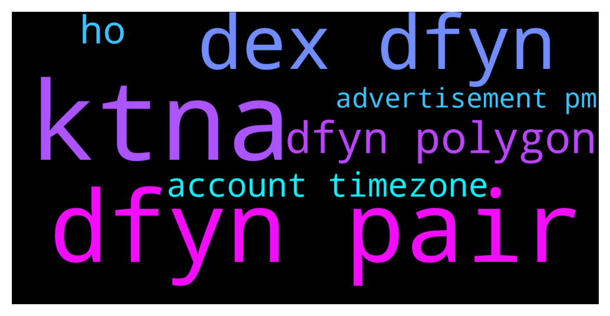

# **@DEXToolsCommunity**
 ## Analysis for **2021-12-08** - **2021-12-10**.

---

## 📊 **Basic Stats**

**n_messages_sent**: 584

---

---

## 🔝 **Top keywords and related messages**

1. **ktna**

    @sertezx --- *Ktna mst etc* **--->** [TG Discussion](https://t.me/DEXToolsCommunity/311078)

    @Teeyang99 --- *I bought KTNA. And then I was blacklisted. I am forced to not be able to sell KTNA.* **--->** [TG Discussion](https://t.me/DEXToolsCommunity/311531)

    @Teeyang99 --- *I repeat is only 1 KTNA token. Before that I was still trading. And now. my friend still deals with it. I still trade it with another token. very normal operation.* **--->** [TG Discussion](https://t.me/DEXToolsCommunity/311526)

    @Teeyang99 --- *I still cannot trade KTNA. And banned on the blacklist. You guys didn't respond and ignored my request for support. I waited for you for 3-4 days. About 96 Hours. And you don't want to support me. very sad and disappointing.* **--->** [TG Discussion](https://t.me/DEXToolsCommunity/311527)

2. **dfyn pair**

    @ETH_Validator --- *Actually I don't see any coins data on Dfyn Dex showing up..* **--->** [TG Discussion](https://t.me/DEXToolsCommunity/311336)

    @hmk18990 --- *it means devs should check your pair 😊* **--->** [TG Discussion](https://t.me/DEXToolsCommunity/310679)

    @stanes --- *So obviously this Dextools doesn't find this pair. I am sending that to the devs, they will fix it asap. We are supposed to show all the pairs on Dfyn (Polygon side), if you find some other ones with an issue, please let us know. Thank you for reporting 👍* **--->** [TG Discussion](https://t.me/DEXToolsCommunity/311335)

    @stanes --- *If you look for a pair on Dfyn on Polygon, you will find it.* **--->** [TG Discussion](https://t.me/DEXToolsCommunity/311323)

    @stanes --- *We already have Dfyn on Polygon sir.* **--->** [TG Discussion](https://t.me/DEXToolsCommunity/311321)

    @stanes --- *This is indeed strange, but Dfyn is supposed to be supported for all the pairs, let me have a deeper look.* **--->** [TG Discussion](https://t.me/DEXToolsCommunity/311333)

3. **dex dfyn**

    @ETH_Validator --- *Actually I don't see any coins data on Dfyn Dex showing up..* **--->** [TG Discussion](https://t.me/DEXToolsCommunity/311336)

    @stanes --- *So obviously this Dextools doesn't find this pair. I am sending that to the devs, they will fix it asap. We are supposed to show all the pairs on Dfyn (Polygon side), if you find some other ones with an issue, please let us know. Thank you for reporting 👍* **--->** [TG Discussion](https://t.me/DEXToolsCommunity/311335)

    @stanes --- *We already have Dfyn on Polygon sir.* **--->** [TG Discussion](https://t.me/DEXToolsCommunity/311321)

    @stanes --- *If you look for a pair on Dfyn on Polygon, you will find it.* **--->** [TG Discussion](https://t.me/DEXToolsCommunity/311323)

    @stanes --- *This is indeed strange, but Dfyn is supposed to be supported for all the pairs, let me have a deeper look.* **--->** [TG Discussion](https://t.me/DEXToolsCommunity/311333)

    @ETH_Validator --- *Its taking from Quickswap and not Dfyn* **--->** [TG Discussion](https://t.me/DEXToolsCommunity/311329)

4. **dfyn polygon**

    @ETH_Validator --- *Actually I don't see any coins data on Dfyn Dex showing up..* **--->** [TG Discussion](https://t.me/DEXToolsCommunity/311336)

    @stanes --- *So obviously this Dextools doesn't find this pair. I am sending that to the devs, they will fix it asap. We are supposed to show all the pairs on Dfyn (Polygon side), if you find some other ones with an issue, please let us know. Thank you for reporting 👍* **--->** [TG Discussion](https://t.me/DEXToolsCommunity/311335)

    @stanes --- *If you look for a pair on Dfyn on Polygon, you will find it.* **--->** [TG Discussion](https://t.me/DEXToolsCommunity/311323)

    @stanes --- *We already have Dfyn on Polygon sir.* **--->** [TG Discussion](https://t.me/DEXToolsCommunity/311321)

    @stanes --- *This is indeed strange, but Dfyn is supposed to be supported for all the pairs, let me have a deeper look.* **--->** [TG Discussion](https://t.me/DEXToolsCommunity/311333)

    @ETH_Validator --- *Its taking from Quickswap and not Dfyn* **--->** [TG Discussion](https://t.me/DEXToolsCommunity/311329)

5. **ho**

    @napascual --- *Not goong to discuss amymore about it. Feel free to share your thoughts in https://t.me/DEXTtraderslounge* **--->** [TG Discussion](https://t.me/DEXToolsCommunity/310721)

    @biggiesmalls5001 --- *This should show 800+ holders but dextools shows 478 does an admin here need to update it?   https://www.dextools.io/app/bsc/pair-explorer/0x5d9b8b85fc542c99be5894ffd4d7352b3ccec382* **--->** [TG Discussion](https://t.me/DEXToolsCommunity/310563)

    @ruganalman --- *Thought so, since I could not find it. I assume it uses web3 to listen for created events from the swap addresses? Either way, how do you rationalize closed source software for an industry/comunity that encourages transparency and decentralization, and discourages obfuscation and moderation? I know it sounds like a rude question, but I am honestly just curious as I too try to develop web3 daps in a largely web2 world.* **--->** [TG Discussion](https://t.me/DEXToolsCommunity/311486)

    @realryanj --- *Do you know how long it will take for the logo to get posted on trust wallet? The required 25k holders and 10k transactions* **--->** [TG Discussion](https://t.me/DEXToolsCommunity/311079)

    @Dannyt6 --- *btw it was indeed missing, as the first 1 hour of the chart history isn't on Dextools but on Poocoin for example, but all good now!* **--->** [TG Discussion](https://t.me/DEXToolsCommunity/310296)

    @VoidInvestor --- *Troubleshooting shouldn't be* **--->** [TG Discussion](https://t.me/DEXToolsCommunity/310797)

6. **account timezone**

    @stanes --- *Sure, please take into account timezones (he is based in Spain).* **--->** [TG Discussion](https://t.me/DEXToolsCommunity/311287)

    @napascual --- *Take into account timezones. It's 1am CET time. Remember admins never dm first* **--->** [TG Discussion](https://t.me/DEXToolsCommunity/311610)

    @napascual --- *Take into account timezones, it's 1.30am CET time* **--->** [TG Discussion](https://t.me/DEXToolsCommunity/311259)

    @gumbercules --- *Smqil that's a scam Frederic account* **--->** [TG Discussion](https://t.me/DEXToolsCommunity/311587)

    @Tore1996 --- *I’m in italy  Have the same timezones i think he reply me later* **--->** [TG Discussion](https://t.me/DEXToolsCommunity/311288)

    @abrahamgoblinhead --- *says it on the old account as well, and on cg/cmc* **--->** [TG Discussion](https://t.me/DEXToolsCommunity/311236)

7. **advertisement pm**

    @D_consul --- *@guillermorodriguez78 check your pm for advertisement* **--->** [TG Discussion](https://t.me/DEXToolsCommunity/311606)

    @D_consul --- *@FredericDEXT ,  @JoeyDieleman check your pm for advertisement purposes. Thanks* **--->** [TG Discussion](https://t.me/DEXToolsCommunity/311608)

    @MadSlav --- *could I send you a screenshot in PM?* **--->** [TG Discussion](https://t.me/DEXToolsCommunity/311135)

    @zenoverseFans --- *Hello, i would like to add our token advertisement on the dex tool advertisement banner. Who should i contact ?* **--->** [TG Discussion](https://t.me/DEXToolsCommunity/310999)

