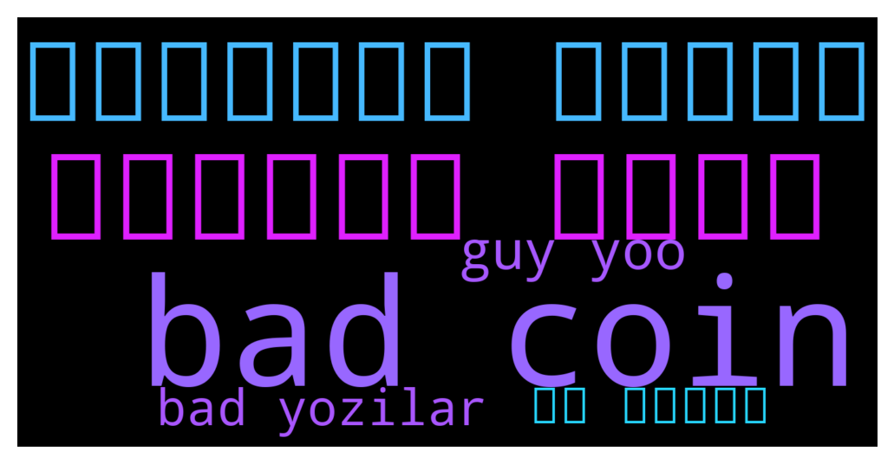

# **@Synthetixi**
 ## Analysis for **2021-12-07** - **2021-12-10**.

---

## 📊 **Basic Stats**

**n_messages_sent**: 132

---

---

## 🔝 **Top keywords and related messages**

1. **bad coin**

    @mryummmm --- *When this worst coin will move all coins move but this worst coin didn't move* **--->** [TG Discussion](https://t.me/Synthetixi/18238)

    @Chi --- *not going to happen, unbonding period is not that bad compared to other chains. It's for security reasons, instant unbonding will be unsafe even with fees.* **--->** [TG Discussion](https://t.me/Synthetixi/18206)

    @mryummmm --- *Dear not fast but I was stuck in this trade from 2 month invest my hole port folio in this coin that's why and also very very slow coin* **--->** [TG Discussion](https://t.me/Synthetixi/18203)

    @tidus75 --- *Hello !  What is the real circulating supply ?  Because there are différent data between Coingecko and Coin Market Cap ?* **--->** [TG Discussion](https://t.me/Synthetixi/18194)

    @mryummmm --- *Worst coin* **--->** [TG Discussion](https://t.me/Synthetixi/18192)

    @mryummmm --- *I BUYED SNX ON 11.7 LAST MONTH NOW ITS ON 5$ 6$ I INVEST 2400$ ON SNX BUT ITS STILL GOING DOWN NO UPWARD MOVEMENT WORST AND VERY SLOW COIN BAD EXP* **--->** [TG Discussion](https://t.me/Synthetixi/18182)

2. **تلگرام گروه**

    @Acdf23459 --- *سلام خوبی؟    من از ممبرزگرام برای زیاد کردن ممبرهای کانال و گروه تلگرام استفاده میکنم. تو هم حتما نصبش کن و با وارد کردن این کد دعوت، سکه رایگان بگیر و باش ممبر سفارش بده.    کد دعوت: 641129218   از اینجا دانلود کن :   https://cutt.ly/mmbrs_play* **--->** [TG Discussion](https://t.me/Synthetixi/18240)

3. **استفاده میکنم**

    @Acdf23459 --- *سلام خوبی؟    من از ممبرزگرام برای زیاد کردن ممبرهای کانال و گروه تلگرام استفاده میکنم. تو هم حتما نصبش کن و با وارد کردن این کد دعوت، سکه رایگان بگیر و باش ممبر سفارش بده.    کد دعوت: 641129218   از اینجا دانلود کن :   https://cutt.ly/mmbrs_play* **--->** [TG Discussion](https://t.me/Synthetixi/18240)

4. **guy yoo**

    @Ericksonmod --- *Yoo guys* **--->** [TG Discussion](https://t.me/Synthetixi/18242)

    @Thomas --- *You're the fast money type of guy😂* **--->** [TG Discussion](https://t.me/Synthetixi/18198)

    @Daniels --- *Hey guys! Got a silly question ) so I set up my Metamask for Synthetix mainnet and was looking to send some Synthetix there, it’s just the same address as my ETH account, right?* **--->** [TG Discussion](https://t.me/Synthetixi/18175)

    @Moira --- *Guys I have 2 stackes in different nodes and both stakes have different amount of Synthetix but somehow both nodes give me exactly 0.19 Synthetix rewards. How is that possible?* **--->** [TG Discussion](https://t.me/Synthetixi/18131)

    @Mohammed --- *Hi guys I am new to Synthetix. Havent staked yet. Just bought and ready to move my funds off the exchange.  Before I do that, I wanted to understand a few things. A) on the link provided about staking it says  You need to have your funds on the main Ethereum network in order to delegate your tokens.  Question. Is the MEW wallet connected to metamask okay to use?* **--->** [TG Discussion](https://t.me/Synthetixi/18124)

    @Chong --- *Hi guys, I sent some EASY tokens from within the Synthetix Mainnet to my Binance wallet, but nothing ever showed up.  The transaction states everything was successful.  any ideas ?* **--->** [TG Discussion](https://t.me/Synthetixi/18091)

5. **bad yozilar**

    @mryummmm --- *When this worst coin will move all coins move but this worst coin didn't move* **--->** [TG Discussion](https://t.me/Synthetixi/18238)

    @<UNK> --- *Bioda bomba guruh bor kirib lic yozilar👻❤️* **--->** [TG Discussion](https://t.me/Synthetixi/18236)

    @Chi --- *not going to happen, unbonding period is not that bad compared to other chains. It's for security reasons, instant unbonding will be unsafe even with fees.* **--->** [TG Discussion](https://t.me/Synthetixi/18206)

    @mryummmm --- *Worst coin* **--->** [TG Discussion](https://t.me/Synthetixi/18192)

    @mryummmm --- *I BUYED SNX ON 11.7 LAST MONTH NOW ITS ON 5$ 6$ I INVEST 2400$ ON SNX BUT ITS STILL GOING DOWN NO UPWARD MOVEMENT WORST AND VERY SLOW COIN BAD EXP* **--->** [TG Discussion](https://t.me/Synthetixi/18182)

6. **از اینجا**

    @Acdf23459 --- *سلام خوبی؟    من از ممبرزگرام برای زیاد کردن ممبرهای کانال و گروه تلگرام استفاده میکنم. تو هم حتما نصبش کن و با وارد کردن این کد دعوت، سکه رایگان بگیر و باش ممبر سفارش بده.    کد دعوت: 641129218   از اینجا دانلود کن :   https://cutt.ly/mmbrs_play* **--->** [TG Discussion](https://t.me/Synthetixi/18240)

