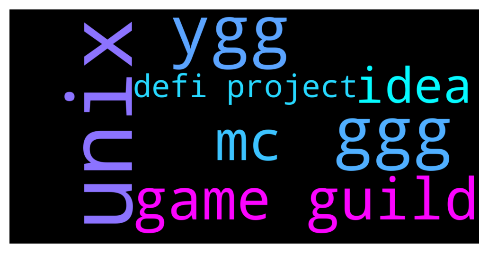

# **@de_fi**
 ## Analysis for **2021-12-09** - **2021-12-10**.

---

## 📊 **Basic Stats**

**n_messages_sent**: 93

---

---

## 🔝 **Top keywords and related messages**

1. **unix**

    @SB031519 --- *Guilds and their Market Cap.   ➡️ Yield Guild Games YGG - $552m (4,700 scholars) DAO gets 10% ➡️ Merit Circle MC - $417m (1,200 scholars) DAO gets 20% ➡️ Good Guild Games GGG - $19m (300 scholars?) DAO gets 20% ➡️ UniX Gaming UniX - $50m (600 scholars) UniX DAO gets 20% ➡️ 𝗔𝘀𝘁𝗿𝗮 𝗚𝘂𝗶𝗹𝗱 𝗩𝗲𝗻𝘁𝘂𝗿𝗲𝘀 𝗔𝗚𝗩  - $6m (2,035 scholars) AGV DAO gets 20%  YGG - 1B Token - $8 MC - 1B Token - $9 GGG - 100m Token - $12 UniX - 1B Token - $1.4  🇦 🇬 🇻  - 2B Token - $?? But in public sale on Dec. 1-23 it's only $0.2 Unbelievable!!! 🚀🚀🚀* **--->** [TG Discussion](https://t.me/de_fi/230461)

2. **ygg**

    @SB031519 --- *Guilds and their Market Cap.   ➡️ Yield Guild Games YGG - $552m (4,700 scholars) DAO gets 10% ➡️ Merit Circle MC - $417m (1,200 scholars) DAO gets 20% ➡️ Good Guild Games GGG - $19m (300 scholars?) DAO gets 20% ➡️ UniX Gaming UniX - $50m (600 scholars) UniX DAO gets 20% ➡️ 𝗔𝘀𝘁𝗿𝗮 𝗚𝘂𝗶𝗹𝗱 𝗩𝗲𝗻𝘁𝘂𝗿𝗲𝘀 𝗔𝗚𝗩  - $6m (2,035 scholars) AGV DAO gets 20%  YGG - 1B Token - $8 MC - 1B Token - $9 GGG - 100m Token - $12 UniX - 1B Token - $1.4  🇦 🇬 🇻  - 2B Token - $?? But in public sale on Dec. 1-23 it's only $0.2 Unbelievable!!! 🚀🚀🚀* **--->** [TG Discussion](https://t.me/de_fi/230461)

3. **ggg**

    @SB031519 --- *Guilds and their Market Cap.   ➡️ Yield Guild Games YGG - $552m (4,700 scholars) DAO gets 10% ➡️ Merit Circle MC - $417m (1,200 scholars) DAO gets 20% ➡️ Good Guild Games GGG - $19m (300 scholars?) DAO gets 20% ➡️ UniX Gaming UniX - $50m (600 scholars) UniX DAO gets 20% ➡️ 𝗔𝘀𝘁𝗿𝗮 𝗚𝘂𝗶𝗹𝗱 𝗩𝗲𝗻𝘁𝘂𝗿𝗲𝘀 𝗔𝗚𝗩  - $6m (2,035 scholars) AGV DAO gets 20%  YGG - 1B Token - $8 MC - 1B Token - $9 GGG - 100m Token - $12 UniX - 1B Token - $1.4  🇦 🇬 🇻  - 2B Token - $?? But in public sale on Dec. 1-23 it's only $0.2 Unbelievable!!! 🚀🚀🚀* **--->** [TG Discussion](https://t.me/de_fi/230461)

4. **game guild**

    @SB031519 --- *Guilds and their Market Cap.   ➡️ Yield Guild Games YGG - $552m (4,700 scholars) DAO gets 10% ➡️ Merit Circle MC - $417m (1,200 scholars) DAO gets 20% ➡️ Good Guild Games GGG - $19m (300 scholars?) DAO gets 20% ➡️ UniX Gaming UniX - $50m (600 scholars) UniX DAO gets 20% ➡️ 𝗔𝘀𝘁𝗿𝗮 𝗚𝘂𝗶𝗹𝗱 𝗩𝗲𝗻𝘁𝘂𝗿𝗲𝘀 𝗔𝗚𝗩  - $6m (2,035 scholars) AGV DAO gets 20%  YGG - 1B Token - $8 MC - 1B Token - $9 GGG - 100m Token - $12 UniX - 1B Token - $1.4  🇦 🇬 🇻  - 2B Token - $?? But in public sale on Dec. 1-23 it's only $0.2 Unbelievable!!! 🚀🚀🚀* **--->** [TG Discussion](https://t.me/de_fi/230461)

5. **mc**

    @SB031519 --- *Guilds and their Market Cap.   ➡️ Yield Guild Games YGG - $552m (4,700 scholars) DAO gets 10% ➡️ Merit Circle MC - $417m (1,200 scholars) DAO gets 20% ➡️ Good Guild Games GGG - $19m (300 scholars?) DAO gets 20% ➡️ UniX Gaming UniX - $50m (600 scholars) UniX DAO gets 20% ➡️ 𝗔𝘀𝘁𝗿𝗮 𝗚𝘂𝗶𝗹𝗱 𝗩𝗲𝗻𝘁𝘂𝗿𝗲𝘀 𝗔𝗚𝗩  - $6m (2,035 scholars) AGV DAO gets 20%  YGG - 1B Token - $8 MC - 1B Token - $9 GGG - 100m Token - $12 UniX - 1B Token - $1.4  🇦 🇬 🇻  - 2B Token - $?? But in public sale on Dec. 1-23 it's only $0.2 Unbelievable!!! 🚀🚀🚀* **--->** [TG Discussion](https://t.me/de_fi/230461)

6. **idea**

    @brianelders --- *I am working with a DeFi project looking for a CMO ... any idea's please DM me* **--->** [TG Discussion](https://t.me/de_fi/230503)

    @Olga --- *Nice to be here! want to ask u a question about a platform called Quarashi. Is it a great idea to take part ICO now? Kinda tempted* **--->** [TG Discussion](https://t.me/de_fi/230489)

7. **defi project**

    @brianelders --- *I am working with a DeFi project looking for a CMO ... any idea's please DM me* **--->** [TG Discussion](https://t.me/de_fi/230503)

    @I --- *There is a nice DeFi project on Arbitrum (on mainnet since June 2020) with over 1000% APY: https://twitter.com/DatamineM/status/1469130378388832256?s=20* **--->** [TG Discussion](https://t.me/de_fi/230468)

    @Tronix50 --- *I’ve heard nothing but good things about it actually from a lot of people! Very solid project. Easy 100x in the near future.* **--->** [TG Discussion](https://t.me/de_fi/230226)

    @sg --- *a social media? how does this kind of project works?* **--->** [TG Discussion](https://t.me/de_fi/230323)

    @ScamtoshiWensama --- *Scam inu is a crypto that fights against scammers. Funds recovery governance platform, Scam database, DeFi wallet antivirus* **--->** [TG Discussion](https://t.me/de_fi/230457)

    @LetsGoBrandon001 --- *It’s a solid project with a lot of promise.   The team they have created has a lot of smart people with some great connections.   Sister to boost coin if anyone knows about boost.    Meta verse coming,  already have a working swap, and a lot more coming.   Honestly, its my favorite project right now.   Hope you guys at least check it out.  See ya’ll in the meta verse!* **--->** [TG Discussion](https://t.me/de_fi/230225)

