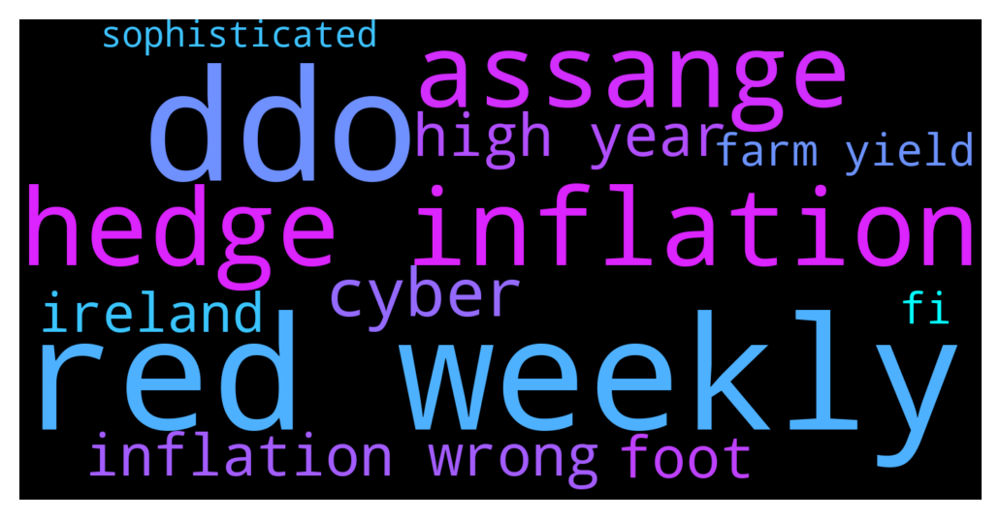

# **@whalepoolbtc**
 ## Analysis for **2021-12-09** - **2021-12-10**.

---

## 📊 **Basic Stats**

**n_messages_sent**: 944

---

---

## 🔝 **Top keywords and related messages**

1. **red weekly**

    @rogerredis --- *Bears working hard to produce 4th red weekly in a row* **--->** [TG Discussion](https://t.me/whalepoolbtc/4078347)

    @hipmeltypikachu --- *most stocks in the red* **--->** [TG Discussion](https://t.me/whalepoolbtc/4077507)

    @ochados --- *transitional state, red > black > green https://twitter.com/ochadosmgmt/status/1465121174858477572?s=20* **--->** [TG Discussion](https://t.me/whalepoolbtc/4077713)

    @MiLostUC --- *Preparing for friday red dildo ?* **--->** [TG Discussion](https://t.me/whalepoolbtc/4077251)

    @InTdev --- *four red weekly in a row - that's quite rare* **--->** [TG Discussion](https://t.me/whalepoolbtc/4078274)

    @SD107 --- *When was the last time btc printed 4 red weekly candles is a raw?* **--->** [TG Discussion](https://t.me/whalepoolbtc/4078373)

2. **ddo**

    @arx_2025 --- *another ddos but claims stayed online* **--->** [TG Discussion](https://t.me/whalepoolbtc/4078086)

    @tg_0S --- *solana claims 50K/s txs and unless they have changed it, how big of a ddos attack are we talking about here?* **--->** [TG Discussion](https://t.me/whalepoolbtc/4078089)

    @arx_2025 --- *they need a greater number of nodes for their centralised network as well as a way to automatically block ddos attempts  not sure of the attack details but would be interested* **--->** [TG Discussion](https://t.me/whalepoolbtc/4078092)

3. **hedge inflation**

    @Saj_le_Great --- *BREAKING: US INFLATION RATE HITS 40-YEAR HIGH* **--->** [TG Discussion](https://t.me/whalepoolbtc/4078217)

    @R0mster --- *BREAKING: Inflation in November rose to 6.8% (y/y) – the highest since 1982.  The US has now experienced six months of over 5% inflation.  Prices are rising across the board: For gas, food, new and used cars and housing (rents)  Join @police_frequency* **--->** [TG Discussion](https://t.me/whalepoolbtc/4078313)

    @arx_2025 --- *basically the high inflation means america can’t afford any more wars  the all mighty dollar isn’t so mighty either so economic sanctions might bite back too  dangerous times* **--->** [TG Discussion](https://t.me/whalepoolbtc/4078246)

    @ApacheSJM --- *Why the rich are buying beach side mansion assets, it's the best inflation hedge out there.* **--->** [TG Discussion](https://t.me/whalepoolbtc/4078323)

    @Painbtc --- *JUST IN - U.S. consumer price inflation jumps 6.8% year over year in November, the largest increase since 1982.  @disclosetv* **--->** [TG Discussion](https://t.me/whalepoolbtc/4078199)

    @Xuvinator --- *@radrandy2k says inflation is good.* **--->** [TG Discussion](https://t.me/whalepoolbtc/4078228)

4. **assange**

    @Painbtc --- *U.K. judges have granted a U.S. request to extradite Julian Assange* **--->** [TG Discussion](https://t.me/whalepoolbtc/4078087)

    @arx_2025 --- *he won’t be freed but “US has given assurances Assange will not be held in a notorious "supermax" jail.”  why not try to recruit him?* **--->** [TG Discussion](https://t.me/whalepoolbtc/4078088)

5. **cyber**

    @Damo_Moo --- *Cyber debt jubilee* **--->** [TG Discussion](https://t.me/whalepoolbtc/4078290)

    @arx_2025 --- *just need a sophisticated cyber attack to shut down the global financial system  unmarked tick box so far* **--->** [TG Discussion](https://t.me/whalepoolbtc/4078258)

    @Painbtc --- *cyber...polygon i believe was the test* **--->** [TG Discussion](https://t.me/whalepoolbtc/4078301)

6. **high year**

    @Saj_le_Great --- *BREAKING: US INFLATION RATE HITS 40-YEAR HIGH* **--->** [TG Discussion](https://t.me/whalepoolbtc/4078217)

    @R0mster --- *BREAKING: Inflation in November rose to 6.8% (y/y) – the highest since 1982.  The US has now experienced six months of over 5% inflation.  Prices are rising across the board: For gas, food, new and used cars and housing (rents)  Join @police_frequency* **--->** [TG Discussion](https://t.me/whalepoolbtc/4078313)

    @arx_2025 --- *basically the high inflation means america can’t afford any more wars  the all mighty dollar isn’t so mighty either so economic sanctions might bite back too  dangerous times* **--->** [TG Discussion](https://t.me/whalepoolbtc/4078246)

    @Painbtc --- *JUST IN - U.S. consumer price inflation jumps 6.8% year over year in November, the largest increase since 1982.  @disclosetv* **--->** [TG Discussion](https://t.me/whalepoolbtc/4078199)

    @Horselorde --- *Seems especially this year there’s a lot more low IQ bears* **--->** [TG Discussion](https://t.me/whalepoolbtc/4077484)

    @rogerredis --- *Or maybe find something from 5 years ago, cause that's all what you can do when you can't accept fact that bears can be right and they can also anticipate upcoming sweeps up* **--->** [TG Discussion](https://t.me/whalepoolbtc/4077592)

7. **inflation wrong**

    @Saj_le_Great --- *BREAKING: US INFLATION RATE HITS 40-YEAR HIGH* **--->** [TG Discussion](https://t.me/whalepoolbtc/4078217)

    @R0mster --- *BREAKING: Inflation in November rose to 6.8% (y/y) – the highest since 1982.  The US has now experienced six months of over 5% inflation.  Prices are rising across the board: For gas, food, new and used cars and housing (rents)  Join @police_frequency* **--->** [TG Discussion](https://t.me/whalepoolbtc/4078313)

    @arx_2025 --- *basically the high inflation means america can’t afford any more wars  the all mighty dollar isn’t so mighty either so economic sanctions might bite back too  dangerous times* **--->** [TG Discussion](https://t.me/whalepoolbtc/4078246)

    @ApacheSJM --- *Why the rich are buying beach side mansion assets, it's the best inflation hedge out there.* **--->** [TG Discussion](https://t.me/whalepoolbtc/4078323)

    @Painbtc --- *JUST IN - U.S. consumer price inflation jumps 6.8% year over year in November, the largest increase since 1982.  @disclosetv* **--->** [TG Discussion](https://t.me/whalepoolbtc/4078199)

    @Xuvinator --- *@radrandy2k says inflation is good.* **--->** [TG Discussion](https://t.me/whalepoolbtc/4078228)

8. **foot**

    @Painbtc --- *no we are a forum that discusses whale watching, did you know that the Humpbacks can grow to 60 feet (18 meters) long, and they can weigh a whopping 40 tons (about half the size of a blue whale), according to the NOAA. Their flippers can grow up to 16 feet (5 m) long, which is the largest appendage in the world. Their tails are also massive and grow up to 18 feet* **--->** [TG Discussion](https://t.me/whalepoolbtc/4078102)

    @ApacheSJM --- *It's like being 5-0 down in a football match, you only lose when the final whistle goes, which for s2f is next halving. Zoomed out correlation accuracy with trend line is good tbf, even if I personally don't believe in it moving forwards as an accurate prediction.* **--->** [TG Discussion](https://t.me/whalepoolbtc/4077903)

9. **ireland**

    @TRotox --- *Don't know about the UK, but Ireland is self declared so it's not an issue unless you are targeted for an audit.* **--->** [TG Discussion](https://t.me/whalepoolbtc/4078176)

    @TRotox --- *Yeah...it's been that way for almost 10 years now since the question was first asked. In Ireland and the UK, crypto investments are treated just the same as any other investment. Germany and Portugal are the best European nations for crypto taxation.* **--->** [TG Discussion](https://t.me/whalepoolbtc/4078171)

10. **farm yield**

    @arbullz --- *ETH blockchain will work as long as there are miners, dapp API infrastructure.. not so much.. what is eth good for if you cant use any defi swaps or farm yield or exchange jpegs* **--->** [TG Discussion](https://t.me/whalepoolbtc/4077096)

    @SD107 --- *I have btc and its making juicy yield in degen farm* **--->** [TG Discussion](https://t.me/whalepoolbtc/4077384)

    @ApacheSJM --- *Soz HMRC I sent my bitcoins to defi farm and got rug pulled, they have all dissapeared* **--->** [TG Discussion](https://t.me/whalepoolbtc/4078172)

    @SD107 --- *You get rekt, and the yield will never cover the losses due to dump* **--->** [TG Discussion](https://t.me/whalepoolbtc/4078304)

    @Hmmmdrop --- *Yield farms count… right?* **--->** [TG Discussion](https://t.me/whalepoolbtc/4078299)

    @SD107 --- *Yeah, yield farm is holding basically* **--->** [TG Discussion](https://t.me/whalepoolbtc/4078303)

11. **fi**

    @arbullz --- *ETH blockchain will work as long as there are miners, dapp API infrastructure.. not so much.. what is eth good for if you cant use any defi swaps or farm yield or exchange jpegs* **--->** [TG Discussion](https://t.me/whalepoolbtc/4077096)

    @arx_2025 --- *just need a sophisticated cyber attack to shut down the global financial system  unmarked tick box so far* **--->** [TG Discussion](https://t.me/whalepoolbtc/4078258)

    @TRotox --- *It's just ass covering really, if I'm ever lucky enough to have to bring home some massive profits, I want to be able to show I'm above board. Unfortunately moving to Belize isn't an option 😭* **--->** [TG Discussion](https://t.me/whalepoolbtc/4078178)

    @hipmeltypikachu --- *BTCUSD has fallen below the yellow fib channel. Daily RSI may hit oversold on another leg down* **--->** [TG Discussion](https://t.me/whalepoolbtc/4077525)

    @TRotox --- *If De-fi charged those rates for borrowing, returns would be amazing.* **--->** [TG Discussion](https://t.me/whalepoolbtc/4078108)

    @aejwj1 --- *Pfizer CEO says fourth Covid vaccine doses may be needed sooner than expected due to omicron* **--->** [TG Discussion](https://t.me/whalepoolbtc/4077781)

12. **sophisticated**

    @KickerBTC --- *We have reason to believe a sophisticated sybil attack is underway amongst the crypto communities, after lots of debate it becoming clear there is some large entity behind it, possibly a government. The goal seems to be attack communities with obvious fake spam & fake accounts to discredit the communities enough that people look for alternative platforms (like discord) and our guess is so it's easier for governments to ID people. Please keep this in mind as we work to combat the problem. We have an idea which will be implemented in the upcoming months that should counter these style of attacks.* **--->** [TG Discussion](https://t.me/whalepoolbtc/4078018)

    @arx_2025 --- *just need a sophisticated cyber attack to shut down the global financial system  unmarked tick box so far* **--->** [TG Discussion](https://t.me/whalepoolbtc/4078258)

