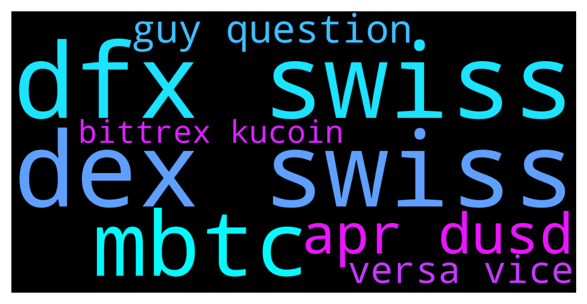

# **@CakeDeFi_EN**
 ## Analysis for **2021-12-10** - **2021-12-11**.

---

## 📊 **Basic Stats**

**n_messages_sent**: 710

---

---

## 🔝 **Top keywords and related messages**

1. **dfx swiss**

    @fabioandreatta --- *DEX and dfx.swiss is working like magic* **--->** [TG Discussion](https://t.me/CakeDeFi_EN/151324)

    @Prateek --- *Oh great so you can transfer from cake defi to dex swiss directly and vice versa...that would negate the use of defichain wallet* **--->** [TG Discussion](https://t.me/CakeDeFi_EN/151452)

    @fabioandreatta --- *DEX or dfx.swiss* **--->** [TG Discussion](https://t.me/CakeDeFi_EN/151051)

    @Prateek --- *Just a quick question guys, does cake allow defi transfer to dex swiss and vice versa?   If anyone can help with the query who has used dex swiss please* **--->** [TG Discussion](https://t.me/CakeDeFi_EN/151419)

    @rhodium219 --- *In the meantime I've had success withdrawing via DFX.swiss and am in the process of checking the depositing end-to-end.* **--->** [TG Discussion](https://t.me/CakeDeFi_EN/151284)

    @ibrahim --- *Dfx swiss how does it work for people ? Is it only people living in Europe or other part of the world's citizens can use it?* **--->** [TG Discussion](https://t.me/CakeDeFi_EN/151430)

2. **dex swiss**

    @fabioandreatta --- *DEX and dfx.swiss is working like magic* **--->** [TG Discussion](https://t.me/CakeDeFi_EN/151324)

    @Joel --- *Oh BTW, buying DFI or the USD through the DEX will give you will pay 1.25 for a dUSD, and $3. something for a DFI. So either way you will lose up to 25% to start off with.* **--->** [TG Discussion](https://t.me/CakeDeFi_EN/151042)

    @Prateek --- *Oh great so you can transfer from cake defi to dex swiss directly and vice versa...that would negate the use of defichain wallet* **--->** [TG Discussion](https://t.me/CakeDeFi_EN/151452)

    @fabioandreatta --- *DEX or dfx.swiss* **--->** [TG Discussion](https://t.me/CakeDeFi_EN/151051)

    @Prateek --- *Just a quick question guys, does cake allow defi transfer to dex swiss and vice versa?   If anyone can help with the query who has used dex swiss please* **--->** [TG Discussion](https://t.me/CakeDeFi_EN/151419)

    @rhodium219 --- *In the meantime I've had success withdrawing via DFX.swiss and am in the process of checking the depositing end-to-end.* **--->** [TG Discussion](https://t.me/CakeDeFi_EN/151284)

3. **mbtc**

    @Albertlong922 --- *Does cake accept mBTC* **--->** [TG Discussion](https://t.me/CakeDeFi_EN/151379)

    @Albertlong922 --- *Anyone know anywhere to put mBTC anymo??* **--->** [TG Discussion](https://t.me/CakeDeFi_EN/151394)

    @Albertlong922 --- *Are there fees on the cake app to deposit mBTC from an outside wallet?* **--->** [TG Discussion](https://t.me/CakeDeFi_EN/151372)

4. **apr dusd**

    @Seanrko89 --- *I am interested in dPLTR-DUSD pool as well but it was one of the last few to enter. Read these 2 articles to understand the risk of LM. Defichain is very transparent in educating us. https://blog.defichain.com/3-key-strategies-to-maximize-your-return/  https://blog.defichain.com/5-secret-insider-tactics/* **--->** [TG Discussion](https://t.me/CakeDeFi_EN/150909)

    @Artur --- *I'm a bit confused about these 450% (now already 210%) APR rate which promising actually a lot but after 4 days of investing 250 USD in the dUSD - DFI pool i have 0.042 DFI and 0.15 dUSD as rewards 👀... 450/365*4= 4,93% right? What did i miss in my calculations???* **--->** [TG Discussion](https://t.me/CakeDeFi_EN/150482)

    @Marv --- *But the rewards are much to low only 2 $ for 2,2 k invest in dtsla-dusd that is much to low* **--->** [TG Discussion](https://t.me/CakeDeFi_EN/150353)

    @Albert --- *dTSLA-DUSD is 350% APR* **--->** [TG Discussion](https://t.me/CakeDeFi_EN/151368)

    @Charlyjaja --- *Swaps are taking forever. I have been trying to exchange DFI for DUSD and it's been already 2 hours. Dreadful* **--->** [TG Discussion](https://t.me/CakeDeFi_EN/150255)

    @edwin🙇🏻‍♂️ --- *just want to understand more about impermanent loss. for the dusd-dfi pair, if the dfi outperforms dusd, the impermanent loss will get larger?* **--->** [TG Discussion](https://t.me/CakeDeFi_EN/150664)

5. **guy question**

    @C --- *Hey guys. Is usdc / Dfi worth liquidity mining with impermanent loss? Since usdc is stable and Dfi can go up or down. Does this create larger impermanent loss. Anyone whose doing it already let me know!* **--->** [TG Discussion](https://t.me/CakeDeFi_EN/151029)

    @Juan --- *This doesn’t answer my question* **--->** [TG Discussion](https://t.me/CakeDeFi_EN/150902)

    @Prateek --- *Just a quick question guys, does cake allow defi transfer to dex swiss and vice versa?   If anyone can help with the query who has used dex swiss please* **--->** [TG Discussion](https://t.me/CakeDeFi_EN/151419)

    @kompyka407 --- *Hi guys. There is any exchange where I can deposit DFI!?* **--->** [TG Discussion](https://t.me/CakeDeFi_EN/151158)

    @DmgBautista --- *Yes, still, considering I only take small lending values to cover fees sometimes for larger investments, the gas cost gets expensive for the value 😅 I do not want to sell DFI to cover transactions, I believe it will pump way more than ethereum for the next months 😅 And BTC is also my sweethearth, dont want to sell any. What can a guy do? 😅* **--->** [TG Discussion](https://t.me/CakeDeFi_EN/150976)

    @Albertlong922 --- *And thank you guys for all of your patience with me and all my questions haa* **--->** [TG Discussion](https://t.me/CakeDeFi_EN/150559)

6. **versa vice**

    @Prateek --- *Oh great so you can transfer from cake defi to dex swiss directly and vice versa...that would negate the use of defichain wallet* **--->** [TG Discussion](https://t.me/CakeDeFi_EN/151452)

    @Prateek --- *Just a quick question guys, does cake allow defi transfer to dex swiss and vice versa?   If anyone can help with the query who has used dex swiss please* **--->** [TG Discussion](https://t.me/CakeDeFi_EN/151419)

    @Prateek --- *Just a quick question guys, does cake allow defi transfer to dex swiss and vice versa?* **--->** [TG Discussion](https://t.me/CakeDeFi_EN/151412)

7. **bittrex kucoin**

    @Dcshel --- *Step in right direction !!❤️ Now if we can only get Kucoin, Bitrue and other CEX's to get theirs working... without them Defichain is at a growth stop.* **--->** [TG Discussion](https://t.me/CakeDeFi_EN/150850)

    @BerndMack --- *The Cake group is the wrong group for defichain issues and the defichain group would also be the wrong group for Kucoin. You can find more exchanges on coinmarketcap. Whether they are also in maintenance I can not say.* **--->** [TG Discussion](https://t.me/CakeDeFi_EN/150802)

    @ibrahim --- *Hello everyone, anyone knows when will deposit and withdrawal services on other exchanges like kucoin hotbit start? They say network update and all deposit and withdrawal services disabled.* **--->** [TG Discussion](https://t.me/CakeDeFi_EN/151070)

    @fabioandreatta --- *Yes KuCoin is under maintenance, same as Cake was yesterday, just that KuCoin needs longer to repopen because they need to upgrade first and then do a full reindex, takes at least 24 hours, maybe much longer. They will take their time to reopen, same goes for other exchanges like Bittrex. Cake uses a snapshot so we are back online in no-time* **--->** [TG Discussion](https://t.me/CakeDeFi_EN/150769)

    @jezzkng --- *Best to buy via exchange  Kucoin or Bittrex* **--->** [TG Discussion](https://t.me/CakeDeFi_EN/151221)

    @Roland --- *Same for kucoin* **--->** [TG Discussion](https://t.me/CakeDeFi_EN/150420)

