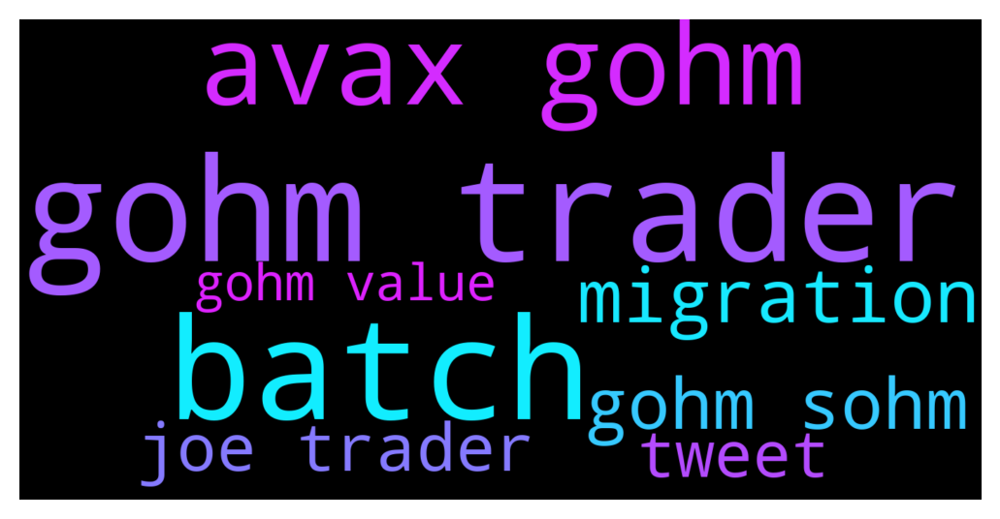

# **@OlympusTG**
 ## Analysis for **2021-12-10** - **2021-12-11**.

---

## 📊 **Basic Stats**

**n_messages_sent**: 1127

---

---

## 🔝 **Top keywords and related messages**

1. **gohm trader**

    @Ras --- *Farming my gOhm on Trader Joe's,  earning more gOhm + Joe  then stake the Joe to earn more Joe  all the while receiving 3 rebases a day.Already earned back the few hundred gas to convert...cheers* **--->** [TG Discussion](https://t.me/OlympusTG/113412)

    @ln_guy --- *The easiest and cheapest now is to buy gOhm at Trader Joe on Avalanche because gOhm is governance Ohm that is already staked and collecting interest.* **--->** [TG Discussion](https://t.me/OlympusTG/113366)

    @DurianCapital --- *Can I clarify - purchasing gOHM is available on other chains such as avalanche and they receiving the compounding effects like sOHM and it is reflected in the price? Would this be the cheapest way to get more OHM because of gas?* **--->** [TG Discussion](https://t.me/OlympusTG/112539)

    @alpida --- *thanks, so i just buy gOHM on avax and keep it nothing else, right?* **--->** [TG Discussion](https://t.me/OlympusTG/113698)

    @theMagicUnicorn --- *dont forget that many forks have ohm or gohm in their treasury* **--->** [TG Discussion](https://t.me/OlympusTG/113244)

    @Poopoo --- *if you purchased gOHM no action is required, gOHM is already staked* **--->** [TG Discussion](https://t.me/OlympusTG/113455)

2. **batch**

    @Omar_Ashanti --- *I have been staking for a while and now I want to stake a new batch* **--->** [TG Discussion](https://t.me/OlympusTG/113600)

    @Omar_Ashanti --- *Should ı use another wallet for the new batch ?* **--->** [TG Discussion](https://t.me/OlympusTG/113602)

    @Omar_Ashanti --- *Does yield reset for the older staked batch If staked at the same wallet ?* **--->** [TG Discussion](https://t.me/OlympusTG/113601)

    @Omar_Ashanti --- *I think that's the beauty of OHM ! New batch will get the same yield of older staked batch !!??* **--->** [TG Discussion](https://t.me/OlympusTG/113613)

3. **avax gohm**

    @Ras --- *Farming my gOhm on Trader Joe's,  earning more gOhm + Joe  then stake the Joe to earn more Joe  all the while receiving 3 rebases a day.Already earned back the few hundred gas to convert...cheers* **--->** [TG Discussion](https://t.me/OlympusTG/113412)

    @ln_guy --- *The easiest and cheapest now is to buy gOhm at Trader Joe on Avalanche because gOhm is governance Ohm that is already staked and collecting interest.* **--->** [TG Discussion](https://t.me/OlympusTG/113366)

    @DurianCapital --- *Can I clarify - purchasing gOHM is available on other chains such as avalanche and they receiving the compounding effects like sOHM and it is reflected in the price? Would this be the cheapest way to get more OHM because of gas?* **--->** [TG Discussion](https://t.me/OlympusTG/112539)

    @alpida --- *thanks, so i just buy gOHM on avax and keep it nothing else, right?* **--->** [TG Discussion](https://t.me/OlympusTG/113698)

    @theMagicUnicorn --- *dont forget that many forks have ohm or gohm in their treasury* **--->** [TG Discussion](https://t.me/OlympusTG/113244)

    @Poopoo --- *if you purchased gOHM no action is required, gOHM is already staked* **--->** [TG Discussion](https://t.me/OlympusTG/113455)

4. **migration**

    @f. I. r --- *I've just realized that we need to withdraw our 33T due the v2 Migration. Is there any deadline when the withdrawal must be made and will it autostake?* **--->** [TG Discussion](https://t.me/OlympusTG/112066)

    @defimaster4 --- *You have to perform migration of tokens from V1 to V2. Please read the tweet below for important points:  https://twitter.com/galaxybchain/status/1469130313615896577?t=hK2OX12Bez_1SKzbG9gzaA&s=19* **--->** [TG Discussion](https://t.me/OlympusTG/113344)

    @Poopoo --- *FOHMO event on the 10th and 12th UTC time, migration to V2 ongoing* **--->** [TG Discussion](https://t.me/OlympusTG/112557)

    @TurboLaserClip --- *but docs said i hav e2 month of migration and medium says "you will have a window of ~2 months to migrate without missing rewards. After this window, you can still migrate; however, some rewards will be forfeited."* **--->** [TG Discussion](https://t.me/OlympusTG/112673)

    @defimaster4 --- *I've made a tweet thread on OHM V2 migration, kindly give it some love, please. 🙏  https://twitter.com/galaxybchain/status/1469130313615896577?t=CClwNMQZ9GEFxhAYYcfBQg&s=19* **--->** [TG Discussion](https://t.me/OlympusTG/113131)

    @dubpIuris --- *What do we need to do for the V2 migration* **--->** [TG Discussion](https://t.me/OlympusTG/113801)

5. **gohm sohm**

    @Ras --- *Farming my gOhm on Trader Joe's,  earning more gOhm + Joe  then stake the Joe to earn more Joe  all the while receiving 3 rebases a day.Already earned back the few hundred gas to convert...cheers* **--->** [TG Discussion](https://t.me/OlympusTG/113412)

    @ln_guy --- *The easiest and cheapest now is to buy gOhm at Trader Joe on Avalanche because gOhm is governance Ohm that is already staked and collecting interest.* **--->** [TG Discussion](https://t.me/OlympusTG/113366)

    @DurianCapital --- *Can I clarify - purchasing gOHM is available on other chains such as avalanche and they receiving the compounding effects like sOHM and it is reflected in the price? Would this be the cheapest way to get more OHM because of gas?* **--->** [TG Discussion](https://t.me/OlympusTG/112539)

    @alpida --- *thanks, so i just buy gOHM on avax and keep it nothing else, right?* **--->** [TG Discussion](https://t.me/OlympusTG/113698)

    @theMagicUnicorn --- *dont forget that many forks have ohm or gohm in their treasury* **--->** [TG Discussion](https://t.me/OlympusTG/113244)

    @Poopoo --- *if you purchased gOHM no action is required, gOHM is already staked* **--->** [TG Discussion](https://t.me/OlympusTG/113455)

6. **joe trader**

    @Ras --- *Farming my gOhm on Trader Joe's,  earning more gOhm + Joe  then stake the Joe to earn more Joe  all the while receiving 3 rebases a day.Already earned back the few hundred gas to convert...cheers* **--->** [TG Discussion](https://t.me/OlympusTG/113412)

    @ln_guy --- *The easiest and cheapest now is to buy gOhm at Trader Joe on Avalanche because gOhm is governance Ohm that is already staked and collecting interest.* **--->** [TG Discussion](https://t.me/OlympusTG/113366)

    @ln_guy --- *You can swap wsOhm to gOhm on Trader Joe on Avax. I did it two days ago. Also, a lot of liquidity in now available for the AVAX-gOhm pair, it was over 8 miilion two days ago.* **--->** [TG Discussion](https://t.me/OlympusTG/112766)

    @Tigergold --- *I purchased some gOHM on trader Joe. Any clues on how I get that to sOHM and stake? Any help appreciated.* **--->** [TG Discussion](https://t.me/OlympusTG/113345)

    @Poopoo --- *Buy gOHM on trader joe (AVAX) gOHM contract address on AVAX: 0x321e7092a180bb43555132ec53aaa65a5bf84251  What is gOHM: https://twitter.com/OlympusDAO/status/1465410905542385677  gOHM documentation: https://docs.olympusdao.finance/main/contracts/tokens#gohm  gohm does not increase, gohm x current index = sohm, current index increases every rebase, you can find current index on the dashboard of the olympus dapp, and check your equivalent number of sOHM when you access the Olympus dapp through the AVAX Network* **--->** [TG Discussion](https://t.me/OlympusTG/113204)

    @defimaster4 --- *This is the right advice. If you are new to OHM, just go and buy gOHM. It's V2 ready and because it's a staked token, you can enjoy rebase rewards just by holding gOHM. If you use Trader Joe at Avalanche to buy it, you can also save eth transaction fees.* **--->** [TG Discussion](https://t.me/OlympusTG/113367)

7. **tweet**

    @defimaster4 --- *gOHM won't change in balance. But its underlying value change every 8hrs (after each rebases).  To calculate gOHM price/value:  gOHM price = OHMprice * Current Index  Read the tweet below for more info about gOHM!👍   https://twitter.com/OlympusDAO/status/1465410905542385677?t=TwKE_dgwRH9VAIt1HD7Avg&s=19* **--->** [TG Discussion](https://t.me/OlympusTG/113350)

    @defimaster4 --- *You need to learn about how ohm works first. I recommend that you study the ohm documentations. As for gOHM, the below tweet is pretty good.👍  https://twitter.com/OlympusDAO/status/1465410905542385677?t=ppZMP9wk76iYDKsoQ5RO7A&s=09* **--->** [TG Discussion](https://t.me/OlympusTG/113372)

    @defimaster4 --- *You have to perform migration of tokens from V1 to V2. Please read the tweet below for important points:  https://twitter.com/galaxybchain/status/1469130313615896577?t=hK2OX12Bez_1SKzbG9gzaA&s=19* **--->** [TG Discussion](https://t.me/OlympusTG/113344)

    @defimaster4 --- *Please read the below tweet. It's one of the BEST tweets on OHM that I've ever read!👍💯  https://twitter.com/ishaheen10/status/1468011639278428161?t=x_l-Er-3iXvQo7JyZinMkg&s=19* **--->** [TG Discussion](https://t.me/OlympusTG/113374)

    @defimaster4 --- *I've made a tweet thread on OHM V2 migration, kindly give it some love, please. 🙏  https://twitter.com/galaxybchain/status/1469130313615896577?t=CClwNMQZ9GEFxhAYYcfBQg&s=19* **--->** [TG Discussion](https://t.me/OlympusTG/113131)

    @bike4peace --- *See the image in the tweet* **--->** [TG Discussion](https://t.me/OlympusTG/112292)

8. **gohm value**

    @Ras --- *Farming my gOhm on Trader Joe's,  earning more gOhm + Joe  then stake the Joe to earn more Joe  all the while receiving 3 rebases a day.Already earned back the few hundred gas to convert...cheers* **--->** [TG Discussion](https://t.me/OlympusTG/113412)

    @ln_guy --- *The easiest and cheapest now is to buy gOhm at Trader Joe on Avalanche because gOhm is governance Ohm that is already staked and collecting interest.* **--->** [TG Discussion](https://t.me/OlympusTG/113366)

    @DurianCapital --- *Can I clarify - purchasing gOHM is available on other chains such as avalanche and they receiving the compounding effects like sOHM and it is reflected in the price? Would this be the cheapest way to get more OHM because of gas?* **--->** [TG Discussion](https://t.me/OlympusTG/112539)

    @alpida --- *thanks, so i just buy gOHM on avax and keep it nothing else, right?* **--->** [TG Discussion](https://t.me/OlympusTG/113698)

    @theMagicUnicorn --- *dont forget that many forks have ohm or gohm in their treasury* **--->** [TG Discussion](https://t.me/OlympusTG/113244)

    @Poopoo --- *if you purchased gOHM no action is required, gOHM is already staked* **--->** [TG Discussion](https://t.me/OlympusTG/113455)

