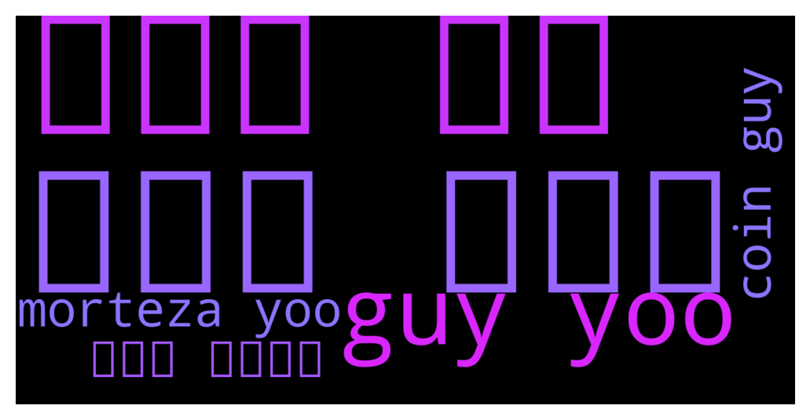

# **@Synthetixi**
 ## Analysis for **2021-12-08** - **2021-12-11**.

---

## 📊 **Basic Stats**

**n_messages_sent**: 107

---

---

## 🔝 **Top keywords and related messages**

1. **ارز اگه**

    @Ndnskaqoan --- *اگه ارز NEAR رو خرید زدید استاپش رو میتونید 8.90 بذارید و نگهدارید هنوز و روی 11.4 سیو سود کنید* **--->** [TG Discussion](https://t.me/Synthetixi/18255)

2. **ارز رو**

    @Ndnskaqoan --- *اگه ارز NEAR رو خرید زدید استاپش رو میتونید 8.90 بذارید و نگهدارید هنوز و روی 11.4 سیو سود کنید* **--->** [TG Discussion](https://t.me/Synthetixi/18255)

3. **guy yoo**

    @Ericksonmod --- *Yoo guys* **--->** [TG Discussion](https://t.me/Synthetixi/18242)

    @Thomas --- *You're the fast money type of guy😂* **--->** [TG Discussion](https://t.me/Synthetixi/18198)

    @Daniels --- *Hey guys! Got a silly question ) so I set up my Metamask for Synthetix mainnet and was looking to send some Synthetix there, it’s just the same address as my ETH account, right?* **--->** [TG Discussion](https://t.me/Synthetixi/18175)

    @Moira --- *Guys I have 2 stackes in different nodes and both stakes have different amount of Synthetix but somehow both nodes give me exactly 0.19 Synthetix rewards. How is that possible?* **--->** [TG Discussion](https://t.me/Synthetixi/18131)

    @Mohammed --- *Hi guys I am new to Synthetix. Havent staked yet. Just bought and ready to move my funds off the exchange.  Before I do that, I wanted to understand a few things. A) on the link provided about staking it says  You need to have your funds on the main Ethereum network in order to delegate your tokens.  Question. Is the MEW wallet connected to metamask okay to use?* **--->** [TG Discussion](https://t.me/Synthetixi/18124)

    @Chong --- *Hi guys, I sent some EASY tokens from within the Synthetix Mainnet to my Binance wallet, but nothing ever showed up.  The transaction states everything was successful.  any ideas ?* **--->** [TG Discussion](https://t.me/Synthetixi/18091)

4. **morteza yoo**

    @Ericksonmod --- *Yoo guys* **--->** [TG Discussion](https://t.me/Synthetixi/18242)

    @mryummmm --- *Morteza* **--->** [TG Discussion](https://t.me/Synthetixi/18239)

5. **روی هنوز**

    @Ndnskaqoan --- *اگه ارز NEAR رو خرید زدید استاپش رو میتونید 8.90 بذارید و نگهدارید هنوز و روی 11.4 سیو سود کنید* **--->** [TG Discussion](https://t.me/Synthetixi/18255)

6. **coin guy**

    @srikanth --- *DEFI  TO  SHIT COIN* **--->** [TG Discussion](https://t.me/Synthetixi/18254)

    @Ericksonmod --- *Yoo guys* **--->** [TG Discussion](https://t.me/Synthetixi/18242)

    @mryummmm --- *When this worst coin will move all coins move but this worst coin didn't move* **--->** [TG Discussion](https://t.me/Synthetixi/18238)

    @mryummmm --- *Dear not fast but I was stuck in this trade from 2 month invest my hole port folio in this coin that's why and also very very slow coin* **--->** [TG Discussion](https://t.me/Synthetixi/18203)

    @Thomas --- *You're the fast money type of guy😂* **--->** [TG Discussion](https://t.me/Synthetixi/18198)

    @tidus75 --- *Hello !  What is the real circulating supply ?  Because there are différent data between Coingecko and Coin Market Cap ?* **--->** [TG Discussion](https://t.me/Synthetixi/18194)

