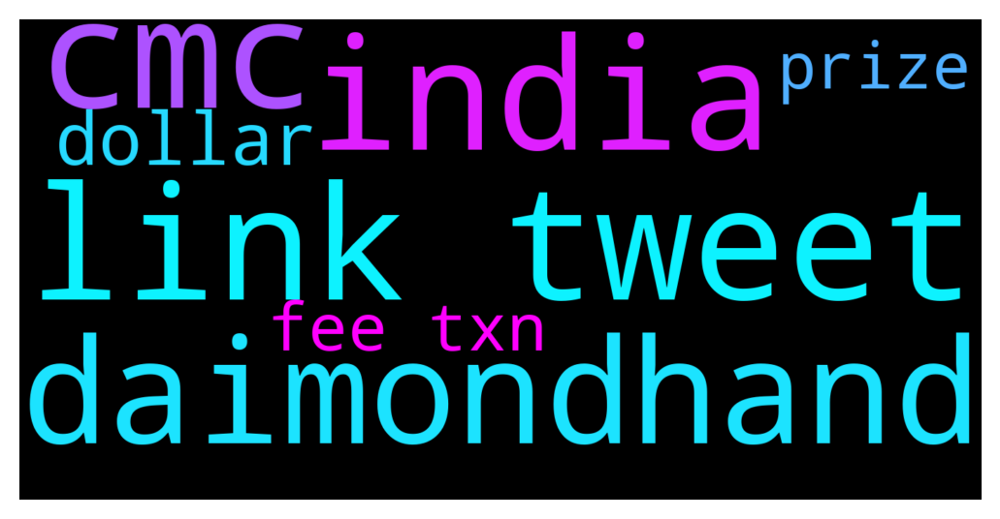

# **@cryptonear**
 ## Analysis for **2021-12-10** - **2021-12-11**.

---

## 📊 **Basic Stats**

**n_messages_sent**: 1335

---

---

## 🔝 **Top keywords and related messages**

1. **link tweet**

    @zubairansari07 --- *Hi NEARians,  There's Vast Audience On Instagram That Stay Active All Day So I've started an Insta account to post NEAR News & Info on Instagram to gain mass traction from there to adopt NEAR ⚡  Give It A Follow To Get All NEARnews At One Place 😉  Here's The Link To The Page >> https://www.instagram.com/p/CXSpyxJPmUa/?utm_medium=copy_link* **--->** [TG Discussion](https://t.me/cryptonear/231198)

    @larry_lang --- *Hi NEARians,  There's Vast Audience On Instagram That Stay Active All Day So I've started an Insta account to post NEAR News & Info on Instagram to gain mass traction from there to adopt NEAR ⚡  Give It A Follow To Get All NEARnews At One Place 😉  Here's The Link To The Page >> https://www.instagram.com/p/CXSpyxJPmUa/?utm_medium=copy_link* **--->** [TG Discussion](https://t.me/cryptonear/231286)

    @iamkemoo --- *🚨Event Alert: End of Year Town Hall  📅THURSDAY, DEC 16, 2021 ⏰3pm CET / 9am EST / 6am PST 📍https://endofyeartownhall.splashthat.com   ℹ️The Town Hall will be live streamed onto YouTube, and we will share the link over email and on social media.  See you soon!* **--->** [TG Discussion](https://t.me/cryptonear/231466)

    @naveenkandwal --- *END OF YEAR TOWNHALL  THURSDAY, DEC 16, 2021 3pm CET / 9am EST / 6am PST  ✅ Agenda:   ⚡️Deadmau5 and Mintbase debrief on the recent Platinum NFT launch ⚡️Exciting updates from Ecosystem Partners to be shared ⚡️Metabuidl II Hackathon  ⚡️NEAR Foundation Update  Registration Link: https://endofyeartownhall.splashthat.com/* **--->** [TG Discussion](https://t.me/cryptonear/231698)

    @Kripto_Raptor --- *Important: Near Wallet Recovery Email for xxxxx.near your recovery link is in this e mail* **--->** [TG Discussion](https://t.me/cryptonear/230922)

    @guatopori --- *My tweet from yesterday just got retweeted by Ryan Selkis, founder of Messari* **--->** [TG Discussion](https://t.me/cryptonear/232100)

2. **india**

    @NEARverse_xd --- *Your mobile screenshot is showing that you are in india. Indian standard time and your mobile screenshot timing is matching with the indian time.* **--->** [TG Discussion](https://t.me/cryptonear/232568)

    @zubairansari07 --- *If @Ratatoesker knows him, then he is truly Indian 😛* **--->** [TG Discussion](https://t.me/cryptonear/231273)

    @zubairansari07 --- *Jai Bhole Ki ✨💥, I didn’t know you are Indian hehe😉* **--->** [TG Discussion](https://t.me/cryptonear/231242)

    @LOVEPREET1313 --- *India is my parent* **--->** [TG Discussion](https://t.me/cryptonear/232556)

    @butola_ravi --- *Wait u from india right* **--->** [TG Discussion](https://t.me/cryptonear/232546)

    @larry_lang --- *Hmm seem like the indian hour is not much different than mine=]]* **--->** [TG Discussion](https://t.me/cryptonear/231034)

3. **cmc**

    @larry_lang --- *If u doing the CMC quiz then the wrong one is the second thing with the Eth transfer stuff* **--->** [TG Discussion](https://t.me/cryptonear/232603)

    @NOOR2255e --- *Hello admins.... I have a team specialized in raising the market value of cryptocurrencies... Ready to work on CMC and CG.. They are able to give this coin many stars and upvotes...* **--->** [TG Discussion](https://t.me/cryptonear/233281)

    @Dix_rao --- *We hit Top 27 on CMC* **--->** [TG Discussion](https://t.me/cryptonear/232974)

    @Killit777 --- *When will we get cmc airdrop* **--->** [TG Discussion](https://t.me/cryptonear/232855)

    @calebDEXX --- *DM ME FOR DEXTOOL CMC TRENDING AND REDDIT POST* **--->** [TG Discussion](https://t.me/cryptonear/232958)

    @NOOR2255e --- *Marketing services... Reddit trending posts or upvotes/comments, coinsniper, and similar websites, CMC Coingecko watchlists and trending..* **--->** [TG Discussion](https://t.me/cryptonear/233282)

4. **daimondhand**

    @Honey --- *U need daimondhand* **--->** [TG Discussion](https://t.me/cryptonear/233012)

    @Honey --- *Daimondhand of near* **--->** [TG Discussion](https://t.me/cryptonear/232999)

    @cc15167258586 --- *Daimondhand of near* **--->** [TG Discussion](https://t.me/cryptonear/233000)

5. **dollar**

    @NEARverse_xd --- *It is based on dollar, not on near token* **--->** [TG Discussion](https://t.me/cryptonear/232729)

    @pavelgordok --- *well haha guys i believe the price will go up, so the tokens we get now would give us more dollars* **--->** [TG Discussion](https://t.me/cryptonear/232752)

    @Aflatoon123 --- *5 dollar* **--->** [TG Discussion](https://t.me/cryptonear/232535)

    @pavelgordok --- *the prizes are in dollars, so we are gonna get dollars according to today's exchange rate* **--->** [TG Discussion](https://t.me/cryptonear/232738)

    @pavelgordok --- *anyways, the question was about near-dollar pair* **--->** [TG Discussion](https://t.me/cryptonear/232737)

6. **fee txn**

    @andyguerra --- *Also, consider deposit on metapool https://metapool.app, they will stake it for you on best performing/low fee validators and they give you stNEAR and META in return* **--->** [TG Discussion](https://t.me/cryptonear/232045)

    @larry_lang --- *txn fee as in transaction fee sir,  70% of Transactions fees are burned on each transaction* **--->** [TG Discussion](https://t.me/cryptonear/232809)

    @larry_lang --- *we have already burn  txn fees, but if buyback and burn is proposed we gonna let u guys know asap* **--->** [TG Discussion](https://t.me/cryptonear/232804)

    @Robin957 --- *Hi. I want to check something. If the fees for Near is so low, what's the use case for having Near?? I mean everyone just needs an extremely small amount only. Can someone explain what I miss out as I don't understand technology* **--->** [TG Discussion](https://t.me/cryptonear/231641)

    @centerline95 --- *That mean 70% txn will use to buyback and burn near? Right?* **--->** [TG Discussion](https://t.me/cryptonear/232811)

    @centerline95 --- *Which is txn fee? Can you explain to me sir?* **--->** [TG Discussion](https://t.me/cryptonear/232806)

7. **prize**

    @naveenkandwal --- *🚨 #NFTGiveaway 🚨 NEAR Tiger Academy x #NEARnft Club  🐯 >100 #pfp traits  🐯 Investment in student researchers 🐯 EnDAOment Fund 🐯 Lotteries  🏆 PRIZE: 1️⃣ 🐯 NFT   Winner in ⏰ 3 Days  📌 https://t.co/Id1127bqjf* **--->** [TG Discussion](https://t.me/cryptonear/233206)

    @pavelgordok --- *yes, we get prize in near token, but it's based on TODAY'S exchange rate* **--->** [TG Discussion](https://t.me/cryptonear/232735)

    @pavelgordok --- *haha we get prizes based on fiat money, not token i guess* **--->** [TG Discussion](https://t.me/cryptonear/232728)

    @butola_ravi --- *I guess u get prize in near token not in fiat* **--->** [TG Discussion](https://t.me/cryptonear/232732)

    @Darkmeadow41 --- *Yes, i curious if prize is based on price today not before quiz* **--->** [TG Discussion](https://t.me/cryptonear/232727)

    @Darkmeadow41 --- *Date prize distribution ?* **--->** [TG Discussion](https://t.me/cryptonear/231081)

