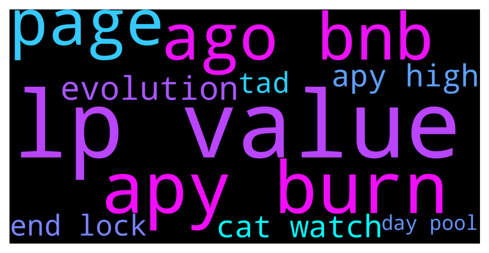

# **@dypfinance**
 ## Analysis for **2021-12-10** - **2021-12-11**.

---

## 📊 **Basic Stats**

**n_messages_sent**: 426

---

---

## 🔝 **Top keywords and related messages**

1. **lp value**

    @DhoniMSD516 --- *In farm you will be providing LP on which you earn WBNB/ETH or WAVAX/ETH rewards there will be Impermanent Loss here in Buyback your deposit is converted to iDYP and DYP on which you earn rewards in DYP there is no IL here https://link.medium.com/1qUnBdU0klb You can read here more about these both features* **--->** [TG Discussion](https://t.me/dypfinance/228085)

    @Eugej --- *The value of my LP has gone down a lot..imagine checking in and seeing my investment gone down over 50% goodness even the claimable amount isn't encouraging...not happy* **--->** [TG Discussion](https://t.me/dypfinance/228350)

    @DhoniMSD516 --- *Hey we made these changes yesterday https://t.me/dypfinance/227799 You can see approx value in USD in Stats page https://app-bsc.dyp.finance/staking-stats* **--->** [TG Discussion](https://t.me/dypfinance/228114)

    @timdyp --- *Let me share some info with you regarding our testing account on the new farming pools. So 21 days ago we deposited 0.3 BNB in each pool, that means a total of 1.5 BNB. I will attach a print screen with the deposits and another one with the current value as today.   Deposit value (21 days ago): $848.74 (1.5 BNB) Current value (As of today): $1389.24* **--->** [TG Discussion](https://t.me/dypfinance/228438)

    @DhoniMSD516 --- *Your deposit value of iDYP/WBNB can be see in stats page, we made changes recently so please clear cache and cookies and try again  https://t.me/dypfinance/224309 https://app-bsc.dyp.finance/staking-stats* **--->** [TG Discussion](https://t.me/dypfinance/228006)

    @timdyp --- *All the NFTs will have the same minting fee, BUT the rarity will be also based on the watch value. The cats' with more expensive watches will be rarer.* **--->** [TG Discussion](https://t.me/dypfinance/228052)

2. **apy burn**

    @DhoniMSD516 --- *As said the apy includes burn% and we never know whether the tokens will be burned or not this will be decided by governance proposal Please read through https://link.medium.com/2nXyI0UkPlb to understand how farming works* **--->** [TG Discussion](https://t.me/dypfinance/228320)

    @timdyp --- *Start Earning Today with #DeFiYieldProtocol  ▶️ 9077 ETH, 8927 BNB & 17010 AVAX paid to users ▶️ #YieldFarming with #BNB & #AVAX rewards 3802% APY ▶️ #Staking with NO IL 171% APY ▶️ #Buyback with NO IL 168% APY ▶️ #DYPTools, #NTFs and #ReferralProgram  👉https://dyp.finance  https://twitter.com/dypfinance/status/1469717699605504000* **--->** [TG Discussion](https://t.me/dypfinance/228460)

    @timdyp --- *Check out the #Avalanche farming pools and earn up to 5000% APY! 16501 #AVAX worth $1,460,338 paid to the users!  Join farming by automatically adding liquidity if you are holding WAVAX, USDC.e, USDT.e, WETH.e, PNG, QI, XAVA, WBTC.e, LINK.e, or iDYP👇 https://dyp.finance/farmv2/avax  👉https://twitter.com/dypfinance/status/1469232212457447428* **--->** [TG Discussion](https://t.me/dypfinance/228000)

    @DhoniMSD516 --- *Excuse me? When did we promise the apy this is common thing to know apy is dynamic in yield farming, if it is fixed we announce the same* **--->** [TG Discussion](https://t.me/dypfinance/228324)

    @RadiantPhoenix4 --- *Check out the #Avalanche farming pools and earn up to 5000% APY! 16501 #AVAX worth $1,460,338 paid to the users!  Join farming by automatically adding liquidity if you are holding WAVAX, USDC.e, USDT.e, WETH.e, PNG, QI, XAVA, WBTC.e, LINK.e, or iDYP👇 https://dyp.finance/farmv2/avax  👉https://twitter.com/dypfinance/status/1469232212457447428* **--->** [TG Discussion](https://t.me/dypfinance/228081)

    @JulienRayleigh --- *Of course but with 4500% APY we are supposed to make money even if the market goes down* **--->** [TG Discussion](https://t.me/dypfinance/228312)

3. **ago bnb**

    @timdyp --- *Let me share some info with you regarding our testing account on the new farming pools. So 21 days ago we deposited 0.3 BNB in each pool, that means a total of 1.5 BNB. I will attach a print screen with the deposits and another one with the current value as today.   Deposit value (21 days ago): $848.74 (1.5 BNB) Current value (As of today): $1389.24* **--->** [TG Discussion](https://t.me/dypfinance/228438)

    @timdyp --- *Start Earning Today with #DeFiYieldProtocol  ▶️ 9077 ETH, 8927 BNB & 17010 AVAX paid to users ▶️ #YieldFarming with #BNB & #AVAX rewards 3802% APY ▶️ #Staking with NO IL 171% APY ▶️ #Buyback with NO IL 168% APY ▶️ #DYPTools, #NTFs and #ReferralProgram  👉https://dyp.finance  https://twitter.com/dypfinance/status/1469717699605504000* **--->** [TG Discussion](https://t.me/dypfinance/228460)

    @timdyp --- *Also, here are some stats regarding the AVAX farms, here we made a test deposit on 0 and 3 days pools, 1 day 21 hrs ago. Deposited a total of 2 AVAX worth $171.70, current value of the deposited assets is $183.82.* **--->** [TG Discussion](https://t.me/dypfinance/228443)

    @Brian --- *My balance no longer displays usd instead it shows idyp/Bnb and dyp.* **--->** [TG Discussion](https://t.me/dypfinance/227863)

    @Can --- *2-3 day ago i was seeing the LP deposits in USD and now in iDYP/WBNB, that was my confusion* **--->** [TG Discussion](https://t.me/dypfinance/228068)

    @DhoniMSD516 --- *Yes every day the iDYP is swapped for BNB/AVAX and sent to you depending on your share %* **--->** [TG Discussion](https://t.me/dypfinance/228411)

4. **page**

    @DhoniMSD516 --- *Hey we made these changes yesterday https://t.me/dypfinance/227799 You can see approx value in USD in Stats page https://app-bsc.dyp.finance/staking-stats* **--->** [TG Discussion](https://t.me/dypfinance/228114)

    @DhoniMSD516 --- *Your deposit value of iDYP/WBNB can be see in stats page, we made changes recently so please clear cache and cookies and try again  https://t.me/dypfinance/224309 https://app-bsc.dyp.finance/staking-stats* **--->** [TG Discussion](https://t.me/dypfinance/228006)

    @DhoniMSD516 --- *Ok to know appro value of your LP goto stats page* **--->** [TG Discussion](https://t.me/dypfinance/227961)

    @iamJubi --- *Maybe you are on the farming dApp. kindly click view all on the stat section to head on the My stat page that was shown on the previous image shared. Or clear cache and cookies so that the UI on your side will be updated:)* **--->** [TG Discussion](https://t.me/dypfinance/227908)

    @Mrcgp_0 --- *Devs either need to put dollar amount in usd the lp is worth on farming page so we can use the calculator or move the calculator to the stats page with dollar amount shown but that would be a tad messy* **--->** [TG Discussion](https://t.me/dypfinance/228385)

    @JDogg --- *It seems we are all struggling with the same issue which is seeing the current value of our deposits in USD to get a handle on IL. The MOD's directions to click on "VIEW ALL" on the "MY STATS" page really helps. The numbers are there. If DYP platform can make that more apparent that would help.* **--->** [TG Discussion](https://t.me/dypfinance/227892)

5. **evolution**

    @nobodyffff --- *Evolution of TVL in time, since first day if possible* **--->** [TG Discussion](https://t.me/dypfinance/228418)

    @nobodyffff --- *Can you guys share evolution of total TVL since inception pls?* **--->** [TG Discussion](https://t.me/dypfinance/228413)

6. **cat watch**

    @timdyp --- *Who wants to adopt a cat that loves to collect watches? Our 10k unique collection of cats that collect watches will be ready soon to mint for the #Avalanche & #BinanceSmartChain users🐱⌚️  Subscribe to our Channel https://t.me/dypannouncements  #NFTs #NFTCommunity #nftcollector  https://twitter.com/dypfinance/status/1469266304452509697* **--->** [TG Discussion](https://t.me/dypfinance/228032)

    @iamJubi --- *Who wants to adopt a cat that loves to collect watches? Our 10k unique collection of cats that collect watches will be ready soon to mint for the #Avalanche & #BinanceSmartChain users🐱⌚️  Subscribe to our Channel https://t.me/dypannouncements  #NFTs #NFTCommunity #nftcollector  https://twitter.com/dypfinance/status/1469266304452509697* **--->** [TG Discussion](https://t.me/dypfinance/228290)

    @timdyp --- *All the NFTs will have the same minting fee, BUT the rarity will be also based on the watch value. The cats' with more expensive watches will be rarer.* **--->** [TG Discussion](https://t.me/dypfinance/228052)

    @Alliveall --- *Is cat with casio watch cheaper than cat with Rolex?? 😁😁* **--->** [TG Discussion](https://t.me/dypfinance/228048)

    @DhoniMSD516 --- *Cat is cat always valuable 😬* **--->** [TG Discussion](https://t.me/dypfinance/228049)

    @Lena_Blonde --- *you didn't include sports watches too LOL* **--->** [TG Discussion](https://t.me/dypfinance/227820)

7. **apy high**

    @DhoniMSD516 --- *As said the apy includes burn% and we never know whether the tokens will be burned or not this will be decided by governance proposal Please read through https://link.medium.com/2nXyI0UkPlb to understand how farming works* **--->** [TG Discussion](https://t.me/dypfinance/228320)

    @timdyp --- *Start Earning Today with #DeFiYieldProtocol  ▶️ 9077 ETH, 8927 BNB & 17010 AVAX paid to users ▶️ #YieldFarming with #BNB & #AVAX rewards 3802% APY ▶️ #Staking with NO IL 171% APY ▶️ #Buyback with NO IL 168% APY ▶️ #DYPTools, #NTFs and #ReferralProgram  👉https://dyp.finance  https://twitter.com/dypfinance/status/1469717699605504000* **--->** [TG Discussion](https://t.me/dypfinance/228460)

    @timdyp --- *Check out the #Avalanche farming pools and earn up to 5000% APY! 16501 #AVAX worth $1,460,338 paid to the users!  Join farming by automatically adding liquidity if you are holding WAVAX, USDC.e, USDT.e, WETH.e, PNG, QI, XAVA, WBTC.e, LINK.e, or iDYP👇 https://dyp.finance/farmv2/avax  👉https://twitter.com/dypfinance/status/1469232212457447428* **--->** [TG Discussion](https://t.me/dypfinance/228000)

    @DhoniMSD516 --- *Excuse me? When did we promise the apy this is common thing to know apy is dynamic in yield farming, if it is fixed we announce the same* **--->** [TG Discussion](https://t.me/dypfinance/228324)

    @RadiantPhoenix4 --- *Check out the #Avalanche farming pools and earn up to 5000% APY! 16501 #AVAX worth $1,460,338 paid to the users!  Join farming by automatically adding liquidity if you are holding WAVAX, USDC.e, USDT.e, WETH.e, PNG, QI, XAVA, WBTC.e, LINK.e, or iDYP👇 https://dyp.finance/farmv2/avax  👉https://twitter.com/dypfinance/status/1469232212457447428* **--->** [TG Discussion](https://t.me/dypfinance/228081)

    @JulienRayleigh --- *Of course, I know how it works. But in this case don't promise such a high APY if you are not able to keep it, you know what i mean* **--->** [TG Discussion](https://t.me/dypfinance/228323)

8. **end lock**

    @iamJubi --- *Hello. SLR. Your deposit is converted into 75% LP(wbnb and idyp pair) which is subject to IL and 25% is DYP. at the end of lock period, the value of what you will be withdrawing will depend on the current price of WBNB+iDYP and DYP.   You can check on MY stat "VIEW ALL" the current value of your LP deposit and DYP.* **--->** [TG Discussion](https://t.me/dypfinance/228361)

    @YatraNode --- *Hello.   I have some question about the impermanent loss in farm   Lock4000 busd for 90 day in farm.   When I put I understand at the end of lock I have 75 of my investissement in busd (3000busd ) and 25% in dyp. Right?  Because I see today I have lp of idy wbnb.* **--->** [TG Discussion](https://t.me/dypfinance/228360)

    @iamJubi --- *As the v1 farm contract went expired, all users have already withdrew their deposits which results to the high APY. During the old farm was still active, the APY was around 200% to 500% depending on the pool’s lock duration.* **--->** [TG Discussion](https://t.me/dypfinance/228331)

    @Paul --- *Hey Admin.... i noticed that changes were made to the original Buy back farming which if i remember correctly was 100% APR with 90 day lock and also the original DYP staking which was 25% no lock and 50% 90 day lock......Are these changes announced to the group prior to being made?* **--->** [TG Discussion](https://t.me/dypfinance/227976)

    @Disguy125 --- *Omg imagine it was on coin base and you could by automatically staking while you hold on coinbase per a smart contract combined in CB with the zero lock up time and get 50%!!!!!! Everyone would buy hold 8f it was added then listed here.   In comparison it would dominate all others.* **--->** [TG Discussion](https://t.me/dypfinance/228278)

    @JDogg --- *Thanks! I am very happy with DYP project. Last question: after a lock expires, can I stay in to keep earning rewards, or do I have to withdraw and re-stake?* **--->** [TG Discussion](https://t.me/dypfinance/227843)

9. **tad**

    @Mrcgp_0 --- *Devs either need to put dollar amount in usd the lp is worth on farming page so we can use the calculator or move the calculator to the stats page with dollar amount shown but that would be a tad messy* **--->** [TG Discussion](https://t.me/dypfinance/228385)

    @Mrcgp_0 --- *I mean i can see how much lp I have there already so makes the lp shown where the $ value used to be a tad pointless* **--->** [TG Discussion](https://t.me/dypfinance/228391)

10. **day pool**

    @timdyp --- *Let me share some info with you regarding our testing account on the new farming pools. So 21 days ago we deposited 0.3 BNB in each pool, that means a total of 1.5 BNB. I will attach a print screen with the deposits and another one with the current value as today.   Deposit value (21 days ago): $848.74 (1.5 BNB) Current value (As of today): $1389.24* **--->** [TG Discussion](https://t.me/dypfinance/228438)

    @timdyp --- *Also, here are some stats regarding the AVAX farms, here we made a test deposit on 0 and 3 days pools, 1 day 21 hrs ago. Deposited a total of 2 AVAX worth $171.70, current value of the deposited assets is $183.82.* **--->** [TG Discussion](https://t.me/dypfinance/228443)

    @timdyp --- *Check out the #Avalanche farming pools and earn up to 5000% APY! 16501 #AVAX worth $1,460,338 paid to the users!  Join farming by automatically adding liquidity if you are holding WAVAX, USDC.e, USDT.e, WETH.e, PNG, QI, XAVA, WBTC.e, LINK.e, or iDYP👇 https://dyp.finance/farmv2/avax  👉https://twitter.com/dypfinance/status/1469232212457447428* **--->** [TG Discussion](https://t.me/dypfinance/228000)

    @iamJubi --- *Stake your #DYP tokens on #Avalanche and earn up to 215% APY! 🌟No Impermanent Loss🌟  The staking pools have the REINVEST function integrated, meaning that you can automatically add your daily rewards to the staking pool👇 https://dyp.finance/stakev2/avax  👉https://twitter.com/dypfinance/status/1468934932693090307* **--->** [TG Discussion](https://t.me/dypfinance/227972)

    @RadiantPhoenix4 --- *Check out the #Avalanche farming pools and earn up to 5000% APY! 16501 #AVAX worth $1,460,338 paid to the users!  Join farming by automatically adding liquidity if you are holding WAVAX, USDC.e, USDT.e, WETH.e, PNG, QI, XAVA, WBTC.e, LINK.e, or iDYP👇 https://dyp.finance/farmv2/avax  👉https://twitter.com/dypfinance/status/1469232212457447428* **--->** [TG Discussion](https://t.me/dypfinance/228081)

    @Can --- *2-3 day ago i was seeing the LP deposits in USD and now in iDYP/WBNB, that was my confusion* **--->** [TG Discussion](https://t.me/dypfinance/228068)

