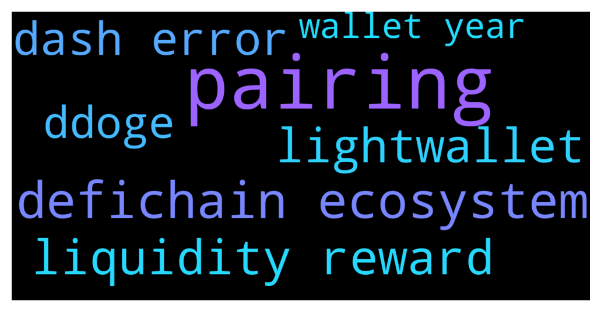

# **@CakeDeFi_EN**
 ## Analysis for **2021-12-11** - **2021-12-12**.

---

## 📊 **Basic Stats**

**n_messages_sent**: 431

---

---

## 🔝 **Top keywords and related messages**

1. **pairing**

    @Albertlong922 --- *What would be the best pairing to invest in on LM?* **--->** [TG Discussion](https://t.me/CakeDeFi_EN/151845)

    @Michael_Schredl --- *There is no best pairing - depends on the coins you want* **--->** [TG Discussion](https://t.me/CakeDeFi_EN/151847)

    @weisianz --- *Whichever pairing you find comfortable and familiar with. Volatility is to be expected for all pairings.* **--->** [TG Discussion](https://t.me/CakeDeFi_EN/151848)

2. **defichain ecosystem**

    @Dcshel --- *You mean Defichain? Cake is like a central exchange within the Defichain ecosystem* **--->** [TG Discussion](https://t.me/CakeDeFi_EN/151651)

    @james7235 --- *I know this has probably been covered, but I've been looking and can't find an answer. dUSD is designed to be a stablecoin, but the current price is $1.28. When will we see it be a "true" stablecoin (i.e. $1) or am I fundamentally misunderstanding the role of dUSD in the ecosystem?* **--->** [TG Discussion](https://t.me/CakeDeFi_EN/151457)

    @ordinaryguy1985 --- *Look at it this way, Cakedefi n community are going all out to promote DFI and the products.. im sure most here 1st know of Defichain and the awesome rewards bcos of Cakedefi. After tat how you want to maximise ur profits or which products u choose u really need to DYOR.* **--->** [TG Discussion](https://t.me/CakeDeFi_EN/151586)

    @Michael_Schredl --- *dUSD is currently that expensive, also on the DeFiChain - unbalanced pool* **--->** [TG Discussion](https://t.me/CakeDeFi_EN/151097)

    @N.Y.T. --- *Anyone know if we will be able to stake dfi on defichain lightwallet?* **--->** [TG Discussion](https://t.me/CakeDeFi_EN/151202)

    @freedfidotcom --- *DeFiChain have some proposals to put it right* **--->** [TG Discussion](https://t.me/CakeDeFi_EN/151696)

3. **liquidity reward**

    @Manvydasm --- *For me, it seems that dGoogl-dusd gives no rewards for me. How for.others?* **--->** [TG Discussion](https://t.me/CakeDeFi_EN/151744)

    @ordinaryguy1985 --- *Look at it this way, Cakedefi n community are going all out to promote DFI and the products.. im sure most here 1st know of Defichain and the awesome rewards bcos of Cakedefi. After tat how you want to maximise ur profits or which products u choose u really need to DYOR.* **--->** [TG Discussion](https://t.me/CakeDeFi_EN/151586)

    @umcand --- *Why are staking rewards reducing exponentially -.-* **--->** [TG Discussion](https://t.me/CakeDeFi_EN/151413)

    @fabioandreatta --- *This is the same for all Dash Stakers. There was one reward transaction too much, displayed as cancelled* **--->** [TG Discussion](https://t.me/CakeDeFi_EN/151768)

    @dwgranth --- *Question:  If/When will liquidity mining pairs be available to use in the USA besides DUSD/DFI ?* **--->** [TG Discussion](https://t.me/CakeDeFi_EN/151442)

    @C --- *Hey guys. Is usdc / Dfi worth liquidity mining with impermanent loss? Since usdc is stable and Dfi can go up or down. Does this create larger impermanent loss. Anyone whose doing it already let me know!* **--->** [TG Discussion](https://t.me/CakeDeFi_EN/151029)

4. **lightwallet**

    @Juan --- *3000 dfi on lightwallet is earning , almost the same as 15000 dfi in 10 year freeze* **--->** [TG Discussion](https://t.me/CakeDeFi_EN/151562)

    @Gangster1998 --- *How to use lightwallet sir . I never use that one ⁉️ Will u help me .* **--->** [TG Discussion](https://t.me/CakeDeFi_EN/151618)

    @N.Y.T. --- *Anyone know if we will be able to stake dfi on defichain lightwallet?* **--->** [TG Discussion](https://t.me/CakeDeFi_EN/151202)

    @freedfidotcom --- *If you want to trade your DFI here is one way if exchange DFI wallets are not up again yet: Send your DFI from Cake to DeFiChain wallet (desktop wallet or lightwallet) Use the DeFiChain DEX to convert to another coin (dDOGE for instance, withdrawal fees for DOGE from Cake are low) Send your dDoge back to Cake and then withdraw to exchange as DOGE on DOGE network  You can also convert to Bitcoin or Ethereum and withdraw that from Cake but withdrawal fees will be higher* **--->** [TG Discussion](https://t.me/CakeDeFi_EN/151622)

    @pbrelin --- *Even when I withdraw to my DefiChain lightwallet?* **--->** [TG Discussion](https://t.me/CakeDeFi_EN/151061)

5. **dash error**

    @Laurence --- *Hey guys, I have got a question. When I randomly checked staking yesterday, I noticed a dash transaction that was cancelled. Can someone explain to me what this means and why it happens? 😊 thank you guys 😁* **--->** [TG Discussion](https://t.me/CakeDeFi_EN/151767)

    @fabioandreatta --- *This is the same for all Dash Stakers. There was one reward transaction too much, displayed as cancelled* **--->** [TG Discussion](https://t.me/CakeDeFi_EN/151768)

    @Ginogigi --- *Why can't I submit my kyc...facing network error for multiple times on clicking the final submit button since yesterday.. what's wrong?.. My network is infact great..* **--->** [TG Discussion](https://t.me/CakeDeFi_EN/151636)

    @fabioandreatta --- *Not 100% sure where the error is caused, either by dash or by cake. i can look into it.* **--->** [TG Discussion](https://t.me/CakeDeFi_EN/151770)

    @Laurence --- *Interesting, is this an error caused by the dash chain?* **--->** [TG Discussion](https://t.me/CakeDeFi_EN/151769)

    @Ginogigi --- *Why am I getting network error while clicking final submit button of kyc. Tried many times... Help* **--->** [TG Discussion](https://t.me/CakeDeFi_EN/151358)

6. **ddoge**

    @freedfidotcom --- *If you want to trade your DFI here is one way if exchange DFI wallets are not up again yet: Send your DFI from Cake to DeFiChain wallet (desktop wallet or lightwallet) Use the DeFiChain DEX to convert to another coin (dDOGE for instance, withdrawal fees for DOGE from Cake are low) Send your dDoge back to Cake and then withdraw to exchange as DOGE on DOGE network  You can also convert to Bitcoin or Ethereum and withdraw that from Cake but withdrawal fees will be higher* **--->** [TG Discussion](https://t.me/CakeDeFi_EN/151622)

7. **wallet year**

    @Albertlong922 --- *What do you mean holdings on the wallet? I'm new* **--->** [TG Discussion](https://t.me/CakeDeFi_EN/151566)

    @Juan --- *Who regrets 10 year freeze ?* **--->** [TG Discussion](https://t.me/CakeDeFi_EN/151552)

    @Juan --- *3000 dfi on lightwallet is earning , almost the same as 15000 dfi in 10 year freeze* **--->** [TG Discussion](https://t.me/CakeDeFi_EN/151562)

    @John --- *I’m making more on light wallet with 10% of my holdings… make of it what you will…* **--->** [TG Discussion](https://t.me/CakeDeFi_EN/151561)

    @Juan --- *So this means that everyone who locked in for 10 years , very soon (6-12 months ) will be earning almost nothing reward wise* **--->** [TG Discussion](https://t.me/CakeDeFi_EN/151727)

    @k --- *Meanwhile depositing to cake costs a lot (creating the wallet). Do as you want but i see a lot of obstacles for new users who wany to try things out. And that is nevrr a good thing* **--->** [TG Discussion](https://t.me/CakeDeFi_EN/151101)

