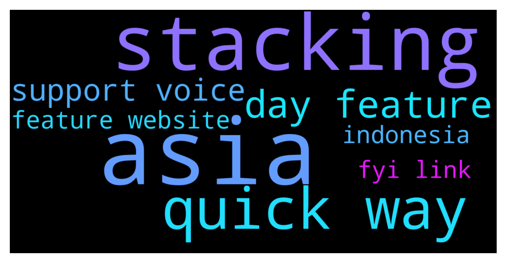

# **@Cardano**
 ## Analysis for **2021-12-11** - **2021-12-12**.

---

## 📊 **Basic Stats**

**n_messages_sent**: 146

---

---

## 🔝 **Top keywords and related messages**

1. **asia**

    @Shadowanthrop --- *Please cardano to give more serious attention to Asia market* **--->** [TG Discussion](https://t.me/Cardano/757796)

    @Shadowanthrop --- *Asia is promising. Infrastructure has already been well developed. I have several contacts to liaise with Indonesia government* **--->** [TG Discussion](https://t.me/Cardano/757799)

    @Shadowanthrop --- *When CH has been occupied to open market in Africa, his team missed a big opportunity to work on Asia market, CZ (bnb) has started a discussion with the owner of the biggest bank in Indonesia to have business in Indonesia* **--->** [TG Discussion](https://t.me/Cardano/757795)

2. **stacking**

    @st_chine --- *It happens automatically. Your rewards are automatically added to your stacking wallet and count toward* **--->** [TG Discussion](https://t.me/Cardano/757952)

    @st_chine --- *You can check your stacking with Yoroy* **--->** [TG Discussion](https://t.me/Cardano/757937)

    @st_chine --- *Do your stacking on Daedalus. You can check it’s status and snide Yoroi any time. Yoroi let’s you send on mobile* **--->** [TG Discussion](https://t.me/Cardano/757943)

3. **quick way**

    @brand0nC --- *@Lgbeano Cheers mate! Thanks for getting on it so quick  Lol at 'bitchslapper'* **--->** [TG Discussion](https://t.me/Cardano/757880)

    @You --- *Hello hello I am wondering if there is a quicker way to see what stake pools are doing with rewards (charity, interesting projects, etc), than going to each ones website and searching it out.  Is there some kind of categorizer in action somewhere? There are too many to be worth spending all that time.   If my only interest is returns, than it doesn’t matter, but if Im more interested in what its contributing to, then its more important.   Is there a quicker way?* **--->** [TG Discussion](https://t.me/Cardano/757823)

    @C --- *Sundae Swap is in testnet, why not give it a try…I’ve done it and it’s super easy. One way to contribute to the ecosystem 👍🏻* **--->** [TG Discussion](https://t.me/Cardano/757446)

    @icculp --- *is there an easy way to see the scheduled slots for a previous epoch?* **--->** [TG Discussion](https://t.me/Cardano/757325)

4. **day feature**

    @Lgbeano --- *[Forwarded from Cardano Announcements] Hey all! Want to help get more adoption and grow #Cardano? 👀  Please take a moment to vote and potentially get Ada added to bitpay app! ✨  Thanks for all the support! 💪  https://twitter.com/bitpay/status/1458977852230180868?s=21  Direct link to poll: https://gleam.io/1a0mE/bitpay-coin-poll (FYI: You can vote every day!😉)  Would you rather request a feature via the website and ask them for Cardano support? Please visit here and let your voices be heard: https://bitpay.canny.io/feature-request?sort=top* **--->** [TG Discussion](https://t.me/Cardano/757964)

    @Lgbeano --- *Hey all! Want to help get more adoption and grow #Cardano? 👀  Please take a moment to vote and potentially get Ada added to bitpay app! ✨  Thanks for all the support! 💪  https://twitter.com/bitpay/status/1458977852230180868?s=21  Direct link to poll: https://gleam.io/1a0mE/bitpay-coin-poll (FYI: You can vote every day!😉)  Would you rather request a feature via the website and ask them for Cardano support? Please visit here and let your voices be heard: https://bitpay.canny.io/feature-request?sort=top* **--->** [TG Discussion](https://t.me/Cardano/757684)

    @thomas --- *[Forwarded from Cardano Announcements] Hey all! Want to help get more adoption and grow #Cardano? 👀  Please take a moment to vote and potentially get Ada added to bitpay app! ✨  Thanks for all the support! 💪  https://twitter.com/bitpay/status/1458977852230180868?s=21  Direct link to poll: https://gleam.io/1a0mE/bitpay-coin-poll (FYI: You can vote every day!😉)  Would you rather request a feature via the website and ask them for Cardano support? Please visit here and let your voices be heard: https://bitpay.canny.io/feature-request?sort=top* **--->** [TG Discussion](https://t.me/Cardano/757940)

    @Katsumot0 --- *If you synch from scratch then yes a couple hours, up to a day depending on internet and pc specs* **--->** [TG Discussion](https://t.me/Cardano/757972)

    @brand0nC --- *Yea think i may have been banned. I've been in there for ages. Posted a link the other day then the chat disappeared 🤷‍♂️* **--->** [TG Discussion](https://t.me/Cardano/757877)

    @icculp --- *I believe it's started correctly now, just wasn't for most of the day* **--->** [TG Discussion](https://t.me/Cardano/757372)

5. **support voice**

    @Lgbeano --- *[Forwarded from Cardano Announcements] Hey all! Want to help get more adoption and grow #Cardano? 👀  Please take a moment to vote and potentially get Ada added to bitpay app! ✨  Thanks for all the support! 💪  https://twitter.com/bitpay/status/1458977852230180868?s=21  Direct link to poll: https://gleam.io/1a0mE/bitpay-coin-poll (FYI: You can vote every day!😉)  Would you rather request a feature via the website and ask them for Cardano support? Please visit here and let your voices be heard: https://bitpay.canny.io/feature-request?sort=top* **--->** [TG Discussion](https://t.me/Cardano/757964)

    @Lgbeano --- *Hey all! Want to help get more adoption and grow #Cardano? 👀  Please take a moment to vote and potentially get Ada added to bitpay app! ✨  Thanks for all the support! 💪  https://twitter.com/bitpay/status/1458977852230180868?s=21  Direct link to poll: https://gleam.io/1a0mE/bitpay-coin-poll (FYI: You can vote every day!😉)  Would you rather request a feature via the website and ask them for Cardano support? Please visit here and let your voices be heard: https://bitpay.canny.io/feature-request?sort=top* **--->** [TG Discussion](https://t.me/Cardano/757684)

    @thomas --- *[Forwarded from Cardano Announcements] Hey all! Want to help get more adoption and grow #Cardano? 👀  Please take a moment to vote and potentially get Ada added to bitpay app! ✨  Thanks for all the support! 💪  https://twitter.com/bitpay/status/1458977852230180868?s=21  Direct link to poll: https://gleam.io/1a0mE/bitpay-coin-poll (FYI: You can vote every day!😉)  Would you rather request a feature via the website and ask them for Cardano support? Please visit here and let your voices be heard: https://bitpay.canny.io/feature-request?sort=top* **--->** [TG Discussion](https://t.me/Cardano/757940)

    @glitch04 --- *👆 use the channel listed above anyone that dm's you is a scammer report and block them no support / mod / admin will dm you first* **--->** [TG Discussion](https://t.me/Cardano/757395)

6. **feature website**

    @Lgbeano --- *[Forwarded from Cardano Announcements] Hey all! Want to help get more adoption and grow #Cardano? 👀  Please take a moment to vote and potentially get Ada added to bitpay app! ✨  Thanks for all the support! 💪  https://twitter.com/bitpay/status/1458977852230180868?s=21  Direct link to poll: https://gleam.io/1a0mE/bitpay-coin-poll (FYI: You can vote every day!😉)  Would you rather request a feature via the website and ask them for Cardano support? Please visit here and let your voices be heard: https://bitpay.canny.io/feature-request?sort=top* **--->** [TG Discussion](https://t.me/Cardano/757964)

    @Lgbeano --- *Hey all! Want to help get more adoption and grow #Cardano? 👀  Please take a moment to vote and potentially get Ada added to bitpay app! ✨  Thanks for all the support! 💪  https://twitter.com/bitpay/status/1458977852230180868?s=21  Direct link to poll: https://gleam.io/1a0mE/bitpay-coin-poll (FYI: You can vote every day!😉)  Would you rather request a feature via the website and ask them for Cardano support? Please visit here and let your voices be heard: https://bitpay.canny.io/feature-request?sort=top* **--->** [TG Discussion](https://t.me/Cardano/757684)

    @thomas --- *[Forwarded from Cardano Announcements] Hey all! Want to help get more adoption and grow #Cardano? 👀  Please take a moment to vote and potentially get Ada added to bitpay app! ✨  Thanks for all the support! 💪  https://twitter.com/bitpay/status/1458977852230180868?s=21  Direct link to poll: https://gleam.io/1a0mE/bitpay-coin-poll (FYI: You can vote every day!😉)  Would you rather request a feature via the website and ask them for Cardano support? Please visit here and let your voices be heard: https://bitpay.canny.io/feature-request?sort=top* **--->** [TG Discussion](https://t.me/Cardano/757940)

    @You --- *Hello hello I am wondering if there is a quicker way to see what stake pools are doing with rewards (charity, interesting projects, etc), than going to each ones website and searching it out.  Is there some kind of categorizer in action somewhere? There are too many to be worth spending all that time.   If my only interest is returns, than it doesn’t matter, but if Im more interested in what its contributing to, then its more important.   Is there a quicker way?* **--->** [TG Discussion](https://t.me/Cardano/757823)

7. **indonesia**

    @Shadowanthrop --- *Asia is promising. Infrastructure has already been well developed. I have several contacts to liaise with Indonesia government* **--->** [TG Discussion](https://t.me/Cardano/757799)

    @Shadowanthrop --- *When CH has been occupied to open market in Africa, his team missed a big opportunity to work on Asia market, CZ (bnb) has started a discussion with the owner of the biggest bank in Indonesia to have business in Indonesia* **--->** [TG Discussion](https://t.me/Cardano/757795)

8. **fyi link**

    @Lgbeano --- *[Forwarded from Cardano Announcements] Hey all! Want to help get more adoption and grow #Cardano? 👀  Please take a moment to vote and potentially get Ada added to bitpay app! ✨  Thanks for all the support! 💪  https://twitter.com/bitpay/status/1458977852230180868?s=21  Direct link to poll: https://gleam.io/1a0mE/bitpay-coin-poll (FYI: You can vote every day!😉)  Would you rather request a feature via the website and ask them for Cardano support? Please visit here and let your voices be heard: https://bitpay.canny.io/feature-request?sort=top* **--->** [TG Discussion](https://t.me/Cardano/757964)

    @Lgbeano --- *Hey all! Want to help get more adoption and grow #Cardano? 👀  Please take a moment to vote and potentially get Ada added to bitpay app! ✨  Thanks for all the support! 💪  https://twitter.com/bitpay/status/1458977852230180868?s=21  Direct link to poll: https://gleam.io/1a0mE/bitpay-coin-poll (FYI: You can vote every day!😉)  Would you rather request a feature via the website and ask them for Cardano support? Please visit here and let your voices be heard: https://bitpay.canny.io/feature-request?sort=top* **--->** [TG Discussion](https://t.me/Cardano/757684)

    @thomas --- *[Forwarded from Cardano Announcements] Hey all! Want to help get more adoption and grow #Cardano? 👀  Please take a moment to vote and potentially get Ada added to bitpay app! ✨  Thanks for all the support! 💪  https://twitter.com/bitpay/status/1458977852230180868?s=21  Direct link to poll: https://gleam.io/1a0mE/bitpay-coin-poll (FYI: You can vote every day!😉)  Would you rather request a feature via the website and ask them for Cardano support? Please visit here and let your voices be heard: https://bitpay.canny.io/feature-request?sort=top* **--->** [TG Discussion](https://t.me/Cardano/757940)

    @brand0nC --- *Yea think i may have been banned. I've been in there for ages. Posted a link the other day then the chat disappeared 🤷‍♂️* **--->** [TG Discussion](https://t.me/Cardano/757877)

    @DennBro --- *i noticed that and if you click that cmc link in the Trust wallet it directs you to a BINANCE smart chain contract which is kinda weird* **--->** [TG Discussion](https://t.me/Cardano/757607)

