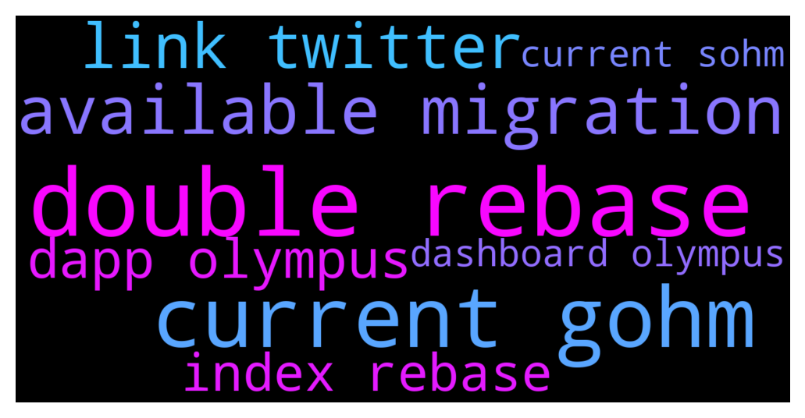

# **@OlympusTG**
 ## Analysis for **2021-12-11** - **2021-12-12**.

---

## 📊 **Basic Stats**

**n_messages_sent**: 2787

---

---

## 🔝 **Top keywords and related messages**

1. **double rebase**

    @Ras --- *Farming my gOhm on Trader Joe's,  earning more gOhm + Joe  then stake the Joe to earn more Joe  all the while receiving 3 rebases a day.Already earned back the few hundred gas to convert...cheers* **--->** [TG Discussion](https://t.me/OlympusTG/113412)

    @JWH007 --- *As I understand it. Unless you want to transact on another network gOHM, you can stay on v2 sOHM and still receive your rebase rewards.* **--->** [TG Discussion](https://t.me/OlympusTG/113945)

    @KlimDao --- *If I have gOHM, are the rebases still in sOHM or not?* **--->** [TG Discussion](https://t.me/OlympusTG/116838)

    @JiseongHoang --- *hello sir i converted sohm to gohm .  so now i can get rebase benefits* **--->** [TG Discussion](https://t.me/OlympusTG/115726)

    @Waseem --- *Thanks! It’s weird because I got gOHM and then bridged it to avalanche, but now there’s no “dashboard” option or “stake” option on the Olympus dApp  So was just nervous! Wondering whether my gOHM wouldn’t get rebase rewards because I’ve bridged it to avalanche or something* **--->** [TG Discussion](https://t.me/OlympusTG/114340)

    @Poopoo --- *Yes gOHM does not need to be staked.  What is gOHM: https://twitter.com/OlympusDAO/status/1465410905542385677  gOHM documentation: https://docs.olympusdao.finance/main/contracts/tokens#gohm  gohm does not increase, gohm x current index = sohm, current index increases every rebase, you can find current index on the dashboard of the olympus dapp* **--->** [TG Discussion](https://t.me/OlympusTG/115333)

2. **current gohm**

    @defimaster4 --- *gOHM = wsOHM  https://twitter.com/OlympusDAO/status/1465410905542385677?t=f_1AV7xGskPSg5WYha1J_w&s=19* **--->** [TG Discussion](https://t.me/OlympusTG/114039)

    @igorb337 --- *Just trying to figure it out, what's the point of OHM and sOHM if all is happening with gOHM?* **--->** [TG Discussion](https://t.me/OlympusTG/114493)

    @theMagicUnicorn --- *it seems sohm to sohm 2 is coming soon, but for now you can go sohm to gohm* **--->** [TG Discussion](https://t.me/OlympusTG/114414)

    @KlimDao --- *Hi Bro we just need to wrap sOHM to gOHM on the website. And nothing after? It s OK on AVAX* **--->** [TG Discussion](https://t.me/OlympusTG/116149)

    @Ras --- *Farming my gOhm on Trader Joe's,  earning more gOhm + Joe  then stake the Joe to earn more Joe  all the while receiving 3 rebases a day.Already earned back the few hundred gas to convert...cheers* **--->** [TG Discussion](https://t.me/OlympusTG/113412)

    @Filipe --- *Tryed do buy gohm in the polygon network, there’s no liquidity* **--->** [TG Discussion](https://t.me/OlympusTG/116141)

3. **available migration**

    @Goal --- *I mean sOHM v2 will also be introduced. Migrating of sOHM v1 to sOHM v2 will also be available as per the discord group announcement.  My question was why move to gOHM when sOHM v2 is an option 🤔* **--->** [TG Discussion](https://t.me/OlympusTG/114194)

    @Poopoo --- *Olympus Migration TL;DR for the Ohmies  - Current sOHM won't see rebases anymore. will get all backdated rewards whenever you migrate. - Folks collateralised at Rari don't need to do anything. will be taken care of in the backend. - sOHM to sOHM v2 migration will become available soon. - sOHM to gOHM and wsOHM to gOHM migration is already available at https://app.olympusdao.finance/#/wrap - In no scenario will you lose rewards  The APY will show correctly on website when V2 migration is done. Current sOHM won't see rebases anymore. Ohmies will get all backdated rewards whenever you migrate.  Ohmies collateralized at Rari don't need to do anything. Everything will be taken care of in the backend.  You don’t have to unstake or do anything right now. sOHM to sOHM v2 migration will become available soon with easy step by step instructions.   sOHM: wait for migration to sOHM v2 or wrap to gOHM wsOHM:  convert to gOHM gOHM:  nothing fsOHM (Rari): nothing* **--->** [TG Discussion](https://t.me/OlympusTG/115639)

    @Neuzter --- *As i understand it Olympus is on top of ETH , so if you want to mint , interact with Olympus app , you will need to do it via ETH network right? even with gOHM available in multiple blockchains , is this right or wrong?* **--->** [TG Discussion](https://t.me/OlympusTG/114305)

    @CoachLuko --- *It’s also for sOhm the migration??* **--->** [TG Discussion](https://t.me/OlympusTG/114088)

    @Ap0l1o --- *for now only gOhm is available* **--->** [TG Discussion](https://t.me/OlympusTG/115095)

    @BROHMZ --- *The other reason for the migration is to resolve the old issue of Zeus' old faulty hardware wallet that no longer can be accessed and contained the private key to the contracts* **--->** [TG Discussion](https://t.me/OlympusTG/114228)

4. **link twitter**

    @Poopoo --- *gOHM is already staked, refer to gOHM info links above. gohm does not increase, gohm x current index = sohm, current index increases every rebase, you can find current index on the dashboard of the olympus dapp* **--->** [TG Discussion](https://t.me/OlympusTG/115923)

    @Theo --- *I see I am not the only one asking this question: So just unstake and stake? The instructions on Twitter aren't clear* **--->** [TG Discussion](https://t.me/OlympusTG/114136)

    @HODLAMA --- *I got the link from here  https://www.olympusdao.finance* **--->** [TG Discussion](https://t.me/OlympusTG/113716)

    @HODLAMA --- *It said the link is expired or useless, I need to try different link to join.* **--->** [TG Discussion](https://t.me/OlympusTG/113725)

    @Blockchain_B_B --- *Anyone else lost when they say on Twitter two seemingly conflicting statements? They said sOHM will have a v2 sOHm. But then they say sOHM will be converted to gOHM?* **--->** [TG Discussion](https://t.me/OlympusTG/114384)

    @Goal --- *I checked Olympus Dao discord and twitter and there is a migration running.  I suggest everyone go to Olympus Dao twitter accord and read the announcement.* **--->** [TG Discussion](https://t.me/OlympusTG/114016)

5. **dapp olympus**

    @Neuzter --- *I see gOHM also will make olympus multichain? So from now you can add to your current position via Avalanche and other blockchains , is this right?* **--->** [TG Discussion](https://t.me/OlympusTG/114260)

    @Waseem --- *Thanks! It’s weird because I got gOHM and then bridged it to avalanche, but now there’s no “dashboard” option or “stake” option on the Olympus dApp  So was just nervous! Wondering whether my gOHM wouldn’t get rebase rewards because I’ve bridged it to avalanche or something* **--->** [TG Discussion](https://t.me/OlympusTG/114340)

    @Poopoo --- *Yes gOHM does not need to be staked.  What is gOHM: https://twitter.com/OlympusDAO/status/1465410905542385677  gOHM documentation: https://docs.olympusdao.finance/main/contracts/tokens#gohm  gohm does not increase, gohm x current index = sohm, current index increases every rebase, you can find current index on the dashboard of the olympus dapp* **--->** [TG Discussion](https://t.me/OlympusTG/115333)

    @MrFreshTime --- *I think we will see a shift once gOHM is launched More networks for gOHM to be in DEX liquity pools or used as collateral in borrowing Dapps  But I have a feeling it’s the newfound ability for gOHM to finally get listed on the top centralized exchanges   It was nearly impossible to get any market makers to provide bids/asks in native OHM when they could be staking and earning 7,000% APY  gOHM eliminates this conundrum, opening up top global crypto exchanges to list gOHM. This will bring in a new wave of buying demand   There’s going to be arbitrage opportunities between gOHM and OHM that will balance out their market prices  gOHM will be very appealing to a lot of BTC and blue chip only traders, as its value will include the same 3x day rebasing yield as staked OHM but with flexibility to use freely without having to stake OHM in Dapp with Web3 wallet* **--->** [TG Discussion](https://t.me/OlympusTG/114025)

    @Poopoo --- *gOHM is already staked, refer to gOHM info links above. gohm does not increase, gohm x current index = sohm, current index increases every rebase, you can find current index on the dashboard of the olympus dapp* **--->** [TG Discussion](https://t.me/OlympusTG/115923)

    @Poopoo --- *gohm does not increase, gohm x current index = sohm, current index increases every rebase, you can find current index on the dashboard of the olympus dapp* **--->** [TG Discussion](https://t.me/OlympusTG/115803)

6. **index rebase**

    @Ras --- *Farming my gOhm on Trader Joe's,  earning more gOhm + Joe  then stake the Joe to earn more Joe  all the while receiving 3 rebases a day.Already earned back the few hundred gas to convert...cheers* **--->** [TG Discussion](https://t.me/OlympusTG/113412)

    @MrFreshTime --- *i don't believe gOHM has went live yet.  It's a completely different price per token vs ohm or sOHM.  OHM x Current Index0= gOHM price* **--->** [TG Discussion](https://t.me/OlympusTG/115058)

    @Ap0l1o --- *should be... 1 gOhm = 1 Ohm * Index (which is 45.1 at this moment)* **--->** [TG Discussion](https://t.me/OlympusTG/114495)

    @ghosttmeme --- *I understand that. But how does that compound? The value of sOHM autocompounding is that the value grows over time as the token amount increases. So the more time I stake the more token I have. If gOHM isn’t growing in token amount and is only gOHM= sOHM x index. There is no point in holding/staking gOHM. And if there is no autocompounding it does not grow in value like current staked sOHM…* **--->** [TG Discussion](https://t.me/OlympusTG/116511)

    @ghosttmeme --- *I mean the index would have to grow a lot. For example if I put 2k into sOHM at roughly 7,000APY it would roughly double in a month. In order for gOHM to double the index would also roughly need to double to 100.* **--->** [TG Discussion](https://t.me/OlympusTG/116552)

    @JWH007 --- *As I understand it. Unless you want to transact on another network gOHM, you can stay on v2 sOHM and still receive your rebase rewards.* **--->** [TG Discussion](https://t.me/OlympusTG/113945)

7. **dashboard olympus**

    @Neuzter --- *I see gOHM also will make olympus multichain? So from now you can add to your current position via Avalanche and other blockchains , is this right?* **--->** [TG Discussion](https://t.me/OlympusTG/114260)

    @Waseem --- *Thanks! It’s weird because I got gOHM and then bridged it to avalanche, but now there’s no “dashboard” option or “stake” option on the Olympus dApp  So was just nervous! Wondering whether my gOHM wouldn’t get rebase rewards because I’ve bridged it to avalanche or something* **--->** [TG Discussion](https://t.me/OlympusTG/114340)

    @Poopoo --- *Yes gOHM does not need to be staked.  What is gOHM: https://twitter.com/OlympusDAO/status/1465410905542385677  gOHM documentation: https://docs.olympusdao.finance/main/contracts/tokens#gohm  gohm does not increase, gohm x current index = sohm, current index increases every rebase, you can find current index on the dashboard of the olympus dapp* **--->** [TG Discussion](https://t.me/OlympusTG/115333)

    @Poopoo --- *gohm does not increase, gohm x current index = sohm, current index increases every rebase, you can find current index on the dashboard of the olympus dapp* **--->** [TG Discussion](https://t.me/OlympusTG/115803)

    @Poopoo --- *gOHM is already staked, refer to gOHM info links above. gohm does not increase, gohm x current index = sohm, current index increases every rebase, you can find current index on the dashboard of the olympus dapp* **--->** [TG Discussion](https://t.me/OlympusTG/115923)

    @Poopoo --- *no you don't need to do anything, gOHM is already earning rebases. sOHM = gOHM x current index, current index increases every rebase, you can find it on the dashboard* **--->** [TG Discussion](https://t.me/OlympusTG/115506)

8. **current sohm**

    @theMagicUnicorn --- *it seems sohm to sohm 2 is coming soon, but for now you can go sohm to gohm* **--->** [TG Discussion](https://t.me/OlympusTG/114414)

    @KlimDao --- *Hi Bro we just need to wrap sOHM to gOHM on the website. And nothing after? It s OK on AVAX* **--->** [TG Discussion](https://t.me/OlympusTG/116149)

    @MrFreshTime --- *i don't believe gOHM has went live yet.  It's a completely different price per token vs ohm or sOHM.  OHM x Current Index0= gOHM price* **--->** [TG Discussion](https://t.me/OlympusTG/115058)

    @Ap0l1o --- *you have transform and choose sOhm/wsOhm or gOhm and choose to gOhm or sOhm, but you can only approve to gOhm at the moment* **--->** [TG Discussion](https://t.me/OlympusTG/114622)

    @Goal --- *I mean sOHM v2 will also be introduced. Migrating of sOHM v1 to sOHM v2 will also be available as per the discord group announcement.  My question was why move to gOHM when sOHM v2 is an option 🤔* **--->** [TG Discussion](https://t.me/OlympusTG/114194)

    @ghosttmeme --- *I understand that. But how does that compound? The value of sOHM autocompounding is that the value grows over time as the token amount increases. So the more time I stake the more token I have. If gOHM isn’t growing in token amount and is only gOHM= sOHM x index. There is no point in holding/staking gOHM. And if there is no autocompounding it does not grow in value like current staked sOHM…* **--->** [TG Discussion](https://t.me/OlympusTG/116511)

