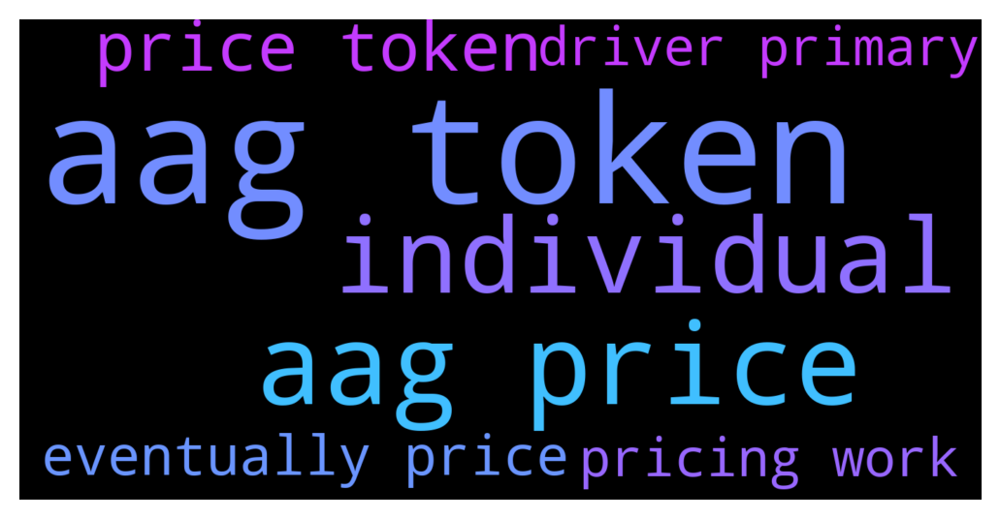

# **@defisearchpublic**
 ## Analysis for **2021-12-10** - **2021-12-12**.

---

## 📊 **Basic Stats**

**n_messages_sent**: 23

---

---

## 🔝 **Top keywords and related messages**

1. **aag token**

    @CasperDeFi --- *We are live!  https://twitter.com/aag_ventures/status/1470000579460145155?s=20  --  A reminder of our pricing work for TLA:  TLA Pricing Mechanism  When an individual completes a purchase, the transaction will cause the AAG token’s price to increase. In contrast, when no purchases are initiated, prices will gradually decrease with the weight increasing.  Starting at $4.14, the price of AAG tokens will gradually decrease when no purchases occur. However, if at one point, for instance, at $3, there are large orders that have been successfully transacted, the price of the AAG token may also increase quickly. That means the price could also go above $4.14 and advance even higher if there are investors continuously buying.  In conclusion, an individual can freely purchase AAG tokens at any price they see fit, and that is the price they get. Eventually, the price will settle at a price the market as a whole finds most suitable.* **--->** [TG Discussion](https://t.me/defisearchpublic/240171)

    @MaskedRiderBlackRX --- *What's the name of the token of Clout? I want to buy one* **--->** [TG Discussion](https://t.me/defisearchpublic/240098)

2. **aag price**

    @CasperDeFi --- *We are live!  https://twitter.com/aag_ventures/status/1470000579460145155?s=20  --  A reminder of our pricing work for TLA:  TLA Pricing Mechanism  When an individual completes a purchase, the transaction will cause the AAG token’s price to increase. In contrast, when no purchases are initiated, prices will gradually decrease with the weight increasing.  Starting at $4.14, the price of AAG tokens will gradually decrease when no purchases occur. However, if at one point, for instance, at $3, there are large orders that have been successfully transacted, the price of the AAG token may also increase quickly. That means the price could also go above $4.14 and advance even higher if there are investors continuously buying.  In conclusion, an individual can freely purchase AAG tokens at any price they see fit, and that is the price they get. Eventually, the price will settle at a price the market as a whole finds most suitable.* **--->** [TG Discussion](https://t.me/defisearchpublic/240171)

3. **individual**

    @CasperDeFi --- *We are live!  https://twitter.com/aag_ventures/status/1470000579460145155?s=20  --  A reminder of our pricing work for TLA:  TLA Pricing Mechanism  When an individual completes a purchase, the transaction will cause the AAG token’s price to increase. In contrast, when no purchases are initiated, prices will gradually decrease with the weight increasing.  Starting at $4.14, the price of AAG tokens will gradually decrease when no purchases occur. However, if at one point, for instance, at $3, there are large orders that have been successfully transacted, the price of the AAG token may also increase quickly. That means the price could also go above $4.14 and advance even higher if there are investors continuously buying.  In conclusion, an individual can freely purchase AAG tokens at any price they see fit, and that is the price they get. Eventually, the price will settle at a price the market as a whole finds most suitable.* **--->** [TG Discussion](https://t.me/defisearchpublic/240171)

4. **price token**

    @CasperDeFi --- *We are live!  https://twitter.com/aag_ventures/status/1470000579460145155?s=20  --  A reminder of our pricing work for TLA:  TLA Pricing Mechanism  When an individual completes a purchase, the transaction will cause the AAG token’s price to increase. In contrast, when no purchases are initiated, prices will gradually decrease with the weight increasing.  Starting at $4.14, the price of AAG tokens will gradually decrease when no purchases occur. However, if at one point, for instance, at $3, there are large orders that have been successfully transacted, the price of the AAG token may also increase quickly. That means the price could also go above $4.14 and advance even higher if there are investors continuously buying.  In conclusion, an individual can freely purchase AAG tokens at any price they see fit, and that is the price they get. Eventually, the price will settle at a price the market as a whole finds most suitable.* **--->** [TG Discussion](https://t.me/defisearchpublic/240171)

    @MaskedRiderBlackRX --- *What's the name of the token of Clout? I want to buy one* **--->** [TG Discussion](https://t.me/defisearchpublic/240098)

5. **eventually price**

    @CasperDeFi --- *We are live!  https://twitter.com/aag_ventures/status/1470000579460145155?s=20  --  A reminder of our pricing work for TLA:  TLA Pricing Mechanism  When an individual completes a purchase, the transaction will cause the AAG token’s price to increase. In contrast, when no purchases are initiated, prices will gradually decrease with the weight increasing.  Starting at $4.14, the price of AAG tokens will gradually decrease when no purchases occur. However, if at one point, for instance, at $3, there are large orders that have been successfully transacted, the price of the AAG token may also increase quickly. That means the price could also go above $4.14 and advance even higher if there are investors continuously buying.  In conclusion, an individual can freely purchase AAG tokens at any price they see fit, and that is the price they get. Eventually, the price will settle at a price the market as a whole finds most suitable.* **--->** [TG Discussion](https://t.me/defisearchpublic/240171)

6. **driver primary**

    @KEK --- *The creative industries will become the world's primary drivers of economic development as producers of knowledge-based assets.* **--->** [TG Discussion](https://t.me/defisearchpublic/240166)

7. **pricing work**

    @CasperDeFi --- *We are live!  https://twitter.com/aag_ventures/status/1470000579460145155?s=20  --  A reminder of our pricing work for TLA:  TLA Pricing Mechanism  When an individual completes a purchase, the transaction will cause the AAG token’s price to increase. In contrast, when no purchases are initiated, prices will gradually decrease with the weight increasing.  Starting at $4.14, the price of AAG tokens will gradually decrease when no purchases occur. However, if at one point, for instance, at $3, there are large orders that have been successfully transacted, the price of the AAG token may also increase quickly. That means the price could also go above $4.14 and advance even higher if there are investors continuously buying.  In conclusion, an individual can freely purchase AAG tokens at any price they see fit, and that is the price they get. Eventually, the price will settle at a price the market as a whole finds most suitable.* **--->** [TG Discussion](https://t.me/defisearchpublic/240171)

