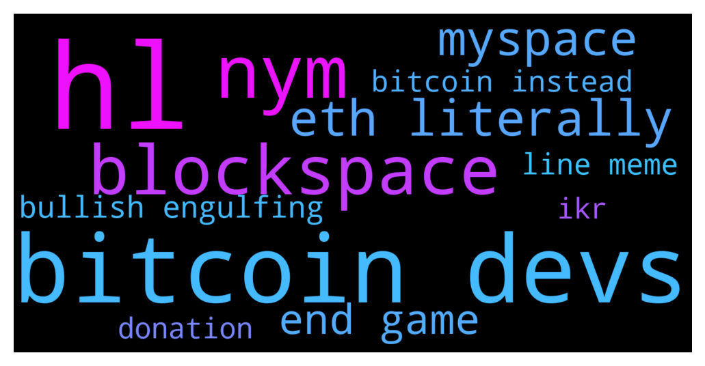

# **@whalepoolbtc**
 ## Analysis for **2021-12-11** - **2021-12-12**.

---

## 📊 **Basic Stats**

**n_messages_sent**: 1016

---

---

## 🔝 **Top keywords and related messages**

1. **hl**

    @Nickjohn101 --- *+1, Nowadays it's very difficult to figure out market especially in this highly volatile market* **--->** [TG Discussion](https://t.me/whalepoolbtc/4079743)

    @Painbtc --- *just another hl imo* **--->** [TG Discussion](https://t.me/whalepoolbtc/4079728)

    @Painbtc --- *yeah hl hl hl* **--->** [TG Discussion](https://t.me/whalepoolbtc/4079722)

    @Pablorok --- *keep your worthy magic internet money. I will keep my worthless* **--->** [TG Discussion](https://t.me/whalepoolbtc/4078553)

    @Horselorde --- *Your money is worthless* **--->** [TG Discussion](https://t.me/whalepoolbtc/4078550)

    @TrollsToolsTelegram --- *The funny thing about Trump is like he branded himself as this highly successful businessman but in actuality he was a total failure at business. He just played a successful businessman on so it's almost like the country elected a reality TV star as president* **--->** [TG Discussion](https://t.me/whalepoolbtc/4079043)

2. **bitcoin devs**

    @hipmeltypikachu --- *As others said its spread across multiple address but this is the first address bitcoin wss sent to: https://www.blockchain.com/btc/address/1A1zP1eP5QGefi2DMPTfTL5SLmv7DivfNa Many people have sent btc to this asddress with notes, but no coins have ever moved out of it.* **--->** [TG Discussion](https://t.me/whalepoolbtc/4079804)

    @Painbtc --- *Hacked Indian PM Modi’s Twitter account promotes bitcoin SCAM  The personal Twitter handle of Indian Prime Minister Narendra Modi was “very briefly compromised,” his office has confirmed, urging the public to “ignore” any unusual recent tweets.  According to multiple screenshots, it claimed that “India has officially adopted bitcoin as legal tender,” purchased hundreds of coins, and was “distributing them to all residents of the country.”  https://on.rt.com/bmxk  Subscribe to RT t.me/rtnews* **--->** [TG Discussion](https://t.me/whalepoolbtc/4079619)

    @Xuvinator --- *gratz. hope ur work is better than ur bitcoin predictions or bankruptcy and poverty within a year!* **--->** [TG Discussion](https://t.me/whalepoolbtc/4078728)

    @Kitty856 --- *Bitcoin has no competitors* **--->** [TG Discussion](https://t.me/whalepoolbtc/4078819)

    @Xuvinator --- *can the devs plz do something? it's retracing agian* **--->** [TG Discussion](https://t.me/whalepoolbtc/4078637)

    @ApacheSJM --- *Bitcoin only needs 1 use case, store of value, to make it.* **--->** [TG Discussion](https://t.me/whalepoolbtc/4079536)

3. **nym**

    @Kitty856 --- *All Bitcoin devs should be nyms. Satoshi set the standard* **--->** [TG Discussion](https://t.me/whalepoolbtc/4079506)

    @rocket_fuel --- *all Bitcoin devs should be federal agents with nyms* **--->** [TG Discussion](https://t.me/whalepoolbtc/4079507)

    @TrollsToolsTelegram --- *There aren't facts anymore just sources who agree with you* **--->** [TG Discussion](https://t.me/whalepoolbtc/4079218)

    @arbullz --- *theres nothing sacred anymore* **--->** [TG Discussion](https://t.me/whalepoolbtc/4079213)

    @Painbtc --- *Hmmm i don't think core devs are irrelevant or becoming irralivent, its like devs maintaining 1980's accounting software in NY, although not majority anymore necessity to keep books flowing* **--->** [TG Discussion](https://t.me/whalepoolbtc/4078881)

    @bitcoinpoker76 --- *Been doing this so long that I don’t even stress anymore if I miss a trade* **--->** [TG Discussion](https://t.me/whalepoolbtc/4078412)

4. **blockspace**

    @rocket_fuel --- *and demand for blockspace today is inexistant* **--->** [TG Discussion](https://t.me/whalepoolbtc/4079541)

    @rocket_fuel --- *dies without enough demand for blockspace* **--->** [TG Discussion](https://t.me/whalepoolbtc/4079540)

5. **eth literally**

    @W4SS4 --- *Eth didnt hit 5k liar* **--->** [TG Discussion](https://t.me/whalepoolbtc/4079391)

    @TrollsToolsTelegram --- *I just see it as more of a disruptor for banking and financial services whereas ETH is playing more with trying to disrupt all the massive internet hegemonies* **--->** [TG Discussion](https://t.me/whalepoolbtc/4079162)

    @Cretanicious --- *Well i am out of eth at 5k and out of btc at 61* **--->** [TG Discussion](https://t.me/whalepoolbtc/4079347)

    @Saj_le_Great --- *yeah eth is myspace* **--->** [TG Discussion](https://t.me/whalepoolbtc/4079692)

    @Saj_le_Great --- *eth layer one doesnt scale, no shit sherlock, bitcoiners told you years before it happen* **--->** [TG Discussion](https://t.me/whalepoolbtc/4078895)

    @criptix --- *Literally no one paying bitcoin devs compared to all other billion dollar mc chains.* **--->** [TG Discussion](https://t.me/whalepoolbtc/4079512)

6. **myspace**

    @Toshimatic --- *That’s what MySpace thought too* **--->** [TG Discussion](https://t.me/whalepoolbtc/4079691)

    @Saj_le_Great --- *yeah eth is myspace* **--->** [TG Discussion](https://t.me/whalepoolbtc/4079692)

7. **end game**

    @Gunnerin --- *It is not like the billionaires have to worry about bills. Most middle class and lower class will be struggling to pay bills and to make ends meet who make up majority of population. I honestly dont think anything will ever fix this. There will always be poor people* **--->** [TG Discussion](https://t.me/whalepoolbtc/4078443)

    @cryptoskwid --- *Hope so, We are in a game possibilities* **--->** [TG Discussion](https://t.me/whalepoolbtc/4079742)

    @arbullz --- *today "science" is a cesspool of corporations funding colleges and scientific research with an end goal,* **--->** [TG Discussion](https://t.me/whalepoolbtc/4079211)

    @aejwj1 --- *Looking at Vitaliks recent post “end game” it’s clear that there is no end game* **--->** [TG Discussion](https://t.me/whalepoolbtc/4079560)

    @brendanplayford --- *end of* **--->** [TG Discussion](https://t.me/whalepoolbtc/4078743)

    @Rekt_Flair --- *Decentraland needs to step their game up* **--->** [TG Discussion](https://t.me/whalepoolbtc/4079311)

8. **bullish engulfing**

    @Xuvinator --- *and that picachu. telling bullish lies since 69k. Now you are REKT* **--->** [TG Discussion](https://t.me/whalepoolbtc/4078590)

    @HunakauTrader --- *That was a bullish engulfing pattern on 4h* **--->** [TG Discussion](https://t.me/whalepoolbtc/4079455)

    @Rainer --- *Someone have a confirmation-bias-bullish-chart?* **--->** [TG Discussion](https://t.me/whalepoolbtc/4079721)

    @Deathbal1 --- *Why have you ignored the other bullish engulfing to the left?* **--->** [TG Discussion](https://t.me/whalepoolbtc/4079474)

    @brendanplayford --- *Always telling bullish lies. Bro* **--->** [TG Discussion](https://t.me/whalepoolbtc/4078593)

    @Deathbal1 --- *Why did you ignore the other bullish englufing to the left?* **--->** [TG Discussion](https://t.me/whalepoolbtc/4078765)

9. **line meme**

    @Painbtc --- *taking the meme of a growth log curve and saying "science" is about as bad as journalists saying "trust it"* **--->** [TG Discussion](https://t.me/whalepoolbtc/4078680)

    @brendanplayford --- *All the meme coins and open mouthed YouTube influencers. I guess we deserve it* **--->** [TG Discussion](https://t.me/whalepoolbtc/4078599)

    @santimaster2000 --- *Insert first time meme* **--->** [TG Discussion](https://t.me/whalepoolbtc/4078714)

    @Painbtc --- *what is the green meme line and orange meme line for* **--->** [TG Discussion](https://t.me/whalepoolbtc/4079816)

10. **bitcoin instead**

    @hipmeltypikachu --- *As others said its spread across multiple address but this is the first address bitcoin wss sent to: https://www.blockchain.com/btc/address/1A1zP1eP5QGefi2DMPTfTL5SLmv7DivfNa Many people have sent btc to this asddress with notes, but no coins have ever moved out of it.* **--->** [TG Discussion](https://t.me/whalepoolbtc/4079804)

    @Painbtc --- *Hacked Indian PM Modi’s Twitter account promotes bitcoin SCAM  The personal Twitter handle of Indian Prime Minister Narendra Modi was “very briefly compromised,” his office has confirmed, urging the public to “ignore” any unusual recent tweets.  According to multiple screenshots, it claimed that “India has officially adopted bitcoin as legal tender,” purchased hundreds of coins, and was “distributing them to all residents of the country.”  https://on.rt.com/bmxk  Subscribe to RT t.me/rtnews* **--->** [TG Discussion](https://t.me/whalepoolbtc/4079619)

    @hipmeltypikachu --- *I encourage everyone to inform themselves with facts instead of opinions on all matters trading or otherwise* **--->** [TG Discussion](https://t.me/whalepoolbtc/4079216)

    @Xuvinator --- *gratz. hope ur work is better than ur bitcoin predictions or bankruptcy and poverty within a year!* **--->** [TG Discussion](https://t.me/whalepoolbtc/4078728)

    @Kitty856 --- *Bitcoin has no competitors* **--->** [TG Discussion](https://t.me/whalepoolbtc/4078819)

    @ApacheSJM --- *Bitcoin only needs 1 use case, store of value, to make it.* **--->** [TG Discussion](https://t.me/whalepoolbtc/4079536)

11. **ikr**

    @rocket_fuel --- *ikr* **--->** [TG Discussion](https://t.me/whalepoolbtc/4079641)

    @Chroniclesofa_Boss --- *Sure ikr. Wouldn’t have been that easy, I doubt if there’s any that held this long* **--->** [TG Discussion](https://t.me/whalepoolbtc/4079807)

12. **donation**

    @rocket_fuel --- *There is a sizeable amount of quiet donations.* **--->** [TG Discussion](https://t.me/whalepoolbtc/4079530)

    @criptix --- *There is a website that shows the donations - i really think the past years it was around that level... :S* **--->** [TG Discussion](https://t.me/whalepoolbtc/4079529)

