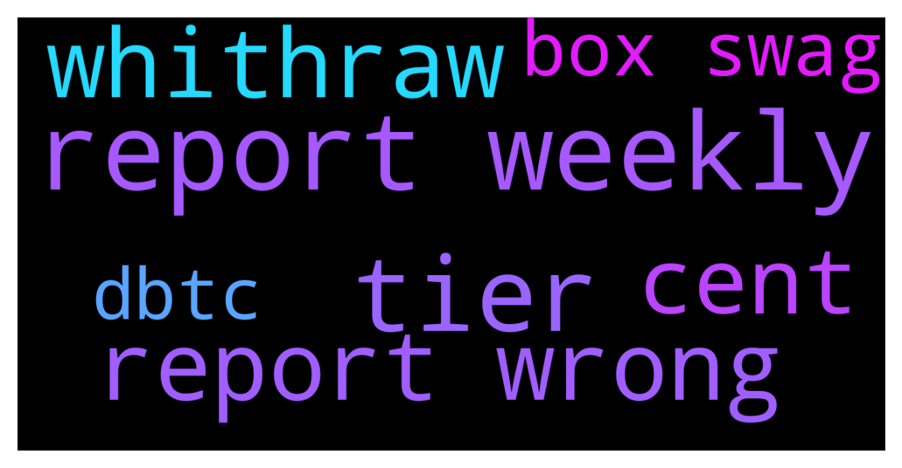

# **@CakeDeFi_EN**
 ## Analysis for **2021-12-12** - **2021-12-13**.

---

## 📊 **Basic Stats**

**n_messages_sent**: 413

---

---

## 🔝 **Top keywords and related messages**

1. **report weekly**

    @Michael_Schredl --- *It looks like something went wrong in the calculation of the weekly report, the team is checking it already* **--->** [TG Discussion](https://t.me/CakeDeFi_EN/152171)

    @itmlgife --- *Steven my report appears to be wrong too. Staking rewards seem correct while LM appear to be underestimated.* **--->** [TG Discussion](https://t.me/CakeDeFi_EN/152078)

    @Brian --- *WHo would I reach out to regarding a discrepancy on the weekly cash flow report?* **--->** [TG Discussion](https://t.me/CakeDeFi_EN/152020)

    @Kache008 --- *Got my weekly report but its wrong..... :/* **--->** [TG Discussion](https://t.me/CakeDeFi_EN/152073)

    @fabioandreatta --- *Next report, next week it should be fixed, no we will not update this weeks report. It is done automatically* **--->** [TG Discussion](https://t.me/CakeDeFi_EN/152174)

    @Michael_Schredl --- *The weekly report is wrong, but you can check your transactions, there is the correct amount* **--->** [TG Discussion](https://t.me/CakeDeFi_EN/152255)

2. **tier**

    @sawwassaw --- *Below the feature you can see "your current tier" the grey outs are "coming soon" noone get it so far - friend of my got a cakedefi basball jacket  out of nowehre from cake, but he went in big - official no swag box so far for anybody* **--->** [TG Discussion](https://t.me/CakeDeFi_EN/152197)

    @MatetheCs --- *I understand how the tiers work.  The benefit cake swag box is light gray under every tier. That’s why I can’t tell which one will it actually start from.* **--->** [TG Discussion](https://t.me/CakeDeFi_EN/152024)

    @MatetheCs --- *Which tier will be eligible for the swag box?* **--->** [TG Discussion](https://t.me/CakeDeFi_EN/152010)

    @peterralff --- *I want to be 1337 VIP tier.* **--->** [TG Discussion](https://t.me/CakeDeFi_EN/152205)

3. **report wrong**

    @Michael_Schredl --- *It looks like something went wrong in the calculation of the weekly report, the team is checking it already* **--->** [TG Discussion](https://t.me/CakeDeFi_EN/152171)

    @itmlgife --- *Steven my report appears to be wrong too. Staking rewards seem correct while LM appear to be underestimated.* **--->** [TG Discussion](https://t.me/CakeDeFi_EN/152078)

    @Brian --- *WHo would I reach out to regarding a discrepancy on the weekly cash flow report?* **--->** [TG Discussion](https://t.me/CakeDeFi_EN/152020)

    @Kache008 --- *Got my weekly report but its wrong..... :/* **--->** [TG Discussion](https://t.me/CakeDeFi_EN/152073)

    @fabioandreatta --- *Next report, next week it should be fixed, no we will not update this weeks report. It is done automatically* **--->** [TG Discussion](https://t.me/CakeDeFi_EN/152174)

    @Michael_Schredl --- *The weekly report is wrong, but you can check your transactions, there is the correct amount* **--->** [TG Discussion](https://t.me/CakeDeFi_EN/152255)

4. **whithraw**

    @AnalWhale666 --- *Yes but why make it 1 more  step, instead of just swap with cakes Dex on site, and then whithraw? That's my question* **--->** [TG Discussion](https://t.me/CakeDeFi_EN/152126)

    @AnalWhale666 --- *Ofc u will have to use a exchange in the end for fiat, leta say binance, but what I don't get is why you can swap btc to everything but not from dfi back to btc and just whithraw, here cake defi wants me to make it o a third party then from there to a exchange, that's 2 extra steps* **--->** [TG Discussion](https://t.me/CakeDeFi_EN/152128)

    @AnalWhale666 --- *Lets say I made 100 dfi and i for fun would like to sell 10, then I unatake , swap for btc, and whithraw right ? Or how would this process look like ?* **--->** [TG Discussion](https://t.me/CakeDeFi_EN/152114)

5. **cent**

    @Dcshel --- *You mean Defichain? Cake is like a central exchange within the Defichain ecosystem* **--->** [TG Discussion](https://t.me/CakeDeFi_EN/151651)

    @acsivrikaya --- *How does the percentage in the referral bonus section change? It was 75 yesterday, it's 50 today.* **--->** [TG Discussion](https://t.me/CakeDeFi_EN/152195)

    @Jan-Niklas --- *Hello guys I've got a question: I have 35$ frozen in dfi staking. Also I have 75 dollar each in btc and dfi which I have set to liquidity mining. Both started on December 12th. Now I got a weekly report and it says: 10 cents staking 2 cents liquidity mining  Without calculating it as it is, why is the liquidity mining part so small? Since the % is double and the money more then 4 times as much, it should be like 80cents plus!  Anyone knows the reason for this?* **--->** [TG Discussion](https://t.me/CakeDeFi_EN/152238)

    @Cosmic88 --- *why dfi current cost around 50cents (usd) more to buy using credit card than using usdt?* **--->** [TG Discussion](https://t.me/CakeDeFi_EN/152188)

    @James --- *The increase in DFI price will make up the decrease in apy so you'll still have a decent income if you're an early adopter* **--->** [TG Discussion](https://t.me/CakeDeFi_EN/151909)

6. **box swag**

    @sawwassaw --- *Below the feature you can see "your current tier" the grey outs are "coming soon" noone get it so far - friend of my got a cakedefi basball jacket  out of nowehre from cake, but he went in big - official no swag box so far for anybody* **--->** [TG Discussion](https://t.me/CakeDeFi_EN/152197)

    @MatetheCs --- *I understand how the tiers work.  The benefit cake swag box is light gray under every tier. That’s why I can’t tell which one will it actually start from.* **--->** [TG Discussion](https://t.me/CakeDeFi_EN/152024)

    @MatetheCs --- *Which tier will be eligible for the swag box?* **--->** [TG Discussion](https://t.me/CakeDeFi_EN/152010)

7. **dbtc**

    @Christian --- *Is it maybe a dBTC <> BTC thing?* **--->** [TG Discussion](https://t.me/CakeDeFi_EN/151791)

    @rhodium219 --- *Which CEX's support deposit of dBTC over the DefiChain network?* **--->** [TG Discussion](https://t.me/CakeDeFi_EN/152112)

    @Gerri --- *How to deposit to Cake dBTC from my Light Wallet? I can only find the address for BTC?* **--->** [TG Discussion](https://t.me/CakeDeFi_EN/152105)

    @Michael_Schredl --- *There is no CEX that supports dBTC* **--->** [TG Discussion](https://t.me/CakeDeFi_EN/152113)

    @JhaRuehl --- *Anyone know how long it takes for dBTC sent from Wallet to cake normally takes? Sent a test transaction to make sure I’m doing it right haha* **--->** [TG Discussion](https://t.me/CakeDeFi_EN/151823)

    @TravisWilliams --- *You can use the DEX on mobile of computer to swop to dBTC or other wrapped token, send that to cake, cake automatically unwraps, then send to any CEX* **--->** [TG Discussion](https://t.me/CakeDeFi_EN/152146)

