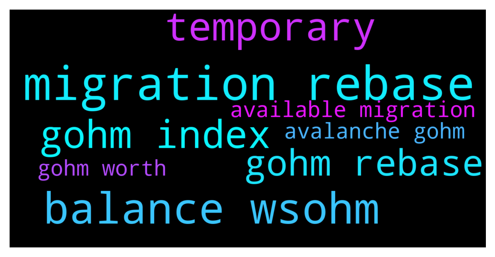

# **@OlympusTG**
 ## Analysis for **2021-12-12** - **2021-12-13**.

---

## 📊 **Basic Stats**

**n_messages_sent**: 3978

---

---

## 🔝 **Top keywords and related messages**

1. **migration rebase**

    @Ap0l1o --- *Just to make one thing clear, to all of you that claim to have issues with the price difference: 1 sOhm has price same as Ohm and has rebases every 8 hours. The difference between sOhm and gOhm is that with sOhm, you have an increase of token quantity, and on the other hand, with gOhm you have increase in price and not in quantity since 1 gOhm = Ohm price x Index - which is equivalent to how much Ohm you would have if you staked one Ohm at the beginning of the staking. This index increases with each rebase, so no matter if you have it as sOhm or gOhm, you should gain same amount.* **--->** [TG Discussion](https://t.me/OlympusTG/117628)

    @Spenny1988 --- *wasnt there something about not getting rebases in the future if sOhm and not gOhm, i dont keep p t date with project that much* **--->** [TG Discussion](https://t.me/OlympusTG/116979)

    @KlimDao --- *I can see my gOHMs on my avax MM however nothing in the OHM Dashboard. I no longer see my rebase, nothing at all and that since yesterday.* **--->** [TG Discussion](https://t.me/OlympusTG/118581)

    @KlimDao --- *If my Current index increase Does this mean that I have my gOHMs in rebase? Although I don't see them on my Dashboard. I only see them on my avax MM* **--->** [TG Discussion](https://t.me/OlympusTG/118918)

    @KingMozzie --- *Yep, you will need to migrate sOHM to gOHM or sOHM v2. But other than that everything else like your rebase rewards will be updated automatically* **--->** [TG Discussion](https://t.me/OlympusTG/117903)

    @KingMozzie --- *The value of your new gOHM will start going up. The rebases are reflected in the price increases of your gOHM.* **--->** [TG Discussion](https://t.me/OlympusTG/118366)

2. **balance wsohm**

    @defimaster4 --- *gOHM = wsOHM  https://twitter.com/OlympusDAO/status/1465410905542385677?t=f_1AV7xGskPSg5WYha1J_w&s=19* **--->** [TG Discussion](https://t.me/OlympusTG/114039)

    @Ap0l1o --- *you have transform and choose sOhm/wsOhm or gOhm and choose to gOhm or sOhm, but you can only approve to gOhm at the moment* **--->** [TG Discussion](https://t.me/OlympusTG/114622)

    @MiaRomeo --- *So gOHM works like wsOHM?  If so then should I still swap wsOHM to gOHM?* **--->** [TG Discussion](https://t.me/OlympusTG/117640)

    @fairwinds --- *Yes, convert that to gOHM on trader joe it will cost you almost nothing. We all, will only have gOHM as 2022 goes on. Ohm and sOHM and wsOHM will be phased out. At this point, there is no idea when.* **--->** [TG Discussion](https://t.me/OlympusTG/117045)

    @Poopoo --- *Olympus but the website is being worked on at the moment for the migration, you can double check your balance by looking up your own address through the debank website or app* **--->** [TG Discussion](https://t.me/OlympusTG/117968)

    @theMagicUnicorn --- *gohm is wsohm v2* **--->** [TG Discussion](https://t.me/OlympusTG/118048)

3. **temporary**

    @theMagicUnicorn --- *oh thats strange, gohm is ready now so, it may be a temporary error, as i know many have already obtained gohm* **--->** [TG Discussion](https://t.me/OlympusTG/116130)

    @Ap0l1o --- *temporary shows 0 and might even say it is 0 for several rebases, but it is all good... just an issue during migration, will be compensated after the migration is done* **--->** [TG Discussion](https://t.me/OlympusTG/115053)

    @BROHMZ --- *Its temporary due to migration and is shown incorrectly* **--->** [TG Discussion](https://t.me/OlympusTG/119291)

    @SMNFT7 --- *I mean not lost, but paused. Now we're gettinf temporary compensated till we break even from the pauss* **--->** [TG Discussion](https://t.me/OlympusTG/118790)

    @Poopoo --- *the APY is temporary fren to make up for lost rebase due to migration, doesnt indicate any direction* **--->** [TG Discussion](https://t.me/OlympusTG/118828)

    @ZR_CRYPTO --- *this is temporary due to missing rebases due to migration* **--->** [TG Discussion](https://t.me/OlympusTG/118567)

4. **gohm index**

    @defimaster4 --- *gOHM = wsOHM  https://twitter.com/OlympusDAO/status/1465410905542385677?t=f_1AV7xGskPSg5WYha1J_w&s=19* **--->** [TG Discussion](https://t.me/OlympusTG/114039)

    @Ap0l1o --- *Just to make one thing clear, to all of you that claim to have issues with the price difference: 1 sOhm has price same as Ohm and has rebases every 8 hours. The difference between sOhm and gOhm is that with sOhm, you have an increase of token quantity, and on the other hand, with gOhm you have increase in price and not in quantity since 1 gOhm = Ohm price x Index - which is equivalent to how much Ohm you would have if you staked one Ohm at the beginning of the staking. This index increases with each rebase, so no matter if you have it as sOhm or gOhm, you should gain same amount.* **--->** [TG Discussion](https://t.me/OlympusTG/117628)

    @theMagicUnicorn --- *when you migrate your sohm to gohm or sohm v2* **--->** [TG Discussion](https://t.me/OlympusTG/118310)

    @theMagicUnicorn --- *it seems sohm to sohm 2 is coming soon, but for now you can go sohm to gohm* **--->** [TG Discussion](https://t.me/OlympusTG/114414)

    @Spenny1988 --- *wasnt there something about not getting rebases in the future if sOhm and not gOhm, i dont keep p t date with project that much* **--->** [TG Discussion](https://t.me/OlympusTG/116979)

    @WalaNaAkoPera --- *but it looks like my gohm not increasing* **--->** [TG Discussion](https://t.me/OlympusTG/119299)

5. **gohm rebase**

    @defimaster4 --- *gOHM = wsOHM  https://twitter.com/OlympusDAO/status/1465410905542385677?t=f_1AV7xGskPSg5WYha1J_w&s=19* **--->** [TG Discussion](https://t.me/OlympusTG/114039)

    @Ap0l1o --- *Just to make one thing clear, to all of you that claim to have issues with the price difference: 1 sOhm has price same as Ohm and has rebases every 8 hours. The difference between sOhm and gOhm is that with sOhm, you have an increase of token quantity, and on the other hand, with gOhm you have increase in price and not in quantity since 1 gOhm = Ohm price x Index - which is equivalent to how much Ohm you would have if you staked one Ohm at the beginning of the staking. This index increases with each rebase, so no matter if you have it as sOhm or gOhm, you should gain same amount.* **--->** [TG Discussion](https://t.me/OlympusTG/117628)

    @theMagicUnicorn --- *when you migrate your sohm to gohm or sohm v2* **--->** [TG Discussion](https://t.me/OlympusTG/118310)

    @theMagicUnicorn --- *it seems sohm to sohm 2 is coming soon, but for now you can go sohm to gohm* **--->** [TG Discussion](https://t.me/OlympusTG/114414)

    @Spenny1988 --- *wasnt there something about not getting rebases in the future if sOhm and not gOhm, i dont keep p t date with project that much* **--->** [TG Discussion](https://t.me/OlympusTG/116979)

    @WalaNaAkoPera --- *but it looks like my gohm not increasing* **--->** [TG Discussion](https://t.me/OlympusTG/119299)

6. **available migration**

    @ghosttmeme --- *I did the migration yesterday from sOHM to gOHM. The value of my gOHM in my MM is decreasing yet OHM price is increasing. what gives?* **--->** [TG Discussion](https://t.me/OlympusTG/117452)

    @Poopoo --- *Olympus but the website is being worked on at the moment for the migration, you can double check your balance by looking up your own address through the debank website or app* **--->** [TG Discussion](https://t.me/OlympusTG/117968)

    @Goal --- *I mean sOHM v2 will also be introduced. Migrating of sOHM v1 to sOHM v2 will also be available as per the discord group announcement.  My question was why move to gOHM when sOHM v2 is an option 🤔* **--->** [TG Discussion](https://t.me/OlympusTG/114194)

    @theMagicUnicorn --- *according to Drondin on discord here, sohm to sohm v2 will be available soon, so we dont just have to migrate sohm to gohm, we can wait a few days and migrate sohm to sohm v2, correct?* **--->** [TG Discussion](https://t.me/OlympusTG/114850)

    @Ap0l1o --- *for now only gOhm is available* **--->** [TG Discussion](https://t.me/OlympusTG/115095)

    @CryptoKaiZ --- *you don't have to stake gOhm and it's available on chains with low tx fees* **--->** [TG Discussion](https://t.me/OlympusTG/117849)

7. **gohm worth**

    @defimaster4 --- *gOHM = wsOHM  https://twitter.com/OlympusDAO/status/1465410905542385677?t=f_1AV7xGskPSg5WYha1J_w&s=19* **--->** [TG Discussion](https://t.me/OlympusTG/114039)

    @Ap0l1o --- *Just to make one thing clear, to all of you that claim to have issues with the price difference: 1 sOhm has price same as Ohm and has rebases every 8 hours. The difference between sOhm and gOhm is that with sOhm, you have an increase of token quantity, and on the other hand, with gOhm you have increase in price and not in quantity since 1 gOhm = Ohm price x Index - which is equivalent to how much Ohm you would have if you staked one Ohm at the beginning of the staking. This index increases with each rebase, so no matter if you have it as sOhm or gOhm, you should gain same amount.* **--->** [TG Discussion](https://t.me/OlympusTG/117628)

    @theMagicUnicorn --- *it seems sohm to sohm 2 is coming soon, but for now you can go sohm to gohm* **--->** [TG Discussion](https://t.me/OlympusTG/114414)

    @theMagicUnicorn --- *when you migrate your sohm to gohm or sohm v2* **--->** [TG Discussion](https://t.me/OlympusTG/118310)

    @Spenny1988 --- *wasnt there something about not getting rebases in the future if sOhm and not gOhm, i dont keep p t date with project that much* **--->** [TG Discussion](https://t.me/OlympusTG/116979)

    @WalaNaAkoPera --- *but it looks like my gohm not increasing* **--->** [TG Discussion](https://t.me/OlympusTG/119299)

8. **avalanche gohm**

    @defimaster4 --- *gOHM = wsOHM  https://twitter.com/OlympusDAO/status/1465410905542385677?t=f_1AV7xGskPSg5WYha1J_w&s=19* **--->** [TG Discussion](https://t.me/OlympusTG/114039)

    @Ap0l1o --- *Just to make one thing clear, to all of you that claim to have issues with the price difference: 1 sOhm has price same as Ohm and has rebases every 8 hours. The difference between sOhm and gOhm is that with sOhm, you have an increase of token quantity, and on the other hand, with gOhm you have increase in price and not in quantity since 1 gOhm = Ohm price x Index - which is equivalent to how much Ohm you would have if you staked one Ohm at the beginning of the staking. This index increases with each rebase, so no matter if you have it as sOhm or gOhm, you should gain same amount.* **--->** [TG Discussion](https://t.me/OlympusTG/117628)

    @theMagicUnicorn --- *it seems sohm to sohm 2 is coming soon, but for now you can go sohm to gohm* **--->** [TG Discussion](https://t.me/OlympusTG/114414)

    @theMagicUnicorn --- *when you migrate your sohm to gohm or sohm v2* **--->** [TG Discussion](https://t.me/OlympusTG/118310)

    @Spenny1988 --- *wasnt there something about not getting rebases in the future if sOhm and not gOhm, i dont keep p t date with project that much* **--->** [TG Discussion](https://t.me/OlympusTG/116979)

    @WalaNaAkoPera --- *but it looks like my gohm not increasing* **--->** [TG Discussion](https://t.me/OlympusTG/119299)

