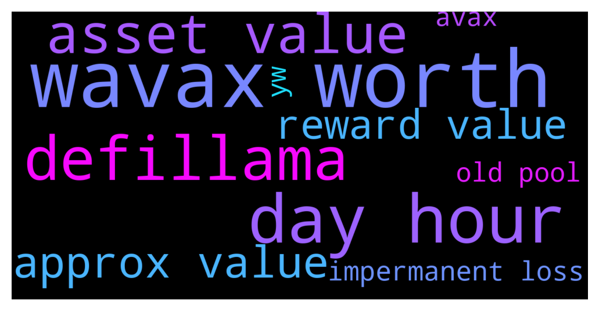

# **@dypfinance**
 ## Analysis for **2021-12-12** - **2021-12-13**.

---

## 📊 **Basic Stats**

**n_messages_sent**: 372

---

---

## 🔝 **Top keywords and related messages**

1. **wavax worth**

    @timdyp --- *#DYP Governance Token Burn  🔥372,557.40 #DYP worth $178,351.80 have been burned and removed from circulation!  Proof transaction👇 https://etherscan.io/tx/0x8e6d31a62da516cf7d716a6ba9f784045bb9973fee8a70f6907740028071df26 https://etherscan.io/tx/0x73765b1b26ca7c3daeae096b04eb1bfe7541a77bda9002f3272b2d119a023f32  👉https://twitter.com/dypfinance/status/1470366754966810627?s=20* **--->** [TG Discussion](https://t.me/dypfinance/229058)

    @hemanrock --- *For FARMS  If you deposit WAVAX worth $1000. the smart contract will split the WAVAX worth $1000 in two parts: WAVAX worth $750 is added to Pangolin AVAX/iDYP LP and WAVAX worth $250 is sent to DYP Staking with up to 140% APY.  https://dypfinance.medium.com/staking-farming-and-buyback-v2-is-live-on-avalanche-c0d16bf1961c  ex:  FARM video tutorial https://www.youtube.com/watch?v=TIC2UimE-50&t=2s* **--->** [TG Discussion](https://t.me/dypfinance/228489)

    @M. --- *hey buddy, i put my avalanche in farm for 2 days. I am worth about $ 1100. But I didn't get enough reward, 0.27Ava yesterday and 0.20Ava today. But according to the calculator, I would have to get $ 1100 more at 1200% APY in value?* **--->** [TG Discussion](https://t.me/dypfinance/228748)

    @Tekkol --- *Hi Caz, For avax chain the  pupported assets are (WAVAX, USDC.e, USDT.e, WETH.e, PNG, QI, DAI.e, XAVA, WBTC.e, LINK.e, or iDYP)  More details: https://dypfinance.medium.com/staking-farming-and-buyback-v2-is-live-on-avalanche-c0d16bf1961c* **--->** [TG Discussion](https://t.me/dypfinance/228762)

    @DhoniMSD516 --- *Hey mate the contracts deal with Wrapped Avax and not AVAX so you are seeing avax balance as 0 but if you se there is WAVAX in contracts and rewards are paid in WAVAX* **--->** [TG Discussion](https://t.me/dypfinance/228846)

    @timdyp --- *0.4 AVAX worth $33.75 deposited 5 days 18 hours ago to 3,30,60, and 90 days pools, and current market value is $34.20.* **--->** [TG Discussion](https://t.me/dypfinance/228970)

2. **day hour**

    @DhoniMSD516 --- *We didn't PROMISE an APY mate please get your statements correct you are saying this from day 1 you joined here, everyone aware that APY is dynamic and includes burns, we also explained how this works in  medium and also being shown under calculator>  Isn't there a way that it can be modified for example every minute automatically according to the real performance - No because we never know if the tokens will be burned or not because this was decided by governance proposal and this will be voted by investors and not from team* **--->** [TG Discussion](https://t.me/dypfinance/229009)

    @DhoniMSD516 --- *These burning happened in ETH farms V1 and these farms will be expired in 3 days* **--->** [TG Discussion](https://t.me/dypfinance/229075)

    @M. --- *hey buddy, i put my avalanche in farm for 2 days. I am worth about $ 1100. But I didn't get enough reward, 0.27Ava yesterday and 0.20Ava today. But according to the calculator, I would have to get $ 1100 more at 1200% APY in value?* **--->** [TG Discussion](https://t.me/dypfinance/228748)

    @JulienRayleigh --- *@timdyp or @DhoniMSD516 did you check the test account for other AVAX pools ? 30, 60 and 90 days ? Thank you very much* **--->** [TG Discussion](https://t.me/dypfinance/228964)

    @DhoniMSD516 --- *If you deposit more the rewards will be more because the share % will be more, everyone will not earn only 1.16% per day* **--->** [TG Discussion](https://t.me/dypfinance/228998)

    @timdyp --- *0.4 AVAX worth $33.75 deposited 5 days 18 hours ago to 3,30,60, and 90 days pools, and current market value is $34.20.* **--->** [TG Discussion](https://t.me/dypfinance/228970)

3. **defillama**

    @timdyp --- *The point is that Coingecko is taking the TVL directly from Defillama, and by default Defillama is showing only our vaults, in order to see the rest of the pools the users must check ''Staking''. Also, we have made a request to Defillama to track the new pools, currently they track only the old pools. Coingecko is working on some updates to include all the pool stats, see attached email.* **--->** [TG Discussion](https://t.me/dypfinance/228960)

4. **asset value**

    @DhoniMSD516 --- *As suggested above mate you can use calculator on dApp to check approx values, we cannot say exact values because the APY is dynamic and includes burn %* **--->** [TG Discussion](https://t.me/dypfinance/229031)

    @DhoniMSD516 --- *The value is approx value* **--->** [TG Discussion](https://t.me/dypfinance/229035)

    @DhoniMSD516 --- *Then you can select the asset which you want to deposit, Click Approve and Click Deposit This tutorial is for BSC but the process is same for AVAX too https://www.youtube.com/watch?v=TIC2UimE-50* **--->** [TG Discussion](https://t.me/dypfinance/228909)

    @M. --- *hey buddy, i put my avalanche in farm for 2 days. I am worth about $ 1100. But I didn't get enough reward, 0.27Ava yesterday and 0.20Ava today. But according to the calculator, I would have to get $ 1100 more at 1200% APY in value?* **--->** [TG Discussion](https://t.me/dypfinance/228748)

    @DhoniMSD516 --- *Please use calculator to know the Approx values* **--->** [TG Discussion](https://t.me/dypfinance/229003)

    @DhoniMSD516 --- *The calculator gives you approx value considering the APY with burn %* **--->** [TG Discussion](https://t.me/dypfinance/228999)

5. **approx value**

    @DhoniMSD516 --- *As suggested above mate you can use calculator on dApp to check approx values, we cannot say exact values because the APY is dynamic and includes burn %* **--->** [TG Discussion](https://t.me/dypfinance/229031)

    @DhoniMSD516 --- *The value is approx value* **--->** [TG Discussion](https://t.me/dypfinance/229035)

    @M. --- *hey buddy, i put my avalanche in farm for 2 days. I am worth about $ 1100. But I didn't get enough reward, 0.27Ava yesterday and 0.20Ava today. But according to the calculator, I would have to get $ 1100 more at 1200% APY in value?* **--->** [TG Discussion](https://t.me/dypfinance/228748)

    @DhoniMSD516 --- *Please use calculator to know the Approx values* **--->** [TG Discussion](https://t.me/dypfinance/229003)

    @DhoniMSD516 --- *The calculator gives you approx value considering the APY with burn %* **--->** [TG Discussion](https://t.me/dypfinance/228999)

    @DhoniMSD516 --- *We are seeing ppl complaining their deposited values are decreasing in value but that is not the case, ofcourse impermanent loss will be positive and negative in values but this is how yield farming works, we should see yield farming as longterm passive income plan and not a quick flip category* **--->** [TG Discussion](https://t.me/dypfinance/228978)

6. **reward value**

    @DhoniMSD516 --- *As suggested above mate you can use calculator on dApp to check approx values, we cannot say exact values because the APY is dynamic and includes burn %* **--->** [TG Discussion](https://t.me/dypfinance/229031)

    @hemanrock --- *With these new strategies, we maximize the yield farming rewards for the users, minimize the impermanent loss.  please check more about how FARMS work.* **--->** [TG Discussion](https://t.me/dypfinance/228497)

    @DhoniMSD516 --- *The value is approx value* **--->** [TG Discussion](https://t.me/dypfinance/229035)

    @Chris_Cryp --- *Your LP will keep decreasing until they manage to get more users into the farm. iDYP is sold everyday to pay rewards and new user deposits into the farms accounts for all the buying pressure for the iDYP price.* **--->** [TG Discussion](https://t.me/dypfinance/229126)

    @M. --- *hey buddy, i put my avalanche in farm for 2 days. I am worth about $ 1100. But I didn't get enough reward, 0.27Ava yesterday and 0.20Ava today. But according to the calculator, I would have to get $ 1100 more at 1200% APY in value?* **--->** [TG Discussion](https://t.me/dypfinance/228748)

    @DhoniMSD516 --- *Please use calculator to know the Approx values* **--->** [TG Discussion](https://t.me/dypfinance/229003)

7. **impermanent loss**

    @hemanrock --- *With these new strategies, we maximize the yield farming rewards for the users, minimize the impermanent loss.  please check more about how FARMS work.* **--->** [TG Discussion](https://t.me/dypfinance/228497)

    @timdyp --- *Julien, please check my previous message scenario number 3: https://t.me/dypfinance/223784 At some point for the old pools the displayed APY was being earned, but these happened after at least 6 months since launch. Also, for the old pools at some point we had 0 IL, but again these happened after 7 months since launch. The yield farming is a long-term game, it is not something that you can flip daily. If you make the mistake to remove your liquidity in a bad moment, you can have losses caused by the IL. https://t.me/dypannouncements/541* **--->** [TG Discussion](https://t.me/dypfinance/229014)

    @DhoniMSD516 --- *Please read about impermanent loss concept* **--->** [TG Discussion](https://t.me/dypfinance/229043)

    @DhoniMSD516 --- *You should read about impermanent loss and have a closer watch on market conditions, also already many times an explanation is given here in this group so please use search function and search for related keywords* **--->** [TG Discussion](https://t.me/dypfinance/229111)

    @DhoniMSD516 --- *We are seeing ppl complaining their deposited values are decreasing in value but that is not the case, ofcourse impermanent loss will be positive and negative in values but this is how yield farming works, we should see yield farming as longterm passive income plan and not a quick flip category* **--->** [TG Discussion](https://t.me/dypfinance/228978)

    @DhoniMSD516 --- *Impermanent loss* **--->** [TG Discussion](https://t.me/dypfinance/229018)

8. **old pool**

    @DhoniMSD516 --- *This is general tope so I suggest you to watch some videos and articles https://academy.binance.com/en/articles/impermanent-loss-explained  and then you can come back to us here are links for our Farming pools BSC: https://dyp.finance/farmv2/bsc AVAX: https://dyp.finance/farmv2/avax Tutorial:  https://youtu.be/TIC2UimE-50* **--->** [TG Discussion](https://t.me/dypfinance/229051)

    @timdyp --- *Julien, please check my previous message scenario number 3: https://t.me/dypfinance/223784 At some point for the old pools the displayed APY was being earned, but these happened after at least 6 months since launch. Also, for the old pools at some point we had 0 IL, but again these happened after 7 months since launch. The yield farming is a long-term game, it is not something that you can flip daily. If you make the mistake to remove your liquidity in a bad moment, you can have losses caused by the IL. https://t.me/dypannouncements/541* **--->** [TG Discussion](https://t.me/dypfinance/229014)

    @JulienRayleigh --- *@timdyp or @DhoniMSD516 did you check the test account for other AVAX pools ? 30, 60 and 90 days ? Thank you very much* **--->** [TG Discussion](https://t.me/dypfinance/228964)

    @DhoniMSD516 --- *The APY is dynamic yes but it stays in good range imo and from what I saw in V1 pools but again the APY depends on many factors* **--->** [TG Discussion](https://t.me/dypfinance/229013)

    @timdyp --- *0.4 AVAX worth $33.75 deposited 5 days 18 hours ago to 3,30,60, and 90 days pools, and current market value is $34.20.* **--->** [TG Discussion](https://t.me/dypfinance/228970)

    @DhoniMSD516 --- *The rewards you get depends on the APY and share % of the pools in above screen you can see so far earned rewards are ~2$ so in ~ 6 Days on 30$ deposit user earned 2$ multiple it to 10, 100, 1000 of deposited value so you got the math :)* **--->** [TG Discussion](https://t.me/dypfinance/228981)

9. **yw**

    @DhoniMSD516 --- *YW :)  If you want to try out our farms and not a fan of spending ETH fees I suggest trying them on BSC or AVAX and also we are soon coming on Polygin too* **--->** [TG Discussion](https://t.me/dypfinance/229023)

    @DhoniMSD516 --- *You should read about impermanent loss and have a closer watch on market conditions, also already many times an explanation is given here in this group so please use search function and search for related keywords* **--->** [TG Discussion](https://t.me/dypfinance/229111)

    @DhoniMSD516 --- *YW :)* **--->** [TG Discussion](https://t.me/dypfinance/229125)

    @DhoniMSD516 --- *YW 👍* **--->** [TG Discussion](https://t.me/dypfinance/229045)

    @DhoniMSD516 --- *Yw 👍* **--->** [TG Discussion](https://t.me/dypfinance/228850)

    @hemanrock --- *Yw.* **--->** [TG Discussion](https://t.me/dypfinance/228770)

10. **avax**

    @hemanrock --- *For FARMS  If you deposit WAVAX worth $1000. the smart contract will split the WAVAX worth $1000 in two parts: WAVAX worth $750 is added to Pangolin AVAX/iDYP LP and WAVAX worth $250 is sent to DYP Staking with up to 140% APY.  https://dypfinance.medium.com/staking-farming-and-buyback-v2-is-live-on-avalanche-c0d16bf1961c  ex:  FARM video tutorial https://www.youtube.com/watch?v=TIC2UimE-50&t=2s* **--->** [TG Discussion](https://t.me/dypfinance/228489)

    @DhoniMSD516 --- *This is general tope so I suggest you to watch some videos and articles https://academy.binance.com/en/articles/impermanent-loss-explained  and then you can come back to us here are links for our Farming pools BSC: https://dyp.finance/farmv2/bsc AVAX: https://dyp.finance/farmv2/avax Tutorial:  https://youtu.be/TIC2UimE-50* **--->** [TG Discussion](https://t.me/dypfinance/229051)

    @iamJubi --- *Start Earning Today with #DeFiYieldProtocol  ▶️ 9077 ETH, 8927 BNB & 17010 AVAX paid to users ▶️ #YieldFarming with #BNB & #AVAX rewards 3802% APY ▶️ #Staking with NO IL 171% APY ▶️ #Buyback with NO IL 168% APY ▶️ #DYPTools, #NTFs and #ReferralProgram  👉https://dyp.finance  https://twitter.com/dypfinance/status/1469717699605504000* **--->** [TG Discussion](https://t.me/dypfinance/228903)

    @DhoniMSD516 --- *Then you can select the asset which you want to deposit, Click Approve and Click Deposit This tutorial is for BSC but the process is same for AVAX too https://www.youtube.com/watch?v=TIC2UimE-50* **--->** [TG Discussion](https://t.me/dypfinance/228909)

    @DhoniMSD516 --- *YW :)  If you want to try out our farms and not a fan of spending ETH fees I suggest trying them on BSC or AVAX and also we are soon coming on Polygin too* **--->** [TG Discussion](https://t.me/dypfinance/229023)

    @Tekkol --- *Hi Caz, For avax chain the  pupported assets are (WAVAX, USDC.e, USDT.e, WETH.e, PNG, QI, DAI.e, XAVA, WBTC.e, LINK.e, or iDYP)  More details: https://dypfinance.medium.com/staking-farming-and-buyback-v2-is-live-on-avalanche-c0d16bf1961c* **--->** [TG Discussion](https://t.me/dypfinance/228762)

