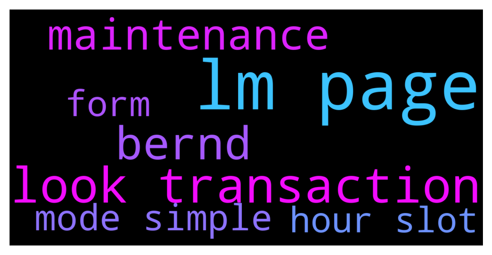

# **@CakeDeFi_EN**
 ## Analysis for **2021-12-13** - **2021-12-14**.

---

## 📊 **Basic Stats**

**n_messages_sent**: 507

---

---

## 🔝 **Top keywords and related messages**

1. **lm page**

    @jezzkng --- *Pls visit the referral page of your cake account. there is a code respresenting your referral code and replace "xxxxxx" in below  https://app.cakedefi.com/?ref=xxxxxx* **--->** [TG Discussion](https://t.me/CakeDeFi_EN/152527)

    @Michael_Schredl --- *The LM Page only shows the comission fee and in the weekly mail was a calculation mistake - next week it should work again* **--->** [TG Discussion](https://t.me/CakeDeFi_EN/152622)

    @DmgBautista --- *What that means is that your DFI rewards from LM get automatically staked into stacking. @moneydelics was acrually asking if it was possible to reinvest those rewards into LM again. But no, not possible automatically* **--->** [TG Discussion](https://t.me/CakeDeFi_EN/151870)

    @Manuel --- *Hi Bernd, Ok, I will show you my way. I am „learning“ the LM with the dTSLA-DUSD Pool. There are 0.0349116 dTSLA and 39.6713039 DUSD. The APR was 350,23%. Let‘s just focus on DUSD. I thought that I Need to Break down the APR to one 12 Hour Slot so I divided the 350,23% by 730 (365 days * 2 12 Hour Slots). That would make 0,47976712% per 12 Hours. After That i just multiplied the DUSD amount with it > 0,19032987 DUSD per 12 Hours. That minus 15% of fees = 0,16178039 DUSD. That seems totally wrong. I received 0,00543378 DUSD Bit I don’t know how to calculate that correctly. There must be an huge mistake taken by me but i can’t See it.🙈* **--->** [TG Discussion](https://t.me/CakeDeFi_EN/152661)

    @velo314 --- *You mean manually converted DFI are auto-staked? And you'd have to unstake them to, for example, LM? What's the downside to temporarily disabling auto? Just the manual hassle? I think we're all anxiously awaiting simple mode's return!* **--->** [TG Discussion](https://t.me/CakeDeFi_EN/152846)

    @Freyr Líndal --- *Can I get a clarification.  On my activity feed I can see Im earning around 0.18 Dfi in 12 hours from BTC/DFI LM  But on LM page on BTC/DFI pool it says DFI rewards is 0.28.  Also got my weekly email yesterday and it says Ive earned from BTC/DFI pool 0.023DFi.  Im confused.* **--->** [TG Discussion](https://t.me/CakeDeFi_EN/152617)

2. **look transaction**

    @fabioandreatta --- *Take a look at the offical website & contact us there. No business on Telegram* **--->** [TG Discussion](https://t.me/CakeDeFi_EN/152334)

    @ChristophG_CG --- *Hello, just want to let you know that my Reward Analyzer also shows the rewards from the new dToken pools. At Cake, you can export the transactions as .csv and get a nice graphical representation of all your rewards... https://www.krypto-sprungbrett.com/cake-reward-analyzer/* **--->** [TG Discussion](https://t.me/CakeDeFi_EN/152082)

    @Michael_Schredl --- *Correct, full rewards are shown unter transactions* **--->** [TG Discussion](https://t.me/CakeDeFi_EN/152629)

    @Michael_Schredl --- *Take a look at all transactions, there you can see the right amount* **--->** [TG Discussion](https://t.me/CakeDeFi_EN/152618)

    @cats_and_dogs --- *I’ve transferred some BTC from cake to my exchange. The BTC is no longer available to transfer but the transaction is not showing in my transactions list. Would transactions normally show up straight away?  I transferred a small amount first which made it successfully to my exchange account.* **--->** [TG Discussion](https://t.me/CakeDeFi_EN/152448)

    @Michael_Schredl --- *The weekly report is wrong, but you can check your transactions, there is the correct amount* **--->** [TG Discussion](https://t.me/CakeDeFi_EN/152255)

3. **bernd**

    @Manuel --- *Hi Bernd, Ok, I will show you my way. I am „learning“ the LM with the dTSLA-DUSD Pool. There are 0.0349116 dTSLA and 39.6713039 DUSD. The APR was 350,23%. Let‘s just focus on DUSD. I thought that I Need to Break down the APR to one 12 Hour Slot so I divided the 350,23% by 730 (365 days * 2 12 Hour Slots). That would make 0,47976712% per 12 Hours. After That i just multiplied the DUSD amount with it > 0,19032987 DUSD per 12 Hours. That minus 15% of fees = 0,16178039 DUSD. That seems totally wrong. I received 0,00543378 DUSD Bit I don’t know how to calculate that correctly. There must be an huge mistake taken by me but i can’t See it.🙈* **--->** [TG Discussion](https://t.me/CakeDeFi_EN/152661)

    @默默啃书小凳子~ --- *Bernd Mack Fake account !!!* **--->** [TG Discussion](https://t.me/CakeDeFi_EN/152487)

    @Manuel --- *Hi Bernd, thanks for your help. How can i calculate these payouts?* **--->** [TG Discussion](https://t.me/CakeDeFi_EN/152693)

    @Manuel --- *Ok, so just sit back, enjoy and stop trying to calculate That. 😅 thanks Bernd. Really appreciate your help.* **--->** [TG Discussion](https://t.me/CakeDeFi_EN/152701)

4. **maintenance**

    @fabioandreatta --- *Kucoin has wallet maintenance* **--->** [TG Discussion](https://t.me/CakeDeFi_EN/152833)

    @fabioandreatta --- *Your money is not lost. Should be processed as soon as kucoin Wallet maintenance is finished* **--->** [TG Discussion](https://t.me/CakeDeFi_EN/152098)

    @fabioandreatta --- *There is nothing to be worried about. I expect Kucoin to finish their maintenance within the next 24 hours.* **--->** [TG Discussion](https://t.me/CakeDeFi_EN/152168)

    @flxdvnden --- *Blockchain maintenance* **--->** [TG Discussion](https://t.me/CakeDeFi_EN/152525)

    @rhodium219 --- *😞 I was looking for another solution to the maintenance issue 😊* **--->** [TG Discussion](https://t.me/CakeDeFi_EN/152117)

    @DmgBautista --- *You can send DFI directly to an exchange that has it listed (altough in the moment some are dpwn with maintenance), or you can use DFX.swiss for example. They are now live with off ramp capability and its designed specifically for DFI, no need to convert into other tokens.* **--->** [TG Discussion](https://t.me/CakeDeFi_EN/152122)

5. **mode simple**

    @fabioandreatta --- *Simple Mode will be finished this week!* **--->** [TG Discussion](https://t.me/CakeDeFi_EN/152847)

    @aemilius89 --- *I got all my dfi staked, auto compounding and all. Thus without the conversion of the simple mode I'd have to unstake, which I'd rather avoid. But yes manual does work.* **--->** [TG Discussion](https://t.me/CakeDeFi_EN/152809)

    @velo314 --- *You mean manually converted DFI are auto-staked? And you'd have to unstake them to, for example, LM? What's the downside to temporarily disabling auto? Just the manual hassle? I think we're all anxiously awaiting simple mode's return!* **--->** [TG Discussion](https://t.me/CakeDeFi_EN/152846)

    @aemilius89 --- *How is the simple mode fix going?* **--->** [TG Discussion](https://t.me/CakeDeFi_EN/152730)

6. **form**

    @jezzkng --- *👉Cake DeFi Security Notice👈  We have been made aware of fraudulent accounts from people claiming to be from Cake DeFi and requesting personal information from members of our community.   As crypto continues to experience significant growth, we request that you remain vigilant, as opportunists will try to take advantage. Remember, Cake DeFi will never ask you for any confidential information including any credentials and / or password, and we will never share deposit or withdrawal addresses in chats or via DM on any social media or instant messenger platform.   If you have seen or experienced any suspected fraudulent activity, please report it to a moderator or a Community Manager Contact official Cake-Support here:   https://cake.zendesk.com/hc/en-us/requests/new  Your safety is our utmost priority and we will investigate every case sent to us* **--->** [TG Discussion](https://t.me/CakeDeFi_EN/152513)

    @cats_and_dogs --- *Sorry perhaps that was poorly worded. I think you were telling me to submit a ticket to support. I’m trying to do that but the e-form asks for info I don’t have.* **--->** [TG Discussion](https://t.me/CakeDeFi_EN/152492)

    @fabioandreatta --- *Possible. Check you email, you can see the contact information right there to ask for the status of your order* **--->** [TG Discussion](https://t.me/CakeDeFi_EN/152866)

    @BerndMack --- *your poolshare in relation to the overall poolshare and then you need an information: How many swaps and how big are the amounts. An information i don't know* **--->** [TG Discussion](https://t.me/CakeDeFi_EN/152696)

    @DmgBautista --- *Business accounts are not yet existent, as far as I know. That feature is planned according my best information, but currently not yet rolled-out. Maybe thats why you were informed that it will take weeks (maybe the answer is already considering the time until it will be implemented)* **--->** [TG Discussion](https://t.me/CakeDeFi_EN/152706)

    @maurizio2k --- *There is a Google Form with a Corporate Account Questionnaire, so there must be a process. You should give this a higher priority, since these accounts normally involve more capital than the retail user…* **--->** [TG Discussion](https://t.me/CakeDeFi_EN/152712)

7. **hour slot**

    @NLN --- *Almost 2 hours now.. trying to swap the rest of dusd that I have to dfi..  also usually I get email from cake.. should I just wait?* **--->** [TG Discussion](https://t.me/CakeDeFi_EN/151872)

    @fabioandreatta --- *Takes at least two hours sometimes longer, check your Banxa Status. As soon as they finish, it takes around 1 hour for it to be added to Cake* **--->** [TG Discussion](https://t.me/CakeDeFi_EN/152768)

    @Manuel --- *Hi Bernd, Ok, I will show you my way. I am „learning“ the LM with the dTSLA-DUSD Pool. There are 0.0349116 dTSLA and 39.6713039 DUSD. The APR was 350,23%. Let‘s just focus on DUSD. I thought that I Need to Break down the APR to one 12 Hour Slot so I divided the 350,23% by 730 (365 days * 2 12 Hour Slots). That would make 0,47976712% per 12 Hours. After That i just multiplied the DUSD amount with it > 0,19032987 DUSD per 12 Hours. That minus 15% of fees = 0,16178039 DUSD. That seems totally wrong. I received 0,00543378 DUSD Bit I don’t know how to calculate that correctly. There must be an huge mistake taken by me but i can’t See it.🙈* **--->** [TG Discussion](https://t.me/CakeDeFi_EN/152661)

    @fabioandreatta --- *There is nothing to be worried about. I expect Kucoin to finish their maintenance within the next 24 hours.* **--->** [TG Discussion](https://t.me/CakeDeFi_EN/152168)

    @Freyr Líndal --- *Can I get a clarification.  On my activity feed I can see Im earning around 0.18 Dfi in 12 hours from BTC/DFI LM  But on LM page on BTC/DFI pool it says DFI rewards is 0.28.  Also got my weekly email yesterday and it says Ive earned from BTC/DFI pool 0.023DFi.  Im confused.* **--->** [TG Discussion](https://t.me/CakeDeFi_EN/152617)

    @freedfidotcom --- *Hi Brandon - I received mine 4 hours ago - I don't believe anyone else has said they haven't received yet* **--->** [TG Discussion](https://t.me/CakeDeFi_EN/152062)

