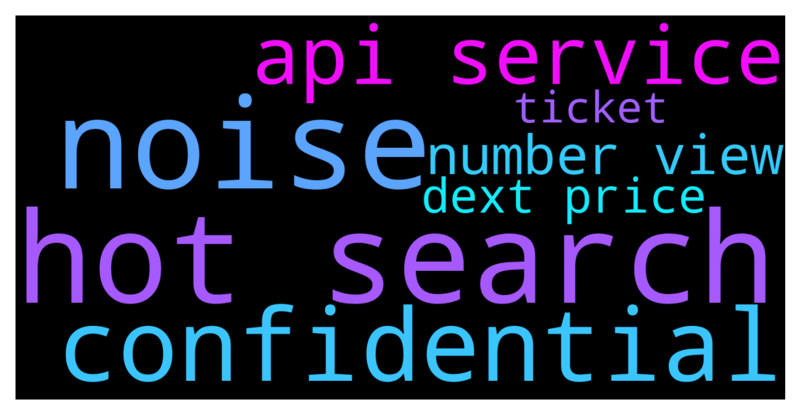

# **@DEXToolsCommunity**
 ## Analysis for **2021-12-12** - **2021-12-14**.

---

## 📊 **Basic Stats**

**n_messages_sent**: 397

---

---

## 🔝 **Top keywords and related messages**

1. **hot search**

    @sertezx --- *Pls remove fame from hot pairs* **--->** [TG Discussion](https://t.me/DEXToolsCommunity/313273)

    @changshengcz --- *Whether it is an ip search is a traffic volume* **--->** [TG Discussion](https://t.me/DEXToolsCommunity/313015)

    @No.One --- *No chart change :) And hot pairs !!!* **--->** [TG Discussion](https://t.me/DEXToolsCommunity/311931)

    @changshengcz --- *We all know it is very hot and popular.* **--->** [TG Discussion](https://t.me/DEXToolsCommunity/313012)

    @changshengcz --- *I think many people are paying attention to hot searches. I want to know how the number of views of hot searches is defined.* **--->** [TG Discussion](https://t.me/DEXToolsCommunity/313026)

    @hmk18990 --- *1) Admins never DM you first or request for funds 2) All pairs are automatically added to DEXTools when pair created & liquidity added 3) Hot Pairs depends on a custom algorithm which is undisclosed so please don't ask about it (and no! It's not for sale) 4) DEXTools Plans 5) DEXTForce (which you need to hold at least 1K of $DEXT) 6) DEXTForce Ventures (which you need to hold at least 100K of $DEXT) 7) DEXTShare Burn It All Edition - DEXT goes deflationary 8) To Improve DEXT Score & Update Social Information for your token, please update etherscan.io or bscscan.com & update information on coinmarketcap.com and coingecko.com 9) For the news, advertisements, sponsorships please DM @guillermorodriguez78 he's the only in charge (and he'll never DM you first) 10) Add DEXTools Telegram Price Bot To Your Group 11) Always DYOR and stay away from scammers 12) New DEXTools Pairs & contracts for $DEXT:   UNI PAIR UNI CA: 0xfb7b4564402e5500db5bb6d63ae671302777c75a  PANCAKE PAIR PANCAKE CA: 0xe91a8d2c584ca93c7405f15c22cdfe53c29896e3* **--->** [TG Discussion](https://t.me/DEXToolsCommunity/312691)

2. **noise**

    @stanes --- *Pink Noise already created a ticket for you. There is nothing more that can be done. Please be patient.* **--->** [TG Discussion](https://t.me/DEXToolsCommunity/313089)

    @prep_mb --- *Thanks. @pink noise* **--->** [TG Discussion](https://t.me/DEXToolsCommunity/313109)

3. **confidential**

    @napascual --- *Understand, but we try to keep it confidential to avoid getting it manipulated* **--->** [TG Discussion](https://t.me/DEXToolsCommunity/313031)

    @changshengcz --- *Well, I'm sorry, I didn't know it was confidential.* **--->** [TG Discussion](https://t.me/DEXToolsCommunity/313023)

4. **api service**

    @napascual --- *We read blockchain in real time, not an api* **--->** [TG Discussion](https://t.me/DEXToolsCommunity/312337)

    @napascual --- *I'd recommend coingecko api as it's free* **--->** [TG Discussion](https://t.me/DEXToolsCommunity/311958)

    @WeShineCapital --- *Is there any plan that you will offer the api service by becoming ur menber* **--->** [TG Discussion](https://t.me/DEXToolsCommunity/312994)

    @WeShineCapital --- *Hey mate do we have a api service？* **--->** [TG Discussion](https://t.me/DEXToolsCommunity/312990)

    @JoeyDieleman --- *There is no additional info known about the public api. Its on the roadmap but delayed.* **--->** [TG Discussion](https://t.me/DEXToolsCommunity/312995)

    @KODIMillionaire --- *Is dextools api open source?* **--->** [TG Discussion](https://t.me/DEXToolsCommunity/312333)

5. **number view**

    @changshengcz --- *Or is an ip that can be accessed multiple times to increase page views* **--->** [TG Discussion](https://t.me/DEXToolsCommunity/313016)

    @napascual --- *Looks like you can set the cooldown with /set_cooldown <chart number> <minutes>* **--->** [TG Discussion](https://t.me/DEXToolsCommunity/312238)

    @napascual --- *that's trading view chart default functionally, you can travel through the history on the chart or change the candle resolution* **--->** [TG Discussion](https://t.me/DEXToolsCommunity/312230)

    @changshengcz --- *I think many people are paying attention to hot searches. I want to know how the number of views of hot searches is defined.* **--->** [TG Discussion](https://t.me/DEXToolsCommunity/313026)

    @changshengcz --- *I can't find where to see the number of views.* **--->** [TG Discussion](https://t.me/DEXToolsCommunity/313017)

6. **dext price**

    @stanes --- *For the monthly subscription it's 100$ paid in DEXT. So today the price of DEXT is 0.5$ then you need to send 200 DEXT. If next month when you want to renew the price is 1$ then you will have to send 100 DEXT. For the holding, it's 1k DEXT whatever the price of DEXT is. And we don't deduct anything from anyone wallet.* **--->** [TG Discussion](https://t.me/DEXToolsCommunity/312901)

    @stanes --- *DEXT UNISWAP PAIR Chart and trade: https://www.dextools.io/app/uniswap/pair-explorer/0xa29fe6ef9592b5d408cca961d0fb9b1faf497d6d Contract: 0xfb7b4564402e5500db5bb6d63ae671302777c75a  DEXT PANCAKESWAP PAIR Chart and trade: https://www.dextools.io/app/pancakeswap/pair-explorer/0x4b729d5d871057f3a9c424792729217cde72410d Contract: 0xe91a8d2c584ca93c7405f15c22cdfe53c29896e3* **--->** [TG Discussion](https://t.me/DEXToolsCommunity/312890)

    @stanes --- *No, DEXT is an utility token but doesn't have any governance power.* **--->** [TG Discussion](https://t.me/DEXToolsCommunity/312083)

    @broadgasorc --- *Launch IDO section  Airdrop for users with  High volume trade by dextools Add to CEXs  Like : Mexc/gate/kucoin Launch stake section for DEXT* **--->** [TG Discussion](https://t.me/DEXToolsCommunity/312091)

    @Madems8 --- *Wait. Let me be more specific.🤦‍♂  I am asking about the DexTools Price bot.* **--->** [TG Discussion](https://t.me/DEXToolsCommunity/312233)

    @Xx_DuLe_xX --- *I have problem i bought 1k dext and on dextools site when i connect my wallet it shows 0 balance* **--->** [TG Discussion](https://t.me/DEXToolsCommunity/313194)

7. **ticket**

    @stanes --- *Pink Noise already created a ticket for you. There is nothing more that can be done. Please be patient.* **--->** [TG Discussion](https://t.me/DEXToolsCommunity/313089)

    @prep_mb --- *Anywhere to create ticket?* **--->** [TG Discussion](https://t.me/DEXToolsCommunity/313088)

