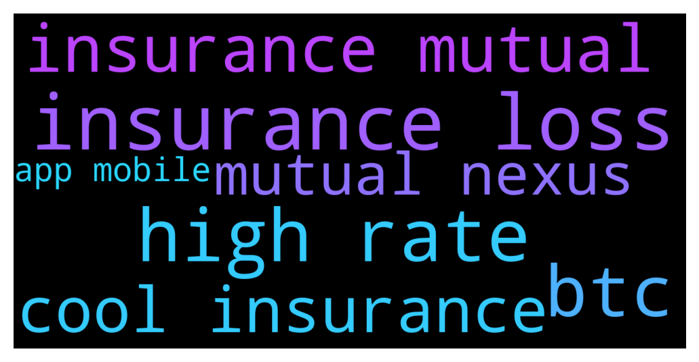

# **@de_fi**
 ## Analysis for **2021-12-13** - **2021-12-14**.

---

## 📊 **Basic Stats**

**n_messages_sent**: 48

---

---

## 🔝 **Top keywords and related messages**

1. **insurance loss**

    @Partickk29 --- *Nexus mutual is an insurance project in blockchain which offer loss insurance which will cover your loss in case of hack or anything like that.  Hodlnaut and nexo supporting nexus mutual* **--->** [TG Discussion](https://t.me/de_fi/231118)

    @WhoCareBaby1 --- *Insurance in crypto??* **--->** [TG Discussion](https://t.me/de_fi/231114)

    @Partickk29 --- *You guy can also buy loss insurance for extra security.* **--->** [TG Discussion](https://t.me/de_fi/231110)

    @SamAlgo1 --- *I didn't know we have insurance in crypto 👍👍* **--->** [TG Discussion](https://t.me/de_fi/231119)

    @SamAlgo1 --- *Cool. What is loss insurance?* **--->** [TG Discussion](https://t.me/de_fi/231115)

2. **high rate**

    @Tomy1919 --- *I'm using all these platforms.  Hodlnaut > Higher rates Nexo > 0 interest loan Celsius > more assets.* **--->** [TG Discussion](https://t.me/de_fi/231108)

    @Partickk29 --- *True, if you're looking for higher rates check Hodlnaut, nexo and Celsius* **--->** [TG Discussion](https://t.me/de_fi/231100)

    @Partickk29 --- *Highest rate is 7.40% APY in Hodlnaut.* **--->** [TG Discussion](https://t.me/de_fi/231103)

    @WhoCareBaby1 --- *Rates are ridiculously low. Not so worthy. I tried Aave and compound with 1% APY for BTC* **--->** [TG Discussion](https://t.me/de_fi/231097)

3. **btc**

    @SamAlgo1 --- *Which platform? For btc* **--->** [TG Discussion](https://t.me/de_fi/231096)

    @WhoCareBaby1 --- *Rates are ridiculously low. Not so worthy. I tried Aave and compound with 1% APY for BTC* **--->** [TG Discussion](https://t.me/de_fi/231097)

    @Tomy1919 --- *For BTC cefi is better, but they are centerlized* **--->** [TG Discussion](https://t.me/de_fi/231098)

    @WhoCareBaby1 --- *Ethereum will flip the btc?* **--->** [TG Discussion](https://t.me/de_fi/231093)

4. **insurance mutual**

    @Partickk29 --- *Nexus mutual is an insurance project in blockchain which offer loss insurance which will cover your loss in case of hack or anything like that.  Hodlnaut and nexo supporting nexus mutual* **--->** [TG Discussion](https://t.me/de_fi/231118)

    @WhoCareBaby1 --- *Insurance in crypto??* **--->** [TG Discussion](https://t.me/de_fi/231114)

    @Partickk29 --- *You guy can also buy loss insurance for extra security.* **--->** [TG Discussion](https://t.me/de_fi/231110)

    @SamAlgo1 --- *I didn't know we have insurance in crypto 👍👍* **--->** [TG Discussion](https://t.me/de_fi/231119)

    @SamAlgo1 --- *Cool. What is loss insurance?* **--->** [TG Discussion](https://t.me/de_fi/231115)

5. **cool insurance**

    @Partickk29 --- *Nexus mutual is an insurance project in blockchain which offer loss insurance which will cover your loss in case of hack or anything like that.  Hodlnaut and nexo supporting nexus mutual* **--->** [TG Discussion](https://t.me/de_fi/231118)

    @WhoCareBaby1 --- *Insurance in crypto??* **--->** [TG Discussion](https://t.me/de_fi/231114)

    @Partickk29 --- *You guy can also buy loss insurance for extra security.* **--->** [TG Discussion](https://t.me/de_fi/231110)

    @SamAlgo1 --- *I didn't know we have insurance in crypto 👍👍* **--->** [TG Discussion](https://t.me/de_fi/231119)

    @Partickk29 --- *They are an authorized company in Singapore with nearly $500M funds under management which is cool.* **--->** [TG Discussion](https://t.me/de_fi/231109)

    @SamAlgo1 --- *Cool. What is loss insurance?* **--->** [TG Discussion](https://t.me/de_fi/231115)

6. **mutual nexus**

    @Partickk29 --- *Nexus mutual is an insurance project in blockchain which offer loss insurance which will cover your loss in case of hack or anything like that.  Hodlnaut and nexo supporting nexus mutual* **--->** [TG Discussion](https://t.me/de_fi/231118)

7. **app mobile**

    @WhoCareBaby1 --- *They all have mobile app? Should we do KYC?* **--->** [TG Discussion](https://t.me/de_fi/231113)

    @Tomy1919 --- *Yeah. You can use mobile app. HN app is easy to use. Just try it* **--->** [TG Discussion](https://t.me/de_fi/231117)

