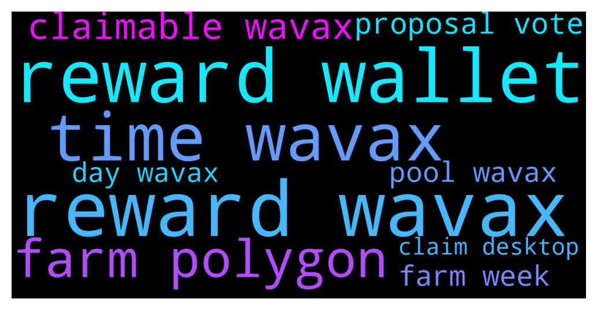

# **@dypfinance**
 ## Analysis for **2021-12-13** - **2021-12-14**.

---

## 📊 **Basic Stats**

**n_messages_sent**: 426

---

---

## 🔝 **Top keywords and related messages**

1. **reward wavax**

    @DhoniMSD516 --- *Hey DYP rewards are updated real time. WAVAX/WBNB rewards are updated every 24H and a claim trigger should be happened  You can hover on Claim in desktop to see time for next rewards and claim when it says Feel free to execute or you can wait and if someone from pool trigger claim rewards are shown* **--->** [TG Discussion](https://t.me/dypfinance/229324)

    @DhoniMSD516 --- *To check time for next rewards hover on Claim in desktop* **--->** [TG Discussion](https://t.me/dypfinance/229484)

    @timdyp --- *DeFi Yield Protocol #DYP Stats and Products for new users:  - Our Liquidity Providers earned 9085 #ETH, 9019 #BNB, and 17443 #AVAX worth $39,628,227 Millions - $10,216,418 liquidity on #Uniswap, #PancakeSwap and #Pangolin - Total Value Locked (TVL) $34,261,372.00 - Total users 23,556   Latest Announcements and Events: https://dyp.finance/latestupdates   DeFi Yield Protocol offers four different ways for earning a passive income:  FARM Automatically adds liquidity using one asset. To start earning, all you need is to deposit one of the supported assets. The protocol employs an anti-manipulation feature that aims to limit the market impact on users’ converting rewards into ETH and other native platform tokens. https://dyp.finance/farmv2  STAKE Stake your DYP tokens and earn up to 165% APY.  No Impermanent Loss. To start earning, all you need is to deposit DYP tokens into the Staking contract. You can choose from two different staking options, with rewards starting from 62% APY up to 165% APY, depending on the lock time from a minimum of zero-days up to a maximum of 90 days. https://dyp.finance/stakev2  BUYBACK The Buyback is one of the latest products from DeFi Yield Protocol. It is a smart contract with staking integrated that offers up to 157% APY for the users. https://dyp.finance/buybackv2  VAULT The DYP Earn Vault is an automated yield farming contract with Compound Protocol integration and support for ETH, WBTC, USDC, USDT, and DAI markets. https://dyp.finance/vault   Other products from DeFi Yield Protocol:  NFTs The NFT dApp by Defi Yield Protocol acts as a marketplace and a gallery where users can mint, buy, sell and trade NFTs for a fixed price.  https://nft.dyp.finance/ V2 version will be released soon, for more info https://t.me/dypannouncements/752.  DYP TOOLS The core feature of the DYP is the decentralized tool dashboard. It provides advanced features, such as Decentralized Score, Unique Community Trust Vote System, DYP Locker, Yield Farm Data, and LaunchPad, allowing investors to make informed decisions that maximize yields and reduce risks. https://tools.dyp.finance/  REFERRAL Should you refer DYP to your friends, 5% of your friends rewards will be automatically sent to you whenever your friends stake DYP. You do not need to stake, it’s automatically sent to you, free of gas fee. https://dyp.finance/referralv2  BRIDGE The Bridge will help you swap DYP tokens between Ethereum Network and Binance Smart Chain / Avalanche Network. https://dyp.finance/bridge  GOVERNANCE DYP tokens represent voting shares in DeFi Yield protocol governance. DYP holders through governance can vote to add more pools, burn tokens, or allocate DYP toward grants, strategic partnerships, governance initiatives, and other programs. https://dyp.finance/vote   If you're interested to learn more, please subscribe to our YouTube Official Channel: https://www.youtube.com/c/DeFiYieldProtocol   For the latest updates join our Announcement Channel:  https://t.me/dypannouncements   Not allowed: Harmful language, insulting others, outright FUD, false/misleading information, shilling other projects, or price discussion. Links to outside forums will be accepted as long as they follow the rules above.  Instant BAN: impersonation, discrimination, explicit content, promotional links, spam, bots, or outright scams.   Please report anyone impersonating team members to the moderators listed below.   Team Moderators:  @DhoniMSD516 @iamJubi @kleopatrad @hemanrock @Tekkol @timdyp  Admins will NOT take the initiative to message you privately to solve problems. Never give your private keys to anyone, send tokens to addresses that they offer, or click on any links that they provide. Don’t share confidential personal information in private chats, and don't make transactions of any kind at all.* **--->** [TG Discussion](https://t.me/dypfinance/229271)

    @Tekkol --- *Hi Caz, For avax chain the  pupported assets are (WAVAX, USDC.e, USDT.e, WETH.e, PNG, QI, DAI.e, XAVA, WBTC.e, LINK.e, or iDYP)  More details: https://dypfinance.medium.com/staking-farming-and-buyback-v2-is-live-on-avalanche-c0d16bf1961c* **--->** [TG Discussion](https://t.me/dypfinance/228762)

    @DhoniMSD516 --- *Hey the DYP rewards are updated real time, the WAVAX rewards needs claim trigger, yes you can hit CLAIM button to claim WAVAX rewards every 24H* **--->** [TG Discussion](https://t.me/dypfinance/229504)

    @DhoniMSD516 --- *DYP rewards are updated real time WAVAX rewards are updated every 24H and a claim trigger should be happened* **--->** [TG Discussion](https://t.me/dypfinance/229120)

2. **reward wallet**

    @DhoniMSD516 --- *Hey DYP rewards are updated real time. WAVAX/WBNB rewards are updated every 24H and a claim trigger should be happened  You can hover on Claim in desktop to see time for next rewards and claim when it says Feel free to execute or you can wait and if someone from pool trigger claim rewards are shown* **--->** [TG Discussion](https://t.me/dypfinance/229324)

    @DhoniMSD516 --- *To check time for next rewards hover on Claim in desktop* **--->** [TG Discussion](https://t.me/dypfinance/229484)

    @timdyp --- *DeFi Yield Protocol #DYP Stats and Products for new users:  - Our Liquidity Providers earned 9085 #ETH, 9019 #BNB, and 17443 #AVAX worth $39,628,227 Millions - $10,216,418 liquidity on #Uniswap, #PancakeSwap and #Pangolin - Total Value Locked (TVL) $34,261,372.00 - Total users 23,556   Latest Announcements and Events: https://dyp.finance/latestupdates   DeFi Yield Protocol offers four different ways for earning a passive income:  FARM Automatically adds liquidity using one asset. To start earning, all you need is to deposit one of the supported assets. The protocol employs an anti-manipulation feature that aims to limit the market impact on users’ converting rewards into ETH and other native platform tokens. https://dyp.finance/farmv2  STAKE Stake your DYP tokens and earn up to 165% APY.  No Impermanent Loss. To start earning, all you need is to deposit DYP tokens into the Staking contract. You can choose from two different staking options, with rewards starting from 62% APY up to 165% APY, depending on the lock time from a minimum of zero-days up to a maximum of 90 days. https://dyp.finance/stakev2  BUYBACK The Buyback is one of the latest products from DeFi Yield Protocol. It is a smart contract with staking integrated that offers up to 157% APY for the users. https://dyp.finance/buybackv2  VAULT The DYP Earn Vault is an automated yield farming contract with Compound Protocol integration and support for ETH, WBTC, USDC, USDT, and DAI markets. https://dyp.finance/vault   Other products from DeFi Yield Protocol:  NFTs The NFT dApp by Defi Yield Protocol acts as a marketplace and a gallery where users can mint, buy, sell and trade NFTs for a fixed price.  https://nft.dyp.finance/ V2 version will be released soon, for more info https://t.me/dypannouncements/752.  DYP TOOLS The core feature of the DYP is the decentralized tool dashboard. It provides advanced features, such as Decentralized Score, Unique Community Trust Vote System, DYP Locker, Yield Farm Data, and LaunchPad, allowing investors to make informed decisions that maximize yields and reduce risks. https://tools.dyp.finance/  REFERRAL Should you refer DYP to your friends, 5% of your friends rewards will be automatically sent to you whenever your friends stake DYP. You do not need to stake, it’s automatically sent to you, free of gas fee. https://dyp.finance/referralv2  BRIDGE The Bridge will help you swap DYP tokens between Ethereum Network and Binance Smart Chain / Avalanche Network. https://dyp.finance/bridge  GOVERNANCE DYP tokens represent voting shares in DeFi Yield protocol governance. DYP holders through governance can vote to add more pools, burn tokens, or allocate DYP toward grants, strategic partnerships, governance initiatives, and other programs. https://dyp.finance/vote   If you're interested to learn more, please subscribe to our YouTube Official Channel: https://www.youtube.com/c/DeFiYieldProtocol   For the latest updates join our Announcement Channel:  https://t.me/dypannouncements   Not allowed: Harmful language, insulting others, outright FUD, false/misleading information, shilling other projects, or price discussion. Links to outside forums will be accepted as long as they follow the rules above.  Instant BAN: impersonation, discrimination, explicit content, promotional links, spam, bots, or outright scams.   Please report anyone impersonating team members to the moderators listed below.   Team Moderators:  @DhoniMSD516 @iamJubi @kleopatrad @hemanrock @Tekkol @timdyp  Admins will NOT take the initiative to message you privately to solve problems. Never give your private keys to anyone, send tokens to addresses that they offer, or click on any links that they provide. Don’t share confidential personal information in private chats, and don't make transactions of any kind at all.* **--->** [TG Discussion](https://t.me/dypfinance/229271)

    @DhoniMSD516 --- *Hey the DYP rewards are updated real time, the WAVAX rewards needs claim trigger, yes you can hit CLAIM button to claim WAVAX rewards every 24H* **--->** [TG Discussion](https://t.me/dypfinance/229504)

    @DhoniMSD516 --- *DYP rewards are updated real time WAVAX rewards are updated every 24H and a claim trigger should be happened* **--->** [TG Discussion](https://t.me/dypfinance/229120)

    @DhoniMSD516 --- *You can hover on Claim in desktop to see time for next rewards and claim when it says Feel free to execute or you cna wait and if someone from pool trigger claim rewards are shown* **--->** [TG Discussion](https://t.me/dypfinance/229122)

3. **time wavax**

    @DhoniMSD516 --- *Hey DYP rewards are updated real time. WAVAX/WBNB rewards are updated every 24H and a claim trigger should be happened  You can hover on Claim in desktop to see time for next rewards and claim when it says Feel free to execute or you can wait and if someone from pool trigger claim rewards are shown* **--->** [TG Discussion](https://t.me/dypfinance/229324)

    @DhoniMSD516 --- *To check time for next rewards hover on Claim in desktop* **--->** [TG Discussion](https://t.me/dypfinance/229484)

    @timdyp --- *DeFi Yield Protocol #DYP Stats and Products for new users:  - Our Liquidity Providers earned 9085 #ETH, 9019 #BNB, and 17443 #AVAX worth $39,628,227 Millions - $10,216,418 liquidity on #Uniswap, #PancakeSwap and #Pangolin - Total Value Locked (TVL) $34,261,372.00 - Total users 23,556   Latest Announcements and Events: https://dyp.finance/latestupdates   DeFi Yield Protocol offers four different ways for earning a passive income:  FARM Automatically adds liquidity using one asset. To start earning, all you need is to deposit one of the supported assets. The protocol employs an anti-manipulation feature that aims to limit the market impact on users’ converting rewards into ETH and other native platform tokens. https://dyp.finance/farmv2  STAKE Stake your DYP tokens and earn up to 165% APY.  No Impermanent Loss. To start earning, all you need is to deposit DYP tokens into the Staking contract. You can choose from two different staking options, with rewards starting from 62% APY up to 165% APY, depending on the lock time from a minimum of zero-days up to a maximum of 90 days. https://dyp.finance/stakev2  BUYBACK The Buyback is one of the latest products from DeFi Yield Protocol. It is a smart contract with staking integrated that offers up to 157% APY for the users. https://dyp.finance/buybackv2  VAULT The DYP Earn Vault is an automated yield farming contract with Compound Protocol integration and support for ETH, WBTC, USDC, USDT, and DAI markets. https://dyp.finance/vault   Other products from DeFi Yield Protocol:  NFTs The NFT dApp by Defi Yield Protocol acts as a marketplace and a gallery where users can mint, buy, sell and trade NFTs for a fixed price.  https://nft.dyp.finance/ V2 version will be released soon, for more info https://t.me/dypannouncements/752.  DYP TOOLS The core feature of the DYP is the decentralized tool dashboard. It provides advanced features, such as Decentralized Score, Unique Community Trust Vote System, DYP Locker, Yield Farm Data, and LaunchPad, allowing investors to make informed decisions that maximize yields and reduce risks. https://tools.dyp.finance/  REFERRAL Should you refer DYP to your friends, 5% of your friends rewards will be automatically sent to you whenever your friends stake DYP. You do not need to stake, it’s automatically sent to you, free of gas fee. https://dyp.finance/referralv2  BRIDGE The Bridge will help you swap DYP tokens between Ethereum Network and Binance Smart Chain / Avalanche Network. https://dyp.finance/bridge  GOVERNANCE DYP tokens represent voting shares in DeFi Yield protocol governance. DYP holders through governance can vote to add more pools, burn tokens, or allocate DYP toward grants, strategic partnerships, governance initiatives, and other programs. https://dyp.finance/vote   If you're interested to learn more, please subscribe to our YouTube Official Channel: https://www.youtube.com/c/DeFiYieldProtocol   For the latest updates join our Announcement Channel:  https://t.me/dypannouncements   Not allowed: Harmful language, insulting others, outright FUD, false/misleading information, shilling other projects, or price discussion. Links to outside forums will be accepted as long as they follow the rules above.  Instant BAN: impersonation, discrimination, explicit content, promotional links, spam, bots, or outright scams.   Please report anyone impersonating team members to the moderators listed below.   Team Moderators:  @DhoniMSD516 @iamJubi @kleopatrad @hemanrock @Tekkol @timdyp  Admins will NOT take the initiative to message you privately to solve problems. Never give your private keys to anyone, send tokens to addresses that they offer, or click on any links that they provide. Don’t share confidential personal information in private chats, and don't make transactions of any kind at all.* **--->** [TG Discussion](https://t.me/dypfinance/229271)

    @Tekkol --- *Hi Caz, For avax chain the  pupported assets are (WAVAX, USDC.e, USDT.e, WETH.e, PNG, QI, DAI.e, XAVA, WBTC.e, LINK.e, or iDYP)  More details: https://dypfinance.medium.com/staking-farming-and-buyback-v2-is-live-on-avalanche-c0d16bf1961c* **--->** [TG Discussion](https://t.me/dypfinance/228762)

    @DhoniMSD516 --- *Hey the DYP rewards are updated real time, the WAVAX rewards needs claim trigger, yes you can hit CLAIM button to claim WAVAX rewards every 24H* **--->** [TG Discussion](https://t.me/dypfinance/229504)

    @DhoniMSD516 --- *DYP rewards are updated real time WAVAX rewards are updated every 24H and a claim trigger should be happened* **--->** [TG Discussion](https://t.me/dypfinance/229120)

4. **farm polygon**

    @DhoniMSD516 --- *YW :)  If you want to try out our farms and not a fan of spending ETH fees I suggest trying them on BSC or AVAX and also we are soon coming on Polygin too* **--->** [TG Discussion](https://t.me/dypfinance/229023)

    @timdyp --- *DeFi Yield Protocol #DYP Stats and Products for new users:  - Our Liquidity Providers earned 9085 #ETH, 9019 #BNB, and 17443 #AVAX worth $39,628,227 Millions - $10,216,418 liquidity on #Uniswap, #PancakeSwap and #Pangolin - Total Value Locked (TVL) $34,261,372.00 - Total users 23,556   Latest Announcements and Events: https://dyp.finance/latestupdates   DeFi Yield Protocol offers four different ways for earning a passive income:  FARM Automatically adds liquidity using one asset. To start earning, all you need is to deposit one of the supported assets. The protocol employs an anti-manipulation feature that aims to limit the market impact on users’ converting rewards into ETH and other native platform tokens. https://dyp.finance/farmv2  STAKE Stake your DYP tokens and earn up to 165% APY.  No Impermanent Loss. To start earning, all you need is to deposit DYP tokens into the Staking contract. You can choose from two different staking options, with rewards starting from 62% APY up to 165% APY, depending on the lock time from a minimum of zero-days up to a maximum of 90 days. https://dyp.finance/stakev2  BUYBACK The Buyback is one of the latest products from DeFi Yield Protocol. It is a smart contract with staking integrated that offers up to 157% APY for the users. https://dyp.finance/buybackv2  VAULT The DYP Earn Vault is an automated yield farming contract with Compound Protocol integration and support for ETH, WBTC, USDC, USDT, and DAI markets. https://dyp.finance/vault   Other products from DeFi Yield Protocol:  NFTs The NFT dApp by Defi Yield Protocol acts as a marketplace and a gallery where users can mint, buy, sell and trade NFTs for a fixed price.  https://nft.dyp.finance/ V2 version will be released soon, for more info https://t.me/dypannouncements/752.  DYP TOOLS The core feature of the DYP is the decentralized tool dashboard. It provides advanced features, such as Decentralized Score, Unique Community Trust Vote System, DYP Locker, Yield Farm Data, and LaunchPad, allowing investors to make informed decisions that maximize yields and reduce risks. https://tools.dyp.finance/  REFERRAL Should you refer DYP to your friends, 5% of your friends rewards will be automatically sent to you whenever your friends stake DYP. You do not need to stake, it’s automatically sent to you, free of gas fee. https://dyp.finance/referralv2  BRIDGE The Bridge will help you swap DYP tokens between Ethereum Network and Binance Smart Chain / Avalanche Network. https://dyp.finance/bridge  GOVERNANCE DYP tokens represent voting shares in DeFi Yield protocol governance. DYP holders through governance can vote to add more pools, burn tokens, or allocate DYP toward grants, strategic partnerships, governance initiatives, and other programs. https://dyp.finance/vote   If you're interested to learn more, please subscribe to our YouTube Official Channel: https://www.youtube.com/c/DeFiYieldProtocol   For the latest updates join our Announcement Channel:  https://t.me/dypannouncements   Not allowed: Harmful language, insulting others, outright FUD, false/misleading information, shilling other projects, or price discussion. Links to outside forums will be accepted as long as they follow the rules above.  Instant BAN: impersonation, discrimination, explicit content, promotional links, spam, bots, or outright scams.   Please report anyone impersonating team members to the moderators listed below.   Team Moderators:  @DhoniMSD516 @iamJubi @kleopatrad @hemanrock @Tekkol @timdyp  Admins will NOT take the initiative to message you privately to solve problems. Never give your private keys to anyone, send tokens to addresses that they offer, or click on any links that they provide. Don’t share confidential personal information in private chats, and don't make transactions of any kind at all.* **--->** [TG Discussion](https://t.me/dypfinance/229271)

    @DhoniMSD516 --- *Planned for this month, next up ETH farms, then Launchpad then Polygon farms* **--->** [TG Discussion](https://t.me/dypfinance/229419)

    @DhoniMSD516 --- *We will be having ETH V2 farms this week, Launchpad might be coming next week* **--->** [TG Discussion](https://t.me/dypfinance/229409)

    @DhoniMSD516 --- *As AVAX farms are newer than BSC the APY is more compared to BSC now* **--->** [TG Discussion](https://t.me/dypfinance/229028)

    @DhoniMSD516 --- *These burning happened in ETH farms V1 and these farms will be expired in 3 days* **--->** [TG Discussion](https://t.me/dypfinance/229075)

5. **claimable wavax**

    @DhoniMSD516 --- *Hey DYP rewards are updated real time. WAVAX/WBNB rewards are updated every 24H and a claim trigger should be happened  You can hover on Claim in desktop to see time for next rewards and claim when it says Feel free to execute or you can wait and if someone from pool trigger claim rewards are shown* **--->** [TG Discussion](https://t.me/dypfinance/229324)

    @Tekkol --- *Hi Caz, For avax chain the  pupported assets are (WAVAX, USDC.e, USDT.e, WETH.e, PNG, QI, DAI.e, XAVA, WBTC.e, LINK.e, or iDYP)  More details: https://dypfinance.medium.com/staking-farming-and-buyback-v2-is-live-on-avalanche-c0d16bf1961c* **--->** [TG Discussion](https://t.me/dypfinance/228762)

    @DhoniMSD516 --- *Hey the DYP rewards are updated real time, the WAVAX rewards needs claim trigger, yes you can hit CLAIM button to claim WAVAX rewards every 24H* **--->** [TG Discussion](https://t.me/dypfinance/229504)

    @DhoniMSD516 --- *DYP rewards are updated real time WAVAX rewards are updated every 24H and a claim trigger should be happened* **--->** [TG Discussion](https://t.me/dypfinance/229120)

    @DhoniMSD516 --- *Hey mate the contracts deal with Wrapped Avax and not AVAX so you are seeing avax balance as 0 but if you se there is WAVAX in contracts and rewards are paid in WAVAX* **--->** [TG Discussion](https://t.me/dypfinance/228846)

    @DhoniMSD516 --- *You will not be earning WBNB/WAVAX because you removed LP* **--->** [TG Discussion](https://t.me/dypfinance/229168)

6. **proposal vote**

    @DhoniMSD516 --- *We didn't PROMISE an APY mate please get your statements correct you are saying this from day 1 you joined here, everyone aware that APY is dynamic and includes burns, we also explained how this works in  medium and also being shown under calculator>  Isn't there a way that it can be modified for example every minute automatically according to the real performance - No because we never know if the tokens will be burned or not because this was decided by governance proposal and this will be voted by investors and not from team* **--->** [TG Discussion](https://t.me/dypfinance/229009)

    @DhoniMSD516 --- *https://t.me/dypannouncements/757 This is one such even which when vote to burn the tokens from ETH pools got burned yesterday* **--->** [TG Discussion](https://t.me/dypfinance/229332)

    @DhoniMSD516 --- *Hey AVAX V2 launched just 5 Days ago the burn/disburse vote didn't happen yet, you can create a proposal here https://gov-avax.dyp.finance/ with 5000 DYP and can vote it out either to burn or disburse 25000 votes needed for a proposal to be successfull* **--->** [TG Discussion](https://t.me/dypfinance/229330)

    @timdyp --- *DeFi Yield Protocol #DYP Stats and Products for new users:  - Our Liquidity Providers earned 9085 #ETH, 9019 #BNB, and 17443 #AVAX worth $39,628,227 Millions - $10,216,418 liquidity on #Uniswap, #PancakeSwap and #Pangolin - Total Value Locked (TVL) $34,261,372.00 - Total users 23,556   Latest Announcements and Events: https://dyp.finance/latestupdates   DeFi Yield Protocol offers four different ways for earning a passive income:  FARM Automatically adds liquidity using one asset. To start earning, all you need is to deposit one of the supported assets. The protocol employs an anti-manipulation feature that aims to limit the market impact on users’ converting rewards into ETH and other native platform tokens. https://dyp.finance/farmv2  STAKE Stake your DYP tokens and earn up to 165% APY.  No Impermanent Loss. To start earning, all you need is to deposit DYP tokens into the Staking contract. You can choose from two different staking options, with rewards starting from 62% APY up to 165% APY, depending on the lock time from a minimum of zero-days up to a maximum of 90 days. https://dyp.finance/stakev2  BUYBACK The Buyback is one of the latest products from DeFi Yield Protocol. It is a smart contract with staking integrated that offers up to 157% APY for the users. https://dyp.finance/buybackv2  VAULT The DYP Earn Vault is an automated yield farming contract with Compound Protocol integration and support for ETH, WBTC, USDC, USDT, and DAI markets. https://dyp.finance/vault   Other products from DeFi Yield Protocol:  NFTs The NFT dApp by Defi Yield Protocol acts as a marketplace and a gallery where users can mint, buy, sell and trade NFTs for a fixed price.  https://nft.dyp.finance/ V2 version will be released soon, for more info https://t.me/dypannouncements/752.  DYP TOOLS The core feature of the DYP is the decentralized tool dashboard. It provides advanced features, such as Decentralized Score, Unique Community Trust Vote System, DYP Locker, Yield Farm Data, and LaunchPad, allowing investors to make informed decisions that maximize yields and reduce risks. https://tools.dyp.finance/  REFERRAL Should you refer DYP to your friends, 5% of your friends rewards will be automatically sent to you whenever your friends stake DYP. You do not need to stake, it’s automatically sent to you, free of gas fee. https://dyp.finance/referralv2  BRIDGE The Bridge will help you swap DYP tokens between Ethereum Network and Binance Smart Chain / Avalanche Network. https://dyp.finance/bridge  GOVERNANCE DYP tokens represent voting shares in DeFi Yield protocol governance. DYP holders through governance can vote to add more pools, burn tokens, or allocate DYP toward grants, strategic partnerships, governance initiatives, and other programs. https://dyp.finance/vote   If you're interested to learn more, please subscribe to our YouTube Official Channel: https://www.youtube.com/c/DeFiYieldProtocol   For the latest updates join our Announcement Channel:  https://t.me/dypannouncements   Not allowed: Harmful language, insulting others, outright FUD, false/misleading information, shilling other projects, or price discussion. Links to outside forums will be accepted as long as they follow the rules above.  Instant BAN: impersonation, discrimination, explicit content, promotional links, spam, bots, or outright scams.   Please report anyone impersonating team members to the moderators listed below.   Team Moderators:  @DhoniMSD516 @iamJubi @kleopatrad @hemanrock @Tekkol @timdyp  Admins will NOT take the initiative to message you privately to solve problems. Never give your private keys to anyone, send tokens to addresses that they offer, or click on any links that they provide. Don’t share confidential personal information in private chats, and don't make transactions of any kind at all.* **--->** [TG Discussion](https://t.me/dypfinance/229271)

    @DhoniMSD516 --- *Mate I already explained YOU in multiple instances and also to others in this group, the APY includes Burn % this is how our contracts are working nothing being manipulated and the Burning of tokens or disburse is again decided by investors using a governance proposal, please even after explaining you clearly making such statements is not a correct way.* **--->** [TG Discussion](https://t.me/dypfinance/229006)

    @Nubarv --- *In bsc there is already a proposal to burn with only 52 votes?  Am i reading correctly?* **--->** [TG Discussion](https://t.me/dypfinance/229351)

7. **farm week**

    @DhoniMSD516 --- *YW :)  If you want to try out our farms and not a fan of spending ETH fees I suggest trying them on BSC or AVAX and also we are soon coming on Polygin too* **--->** [TG Discussion](https://t.me/dypfinance/229023)

    @timdyp --- *DeFi Yield Protocol #DYP Stats and Products for new users:  - Our Liquidity Providers earned 9085 #ETH, 9019 #BNB, and 17443 #AVAX worth $39,628,227 Millions - $10,216,418 liquidity on #Uniswap, #PancakeSwap and #Pangolin - Total Value Locked (TVL) $34,261,372.00 - Total users 23,556   Latest Announcements and Events: https://dyp.finance/latestupdates   DeFi Yield Protocol offers four different ways for earning a passive income:  FARM Automatically adds liquidity using one asset. To start earning, all you need is to deposit one of the supported assets. The protocol employs an anti-manipulation feature that aims to limit the market impact on users’ converting rewards into ETH and other native platform tokens. https://dyp.finance/farmv2  STAKE Stake your DYP tokens and earn up to 165% APY.  No Impermanent Loss. To start earning, all you need is to deposit DYP tokens into the Staking contract. You can choose from two different staking options, with rewards starting from 62% APY up to 165% APY, depending on the lock time from a minimum of zero-days up to a maximum of 90 days. https://dyp.finance/stakev2  BUYBACK The Buyback is one of the latest products from DeFi Yield Protocol. It is a smart contract with staking integrated that offers up to 157% APY for the users. https://dyp.finance/buybackv2  VAULT The DYP Earn Vault is an automated yield farming contract with Compound Protocol integration and support for ETH, WBTC, USDC, USDT, and DAI markets. https://dyp.finance/vault   Other products from DeFi Yield Protocol:  NFTs The NFT dApp by Defi Yield Protocol acts as a marketplace and a gallery where users can mint, buy, sell and trade NFTs for a fixed price.  https://nft.dyp.finance/ V2 version will be released soon, for more info https://t.me/dypannouncements/752.  DYP TOOLS The core feature of the DYP is the decentralized tool dashboard. It provides advanced features, such as Decentralized Score, Unique Community Trust Vote System, DYP Locker, Yield Farm Data, and LaunchPad, allowing investors to make informed decisions that maximize yields and reduce risks. https://tools.dyp.finance/  REFERRAL Should you refer DYP to your friends, 5% of your friends rewards will be automatically sent to you whenever your friends stake DYP. You do not need to stake, it’s automatically sent to you, free of gas fee. https://dyp.finance/referralv2  BRIDGE The Bridge will help you swap DYP tokens between Ethereum Network and Binance Smart Chain / Avalanche Network. https://dyp.finance/bridge  GOVERNANCE DYP tokens represent voting shares in DeFi Yield protocol governance. DYP holders through governance can vote to add more pools, burn tokens, or allocate DYP toward grants, strategic partnerships, governance initiatives, and other programs. https://dyp.finance/vote   If you're interested to learn more, please subscribe to our YouTube Official Channel: https://www.youtube.com/c/DeFiYieldProtocol   For the latest updates join our Announcement Channel:  https://t.me/dypannouncements   Not allowed: Harmful language, insulting others, outright FUD, false/misleading information, shilling other projects, or price discussion. Links to outside forums will be accepted as long as they follow the rules above.  Instant BAN: impersonation, discrimination, explicit content, promotional links, spam, bots, or outright scams.   Please report anyone impersonating team members to the moderators listed below.   Team Moderators:  @DhoniMSD516 @iamJubi @kleopatrad @hemanrock @Tekkol @timdyp  Admins will NOT take the initiative to message you privately to solve problems. Never give your private keys to anyone, send tokens to addresses that they offer, or click on any links that they provide. Don’t share confidential personal information in private chats, and don't make transactions of any kind at all.* **--->** [TG Discussion](https://t.me/dypfinance/229271)

    @DhoniMSD516 --- *Planned for this month, next up ETH farms, then Launchpad then Polygon farms* **--->** [TG Discussion](https://t.me/dypfinance/229419)

    @DhoniMSD516 --- *As AVAX farms are newer than BSC the APY is more compared to BSC now* **--->** [TG Discussion](https://t.me/dypfinance/229028)

    @DhoniMSD516 --- *We will be having ETH V2 farms this week, Launchpad might be coming next week* **--->** [TG Discussion](https://t.me/dypfinance/229409)

    @DhoniMSD516 --- *These burning happened in ETH farms V1 and these farms will be expired in 3 days* **--->** [TG Discussion](https://t.me/dypfinance/229075)

8. **pool wavax**

    @DhoniMSD516 --- *This is general tope so I suggest you to watch some videos and articles https://academy.binance.com/en/articles/impermanent-loss-explained  and then you can come back to us here are links for our Farming pools BSC: https://dyp.finance/farmv2/bsc AVAX: https://dyp.finance/farmv2/avax Tutorial:  https://youtu.be/TIC2UimE-50* **--->** [TG Discussion](https://t.me/dypfinance/229051)

    @DhoniMSD516 --- *Hey DYP rewards are updated real time. WAVAX/WBNB rewards are updated every 24H and a claim trigger should be happened  You can hover on Claim in desktop to see time for next rewards and claim when it says Feel free to execute or you can wait and if someone from pool trigger claim rewards are shown* **--->** [TG Discussion](https://t.me/dypfinance/229324)

    @DhoniMSD516 --- *https://t.me/dypannouncements/757 This is one such even which when vote to burn the tokens from ETH pools got burned yesterday* **--->** [TG Discussion](https://t.me/dypfinance/229332)

    @timdyp --- *Check out the #Avalanche and #Binance farming pools and earn up to 2000% APY! 9031 #BNB and 17476 #AVAX paid to farmers💰  Join farming by automatically adding liquidity if you are holding BNB, AVAX, BTC, #ETH, #PNG, USDC, USDT, LINK, #CAKE or iDYP👇 https://dyp.finance/farmv2  👉https://twitter.com/dypfinance/status/1470730289899048977* **--->** [TG Discussion](https://t.me/dypfinance/229460)

    @timdyp --- *DeFi Yield Protocol #DYP Stats and Products for new users:  - Our Liquidity Providers earned 9085 #ETH, 9019 #BNB, and 17443 #AVAX worth $39,628,227 Millions - $10,216,418 liquidity on #Uniswap, #PancakeSwap and #Pangolin - Total Value Locked (TVL) $34,261,372.00 - Total users 23,556   Latest Announcements and Events: https://dyp.finance/latestupdates   DeFi Yield Protocol offers four different ways for earning a passive income:  FARM Automatically adds liquidity using one asset. To start earning, all you need is to deposit one of the supported assets. The protocol employs an anti-manipulation feature that aims to limit the market impact on users’ converting rewards into ETH and other native platform tokens. https://dyp.finance/farmv2  STAKE Stake your DYP tokens and earn up to 165% APY.  No Impermanent Loss. To start earning, all you need is to deposit DYP tokens into the Staking contract. You can choose from two different staking options, with rewards starting from 62% APY up to 165% APY, depending on the lock time from a minimum of zero-days up to a maximum of 90 days. https://dyp.finance/stakev2  BUYBACK The Buyback is one of the latest products from DeFi Yield Protocol. It is a smart contract with staking integrated that offers up to 157% APY for the users. https://dyp.finance/buybackv2  VAULT The DYP Earn Vault is an automated yield farming contract with Compound Protocol integration and support for ETH, WBTC, USDC, USDT, and DAI markets. https://dyp.finance/vault   Other products from DeFi Yield Protocol:  NFTs The NFT dApp by Defi Yield Protocol acts as a marketplace and a gallery where users can mint, buy, sell and trade NFTs for a fixed price.  https://nft.dyp.finance/ V2 version will be released soon, for more info https://t.me/dypannouncements/752.  DYP TOOLS The core feature of the DYP is the decentralized tool dashboard. It provides advanced features, such as Decentralized Score, Unique Community Trust Vote System, DYP Locker, Yield Farm Data, and LaunchPad, allowing investors to make informed decisions that maximize yields and reduce risks. https://tools.dyp.finance/  REFERRAL Should you refer DYP to your friends, 5% of your friends rewards will be automatically sent to you whenever your friends stake DYP. You do not need to stake, it’s automatically sent to you, free of gas fee. https://dyp.finance/referralv2  BRIDGE The Bridge will help you swap DYP tokens between Ethereum Network and Binance Smart Chain / Avalanche Network. https://dyp.finance/bridge  GOVERNANCE DYP tokens represent voting shares in DeFi Yield protocol governance. DYP holders through governance can vote to add more pools, burn tokens, or allocate DYP toward grants, strategic partnerships, governance initiatives, and other programs. https://dyp.finance/vote   If you're interested to learn more, please subscribe to our YouTube Official Channel: https://www.youtube.com/c/DeFiYieldProtocol   For the latest updates join our Announcement Channel:  https://t.me/dypannouncements   Not allowed: Harmful language, insulting others, outright FUD, false/misleading information, shilling other projects, or price discussion. Links to outside forums will be accepted as long as they follow the rules above.  Instant BAN: impersonation, discrimination, explicit content, promotional links, spam, bots, or outright scams.   Please report anyone impersonating team members to the moderators listed below.   Team Moderators:  @DhoniMSD516 @iamJubi @kleopatrad @hemanrock @Tekkol @timdyp  Admins will NOT take the initiative to message you privately to solve problems. Never give your private keys to anyone, send tokens to addresses that they offer, or click on any links that they provide. Don’t share confidential personal information in private chats, and don't make transactions of any kind at all.* **--->** [TG Discussion](https://t.me/dypfinance/229271)

    @Tekkol --- *Hi Caz, For avax chain the  pupported assets are (WAVAX, USDC.e, USDT.e, WETH.e, PNG, QI, DAI.e, XAVA, WBTC.e, LINK.e, or iDYP)  More details: https://dypfinance.medium.com/staking-farming-and-buyback-v2-is-live-on-avalanche-c0d16bf1961c* **--->** [TG Discussion](https://t.me/dypfinance/228762)

9. **day wavax**

    @DhoniMSD516 --- *Hey DYP rewards are updated real time. WAVAX/WBNB rewards are updated every 24H and a claim trigger should be happened  You can hover on Claim in desktop to see time for next rewards and claim when it says Feel free to execute or you can wait and if someone from pool trigger claim rewards are shown* **--->** [TG Discussion](https://t.me/dypfinance/229324)

    @DhoniMSD516 --- *We didn't PROMISE an APY mate please get your statements correct you are saying this from day 1 you joined here, everyone aware that APY is dynamic and includes burns, we also explained how this works in  medium and also being shown under calculator>  Isn't there a way that it can be modified for example every minute automatically according to the real performance - No because we never know if the tokens will be burned or not because this was decided by governance proposal and this will be voted by investors and not from team* **--->** [TG Discussion](https://t.me/dypfinance/229009)

    @DhoniMSD516 --- *Hey AVAX V2 launched just 5 Days ago the burn/disburse vote didn't happen yet, you can create a proposal here https://gov-avax.dyp.finance/ with 5000 DYP and can vote it out either to burn or disburse 25000 votes needed for a proposal to be successfull* **--->** [TG Discussion](https://t.me/dypfinance/229330)

    @timdyp --- *DeFi Yield Protocol #DYP Stats and Products for new users:  - Our Liquidity Providers earned 9085 #ETH, 9019 #BNB, and 17443 #AVAX worth $39,628,227 Millions - $10,216,418 liquidity on #Uniswap, #PancakeSwap and #Pangolin - Total Value Locked (TVL) $34,261,372.00 - Total users 23,556   Latest Announcements and Events: https://dyp.finance/latestupdates   DeFi Yield Protocol offers four different ways for earning a passive income:  FARM Automatically adds liquidity using one asset. To start earning, all you need is to deposit one of the supported assets. The protocol employs an anti-manipulation feature that aims to limit the market impact on users’ converting rewards into ETH and other native platform tokens. https://dyp.finance/farmv2  STAKE Stake your DYP tokens and earn up to 165% APY.  No Impermanent Loss. To start earning, all you need is to deposit DYP tokens into the Staking contract. You can choose from two different staking options, with rewards starting from 62% APY up to 165% APY, depending on the lock time from a minimum of zero-days up to a maximum of 90 days. https://dyp.finance/stakev2  BUYBACK The Buyback is one of the latest products from DeFi Yield Protocol. It is a smart contract with staking integrated that offers up to 157% APY for the users. https://dyp.finance/buybackv2  VAULT The DYP Earn Vault is an automated yield farming contract with Compound Protocol integration and support for ETH, WBTC, USDC, USDT, and DAI markets. https://dyp.finance/vault   Other products from DeFi Yield Protocol:  NFTs The NFT dApp by Defi Yield Protocol acts as a marketplace and a gallery where users can mint, buy, sell and trade NFTs for a fixed price.  https://nft.dyp.finance/ V2 version will be released soon, for more info https://t.me/dypannouncements/752.  DYP TOOLS The core feature of the DYP is the decentralized tool dashboard. It provides advanced features, such as Decentralized Score, Unique Community Trust Vote System, DYP Locker, Yield Farm Data, and LaunchPad, allowing investors to make informed decisions that maximize yields and reduce risks. https://tools.dyp.finance/  REFERRAL Should you refer DYP to your friends, 5% of your friends rewards will be automatically sent to you whenever your friends stake DYP. You do not need to stake, it’s automatically sent to you, free of gas fee. https://dyp.finance/referralv2  BRIDGE The Bridge will help you swap DYP tokens between Ethereum Network and Binance Smart Chain / Avalanche Network. https://dyp.finance/bridge  GOVERNANCE DYP tokens represent voting shares in DeFi Yield protocol governance. DYP holders through governance can vote to add more pools, burn tokens, or allocate DYP toward grants, strategic partnerships, governance initiatives, and other programs. https://dyp.finance/vote   If you're interested to learn more, please subscribe to our YouTube Official Channel: https://www.youtube.com/c/DeFiYieldProtocol   For the latest updates join our Announcement Channel:  https://t.me/dypannouncements   Not allowed: Harmful language, insulting others, outright FUD, false/misleading information, shilling other projects, or price discussion. Links to outside forums will be accepted as long as they follow the rules above.  Instant BAN: impersonation, discrimination, explicit content, promotional links, spam, bots, or outright scams.   Please report anyone impersonating team members to the moderators listed below.   Team Moderators:  @DhoniMSD516 @iamJubi @kleopatrad @hemanrock @Tekkol @timdyp  Admins will NOT take the initiative to message you privately to solve problems. Never give your private keys to anyone, send tokens to addresses that they offer, or click on any links that they provide. Don’t share confidential personal information in private chats, and don't make transactions of any kind at all.* **--->** [TG Discussion](https://t.me/dypfinance/229271)

    @Tekkol --- *Hi Caz, For avax chain the  pupported assets are (WAVAX, USDC.e, USDT.e, WETH.e, PNG, QI, DAI.e, XAVA, WBTC.e, LINK.e, or iDYP)  More details: https://dypfinance.medium.com/staking-farming-and-buyback-v2-is-live-on-avalanche-c0d16bf1961c* **--->** [TG Discussion](https://t.me/dypfinance/228762)

    @DhoniMSD516 --- *Hey the DYP rewards are updated real time, the WAVAX rewards needs claim trigger, yes you can hit CLAIM button to claim WAVAX rewards every 24H* **--->** [TG Discussion](https://t.me/dypfinance/229504)

10. **claim desktop**

    @DhoniMSD516 --- *Hey DYP rewards are updated real time. WAVAX/WBNB rewards are updated every 24H and a claim trigger should be happened  You can hover on Claim in desktop to see time for next rewards and claim when it says Feel free to execute or you can wait and if someone from pool trigger claim rewards are shown* **--->** [TG Discussion](https://t.me/dypfinance/229324)

    @DhoniMSD516 --- *To check time for next rewards hover on Claim in desktop* **--->** [TG Discussion](https://t.me/dypfinance/229484)

    @DhoniMSD516 --- *Hey the DYP rewards are updated real time, the WAVAX rewards needs claim trigger, yes you can hit CLAIM button to claim WAVAX rewards every 24H* **--->** [TG Discussion](https://t.me/dypfinance/229504)

    @DhoniMSD516 --- *DYP rewards are updated real time WAVAX rewards are updated every 24H and a claim trigger should be happened* **--->** [TG Discussion](https://t.me/dypfinance/229120)

    @DhoniMSD516 --- *You can hover on Claim in desktop to see time for next rewards and claim when it says Feel free to execute or you cna wait and if someone from pool trigger claim rewards are shown* **--->** [TG Discussion](https://t.me/dypfinance/229122)

    @DhoniMSD516 --- *The rewards are updated every 24H you can hover on Claim button on desktop to see time for next rewards* **--->** [TG Discussion](https://t.me/dypfinance/229506)

