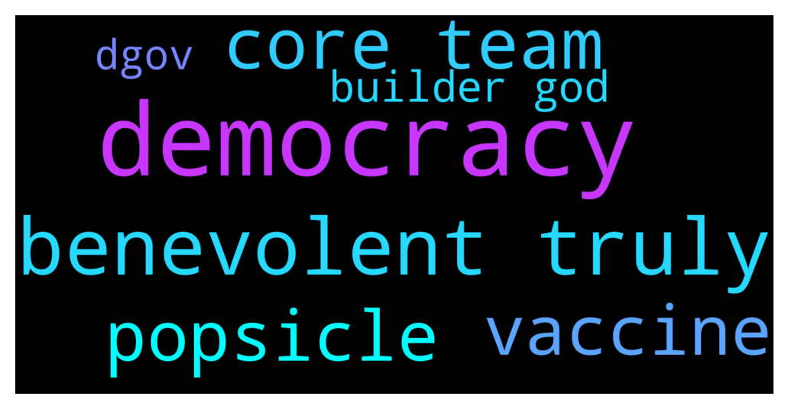

# **@lobsters_chat**
 ## Analysis for **2021-12-13** - **2021-12-14**.

---

## 📊 **Basic Stats**

**n_messages_sent**: 404

---

---

## 🔝 **Top keywords and related messages**

1. **democracy**

    @adammchen --- *Democracy is an issue in my humble opinion. When the elected officials are worried about the next term, what incentivizes them to think in terms of the countries long-term growth? ... nothing. However, in terms of pros and cons, it's still the best option globally to an extent.* **--->** [TG Discussion](https://t.me/lobsters_chat/307249)

    @DeadMeatHK --- *Eventually the DAO model will change from direct democracy to something that works. Meanwhile DAOs are infighting and stalled due to gov token apathy,   VCs and later money managers and funds will step in and take over and make stuff progress — albeit not in directions we'd necessarily like/want.* **--->** [TG Discussion](https://t.me/lobsters_chat/307228)

    @Figu3 --- *Democracies get 50-70% turnout with people having to write their vote on a piece of paper. That's the current comparison we should make to understand how bad we are at this* **--->** [TG Discussion](https://t.me/lobsters_chat/307236)

    @bagheeera48 --- *Plato on Governance: Every form of government tends to perish by excess of its basic principle. Aristocracy ruins itself by limiting too narrowly the circle within which power is confined; oligarchy ruins itself by the incautious scramble for immediate wealth. In either case the end is revolution. When revolution comes it may seem to arise from little causes and petty whims; but though it may spring from slight occasions it is the precipitate result of grave and accumulated wrongs; when a body is weakened by neglected ills, the merest exposure may bring serious disease. "Then democracy comes: the poor overcome their opponents, slaughtering some and banishing the rest; and give to the people an equal share of freedom and power". But even democracy ruins itself by excess–of democracy. Its basic principle is the equal right of all to hold office and determine public policy. This is at first glance a delightful arrangement; it becomes disastrous because the people are not properly equipped by education to select the best rulers and the wisest courses. "As to the people they have no understanding, and only repeat what their rulers are pleased to tell them" (Protagoras, 317); to get a doctrine accepted or rejected it is only necessary to have it praised or ridiculed in a popular play (a hit, no doubt, at Aristophanes, whose comedies attacked almost every new idea). Mob-rule is a rough sea for the ship of state to ride; every wind of oratory stirs up the waters and deflects the course. The upshot of such a democracy is tyranny or autocracy; the crowd so loves flattery, it is so "hungry for honey," that at last the wiliest and most unscrupulous flatterer, calling himself the "protector of the people" rises to supreme power.* **--->** [TG Discussion](https://t.me/lobsters_chat/307254)

    @StrategicReserve --- *there is more to "democracy" than elected officials. The courts. executive branch, and other levels of government also look at long term planning* **--->** [TG Discussion](https://t.me/lobsters_chat/307253)

2. **benevolent truly**

    @andrecronje --- *Personally, I've changed my mind on this one, I no longer think DAO's in a broad spectrum can work, I think DAO's based on an incredibly niche goal work well, but then its a coordination tool at best, and should be dissolved after achieving said goal. Benevolent dictatorship is the way to go.* **--->** [TG Discussion](https://t.me/lobsters_chat/307282)

    @Snowsledge --- *it does if you read btw the lines: - I'm taking over Sushi for free as a benevolent dictator - Protocol revenue (xSUSHI) will deprecated because it adds no value. Likely cutting fees to 0.25% to compete with other value-extractive DEX. - Kill all products other than the DEX or DEX-extensions (Kashi and Bento) - SUSHI future emissions will go to MIM-based pools* **--->** [TG Discussion](https://t.me/lobsters_chat/306965)

    @apindy --- *Benevolent Dictatorship has always been the best form of government ( enlightened despotism). The only problem is that benevolent dictator will be subverted even if he truly is benevolent is his actions and turned into a bad actor by those who seek power.   As a reference how do you establish who is truly benevolent?    I personally feel the blockchain space truly has benevolent leaders ( Vitalyk and especially Jae Kwon seem truly 100% benevolent) for instance but several actors around the interchain foundation and ethereum might not be* **--->** [TG Discussion](https://t.me/lobsters_chat/307348)

    @Figu3 --- *There are two paths for crypto to be relevant : dGov or Gov Minimization. If you have a benevolent dictator, you're just reinventing the wheel. Sure, it's a programmable wheel, but it's still the same wheel as before* **--->** [TG Discussion](https://t.me/lobsters_chat/307380)

    @apindy --- *Like any other company it needs competent benevolent leaders for stakeholders to be rewarded and IMO it is no different within a DAO . But subversion will exist in pretty much any field revolving around money & control* **--->** [TG Discussion](https://t.me/lobsters_chat/307237)

    @juju1234534 --- *There are enough builders (maybe not the most important, grand builders but still) whose thinking and self perception became entitled due to builders being the gods of the space. We, as the community plebs, need ways to protect ourselves from that. One way is via whistleblowing from other builders. Or even via whistleblowing from people who have their own (potentially non-benevolent) agenda. If things get shady, light is always welcome, independent of who brings that light out of which reason.  Also notice that Keno didn’t argue for that chat being “private”. His wording was “privileged”. Privileged information. Think about my point regarding entitlement and god complexes again 😉* **--->** [TG Discussion](https://t.me/lobsters_chat/307338)

3. **core team**

    @Figu3 --- *Core team is happy with 1200 adresses voting with 700k token, but that's ~6% circ and >2% holding adresses* **--->** [TG Discussion](https://t.me/lobsters_chat/307226)

    @juju1234534 --- *Did you even read the Sushi core Devs excerpt we’re discussing here? Or did you not out of the reasons you just outlined here, which is fine of course, but then don’t speak of “two devs talking to eachother”. This was obviously much more then this description makes it sound..  And nobody disputes that being a Dev in this space is hard, stressful and leads to burn outs. This doesn’t contradict god like access though. (If you wanted you could all join any private TG/Discord group in a heart beat e.g.; Not that all of you do that, but you could. And some do, and this kind of access/appreciation gets to the heads of some people. I’m not attacking builders here. I’m saying that there’s insane opportunity to any senior builder in this space and that gets to the heads (egos) of some.)  Being able to refund someone’s aping and losing 1.5M over a weekend is godlike access. Just because some of you lost touch of what number defines a huge number when it comes to money doesnt mean that the rest of the world has 😉  It’s fascinating that that kind of reply always comes in a heart beat if someone writes something critical about a subset of builders in this space.* **--->** [TG Discussion](https://t.me/lobsters_chat/307343)

    @gengargengar --- *Hm I guess the tools that we are building on are different (global, transparent, decentralized) but the governance issues remain largely the same although some of the frictions will be removed. Revolving around compensation, investment allocation, high level decision making, etc. Seems like there are tried and true models for this (delegation of decision rights to more informed individuals or bodies of individuals) that find their application here as well. In essence, most core teams act like mgmt teams of corporations.* **--->** [TG Discussion](https://t.me/lobsters_chat/307309)

    @warylow --- *They injected like 15-20 mill overnight and then suddenly core team isn't responding to anyone's questions and their whole c structure was iffy* **--->** [TG Discussion](https://t.me/lobsters_chat/307231)

    @ziggsd --- *100% These traditional structures / patterns from successful tech and other companies can translate well into DOAs IMO and is something projects / teams can benefit from.* **--->** [TG Discussion](https://t.me/lobsters_chat/306901)

    @thehat6 --- *there is no requirement for him (or team) to explain themselves so its most likely internal strategy moves but until (if ever) it gets turned into a DAO expect more of the same* **--->** [TG Discussion](https://t.me/lobsters_chat/307416)

4. **popsicle**

    @StrategicReserve --- *Popsicle Finance's TVL just dropped from $110m to $66m in 10 days. Someone on their discord says they removed stables (apparently from the Wonderland treasury) because of poor performance.   Does anyone know what's going on here?* **--->** [TG Discussion](https://t.me/lobsters_chat/307399)

    @zegdathetkan --- *Is anyone seeing the fact that if dani sets sushi up for something like uni v3 pools, than popsicle would get more use cases. considering how multichain sushi already is, this would achieve the goal of multi-chain optimized farming on popsicle.   Can we expect something like this? Univ3 pools cannot be forked yet right?* **--->** [TG Discussion](https://t.me/lobsters_chat/307414)

    @StrategicReserve --- *Also, these actions seem to imply there are serious problems with LPing stables on popsicle. Enough so that they produced either no net fees or a loss. Or the funds were removed because they needed liquidity? Nobody knows tbqh* **--->** [TG Discussion](https://t.me/lobsters_chat/307420)

    @phil_muhbags --- *My assumption is he's moving it out of popsicle for something else (probably something to do with sushi)* **--->** [TG Discussion](https://t.me/lobsters_chat/307401)

5. **vaccine**

    @Sunny --- *have you read Jae Kwon's twitter? dude is straight batshit talking about vaccines and how you're an AI if you're not terrified of them* **--->** [TG Discussion](https://t.me/lobsters_chat/307357)

    @apindy --- *When you have as high IQ as him you see patterns... Do you really believe the vaccine is for inoculation purposes?  Or for Government overeach/control?  I can't travel to the US even when vaccinated individuals can transmit covid as well... But anyways let's not turn it into a vaccine discussion* **--->** [TG Discussion](https://t.me/lobsters_chat/307361)

6. **builder god**

    @CroPurger --- *Top P2E games that you can play right now (mainnet stage, working economy).  Axie Infinity (https://dropstab.com/axie-infinity) Mobox (https://dropstab.com/mobox) Alien Worlds (https://dropstab.com/alien-worlds) Thetan Arena (https://dropstab.com/thetan-arena) Gods Unchained (https://dropstab.com/gods-unchained) Splinter Lands (https://dropstab.com/splinterlands) Heroes & Empire (https://dropstab.com/heroes-empires) Crabada (https://dropstab.com/crabada) Crazy Defense Heroes (https://dropstab.com/tower)  More games in the category 👇 - dropstab.com/categories/play-to-earn* **--->** [TG Discussion](https://t.me/lobsters_chat/307334)

    @banteg --- *i don’t think any real builder would act upon what you mentioned here, it’s not what they care about* **--->** [TG Discussion](https://t.me/lobsters_chat/307262)

    @adrianleb --- *This is a surreal discussion to read, builders are not gods in this space, it’s mostly stress and burnouts tbh, community “plebs” are not victims, many are trolls, people are entitled to some privacy, two devs talking to eachother shouldn’t feel like on big brother, all this infighting in the space is a waste of everyone’s time and will drag all down* **--->** [TG Discussion](https://t.me/lobsters_chat/307339)

    @Figu3 --- *I like how everyone turns to the easy choice of dictatorship when faced with adversity. "Oh my god, governing together is hard, you do it". Builder burnout is very reason and I think it justifies a lot the reaction, still, delegated governance scaled with decentralization is the future, I bet my carreer on that* **--->** [TG Discussion](https://t.me/lobsters_chat/307352)

    @DeadMeatHK --- *Funding decides winners. Rarely tech.   Big steaming blobs of funding are coming into this space from outside. The money drive things and it'll be the money men who determine what and when, not the builders.  Our hippie wonderland isn't long for this world I'm afraid.* **--->** [TG Discussion](https://t.me/lobsters_chat/307230)

    @juju1234534 --- *Builders are considered gods in our space. You guys have essentially infinite power and access to insider deals/trading/alpha that the tradfi incumbents/sharks can only dream off.   Don’t shame the few and rare ways that us plebs have to protect us from the people that exploit that god mode too extremely.* **--->** [TG Discussion](https://t.me/lobsters_chat/307224)

7. **dgov**

    @Figu3 --- *You must be one of these people who think Rome was built in a day... Progress doesn't happen without failures and dGov is no exception.  It's not about reinventing shares, it's about building on top of the concept. For every failure you speak of there are successes* **--->** [TG Discussion](https://t.me/lobsters_chat/307278)

    @Figu3 --- *I don't think it can get more bullish for dGov than this* **--->** [TG Discussion](https://t.me/lobsters_chat/307201)

    @Figu3 --- *There are two paths for crypto to be relevant : dGov or Gov Minimization. If you have a benevolent dictator, you're just reinventing the wheel. Sure, it's a programmable wheel, but it's still the same wheel as before* **--->** [TG Discussion](https://t.me/lobsters_chat/307380)

    @Figu3 --- *Crypto / DeFi is essentially new on the decentralised side. If we're not capable to scale dGov then what are we creating exactly ?* **--->** [TG Discussion](https://t.me/lobsters_chat/307235)

