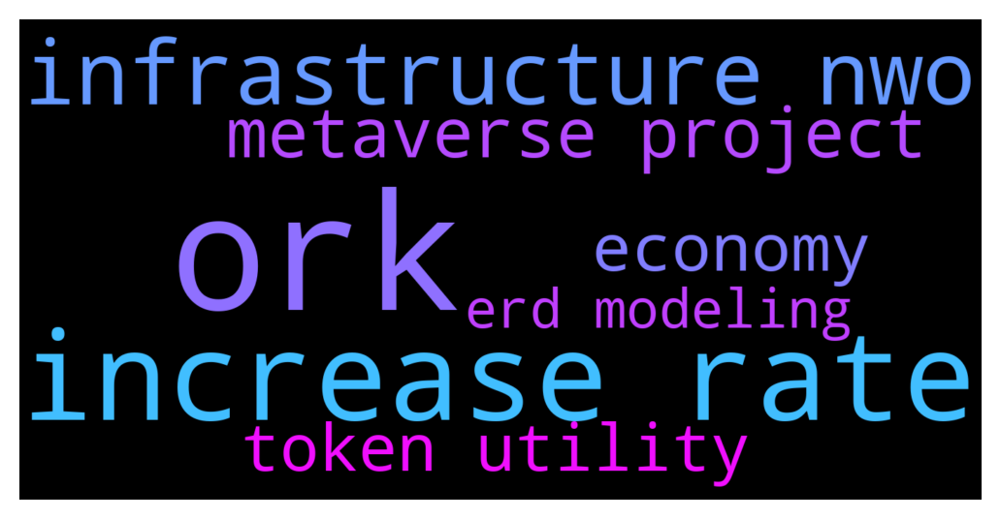

# **@shitpool**
 ## Analysis for **2021-12-13** - **2021-12-14**.

---

## 📊 **Basic Stats**

**n_messages_sent**: 513

---

---

## 🔝 **Top keywords and related messages**

1. **ork**

    @CryptoMike66 --- *I bought $ORK for 0.2$ and sold for 0.35$ and then reinvested in $ORK again* **--->** [TG Discussion](https://t.me/shitpool/707591)

    @CryptoMike66 --- *I hold $AXS and $ORK. Btw the price of $ORK will increase so fast in q1, cuz team release mainnet* **--->** [TG Discussion](https://t.me/shitpool/707590)

    @Gregoranus --- *Where are you trading $ORK dude?* **--->** [TG Discussion](https://t.me/shitpool/707606)

    @goldencatpat --- *definetly has a pork sword* **--->** [TG Discussion](https://t.me/shitpool/707548)

    @sumtemm --- *if that doesnt work then try sending a tx to yourself on same network with.. i think the same nonce? Or was it different nonce* **--->** [TG Discussion](https://t.me/shitpool/706951)

    @MoreMoneyMoreMurder --- *Maybe the network is lese conjested now and eth can lead the dump* **--->** [TG Discussion](https://t.me/shitpool/707029)

2. **increase rate**

    @NotTheGodfather --- *you think? I can't speak to the US much but Canada is drowning in debt, even a tiny rate increase is going to wipe people out* **--->** [TG Discussion](https://t.me/shitpool/707475)

    @NotTheGodfather --- *I know they talking about five rate increases next year for BoC but that could just be posturing* **--->** [TG Discussion](https://t.me/shitpool/707477)

    @grammi --- *All dead especially now that fed will raise rates* **--->** [TG Discussion](https://t.me/shitpool/707186)

    @BlockChainUp --- *Obv during many spread rate increases... this the target* **--->** [TG Discussion](https://t.me/shitpool/707480)

    @BlockChainUp --- *Bloomberg now, discussing of two rate hikes in 2022, and 3 2023* **--->** [TG Discussion](https://t.me/shitpool/707392)

    @BlockChainUp --- *there wont be exchange rates* **--->** [TG Discussion](https://t.me/shitpool/707422)

3. **infrastructure nwo**

    @NotTheGodfather --- *Entire NWO will be using blockchain for infrastructure* **--->** [TG Discussion](https://t.me/shitpool/707403)

    @NotTheGodfather --- *well you are welcome to opinions, but I was told about the virus before it released in 2019, and I've been shown how the new economy will look and some of the entities that are driving it so I'm pretty confident. It's the same investment model our group has used since 2018 and we've done fairly well.   I guess time will tell...I'll keep baggging NWO infrastructure while it's cheap* **--->** [TG Discussion](https://t.me/shitpool/707440)

    @NotTheGodfather --- *Theyll use infrastructure tokens* **--->** [TG Discussion](https://t.me/shitpool/707408)

    @BlockChainUp --- *NWO wont use shitcoins as a base tech* **--->** [TG Discussion](https://t.me/shitpool/707405)

    @ThicccRacer --- *NwO 😂* **--->** [TG Discussion](https://t.me/shitpool/707406)

    @BandidaRaro26 --- *@NotTheGodfather I am curious and intrigued by your past experience and wondering what alts you have your eye on? As you have mentioned NWO infrastructure?* **--->** [TG Discussion](https://t.me/shitpool/707662)

4. **metaverse project**

    @valhala911 --- *but only a very few numbers of projects are working on metaverse* **--->** [TG Discussion](https://t.me/shitpool/707583)

    @valhala911 --- *2021 was for NFTs 2022 will be all about Metaverse* **--->** [TG Discussion](https://t.me/shitpool/707582)

    @CryptoMike66 --- *U should also check projects which take part in metaverses or provide info to metaverses* **--->** [TG Discussion](https://t.me/shitpool/707586)

    @BlockChainUp --- *Metaverse was already tested in the past and failed... it was called Second Life* **--->** [TG Discussion](https://t.me/shitpool/707417)

    @BlockChainUp --- *those prices were just in the metaverse* **--->** [TG Discussion](https://t.me/shitpool/707201)

    @Gregoranus --- *True, but existing projects will jump on the bandwagon when the time comes. What’s your meta picks? I have $TVK & $DAR at the moment.* **--->** [TG Discussion](https://t.me/shitpool/707584)

5. **economy**

    @NotTheGodfather --- *well you are welcome to opinions, but I was told about the virus before it released in 2019, and I've been shown how the new economy will look and some of the entities that are driving it so I'm pretty confident. It's the same investment model our group has used since 2018 and we've done fairly well.   I guess time will tell...I'll keep baggging NWO infrastructure while it's cheap* **--->** [TG Discussion](https://t.me/shitpool/707440)

    @NotTheGodfather --- *there is all sorts of infrastructure that is being built for the new upcoming economy* **--->** [TG Discussion](https://t.me/shitpool/707426)

    @NotTheGodfather --- *Chainlink definitely came up on our ERD modeling yes. Oracles are an important part of new economy. You might have noticed that Sergey stopped dumping as well* **--->** [TG Discussion](https://t.me/shitpool/707509)

    @NotTheGodfather --- *Most dont grasp the scope of the new green economy. It's not about a currency. It's about identity, medical records, supply chains, etc.* **--->** [TG Discussion](https://t.me/shitpool/707411)

6. **token utility**

    @NotTheGodfather --- *Theyll use infrastructure tokens* **--->** [TG Discussion](https://t.me/shitpool/707408)

    @BeAMightyKing --- *this and all valueless governance tokens need the obvious: trading fee dividends. Anything short is meaningless* **--->** [TG Discussion](https://t.me/shitpool/707021)

    @BlockChainUp --- *What do you call the utility tokens that elites are accumulating?* **--->** [TG Discussion](https://t.me/shitpool/707420)

    @NotTheGodfather --- *if you grab the utility for that ecosystem (the tokens that will be needed to drive it)* **--->** [TG Discussion](https://t.me/shitpool/707427)

    @CryptoMike66 --- *What tokens do u hold with big potential?* **--->** [TG Discussion](https://t.me/shitpool/707592)

    @Daniel --- *utility tokens?  you mean like LINK and BLZ* **--->** [TG Discussion](https://t.me/shitpool/707505)

7. **erd modeling**

    @NotTheGodfather --- *if you do ERD modeling you can find these projects* **--->** [TG Discussion](https://t.me/shitpool/707429)

    @NotTheGodfather --- *Chainlink definitely came up on our ERD modeling yes. Oracles are an important part of new economy. You might have noticed that Sergey stopped dumping as well* **--->** [TG Discussion](https://t.me/shitpool/707509)

    @NotTheGodfather --- *there's dozens of alts that come up when you do ERD mapping of establishment projects. But one that I'm watching right now is Cudos. Cloud computing project that will power many of the metaverse and NFT projects, which seems wiser than trying to pick the winners in those sectors. Some very interesting connections to the London finance hub, and partnerships with AMD and Hydro66. Mainnet coming up in January. Truth is you can spot NWO tech everywhere tho. They practically glow lol* **--->** [TG Discussion](https://t.me/shitpool/707667)

