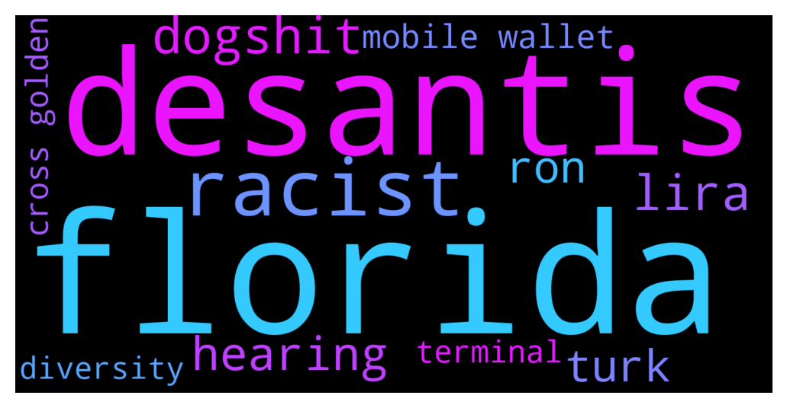

# **@whalepoolbtc**
 ## Analysis for **2021-12-13** - **2021-12-14**.

---

## 📊 **Basic Stats**

**n_messages_sent**: 1119

---

---

## 🔝 **Top keywords and related messages**

1. **florida**

    @Morganrio --- *Florida Governor Ron DeSantis Proposes Creating a Cryptocurrency Payment System for State Fees  The Republican governor of Florida, Ron DeSantis appears to be eager on permitting companies in Florida to pay for state charges in crypto belongings.  A report revealed by Fortune says DeSantis has defined in current instances that he needs the Florida state authorities to grow to be "Crypto-friendly." "Florida encourages cryptocurrency as a method of commerce and furthering Florida's attractiveness to companies and financial development," DeSantis wrote in Florida's 2022-23 price range proposal.  🟡 t.me/CryptoSignalsMust* **--->** [TG Discussion](https://t.me/whalepoolbtc/4081052)

2. **desantis**

    @Morganrio --- *Florida Governor Ron DeSantis Proposes Creating a Cryptocurrency Payment System for State Fees  The Republican governor of Florida, Ron DeSantis appears to be eager on permitting companies in Florida to pay for state charges in crypto belongings.  A report revealed by Fortune says DeSantis has defined in current instances that he needs the Florida state authorities to grow to be "Crypto-friendly." "Florida encourages cryptocurrency as a method of commerce and furthering Florida's attractiveness to companies and financial development," DeSantis wrote in Florida's 2022-23 price range proposal.  🟡 t.me/CryptoSignalsMust* **--->** [TG Discussion](https://t.me/whalepoolbtc/4081052)

3. **racist**

    @Steve_PickyCalls --- *i mean think for a moment , what group or groups want us to be racists* **--->** [TG Discussion](https://t.me/whalepoolbtc/4081216)

    @rektap3 --- *Programming languages are unironically racist because blacks can't literally understand it* **--->** [TG Discussion](https://t.me/whalepoolbtc/4081198)

    @Saj_le_Great --- *racists* **--->** [TG Discussion](https://t.me/whalepoolbtc/4081217)

    @MiLostUC --- *Racist thoughts detected* **--->** [TG Discussion](https://t.me/whalepoolbtc/4081201)

    @Steve_PickyCalls --- *i jus can't understand racists , their mind is like bein controlled* **--->** [TG Discussion](https://t.me/whalepoolbtc/4081215)

4. **dogshit**

    @Rogier_E --- *125% of dogshit is just more dogshit* **--->** [TG Discussion](https://t.me/whalepoolbtc/4081293)

    @SD107 --- *It has a treasury, so its not dogshit* **--->** [TG Discussion](https://t.me/whalepoolbtc/4081299)

    @MiLostUC --- *Dogshit is moar that hot gpu farts* **--->** [TG Discussion](https://t.me/whalepoolbtc/4081296)

5. **lira**

    @MiLostUC --- *Why wouldnt they buy tether before lira goes to shit* **--->** [TG Discussion](https://t.me/whalepoolbtc/4081083)

    @ApacheSJM --- *Dark. I know a wealthy Turk who sell luxury real estate to rich Arabs. He only takes payment in stable coin or btc now. Physical USD too hard to get in the banking system and obv Lira is Micky mouse money, banks not trustworthy* **--->** [TG Discussion](https://t.me/whalepoolbtc/4081093)

    @Deathbal1 --- *Yes you can buy crypto with lira on binance* **--->** [TG Discussion](https://t.me/whalepoolbtc/4081066)

6. **hearing**

    @aejwj1 --- *Hearing talk that ETH transition to POS will never happen* **--->** [TG Discussion](https://t.me/whalepoolbtc/4081302)

    @arx_2025 --- *stable coin hearing is live the detailed testimonies (pdf) is pretty grim on stable coins and defi. might see some negative market movement soon* **--->** [TG Discussion](https://t.me/whalepoolbtc/4081322)

    @Gregoranus --- *Anyone watching the senate stablecoin hearing? Getting a bit of a bashing.* **--->** [TG Discussion](https://t.me/whalepoolbtc/4081342)

7. **turk**

    @ApacheSJM --- *Dark. I know a wealthy Turk who sell luxury real estate to rich Arabs. He only takes payment in stable coin or btc now. Physical USD too hard to get in the banking system and obv Lira is Micky mouse money, banks not trustworthy* **--->** [TG Discussion](https://t.me/whalepoolbtc/4081093)

    @MiLostUC --- *Do turks have access to crypto* **--->** [TG Discussion](https://t.me/whalepoolbtc/4081062)

    @rektap3 --- *Turkish central bank net reserves: minus $50BN* **--->** [TG Discussion](https://t.me/whalepoolbtc/4080323)

    @arx_2025 --- *google “turkish bread lines” sad AF.* **--->** [TG Discussion](https://t.me/whalepoolbtc/4081089)

    @arx_2025 --- *was planning on an affordable holiday to turkey but it’s looking abit dire now   there is cheap and then there is failed nation cheap* **--->** [TG Discussion](https://t.me/whalepoolbtc/4081092)

    @ApacheSJM --- *Ya I mean he's not mega rich or anything by Western standards but in Turkey he eating like a king* **--->** [TG Discussion](https://t.me/whalepoolbtc/4081101)

8. **ron**

    @rektap3 --- *Programming languages are unironically racist because blacks can't literally understand it* **--->** [TG Discussion](https://t.me/whalepoolbtc/4081198)

    @Morganrio --- *Florida Governor Ron DeSantis Proposes Creating a Cryptocurrency Payment System for State Fees  The Republican governor of Florida, Ron DeSantis appears to be eager on permitting companies in Florida to pay for state charges in crypto belongings.  A report revealed by Fortune says DeSantis has defined in current instances that he needs the Florida state authorities to grow to be "Crypto-friendly." "Florida encourages cryptocurrency as a method of commerce and furthering Florida's attractiveness to companies and financial development," DeSantis wrote in Florida's 2022-23 price range proposal.  🟡 t.me/CryptoSignalsMust* **--->** [TG Discussion](https://t.me/whalepoolbtc/4081052)

    @MoreMoneyMoreMurder --- *Whats wrong, she has a nice bum* **--->** [TG Discussion](https://t.me/whalepoolbtc/4079880)

    @Bitcoinnect --- *Just follow the history. Chart is historical data. In 2014 bear market we bottomed at -86% So back in 2018, the most common calls were 2800 since that's -86% of 19800 We ended up bottoming at 31xx or something like that Basically a lot of frontrunning happened There was also a lot of talk about 200wMA providing support twice.  You're gonna need chart that goes back at least 4 years to get 200wMA (currently at 18.4k ish)* **--->** [TG Discussion](https://t.me/whalepoolbtc/4080857)

    @GiuGiuBTC --- *Are we dumping because one English fat bastard died of Omicron? Really? We dumping because market is full of pet.com and charlatans.* **--->** [TG Discussion](https://t.me/whalepoolbtc/4080605)

    @CharliePolite --- *The people got behind fascist and dictators plenty of times. The people are morons.* **--->** [TG Discussion](https://t.me/whalepoolbtc/4080575)

9. **mobile wallet**

    @MiLostUC --- *Btc missed the whole marketing. Ppl want to at least see something when they cant touch it. Why not make funny satoshi coins or cheap hardware wallets for the masses* **--->** [TG Discussion](https://t.me/whalepoolbtc/4081111)

    @SD107 --- *What is the best mobile wallet?* **--->** [TG Discussion](https://t.me/whalepoolbtc/4081152)

    @Saj_le_Great --- *so you can use a bitcoin wallet* **--->** [TG Discussion](https://t.me/whalepoolbtc/4081148)

    @MiLostUC --- *Pômp it Germany's trillion-euro savings banks mull crypto wallet — link* **--->** [TG Discussion](https://t.me/whalepoolbtc/4080284)

    @SD107 --- *And is there a browser extension wallet?* **--->** [TG Discussion](https://t.me/whalepoolbtc/4081153)

    @SD107 --- *What is the best mobile wallet then?* **--->** [TG Discussion](https://t.me/whalepoolbtc/4081156)

10. **terminal**

    @alpenair --- *Terminal is black tho* **--->** [TG Discussion](https://t.me/whalepoolbtc/4081203)

    @Saj_le_Great --- *when black characters on black terminal?* **--->** [TG Discussion](https://t.me/whalepoolbtc/4081205)

11. **cross golden**

    @Rainer --- *Golden Cross at 1h Scale.* **--->** [TG Discussion](https://t.me/whalepoolbtc/4081317)

    @Rogier_E --- *Out of the previous 82 times we've had a golden cross, in 69 cases it turned out to be completely insignificant* **--->** [TG Discussion](https://t.me/whalepoolbtc/4081319)

    @AncientNite --- *He ruined the golden run with some dog shit* **--->** [TG Discussion](https://t.me/whalepoolbtc/4080785)

12. **diversity**

    @MiLostUC --- *No diversity?* **--->** [TG Discussion](https://t.me/whalepoolbtc/4081180)

    @Saj_le_Great --- *why you care about diversity?* **--->** [TG Discussion](https://t.me/whalepoolbtc/4081222)

