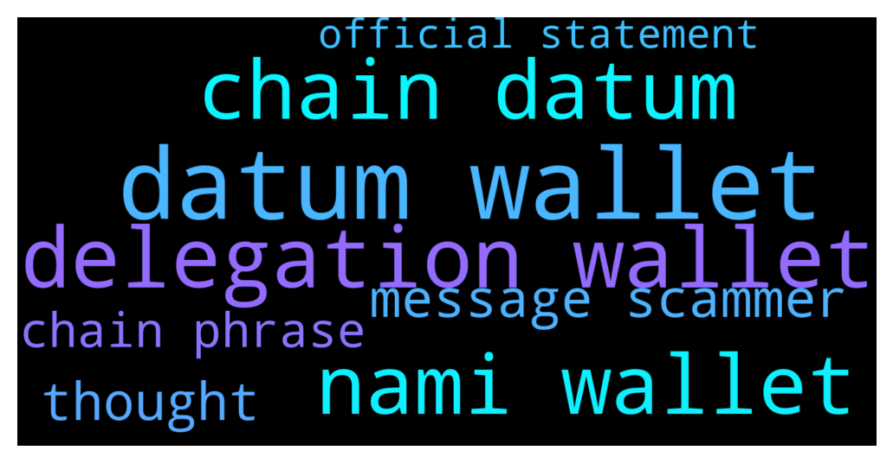

# **@Cardano**
 ## Analysis for **2021-12-14** - **2021-12-15**.

---

## 📊 **Basic Stats**

**n_messages_sent**: 67

---

---

## 🔝 **Top keywords and related messages**

1. **datum wallet**

    @real_ahmadkamal --- *greeting guys, i would like to ask. i'm facing problem to connect my nami wallet in sundaeswap. how to adjust my nami wallet connection for testnet?* **--->** [TG Discussion](https://t.me/Cardano/759035)

    @glitch04 --- *If you recover them using the same secret phrase they access the same on chain data* **--->** [TG Discussion](https://t.me/Cardano/759104)

    @ExInfernis --- *Hi, I have question for Daedalus and Yoroi. Can I have at the same time my ada on both wallets or when I download yoroi and create wallet there my ada will be transferred from the daedalus to yoroi?* **--->** [TG Discussion](https://t.me/Cardano/759102)

    @rdalio321 --- *Hi guys, I see that we can send multiple NFTs in one transaction with Nami wallet, can multiple NFTs also be sent with Yoroi wallet?* **--->** [TG Discussion](https://t.me/Cardano/758847)

    @TJSP2024 --- *my yorio wallet is the brave extension, im not that comfortable with online wallets* **--->** [TG Discussion](https://t.me/Cardano/758484)

    @p --- *I tried. But when i try to use the recovery phrase on adalite it shows that my wallet has 0 balance. I’m sure this is the only set of seedphrase i have because I only have the one cardano wallet and I only wrote down one set of it. Checked it multiple times. The balance on yoroi and cardanoscan is correct tho* **--->** [TG Discussion](https://t.me/Cardano/758603)

2. **delegation wallet**

    @real_ahmadkamal --- *greeting guys, i would like to ask. i'm facing problem to connect my nami wallet in sundaeswap. how to adjust my nami wallet connection for testnet?* **--->** [TG Discussion](https://t.me/Cardano/759035)

    @ExInfernis --- *Hi, I have question for Daedalus and Yoroi. Can I have at the same time my ada on both wallets or when I download yoroi and create wallet there my ada will be transferred from the daedalus to yoroi?* **--->** [TG Discussion](https://t.me/Cardano/759102)

    @rdalio321 --- *Hi guys, I see that we can send multiple NFTs in one transaction with Nami wallet, can multiple NFTs also be sent with Yoroi wallet?* **--->** [TG Discussion](https://t.me/Cardano/758847)

    @TJSP2024 --- *my yorio wallet is the brave extension, im not that comfortable with online wallets* **--->** [TG Discussion](https://t.me/Cardano/758484)

    @p --- *I tried. But when i try to use the recovery phrase on adalite it shows that my wallet has 0 balance. I’m sure this is the only set of seedphrase i have because I only have the one cardano wallet and I only wrote down one set of it. Checked it multiple times. The balance on yoroi and cardanoscan is correct tho* **--->** [TG Discussion](https://t.me/Cardano/758603)

    @p --- *Hey guys. I have some issue withdrawing and restaking ada on Yoroi. I’m using my Trezor T for my yoroi wallet and I transferred Ada into it 2 months ago, delegated it with no issue. Now I’m trying to redelegate it to a different pool and a message pops up on my Trezor, saying “change address payment credential is a path…” then when i tick the checkmark, it takes me to another prompt saying “change address staking credential is a key hash…” then to another prompt of a sum of my account minus the amount I’m trying to withdraw before taking me to the standard signing off that fails to go through. I’ve noticed the same problem on the forums in a few cases but there seems to be no definitive solution for this. Does anyone know how to fix this problem?* **--->** [TG Discussion](https://t.me/Cardano/758585)

3. **nami wallet**

    @real_ahmadkamal --- *greeting guys, i would like to ask. i'm facing problem to connect my nami wallet in sundaeswap. how to adjust my nami wallet connection for testnet?* **--->** [TG Discussion](https://t.me/Cardano/759035)

    @ExInfernis --- *Hi, I have question for Daedalus and Yoroi. Can I have at the same time my ada on both wallets or when I download yoroi and create wallet there my ada will be transferred from the daedalus to yoroi?* **--->** [TG Discussion](https://t.me/Cardano/759102)

    @glitch04 --- *You need to go to Nami support or Sundae's support for those questions* **--->** [TG Discussion](https://t.me/Cardano/759043)

    @rdalio321 --- *Hi guys, I see that we can send multiple NFTs in one transaction with Nami wallet, can multiple NFTs also be sent with Yoroi wallet?* **--->** [TG Discussion](https://t.me/Cardano/758847)

    @TJSP2024 --- *my yorio wallet is the brave extension, im not that comfortable with online wallets* **--->** [TG Discussion](https://t.me/Cardano/758484)

    @p --- *I tried. But when i try to use the recovery phrase on adalite it shows that my wallet has 0 balance. I’m sure this is the only set of seedphrase i have because I only have the one cardano wallet and I only wrote down one set of it. Checked it multiple times. The balance on yoroi and cardanoscan is correct tho* **--->** [TG Discussion](https://t.me/Cardano/758603)

4. **chain datum**

    @glitch04 --- *If you recover them using the same secret phrase they access the same on chain data* **--->** [TG Discussion](https://t.me/Cardano/759104)

    @glitch04 --- *As long as they are synced with the latest chain data* **--->** [TG Discussion](https://t.me/Cardano/759109)

    @glitch04 --- *Anything you do in one will be reflected in the other they access the same data / wallet on chain* **--->** [TG Discussion](https://t.me/Cardano/759108)

    @Hans --- *Yoroi just reads the data of your wallet. Use same credentials as in D!* **--->** [TG Discussion](https://t.me/Cardano/758489)

    @MastodonMedia --- *“Data presented by Finbold shows that as of December 13 2021, the top 10% of Cardano whales hold over 31 billion ADA out of the 33.43 billion circulating coins, according to the data extracted from the on-chain analysis platform Coin Metrics.”  Is there any credibility to this?* **--->** [TG Discussion](https://t.me/Cardano/758752)

5. **message scammer**

    @glitch04 --- *Ignore any incoming private messages they are scammers* **--->** [TG Discussion](https://t.me/Cardano/759161)

    @glitch04 --- *You're welcome, Just make sure to report and block anyone that sends you private messages no support or admins will contact you this way (even me)* **--->** [TG Discussion](https://t.me/Cardano/759114)

    @glitch04 --- *Unfortunately yes because the security on this platform is lacking which is why the join message informs you* **--->** [TG Discussion](https://t.me/Cardano/758692)

    @p --- *Hey guys. I have some issue withdrawing and restaking ada on Yoroi. I’m using my Trezor T for my yoroi wallet and I transferred Ada into it 2 months ago, delegated it with no issue. Now I’m trying to redelegate it to a different pool and a message pops up on my Trezor, saying “change address payment credential is a path…” then when i tick the checkmark, it takes me to another prompt saying “change address staking credential is a key hash…” then to another prompt of a sum of my account minus the amount I’m trying to withdraw before taking me to the standard signing off that fails to go through. I’ve noticed the same problem on the forums in a few cases but there seems to be no definitive solution for this. Does anyone know how to fix this problem?* **--->** [TG Discussion](https://t.me/Cardano/758585)

    @glitch04 --- *Also don't respond to anyone that dm's you acting as support they are scammers* **--->** [TG Discussion](https://t.me/Cardano/759105)

    @glitch04 --- *The message right above yours explains where you should look for help and that anyone sending you messages is a scammer* **--->** [TG Discussion](https://t.me/Cardano/759042)

6. **thought**

    @TheBigBossK --- *Is there a video where Charles shares his thoughts on the future of Bitcoin or Ethereum?* **--->** [TG Discussion](https://t.me/Cardano/759058)

    @TheBigBossK --- *Like what he thinks Bitcoin will look in 10 years, stuff like that. He mentions often that Cardano is a very long-term project, would be interesting to hear his thoughts on Bitcoin* **--->** [TG Discussion](https://t.me/Cardano/759085)

7. **chain phrase**

    @glitch04 --- *If you recover them using the same secret phrase they access the same on chain data* **--->** [TG Discussion](https://t.me/Cardano/759104)

    @p --- *I tried. But when i try to use the recovery phrase on adalite it shows that my wallet has 0 balance. I’m sure this is the only set of seedphrase i have because I only have the one cardano wallet and I only wrote down one set of it. Checked it multiple times. The balance on yoroi and cardanoscan is correct tho* **--->** [TG Discussion](https://t.me/Cardano/758603)

    @glitch04 --- *As long as they are synced with the latest chain data* **--->** [TG Discussion](https://t.me/Cardano/759109)

    @glitch04 --- *Anything you do in one will be reflected in the other they access the same data / wallet on chain* **--->** [TG Discussion](https://t.me/Cardano/759108)

    @glitch04 --- *Using the recovery phrase is supposed to be to recover the device it will not open the same wallet* **--->** [TG Discussion](https://t.me/Cardano/758612)

    @glitch04 --- *You aren't supposed to use that recover phrase only the device* **--->** [TG Discussion](https://t.me/Cardano/758610)

8. **official statement**

    @echion --- *I'm a bit confused about the official statement that you can use one wallet for multiple delegates. Do I understand this correctly: especially with the yoroi wallet it is possible to delegate to multiple pools with a single wallet, but it does not do anything because the mainnet only supports delegation of the wallet address and thus only the first delegation of several in the wallet actually generates rewards?* **--->** [TG Discussion](https://t.me/Cardano/759212)

    @TheBigBossK --- *I thought the same. I was like "is there an official Yoroi chat?".* **--->** [TG Discussion](https://t.me/Cardano/759083)

