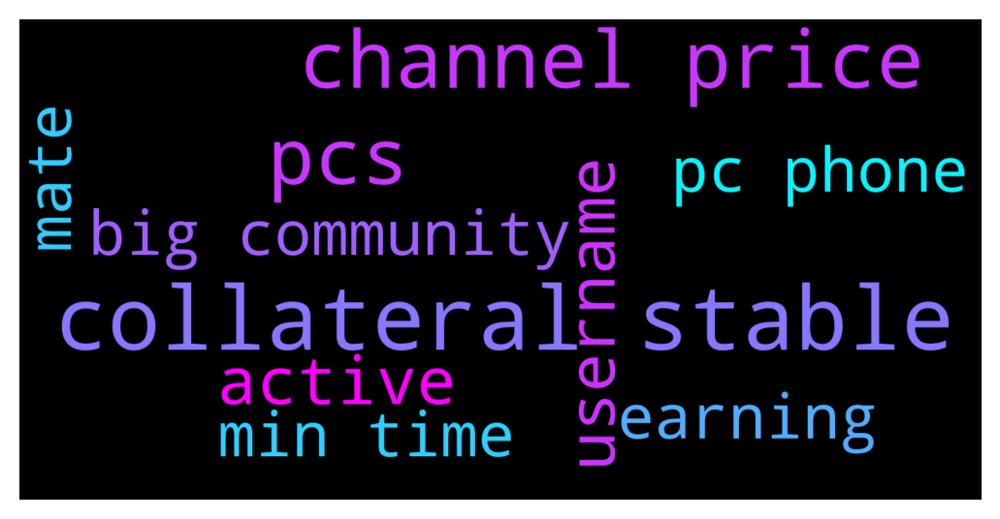

# **@Fantom_English**
 ## Analysis for **2021-12-14** - **2021-12-15**.

---

## 📊 **Basic Stats**

**n_messages_sent**: 98

---

---

## 🔝 **Top keywords and related messages**

1. **collateral stable**

    @benbenitoOG --- *Hello mates where can I put ftm as collateral and borrow some stable at a low apy?* **--->** [TG Discussion](https://t.me/Fantom_English/611703)

    @benbenitoOG --- *Lol I meant a degen type of borrowing 😅 like deposit here, redeem this, put that as a collateral over there and borrow your stable at 0.1% apr...* **--->** [TG Discussion](https://t.me/Fantom_English/611706)

2. **channel price**

    @Maarten --- *Problem is that the price channel is dominated with memes* **--->** [TG Discussion](https://t.me/Fantom_English/611897)

    @JovidDonerson --- *Any idea what price prediction for FTM in 2023?* **--->** [TG Discussion](https://t.me/Fantom_English/611489)

    @Tina --- *Hope you’d be stacking the dip.. Imma re accumulate into my portfolio w my farm earnings 😅😅 it’s the usual price cycle. So HODL* **--->** [TG Discussion](https://t.me/Fantom_English/611892)

    @chyi5788 --- *Hello, does fantom have a Chinese channel?* **--->** [TG Discussion](https://t.me/Fantom_English/611688)

    @Johnnyfantom --- *The price channel is run by community members* **--->** [TG Discussion](https://t.me/Fantom_English/611899)

    @Johnnyfantom --- *Guys no pump, dump or price talk here* **--->** [TG Discussion](https://t.me/Fantom_English/611207)

3. **pcs**

    @pajamasfreak --- *be careful ftm doesn't have much liquidity on pcs* **--->** [TG Discussion](https://t.me/Fantom_English/611736)

    @pajamasfreak --- *Better check on apeswap, pcs mostly low in liquidity* **--->** [TG Discussion](https://t.me/Fantom_English/611655)

4. **active**

    @pajamasfreak --- *Course, looks like you are very active on tomb* **--->** [TG Discussion](https://t.me/Fantom_English/611668)

    @Okasian --- *I tend to be active in the community with the biggest bag* **--->** [TG Discussion](https://t.me/Fantom_English/611674)

5. **username**

    @Janevietani --- *⬢ How to secure your #Telegram account? Use all of the tips below to stay safe from scammers and impersonators.  1️⃣ Change the default Privacy Settings of your account ≡ ➔⚙️ Settings ➔ Privacy and Security a) Phone number ➔ Set to »My Contacts« b) Calls ➔ Set to »My Contacts« c) Groups ➔ Set to »My Contacts« d) Security ➔ Two-Step Verification e) Advanced ➔ Set »Delete my account if away for« to »1 year«  2️⃣ Set unique username and profile bio ≡ ➔⚙️ Settings ➔ Edit profile a) Username b) Bio* **--->** [TG Discussion](https://t.me/Fantom_English/611824)

6. **mate**

    @benbenitoOG --- *Hello mates where can I put ftm as collateral and borrow some stable at a low apy?* **--->** [TG Discussion](https://t.me/Fantom_English/611703)

    @pajamasfreak --- *Lol, too much flexing mate* **--->** [TG Discussion](https://t.me/Fantom_English/611681)

7. **min time**

    @Steller --- *In Binance can I withdral FTM into Metamask FTM wallet using: BSC Arrival time ≈ 2 mins Binance Smart Chain (BEP20)* **--->** [TG Discussion](https://t.me/Fantom_English/611619)

8. **earning**

    @Tina --- *Hope you’d be stacking the dip.. Imma re accumulate into my portfolio w my farm earnings 😅😅 it’s the usual price cycle. So HODL* **--->** [TG Discussion](https://t.me/Fantom_English/611892)

9. **big community**

    @Okasian --- *I tend to be active in the community with the biggest bag* **--->** [TG Discussion](https://t.me/Fantom_English/611674)

    @Johnnyfantom --- *The price channel is run by community members* **--->** [TG Discussion](https://t.me/Fantom_English/611899)

    @jacksontrans --- *that's the only way to connect with Fantom community for now tbh 😂* **--->** [TG Discussion](https://t.me/Fantom_English/611328)

    @Johi --- *Hi all Hoe do you bridge from ftm? I just paid big gas to bridge some bnb from ftm to bsc* **--->** [TG Discussion](https://t.me/Fantom_English/611581)

10. **pc phone**

    @Janevietani --- *⬢ How to secure your #Telegram account? Use all of the tips below to stay safe from scammers and impersonators.  1️⃣ Change the default Privacy Settings of your account ≡ ➔⚙️ Settings ➔ Privacy and Security a) Phone number ➔ Set to »My Contacts« b) Calls ➔ Set to »My Contacts« c) Groups ➔ Set to »My Contacts« d) Security ➔ Two-Step Verification e) Advanced ➔ Set »Delete my account if away for« to »1 year«  2️⃣ Set unique username and profile bio ≡ ➔⚙️ Settings ➔ Edit profile a) Username b) Bio* **--->** [TG Discussion](https://t.me/Fantom_English/611824)

    @bC311 --- *both my phone app and desktop app are reporting funny things.* **--->** [TG Discussion](https://t.me/Fantom_English/611621)

    @bC311 --- *just checked on my fantom wallet on my PC* **--->** [TG Discussion](https://t.me/Fantom_English/611620)

