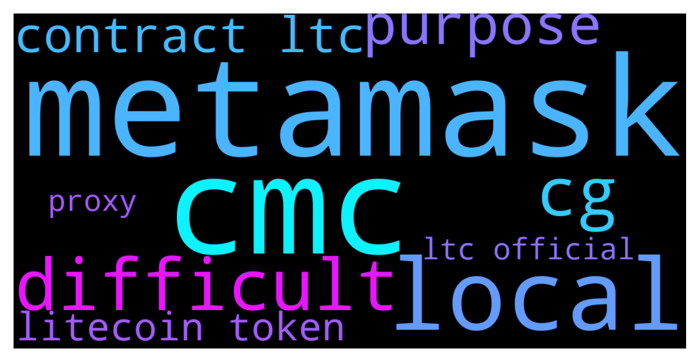

# **@Litecoin**
 ## Analysis for **2021-12-14** - **2021-12-15**.

---

## 📊 **Basic Stats**

**n_messages_sent**: 133

---

---

## 🔝 **Top keywords and related messages**

1. **metamask**

    @SUP3RM4NN --- *I see it bro but my issue is I cant get it that Heco address to add on metamask* **--->** [TG Discussion](https://t.me/Litecoin/2030365)

    @Pablocality --- *I just do not think metamask has litecoin support since their focus is "defi"* **--->** [TG Discussion](https://t.me/Litecoin/2030369)

2. **cmc**

    @jrx486 --- *if only my exchanges use prices from CMC* **--->** [TG Discussion](https://t.me/Litecoin/2030264)

    @RabbitL0v3r --- *But cmc was always considered as shit compared to cg* **--->** [TG Discussion](https://t.me/Litecoin/2030410)

    @jrx486 --- *Any dexes working with cmc prices? Lol* **--->** [TG Discussion](https://t.me/Litecoin/2030403)

    @jw418 --- *that CMC glitch was bullish hahah* **--->** [TG Discussion](https://t.me/Litecoin/2030557)

3. **local**

    @RabbitL0v3r --- *And last time I bought btc was at 29k, seems I bought the local bottom to sell the local top* **--->** [TG Discussion](https://t.me/Litecoin/2030664)

4. **difficult**

    @체인 --- *Falsehood is not always obvious. It is very difficult to distinguish between opinion and fact in any expression, and it is also difficult to distinguish between objective truth and falsehood.* **--->** [TG Discussion](https://t.me/Litecoin/2030375)

5. **cg**

    @RabbitL0v3r --- *But cmc was always considered as shit compared to cg* **--->** [TG Discussion](https://t.me/Litecoin/2030410)

6. **purpose**

    @jw418 --- *I can't be the only one who thinks it's insanely bullish and was likely done on purpose by market manipulators  Or I've gone off the deep end who even knows anymore* **--->** [TG Discussion](https://t.me/Litecoin/2030566)

    @jw418 --- *part of me thinks they did it on purpose to save the markets from falling into bear.  It got me revved up to buy more, in all honesty* **--->** [TG Discussion](https://t.me/Litecoin/2030560)

7. **contract ltc**

    @JohnTheApostle --- *.......❗️Trading Exchanges❗️...... Like to be a VIP member? Join the @Litecoin donor program https://goo.gl/HEagfr -------------------------------------------------- Ticker Code: LTC Trusted Exchanges: Binance, Bitfinex, Bittrex Coinbase, Poloniex, Bitstamp Bitmex, Coinut, BTSE ................................. BitInfoCharts, CoinMarketCap CoinPaprika, CoinGecko WorldCoinIndex, Messari Trading View: BTC | USD --------------------------------------------------* **--->** [TG Discussion](https://t.me/Litecoin/2029980)

    @Catheryne_catthy --- *All y'all screaming LTC is shitcoin, LTC is scam etc, just send me your coins and take a good rest. Save yourself from heart attacks. 😂😂😂* **--->** [TG Discussion](https://t.me/Litecoin/2030623)

    @SUP3RM4NN --- *Hmmm...So basically the only way to send LTC is through centralized exchanges or the lite wallet? :-(* **--->** [TG Discussion](https://t.me/Litecoin/2030371)

    @TonyNakamoto --- *Tax-loss harBesting some more shit into LTC* **--->** [TG Discussion](https://t.me/Litecoin/2030668)

    @bigbrother00 --- *good bye, ltc. just dump it all* **--->** [TG Discussion](https://t.me/Litecoin/2030655)

    @BennyBennyBlanco --- *The way it’s looking right now for crypto, ltc to $100* **--->** [TG Discussion](https://t.me/Litecoin/2029720)

8. **litecoin token**

    @Simon zyroxa --- *Please is this the official group for litecoin I have a complaint please* **--->** [TG Discussion](https://t.me/Litecoin/2030290)

    @Pablocality --- *I just do not think metamask has litecoin support since their focus is "defi"* **--->** [TG Discussion](https://t.me/Litecoin/2030369)

    @Pablocality --- *Litecoin is not a token.  It is a unique cryptocurrency.* **--->** [TG Discussion](https://t.me/Litecoin/2030366)

    @BennyBennyBlanco --- *Look at Tron Trx price 😂 When litecoin will catch up* **--->** [TG Discussion](https://t.me/Litecoin/2030215)

    @Carlos_PRO_Holder --- *He is the biggest rekt guy ever by Litecoin* **--->** [TG Discussion](https://t.me/Litecoin/2030042)

    @Carlos_PRO_Holder --- *Holding like a retard, even Litecoin creator sold, but I am stupid and keep holding* **--->** [TG Discussion](https://t.me/Litecoin/2029675)

9. **ltc official**

    @Simon zyroxa --- *Please is this the official group for litecoin I have a complaint please* **--->** [TG Discussion](https://t.me/Litecoin/2030290)

    @JohnTheApostle --- *.......❗️Trading Exchanges❗️...... Like to be a VIP member? Join the @Litecoin donor program https://goo.gl/HEagfr -------------------------------------------------- Ticker Code: LTC Trusted Exchanges: Binance, Bitfinex, Bittrex Coinbase, Poloniex, Bitstamp Bitmex, Coinut, BTSE ................................. BitInfoCharts, CoinMarketCap CoinPaprika, CoinGecko WorldCoinIndex, Messari Trading View: BTC | USD --------------------------------------------------* **--->** [TG Discussion](https://t.me/Litecoin/2029980)

    @Catheryne_catthy --- *All y'all screaming LTC is shitcoin, LTC is scam etc, just send me your coins and take a good rest. Save yourself from heart attacks. 😂😂😂* **--->** [TG Discussion](https://t.me/Litecoin/2030623)

    @SUP3RM4NN --- *Hmmm...So basically the only way to send LTC is through centralized exchanges or the lite wallet? :-(* **--->** [TG Discussion](https://t.me/Litecoin/2030371)

    @TonyNakamoto --- *Tax-loss harBesting some more shit into LTC* **--->** [TG Discussion](https://t.me/Litecoin/2030668)

    @bigbrother00 --- *good bye, ltc. just dump it all* **--->** [TG Discussion](https://t.me/Litecoin/2030655)

10. **proxy**

    @Alberth29 --- *I paid for a proxy services Cos O hack the system with Jumpers tho... The Service Costs 80 Dollars for around 2 months tho* **--->** [TG Discussion](https://t.me/Litecoin/2030430)

