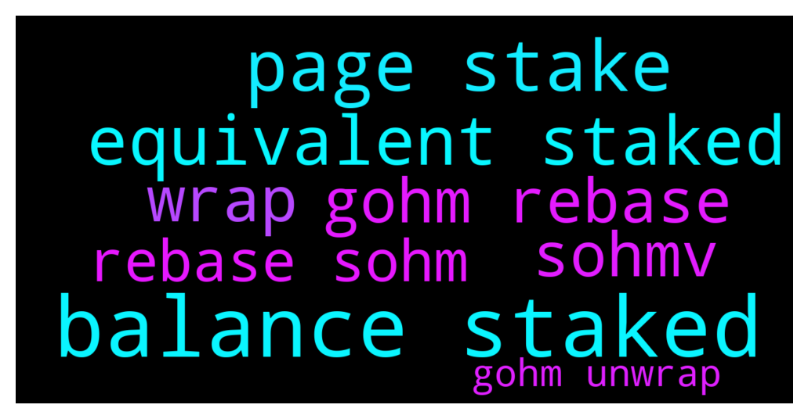

# **@OlympusTG**
 ## Analysis for **2021-12-14** - **2021-12-15**.

---

## 📊 **Basic Stats**

**n_messages_sent**: 1452

---

---

## 🔝 **Top keywords and related messages**

1. **balance staked**

    @Poopoo --- *Are you on the website Stake page? I can see mine, gOHM and staked balance, are you on the Ethereum network, only available in the Eth network now.* **--->** [TG Discussion](https://t.me/OlympusTG/122737)

    @OculusVision --- *I followed the steps in the pinned medium article and still can't see my APY and rebases anyone know why this is? the only thing I am seeing is my staked balance and my gOHM balance.* **--->** [TG Discussion](https://t.me/OlympusTG/121817)

    @Atr788 --- *it does not give me any option to do that - i can still see my gOHM balance in metamask* **--->** [TG Discussion](https://t.me/OlympusTG/120734)

    @Ozzyy --- *Did you wrap your sohm to gohm ?  I think there is a problem on web site. It doesnt show apy. And balances are same.* **--->** [TG Discussion](https://t.me/OlympusTG/122710)

    @Ozzyy --- *It doesnt show stake apy now.   When i wrapped my sohm to gohm , it didnt add reward to my balance. My balance is same for 16 hours.* **--->** [TG Discussion](https://t.me/OlympusTG/122704)

    @TillLammertz --- *Yes man. I’m on the eth network and there is no staked balance at all in Olympus Website. But I have gOHM in my metamask in avax tho* **--->** [TG Discussion](https://t.me/OlympusTG/122739)

2. **page stake**

    @Poopoo --- *Are you on the website Stake page? I can see mine, gOHM and staked balance, are you on the Ethereum network, only available in the Eth network now.* **--->** [TG Discussion](https://t.me/OlympusTG/122737)

    @ANDREAS --- *Cameron Fraser: When should I migrate?  ANDREAS CHATZIPEROS: Man, the gohm don't have stake 😝* **--->** [TG Discussion](https://t.me/OlympusTG/122295)

    @Ozzyy --- *It doesnt show stake apy now.   When i wrapped my sohm to gohm , it didnt add reward to my balance. My balance is same for 16 hours.* **--->** [TG Discussion](https://t.me/OlympusTG/122704)

    @gagan91 --- *But we can't stake gohm right?* **--->** [TG Discussion](https://t.me/OlympusTG/121574)

    @hussar27 --- *Can you also tell me why you advise this? What is the reason?  If wsOHM is already like being stake why make another change?   After I switch to gOHM I need to bridge it to ETH and then stake it?* **--->** [TG Discussion](https://t.me/OlympusTG/119636)

    @MrEightBall --- *Okay so you wrap it into avax gohm and it just stakes on and the fee will be cheaper next time i want to unstake or sell?* **--->** [TG Discussion](https://t.me/OlympusTG/119642)

3. **equivalent staked**

    @Poopoo --- *Are you on the website Stake page? I can see mine, gOHM and staked balance, are you on the Ethereum network, only available in the Eth network now.* **--->** [TG Discussion](https://t.me/OlympusTG/122737)

    @OculusVision --- *I followed the steps in the pinned medium article and still can't see my APY and rebases anyone know why this is? the only thing I am seeing is my staked balance and my gOHM balance.* **--->** [TG Discussion](https://t.me/OlympusTG/121817)

    @TillLammertz --- *Yes man. I’m on the eth network and there is no staked balance at all in Olympus Website. But I have gOHM in my metamask in avax tho* **--->** [TG Discussion](https://t.me/OlympusTG/122739)

    @TillLammertz --- *Only thing I see is the gOHM in my wallet. On Olympus staking, I don’t see any staked balance* **--->** [TG Discussion](https://t.me/OlympusTG/122735)

    @stacyd82d --- *Staked balance sohm v2 and gohm. I wish I had both but I thought sohm balance would drop to zero after I swapped it for gohm* **--->** [TG Discussion](https://t.me/OlympusTG/121583)

    @TillLammertz --- *Is this just temporary or will we be able to see our staked gOHM?* **--->** [TG Discussion](https://t.me/OlympusTG/120131)

4. **wrap**

    @Poopoo --- *Olympus Migration TL;DR for the Ohmies  - Current sOHM won't see rebases anymore. will get all backdated rewards whenever you migrate. - Folks collateralised at Rari don't need to do anything. will be taken care of in the backend. - sOHM to sOHM v2 migration will become available soon. - sOHM to gOHM and wsOHM to gOHM migration is already available at https://app.olympusdao.finance/#/wrap - In no scenario will you lose rewards  The APY will show correctly on website when V2 migration is done. Current sOHM won't see rebases anymore. Ohmies will get all backdated rewards whenever you migrate.  Ohmies collateralized at Rari don't need to do anything. Everything will be taken care of in the backend.  You don’t have to unstake or do anything right now. sOHM to sOHM v2 migration will become available soon with easy step by step instructions.   sOHM: wait for migration to sOHM v2 or wrap to gOHM wsOHM:  convert to gOHM gOHM:  nothing fsOHM (Rari): nothing* **--->** [TG Discussion](https://t.me/OlympusTG/120083)

    @Enjoytaira --- *I don’t want wrap unwrap, i don’t want gohm, only i want my sohm v1 convert to sohm v2. How i do this pleaseeeee?* **--->** [TG Discussion](https://t.me/OlympusTG/122451)

    @Poopoo --- *read pinned message, and question about migration yes, wrap your sOHM to gOHM, stop asking about sOHM v2, it is unnecessary, just wrap to gOHM, do not answer dm* **--->** [TG Discussion](https://t.me/OlympusTG/122763)

    @Pol --- *Yes same to me. After migration, i continue having sOHM and inside wrap i see gOHM* **--->** [TG Discussion](https://t.me/OlympusTG/122709)

    @DandC932830 --- *Nah that’s the weird part, is following migration, under wrap I can’t see any sOHM or gOHM available.   Under staking it still reads I have sOHM, same with my metamask wallet.* **--->** [TG Discussion](https://t.me/OlympusTG/121682)

    @hunkarperk --- *So as i understand, we will choose just wrap in the dashboard after that wrap sohm to gohm, complete the step after that it's done! Do we need to unstake first or stake again or dont need to do anythin?* **--->** [TG Discussion](https://t.me/OlympusTG/121195)

5. **gohm rebase**

    @Stella --- *So I just migrated my sohm to gohm* **--->** [TG Discussion](https://t.me/OlympusTG/121586)

    @Kred88 --- *all contract are correct... on my https://app.olympusdao.finance/ i see my gOHM, on https://synapseprotocol.com/?inputCurrency=gOHM&outputCurrency=gOHM&outputChain=137 i can't see my gOHM on ETH* **--->** [TG Discussion](https://t.me/OlympusTG/122376)

    @flex --- *But I don't want gohm. I rather have sohm v2. And see rebase then having gohm and to calculate rewards etc.* **--->** [TG Discussion](https://t.me/OlympusTG/122518)

    @James --- *So do we have to upgrade sOHM to gOHM? Still staking on same website?* **--->** [TG Discussion](https://t.me/OlympusTG/121088)

    @bike4peace --- *gOHM is already staked and in the dashboard you will see your rebases like before* **--->** [TG Discussion](https://t.me/OlympusTG/122298)

    @Poopoo --- *Olympus Migration TL;DR for the Ohmies  - Current sOHM won't see rebases anymore. will get all backdated rewards whenever you migrate. - Folks collateralised at Rari don't need to do anything. will be taken care of in the backend. - sOHM to sOHM v2 migration will become available soon. - sOHM to gOHM and wsOHM to gOHM migration is already available at https://app.olympusdao.finance/#/wrap - In no scenario will you lose rewards  The APY will show correctly on website when V2 migration is done. Current sOHM won't see rebases anymore. Ohmies will get all backdated rewards whenever you migrate.  Ohmies collateralized at Rari don't need to do anything. Everything will be taken care of in the backend.  You don’t have to unstake or do anything right now. sOHM to sOHM v2 migration will become available soon with easy step by step instructions.   sOHM: wait for migration to sOHM v2 or wrap to gOHM wsOHM:  convert to gOHM gOHM:  nothing fsOHM (Rari): nothing* **--->** [TG Discussion](https://t.me/OlympusTG/120083)

6. **sohmv**

    @theMagicUnicorn --- *you will want to migrate to gohm or sohmv2(when its ready), but there is plenty of time to do so* **--->** [TG Discussion](https://t.me/OlympusTG/121255)

    @ibaniba --- *Hi all- there’s been a lot of chatter but I can’t seem to find what I’m looking for. My sOhm has been missing. I checked on etherscan and it shows that it was migrated and transferred to sohmv2 about 8-10 hours ago.  That said- Am now sure how to locate my sOhm as it’s not shown on my MetaMask nor the app.    Can anyone provide guidance* **--->** [TG Discussion](https://t.me/OlympusTG/120118)

    @Poopoo --- *User migration is now LIVE  Note: you won't be prompted to migrated if you're already holding gOHM  Please migrate here -> https://app.olympusdao.finance/#/dashboard  Contract addresses:  OHMv1: https://analytics.sushi.com/tokens/0x383518188C0C6d7730D91b2c03a03C837814a899  OHMv2: https://analytics.sushi.com/tokens/0x64aa3364f17a4d01c6f1751fd97c2bd3d7e7f1d5  sOHMv1: https://etherscan.io/token/0x04F2694C8fcee23e8Fd0dfEA1d4f5Bb8c352111F  sOHMv2: https://etherscan.io/token/0x04906695D6D12CF5459975d7C3C03356E4Ccd460  Please refer to our documentation for a detailed link to all of the other DAO related V2 contracts: https://docs.olympusdao.finance/main/contracts/tokens* **--->** [TG Discussion](https://t.me/OlympusTG/121441)

    @Jeff --- *Should i just Unwrap from gOhm to sOhm to get sOhmv2?* **--->** [TG Discussion](https://t.me/OlympusTG/123041)

    @theMagicUnicorn --- *so you can wait a few days and migrate to sohmv2* **--->** [TG Discussion](https://t.me/OlympusTG/121287)

    @theMagicUnicorn --- *so if there werent liquidity for sohmv2, you could wrap it to gohm, for instance* **--->** [TG Discussion](https://t.me/OlympusTG/121261)

7. **rebase sohm**

    @Stella --- *So I just migrated my sohm to gohm* **--->** [TG Discussion](https://t.me/OlympusTG/121586)

    @flex --- *But I don't want gohm. I rather have sohm v2. And see rebase then having gohm and to calculate rewards etc.* **--->** [TG Discussion](https://t.me/OlympusTG/122518)

    @James --- *So do we have to upgrade sOHM to gOHM? Still staking on same website?* **--->** [TG Discussion](https://t.me/OlympusTG/121088)

    @bike4peace --- *gOHM is already staked and in the dashboard you will see your rebases like before* **--->** [TG Discussion](https://t.me/OlympusTG/122298)

    @Poopoo --- *Olympus Migration TL;DR for the Ohmies  - Current sOHM won't see rebases anymore. will get all backdated rewards whenever you migrate. - Folks collateralised at Rari don't need to do anything. will be taken care of in the backend. - sOHM to sOHM v2 migration will become available soon. - sOHM to gOHM and wsOHM to gOHM migration is already available at https://app.olympusdao.finance/#/wrap - In no scenario will you lose rewards  The APY will show correctly on website when V2 migration is done. Current sOHM won't see rebases anymore. Ohmies will get all backdated rewards whenever you migrate.  Ohmies collateralized at Rari don't need to do anything. Everything will be taken care of in the backend.  You don’t have to unstake or do anything right now. sOHM to sOHM v2 migration will become available soon with easy step by step instructions.   sOHM: wait for migration to sOHM v2 or wrap to gOHM wsOHM:  convert to gOHM gOHM:  nothing fsOHM (Rari): nothing* **--->** [TG Discussion](https://t.me/OlympusTG/120083)

    @Poopoo --- *it's okay, you'll still be getting rebases as long as you have migrated. read about gOHM https://twitter.com/OlympusDAO/status/1465410905542385677 and check the pinned messages* **--->** [TG Discussion](https://t.me/OlympusTG/122049)

8. **gohm unwrap**

    @Stella --- *So I just migrated my sohm to gohm* **--->** [TG Discussion](https://t.me/OlympusTG/121586)

    @Kred88 --- *all contract are correct... on my https://app.olympusdao.finance/ i see my gOHM, on https://synapseprotocol.com/?inputCurrency=gOHM&outputCurrency=gOHM&outputChain=137 i can't see my gOHM on ETH* **--->** [TG Discussion](https://t.me/OlympusTG/122376)

    @flex --- *But I don't want gohm. I rather have sohm v2. And see rebase then having gohm and to calculate rewards etc.* **--->** [TG Discussion](https://t.me/OlympusTG/122518)

    @James --- *So do we have to upgrade sOHM to gOHM? Still staking on same website?* **--->** [TG Discussion](https://t.me/OlympusTG/121088)

    @bike4peace --- *gOHM is already staked and in the dashboard you will see your rebases like before* **--->** [TG Discussion](https://t.me/OlympusTG/122298)

    @Poopoo --- *Olympus Migration TL;DR for the Ohmies  - Current sOHM won't see rebases anymore. will get all backdated rewards whenever you migrate. - Folks collateralised at Rari don't need to do anything. will be taken care of in the backend. - sOHM to sOHM v2 migration will become available soon. - sOHM to gOHM and wsOHM to gOHM migration is already available at https://app.olympusdao.finance/#/wrap - In no scenario will you lose rewards  The APY will show correctly on website when V2 migration is done. Current sOHM won't see rebases anymore. Ohmies will get all backdated rewards whenever you migrate.  Ohmies collateralized at Rari don't need to do anything. Everything will be taken care of in the backend.  You don’t have to unstake or do anything right now. sOHM to sOHM v2 migration will become available soon with easy step by step instructions.   sOHM: wait for migration to sOHM v2 or wrap to gOHM wsOHM:  convert to gOHM gOHM:  nothing fsOHM (Rari): nothing* **--->** [TG Discussion](https://t.me/OlympusTG/120083)

